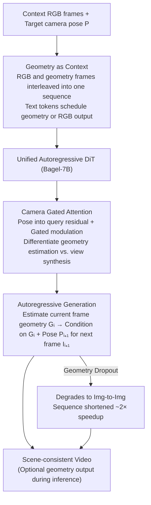

# Geometry-as-context: Modulating Explicit 3D in Scene-consistent Video Generation to Geometry Context

**Conference**: CVPR 2026  
**arXiv**: [2602.21929](https://arxiv.org/abs/2602.21929)  
**Code**: None  
**Area**: Video Generation  
**Keywords**: Scene-consistent Video Generation, Geometry Context, Autoregressive Generation, Camera Control, 3D Reconstruction

## TL;DR

The Geometry-as-Context (GaC) framework is proposed to replace non-differentiable operators (3D reconstruction and rendering) in reconstruction-based scene video generation with a unified autoregressive video generation model. By embedding geometry information (depth maps) as interleaved contexts within the generative sequence, the method achieves end-to-end training and mitigates accumulated errors.

## Background & Motivation

Scene-consistent video generation aims to explore 3D scenes along camera trajectories while maintaining high 3D consistency. Existing methods are categorized into two types:
- **Video Methods** (CameraCtrl, VMem, etc.): Rely solely on video models for consistency; however, memory retrieval struggles with complex scenes and large camera movements.
- **Reconstruction Methods** (SceneScape, ViewCrafter, GEN3C, etc.): Iteratively execute "geometry estimation → 3D reconstruction → rendering → completion," but suffer from two fundamental issues:
  1. **Non-differentiable Operators**: Back-projection and rendering operations in inverse rendering are non-differentiable, preventing gradient propagation.
  2. **Non-end-to-end Training**: Geometry prediction and image completion use independent models, meaning accumulated errors cannot be mitigated through learning.

Unlike long-range video generation where accumulated errors can be relieved through autoregressive training, the errors in reconstruction methods are difficult to eliminate due to non-differentiable operations and model separation. This is the core problem addressed in this work.

## Method

### Overall Architecture

GaC "flattens" the iterative process of reconstruction methods into an autoregressive video generation framework: a single DiT model simultaneously handles geometry estimation, view transition simulation, and image completion. The input sequence interleaves RGB frames and geometry frames $\{I_i, \text{<Geometry>}, G_i, \text{<Image>}, I_{i+1}, \cdots\}$. Inserted text tokens instruct the model whether the next step is to output geometry or RGB. Thus, "estimating geometry," "changing perspective," and "completing images" are unified end-to-end by a single DiT on a single sequence.

### Key Designs

**1. Geometry as Context: Compressing the four-step "Reconstruction-Rendering" into one generation (Variant #1)**

The primary burden of reconstruction methods is the "geometry estimation → back-projection → rendering → completion" chain. Since back-projection and rendering are non-differentiable, gradients cannot pass through, and the separate models for geometry and completion allow errors to accumulate. GaC collapses these four steps into a single conditional generation $\{G_i, I_{i+1}\} = \varrho(\{I_i, G_i\}, P_{i+1})$: the model first estimates the current frame's geometry $G_i$, then generates the next RGB frame conditioned on $G_i$ and the target pose $P_{i+1}$. Explicitly embedding geometry as context serves three purposes: interleaved geometry frames shorten the sequence dependency, improve efficiency, provide 3D awareness to the model to strengthen consistency, and use the modality difference between RGB and geometry to help the model distinguish tasks.

**2. Camera Gated Attention: Differentiating "Geometry Estimation" and "View Synthesis"**

The role of a camera pose differs when predicting geometry versus synthesizing new views. CGA incorporates pose $r_i$ (encoded via Plücker rays) by adding it to the self-attention query as a residual and generating an additional gate to modulate the output:

$$\{Q_{res}, Gate\} = \text{Linear}_2(Q + r_i),\quad O = \text{SDPA}(Q + Q_{res}, K, V),\quad O = \text{Linear}_3(O * \sigma(Gate))$$

By passing the pose into the query residual and controlling the influence via $\sigma(Gate)$, the model adaptively decides how much camera information to use for specific sub-tasks, significantly reducing translation errors.

**3. Geometry Dropout: Accelerating inference and allowing flexible outputs**

While geometry frames are beneficial, generating them for every frame lengthens the sequence and slows down training/inference. During training, geometry contexts are randomly dropped at a rate $r$; dropped frames degrade to pure image-to-image generation (Variant #3). This results in shorter training sequences and allows the model to output only RGB during inference without predicting geometry. Experiments show training time halved from 24 s/step to 11 s/step and inference from 4.6 s/img to 2.2 s/img with negligible performance loss.

### Loss & Training

- Base Model: Bagel-7B (supports interleaved text-image modeling).
- Training Data: RealEstate10K (66,033 video segments).
- 8-frame sequence training: the first 1-4 frames serve as context, followed by target views.
- Every 4 consecutive views are concatenated into a grid frame ($640 \times 352$ resolution) to enhance consistency.
- Images encoded using FLUX-VAE.
- Trained on 8 H100s for 40,000 steps (~2 days).
- Context-as-memory is used during inference for context view selection; classifier-free guidance is omitted.

## Key Experimental Results

### Main Results

| Dataset | Metric | GaC (Ours) | Voyager | GEN3C | ViewCrafter |
|---------|--------|------------|---------|-------|-------------|
| RE10K   | PSNR↑  | **19.01**  | 18.70   | 18.12 | 16.72       |
| RE10K   | SSIM↑  | **0.656**  | 0.616   | 0.624 | 0.585       |
| RE10K   | LPIPS↓ | **0.354**  | 0.395   | 0.402 | 0.417       |
| RE10K   | FID↓   | **55.76**  | 65.12   | 66.20 | 80.47       |
| RE10K   | $R_{err}$↓ | **0.024** | 0.035 | 0.027 | 0.022      |
| RE10K   | $T_{err}$↓ | **0.270** | 0.596 | 0.344 | 0.327      |
| T&T     | PSNR↑  | **15.77**  | 15.24   | 15.32 | 12.59       |
| RE10K(Back-forth) | PSNR↑ | **16.34** | 15.80 | 15.28 | 15.77 |
| RE10K(Back-forth) | FID↓ | **64.31** | 79.81 | 80.03 | 72.14 |

### Ablation Study

| Config | PSNR↑ | SSIM↑ | LPIPS↓ | FID↓ | $T_{err}$↓ | Description |
|--------|-------|-------|--------|------|-----------|-------------|
| None (Variant #3) | 16.34 | 0.551 | 0.412 | 89.03 | 0.351 | No Geo Context |
| Warped img (V#2) | 18.33 | 0.671 | 0.383 | 59.12 | 0.299 | Rendered context |
| Geometry (V#1) | **19.01** | 0.656 | **0.354** | **55.76** | **0.270** | Geometry context |
| w/o CGA | 18.57 | 0.581 | 0.461 | 68.42 | 0.469 | Without CGA |
| w/ CGA | **19.01** | **0.656** | **0.354** | **55.76** | **0.270** | Full method |
| w/o Geo Dropout | 19.23 | 0.660 | 0.342 | 57.18 | 0.248 | No drop (Slower) |
| w/ Geo Dropout | 19.01 | 0.656 | 0.354 | 55.76 | 0.270 | ~2x Acceleration |

### Key Findings

- **Geometry vs. No Context**: PSNR improved by 2.67 and FID decreased by 33.27, proving the critical role of explicit 3D information.
- **CGA Impact**: Reduced translation error ($T_{err}$) from 0.469 to 0.270 (a 42% decrease), significantly improving camera control precision.
- **Geometry Dropout**: Achieved ~2x speedup in both training and inference with negligible performance loss.
- **Depth vs. Points**: Depth maps performed slightly better as they are closer to natural image modalities, making them easier for the VAE to encode.
- **Robustness**: In back-and-forth trajectory tests, GaC faithfully recovers objects (e.g., a laptop that disappeared) upon return, demonstrating long-range 3D memory.

## Highlights & Insights

- **Elegant Unified Framework**: Flattens the four-step iterative reconstruction process into an autoregressive DiT model, fundamentally solving non-differentiability and non-end-to-end issues.
- **Dual-purpose Geometry Dropout**: Reduces computational cost and provides flexibility in choosing whether to output geometry during inference.
- **Sophisticated CGA Design**: Uses query modulation and gated output to enable one model to distinguish camera roles in different sub-tasks.
- **Trajectory Robustness**: GaC exhibits superior scene memory and consistency in forward-backward trajectories.

## Limitations & Future Work

- Performance drops significantly across all methods on back-and-forth trajectories, indicating a need for better long-range context memory.
- Training was limited to RealEstate10K; generalization to more diverse scenes (outdoor, wild) requires more data.
- Low resolution ($640 \times 352$); high-resolution scene generation remains an area for exploration.
- Inference cost remains high (2.2 s/img) due to the large Bagel-7B base model.

## Related Work & Insights

- **ViewCrafter**: Iterative method using point clouds and video diffusion; GaC's unified framework is more elegant and reduces error.
- **GEN3C/Voyager**: Introduce point clouds/3DGS as 3D representations but remain limited by non-differentiable rendering.
- **ReCamMaster**: Follows frame-dimension concatenation for camera control; GaC builds on this with geometry context.
- **Insight**: The strategy of "internalizing non-differentiable operations into generative model capabilities" can be extended to other 3D vision tasks. Text-guided multi-task scheduling (Geometry vs. RGB) is an effective paradigm for interleaved multimodal models.

## Rating

- Novelty: ⭐⭐⭐⭐ Flattening reconstruction into autoregressive generation is an elegant innovation.
- Experimental Thoroughness: ⭐⭐⭐⭐ Multiple benchmarks and ablations, though training data is narrow.
- Writing Quality: ⭐⭐⭐⭐ Thorough motivation analysis and clear algorithmic descriptions.
- Value: ⭐⭐⭐⭐ Provides a new paradigm for scene video generation with broad end-to-end value.

## Related Papers

- [\[CVPR 2026\] StereoWorld: Geometry-Aware Monocular-to-Stereo Video Generation](stereoworld_geometry-aware_monocular-to-stereo_video_generation.md)
- [\[CVPR 2026\] Rethinking Position Embedding as a Context Controller for Multi-Reference and Multi-Shot Video Generation](rethinking_position_embedding_as_a_context_controller_for_multi-reference_and_mu.md)
- [\[ICML 2026\] CamGeo: Sparse Camera-Conditioned Image-to-Video Generation with 3D Geometry Prior](../../ICML2026/video_generation/camgeo_sparse_camera-conditioned_image-to-video_generation_with_3d_geometry_prio.md)
- [\[CVPR 2026\] CineScene: Implicit 3D as Effective Scene Representation for Cinematic Video Generation](cinescene_implicit_3d_as_effective_scene_representation_for_cinematic_video_gene.md)
- [\[CVPR 2026\] Efficient Long-Context Modeling in Diffusion Language Models via Block Approximate Sparse Attention](efficient_long-context_modeling_in_diffusion_language_models_via_block_approxima.md)

<!-- RELATED:END -->

<!-- RELATED:START -->

## Related Papers

- [\[CVPR 2026\] StereoWorld: Geometry-Aware Monocular-to-Stereo Video Generation](stereoworld_geometry-aware_monocular-to-stereo_video_generation.md)
- [\[CVPR 2026\] Towards Realistic and Consistent Orbital Video Generation via 3D Foundation Priors](orbital_video_3d_foundation_priors.md)
- [\[CVPR 2026\] Diff4Splat: Repurposing Video Diffusion Models for Dynamic Scene Generation](diff4splat_controllable_4d_scene_generation_with_latent_dynamic_reconstruction_m.md)
- [\[CVPR 2026\] PerpetualWonder: Long-horizon Action-conditioned 4D Scene Generation](perpetualwonder_long-horizon_action-conditioned_4d_scene_generation.md)
- [\[CVPR 2026\] ConsID-Gen: View-Consistent and Identity-Preserving Image-to-Video Generation](consid-gen_view-consistent_and_identity-preserving_image-to-video_generation.md)

<!-- RELATED:END -->
