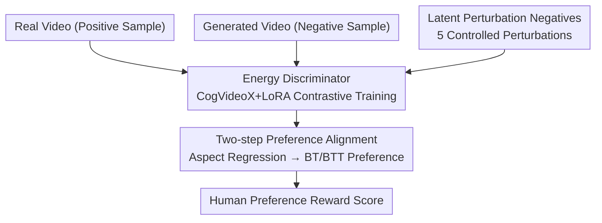

# GT-SVJ: Generative-Transformer-Based Self-Supervised Video Judge For Efficient Video Reward Modeling

**Conference**: CVPR 2026  
**Paper**: [CVF OpenAccess](https://openaccess.thecvf.com/content/CVPR2026/html/Shekhar_GT-SVJ_Generative-Transformer-Based_Self-Supervised_Video_Judge_For_Efficient_Video_Reward_Modeling_CVPR_2026_paper.html)  
**Code**: https://huggingface.co/sasuke-ss1/GT-SVJ (Available)  
**Area**: Video Generation / Reward Modeling / Self-Supervised  
**Keywords**: Video Reward Model, Energy-Based Model, Contrastive Learning, Temporal Alignment, RLHF

## TL;DR
This paper repurposes an off-the-shelf video generation model (CogVideoX) into a video reward model. By using an Energy-Based Model (EBM) with contrastive learning to train a "real/degraded" video discriminator followed by two-step preference alignment, the method outperforms VLM-based reward models trained on millions of samples using only 30K human annotations on GenAI-Bench and MonteBench.

## Background & Motivation

**Background**: Aligning video generation models with human preferences (RLHF/DPO) requires a reliable reward model to score videos. Current mainstream approaches fine-tune Video-Language Models (VLMs, e.g., VideoScore, VisionReward, VideoReward) to predict preference between video pairs.

**Limitations of Prior Work**: VLMs are inherently trained for "video understanding," treating videos as collections of independent frames and using attention mechanisms to *implicitly* reconstruct temporal structures. This frame-centric bias makes them insensitive to subtle temporal cues like motion quality, temporal smoothness, and cross-frame consistency—precisely the keys to distinguishing real from generated videos. Furthermore, VLM-based methods require massive human preference annotations (e.g., 2 million for VisionReward), which are costly and difficult to scale.

**Key Challenge**: Evaluating video quality requires "fine-grained perception of temporal dynamics," a capability VLMs naturally lack. Conversely, video *generation* models excel at modeling temporal dependencies (using causal self-attention for latent tokens) but their discriminative potential remains untapped.

**Goal**: (1) Identify a backbone with inherent temporal understanding to serve as a reward model; (2) Achieve stable training and avoid overfitting to superficial cues with minimal annotations.

**Key Insight**: The authors observe that generative models can be reformulated as Energy-Based Models (EBMs): assigning low energy to high-quality videos and high energy to degraded ones. Coupled with a contrastive objective, a generative model can become a high-precision quality discriminator. Generative representations already encode motion, temporal causality, and fine-grained dynamics, making them more "temporally faithful" backbones than VLMs.

**Core Idea**: Replace VLMs with video generation models as reward backbones. First, use self-supervised contrastive learning to convert the model into an energy discriminator, then perform two-step preference alignment to achieve superior precision with an order of magnitude fewer annotations.

## Method

### Overall Architecture
GT-SVJ takes a video (latent representation) as input and outputs a scalar reward score reflecting human preference. The framework consists of two sequential stages: **Stage 1** trains the video generation backbone (CogVideoX) as a Discriminative Model (DM) via energy contrastive objectives, teaching it to assign low energy to real videos and high energy to generated or perturbed ones. **Stage 2** reuses the DM's LoRA adapters with a new prediction head, performing aspect-wise regression across 21 quality dimensions followed by Bradley-Terry preference loss training for the final scalar reward.

### Key Designs

**1. Reformulating Generative Models as Energy Discriminators**

To address the lack of temporal sensitivity in VLMs and the high data demand, the authors utilize CogVideoX as a discriminator backbone. They take specific transformer layers and a lightweight MLP head to aggregate spatio-temporal features into a scalar "energy." Formally, the EBM defines probability $P_\theta(x) = \exp(-E_\theta(x))/Z_\theta$ via an unnormalized energy function $E_\theta(x)$. Training uses a contrastive objective:

$$\mathcal{L}_{\text{EBM}} = \mathbb{E}_{x^+ \sim p_{\text{data}}}[E_\theta(x^+)] - \mathbb{E}_{x^- \sim p_{\text{neg}}}[E_\theta(x^-)]$$

The objective minimizes energy for real samples $x^+$ and maximizes it for negative samples $x^-$. An $L_2$ regularization term $\mathcal{L}_2 = \mathbb{E}[E_\theta(x^+)^2] + \mathbb{E}[E_\theta(x^-)^2]$ stabilizes training: $\mathcal{L}_{\text{contrast}} = \mathcal{L}_{\text{EBM}} + \beta\mathcal{L}_2$ (where $\beta=0.2$). LoRA adapters ($r=8, \alpha=8$) are applied to the final third of CogVideoX layers. This works because CogVideoX’s VAE is causal; latent energy sequences reflect "temporal perplexity"—real videos show smooth, low-variance energy curves, while generated or degraded videos exhibit sharp fluctuations.

**2. Controlled Latent Perturbations for Hard Negative Mining**

Using only "real vs. generated" samples is insufficient, as models may exploit superficial domain gaps (lighting, texture). The authors apply five controlled perturbations to real video latents $z=\{z_t\}_{t=1}^T$ to create hard negatives that appear realistic but lack temporal/spatial integrity:
- **Frame Shuffle**: Randomly permutes frame indices to violate temporal order while maintaining per-frame appearance.
- **Frame Drop**: Replaces non-continuous time steps with previous frames $\tilde{z}_t = z_{t-1}$ to simulate dropped frames.
- **Noisy Segment Injection**: Adds Gaussian noise $\epsilon_t \sim \mathcal{N}(0,\sigma^2 I)$ to random segments $[s, e]$.
- **Patch Swap**: Swaps a spatial region $\Omega$ between two non-overlapping time segments to disrupt motion trajectories.
- **Temporal Slice Swap**: Swaps two non-overlapping time slices $[t_1,t_1+\tau]$ and $[t_2,t_2+\tau]$ to break long-range dynamics.

These perturbations force the model to learn fine-grained spatio-temporal features rather than relying on domain-level shortcuts.

**3. Two-Step Preference Alignment**

The discriminator is further aligned with human preferences using the pre-trained LoRA adapters. **Step 1: Aspect-wise Regression**: The model predicts $Q=21$ quality dimensions (e.g., realism, smoothness, consistency) using Likert scales (1–5) and MSE loss. **Step 2: Relative Preference Prediction**: A linear head aggregates these 21 scores into a scalar reward, trained using the Bradley-Terry (BT) loss on paired human preferences. To account for "ties," the Bradley-Terry with Ties (BTT) variant is used, explicitly modeling the probability of neutral judgments. This approach provides both interpretive scores and a stable scalar reward for downstream RL.

### Loss & Training
- **Discriminator Phase**: $\mathcal{L}_{\text{contrast}} = \mathcal{L}_{\text{EBM}} + \beta\mathcal{L}_2$ ($\beta=0.2$). Uses ~20K real video clips (positives) and ~30K generated/perturbed clips (negatives). This phase **requires no human labels**.
- **Variable Length Training**: Clips are randomly cropped to 2–6 seconds ($p=0.25$) to ensure duration-invariant representations.
- **Reward Phase**: MSE regression on VisionReward's 21 attributes followed by preference fine-tuning. Only this phase uses human labels (30.4K).

## Key Experimental Results

### Main Results
Performance comparison on video preference benchmarks:

| Method | Human Annotations | Backbone | GenAI-Bench (w/ties) | MonteBench (w/ties) | VideoReward-Bench (w/ties) |
|------|-----------|----------|------|------|------|
| VideoScore | 37.6K | 8B | 49.03 | 49.10 | 41.80 |
| VisionReward | 2000K | 19B | 51.56 | 64.00 | 56.77 |
| VideoReward | 182K | 2B | 49.41 | 54.20 | **61.26** |
| **GT-SVJ** | **30.4K** | 2B | **64.26** | **66.36** | 57.01 |

GT-SVJ outperforms existing models on GenAI-Bench by ~24.6% and MonteBench by ~3.7% while using significantly fewer annotations (6× fewer than VideoReward, 65× fewer than VisionReward).

### Ablation Study
| Configuration | Key Observations |
|------|---------|
| GT-SVJ (Full) | Best performance across benchmarks. |
| GT-SVJ (No DM) | Accuracy drops by ~5% without discriminator pre-training. |
| GT-SVJ (p=0) | Accuracy drops by 1–15% without variable duration training. |
| No Perturbations | Early saturation, vanishing gradients as the model learns trivial domain gaps. |

### Key Findings
- **Perturbations are critical**: Without them, the discriminator exploits simple textures; with them, gradient norms remain healthy, indicating meaningful spatio-temporal learning.
- **Pre-training provides strong inductive bias**: Initializing with the discriminator improves alignment accuracy significantly compared to training from scratch.
- **LoRA Positioning**: Adapting the final third of layers provides the best trade-off between accuracy and training speed (1.5× faster).

## Highlights & Insights
- **Selecting the Right Backbone**: Shifting the bottleneck from "annotation scale" to "backbone temporal awareness" allows 30K labels to beat models using 2 million labels.
- **Energy as Temporal Perplexity**: Using causal VAEs allows energy sequences to be interpreted as temporal consistency metrics—smooth for real videos, jittery for generated ones.
- **Transferable Hard Negative Recipes**: The latent perturbation strategies (shuffle, drop, swap) are universal recipes for any self-supervised task requiring temporal sensitivity.

## Limitations & Future Work
- **Lack of Interpretability**: Unlike VLM evaluators, GT-SVJ lacks a conversational interface for natural language feedback.
- **Domain Shift**: Performance on VideoReward-Bench was slightly lower, likely due to shifts between the training data and benchmark distribution.
- **Backbone Dependency**: The effectiveness remains largely tied to the CogVideoX architecture; validation on other generative backbones is needed.

## Related Work & Insights
- **vs. VLM Reward Models**: VLMs treat videos as "bags of frames" and require massive data. GT-SVJ uses "temporally faithful" generative backbones to achieve higher efficiency.
- **vs. Traditional Metrics (FVD/VBench)**: These are statistical or keypoint-based. GT-SVJ provides a learnable preference reward suitable for RLHF/DPO.

## Rating
- **Novelty**: ⭐⭐⭐⭐⭐ High. Reformulating generative models as EBM discriminators for rewards is a fresh perspective.
- **Experimental Thoroughness**: ⭐⭐⭐⭐ Strong benchmark performance and ablations, though sensitivity analysis on perturbation strength is missing.
- **Writing Quality**: ⭐⭐⭐⭐⭐ Excellent motivation and clear visualization of energy curves.
- **Value**: ⭐⭐⭐⭐⭐ Significant improvement in annotation efficiency for video reward modeling.

<!-- RELATED:START -->

## Related Papers

- [\[CVPR 2026\] From Static to Dynamic: Exploring Self-supervised Image-to-Video Representation Transfer Learning](from_static_to_dynamic_exploring_self-supervised_image-to-video_representation_t.md)
- [\[CVPR 2026\] SoliReward: Mitigating Susceptibility to Reward Hacking and Annotation Noise in Video Generation Reward Models](solireward_mitigating_susceptibility_to_reward_hacking_and_annotation_noise_in_v.md)
- [\[CVPR 2026\] A Frame is Worth One Token: Efficient Generative World Modeling with Delta Tokens](a_frame_is_worth_one_token_efficient_generative_world_modeling_with_delta_tokens.md)
- [\[CVPR 2026\] Thinking with Frames: Generative Video Distortion Evaluation via Frame Reward Model](thinking_with_frames_generative_video_distortion_evaluation_via_frame_reward_mod.md)
- [\[CVPR 2026\] STARFlow-V: End-to-End Video Generative Modeling with Autoregressive Normalizing Flows](starflow-v_end-to-end_video_generative_modeling_with_autoregressive_normalizing_.md)

<!-- RELATED:END -->
