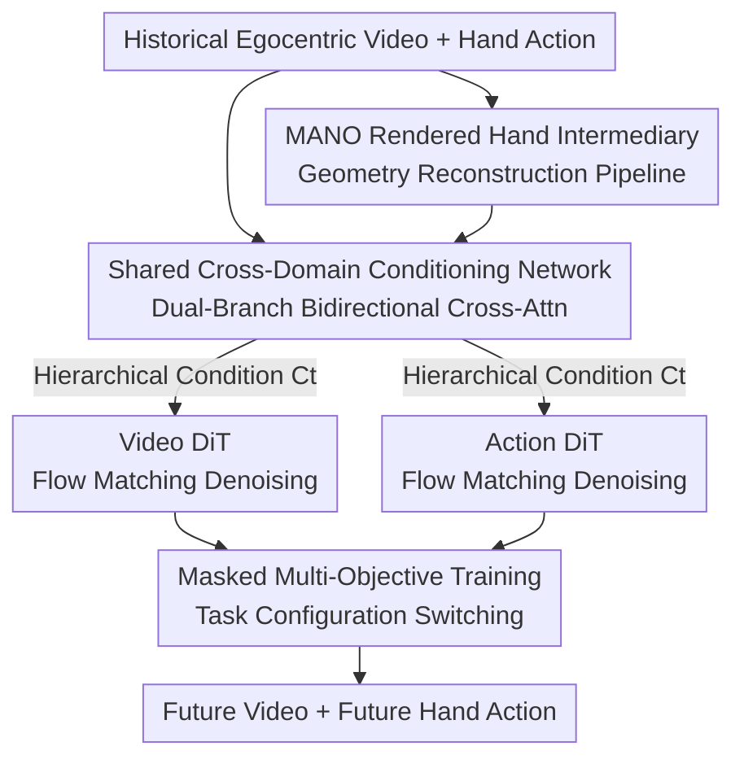

# HandWorld: Hand-Centric Unified Video Action Generation

**Conference**: CVPR 2026  
**Paper**: [CVF Open Access](https://openaccess.thecvf.com/content/CVPR2026/html/Sun_HandWorld_Hand-Centric_Unified_Video_Action_Generation_CVPR_2026_paper.html)  
**Code**: https://sunzhihao18.github.io/HandWorld (Project page, code not explicitly open-sourced)  
**Area**: Video Generation / Diffusion Models  
**Keywords**: Hand-Object Interaction, Egocentric Video, Joint Action-Video Generation, Cross-Domain Conditioning, Flow Matching  

## TL;DR
HandWorld utilizes a shared cross-domain conditioning network to bind "hand action" and "egocentric video" domains together, followed by decoupled Diffusion Transformers for each. Combined with MANO-rendered hands as an intermediate bridge and flexible multi-task training, it enables simultaneous action-conditioned video generation and future hand action prediction within a single framework, outperforming existing specialized baselines in both tasks.

## Background & Motivation
**Background**: Hand-Object Interaction (HOI) is fundamental to human-world interaction—humans decide hand movements based on observations (egocentric video), and hand movements in turn change subsequent observations. Current research typically focuses on either "hand action prediction" (predicting future trajectories/poses from past observations) or "action-conditioned video generation" (controlling synthesis via masks, trajectories, skeletons, or high-level labels) separately.

**Limitations of Prior Work**: These methods rely on **unidirectional conditioning**—treating video as given to predict action, or action as given to generate video. Few have attempted to model both in a unified generative process. Existing unified architectures (e.g., VLA-types, unified latent types) primarily serve "action policy learning," treating video generation as an auxiliary goal with poor visual fidelity. Although PEVA explored the relationship between body motion and future observations, it focused on large-scale spatial movements like navigation rather than fine-grained hand-object manipulation.

**Key Challenge**: The relationship between action and observation is **highly non-linear**. Hand actions are structured and kinematic (wrist pose + joint coordinates), while videos are pixel-level and encode the entire scene (environment, objects, interaction). The same action can correspond to entirely different observations depending on the manipulated object and surroundings. Directly conditioning these two heterogeneous domains on each other makes the mapping difficult to learn.

**Goal**: Construct a unified generative framework capable of **bidirectional learning and prediction** between hand actions and egocentric videos, maintaining high quality in both domains.

**Key Insight**: The authors define "action as continuous hand movement" (rather than coarse masks or discrete primitives) and hypothesize that the domains are difficult to couple because of the lack of an intermediate representation that is **both in the visual domain and contains only hand geometry**.

**Core Idea**: Share a **unified cross-domain conditioning network** (learned via a dual-branch architecture) and utilize two **decoupled** Diffusion Transformers for per-domain generation. Shared conditions ensure cross-domain consistency, while decoupling ensures flexibility and inference efficiency. MANO-rendered hands are introduced as a geometric bridge in the visual domain to stabilize alignment.

## Method

### Overall Architecture
The input to HandWorld is a sequence of historical egocentric video frames $O_{0:t}$ and corresponding hand action sequences $A_{0:t}$. The output consists of future video frames $O_{t+1:T}$ and future hand actions $A_{t+1:T}$. Each action $A_t \in \mathbb{R}^{138}$ encodes a 9D rotation + 3D translation in camera extrinsics, alongside 3D coordinates for 21 joints per hand. Video frames are encoded into latents $Z_t$ using a pre-trained VAE.

The framework decomposes the joint distribution of actions and videos into "shared conditioning followed by individual denoising." Three components cooperate: a **shared cross-domain conditioning network** learns hierarchical conditions $C_t$ from historical data; a **Video DiT** and an **Action DiT** perform flow-matching denoising in their respective domains guided by $C_t$; and **MANO-rendered hands** serve as a geometric alignment signal in the visual domain. Masking controls which tokens are known versus predicted during training, supporting multiple task configurations.

### Key Designs

**1. Dual-Branch Shared Cross-Domain Conditioning Network: Binding Heterogeneous Domains**

To address the non-linear action-observation relationship, the model avoids direct cross-conditioning. Instead, it learns a shared representation $C_t$ as an intermediary. The conditioning block features two branches: a video branch processing visual latents from a pre-trained video VAE, and an action branch encoding hand action sequences. At **each layer**, branches align temporal and structural features via **bidirectional cross-attention**, producing hierarchical conditions refined by domain-specific adapters to match the required feature scales for generation. Experiments show that replacing this with a direct ControlNet injection (Setup 5) causes FVD to soar from 133.9 to 497.0, proving this intermediary structure is the source of cross-domain consistency.

**2. MANO Rendered Hand Intermediary: A Geometric Anchor in the Visual Domain**

Videos contain environmental context, while actions are abstract joint coordinates. To bridge this, authors introduce MANO-rendered hands as an auxiliary representation—it exists in the **visual domain** (accessible to the conditioning network) but contains **only hand geometry** without environment noise, naturally aligning with the action domain's geometry. Since existing egocentric datasets lack high-fidelity MANO meshes, a reconstruction pipeline was designed: multi-hand detection and tracking provide 2D keypoints and bbox sequences, HaMeR recovers 3D hand meshes frame-by-frame, and outlier removal/temporal smoothing are applied. Replacing MANO with skeletons (Setup 3 vs 4) increases FVD from 133.9 to 245.0, confirming that skeletons are too coarse to capture fine finger deformations.

**3. Decoupled Diffusion Transformers + Hierarchical Shared Conditions: Synchronization vs. Independence**

The joint transition $P(A_{t+1:t+n}, Z_{t+1:t+n}\mid C_t)$ is split into action and video components, each using a DiT for Rectified Flow matching. Flow matching defines latent states as linear interpolations between noise and target $x_\tau = (1-\tau)x_0 + \tau x_1$. The model $v_\theta$ learns the velocity field, where the target velocity is:

$$v_\tau = \frac{dx_\tau}{d\tau} = x_1 - x_0,$$

The training loss is the MSE between predicted and ground-truth velocities:

$$L = \mathbb{E}_{x_0, x_1, C_t, \tau}\left[\,\|v_\theta(x_\tau, C_t, \tau) - v_\tau\|^2\,\right].$$

Both DiTs share the same **hierarchical** conditions $C_t$—at each transformer layer, corresponding condition levels are integrated via **residual addition**. Decoupling offers inference efficiency: for single-domain generation, only the relevant DiT is activated, while cross-domain information is still extracted via the shared network. Generating 49 frames takes 33.8s, comparable to AnimateAnything (34.4s) and faster than the two-stage HANDI (37.5s).

**4. Masked Multi-Objective Flexible Training: Unified Loss for Multiple Tasks**

To support both "action-conditioned video generation" and "action prediction," every task is formulated as "predicting unknown states under partial conditions." This corresponds to the same loss (Equation 5) with varying $C_t$ and targets $x_1$. Unused tokens in $C_t$ are replaced with **learnable mask tokens** for the respective domain. When provided with all video frames and past actions, the model predicts future actions; when provided with all actions and past frames, it predicts future frames. DiTs are **selectively updated** based on the task, while the shared conditioning network is optimized across all objectives, tightening the coupling between domains.

### Loss & Training
The core loss is the velocity MSE from flow matching (Equation 5), used for both domains. Training utilizes EgoDex (approx. 314K training / 3K evaluation, 194 tabletop scenarios). Videos are scaled to 832×480, up to 49 frames (matching the $T = 1 + 4t$ VAE constraint). Video components (VAE / text encoder / video DiT) are initialized from pre-trained Wan2.2-TI2V-5B. The video branch in the conditioning network copies weights from the pre-trained diffusion model, while adapters are zero-initialized for smooth fine-tuning. The action DiT and action branch are randomly initialized. Training was conducted on 2×8 H100 GPUs.

## Key Experimental Results

### Main Results: Hand-Centric Egocentric Video Generation
On EgoDex, HandWorld (MANO) leads across visual quality and hand action metrics compared to text-to-video and hand-aware baselines.

| Method | Condition | CLIP↑ | PSNR↑ | SSIM↑ | LPIPS↓ | FVD↓ | CLIPhand↑ | IoU↑ |
|------|------|-------|-------|-------|--------|------|-----------|------|
| AnimateAnything | Text | 0.9152 | 23.97 | 0.867 | 0.210 | 913.9 | 0.8844 | 0.4073 |
| CogVideoX-I2V-5B | Text | 0.8825 | 19.58 | 0.814 | 0.324 | 568.0 | 0.8638 | 0.2770 |
| Wan2.2-TI2V-5B | Text | 0.9306 | 22.86 | 0.842 | 0.223 | 482.3 | 0.9132 | 0.5005 |
| HANDI | Mask | 0.8898 | 23.55 | 0.866 | 0.226 | 1303.9 | 0.8466 | 0.1825 |
| Wang et al. | Skeleton | 0.9031 | 20.73 | 0.804 | 0.297 | 516.1 | 0.8750 | 0.5752 |
| **Ours** | **MANO** | **0.9568** | **26.27** | **0.874** | **0.132** | **133.9** | **0.9461** | **0.8291** |

FVD dropped significantly from 482.3 to 133.9, and hand IoU jumped from 0.575 to 0.829, indicating that MANO cross-domain conditioning provides structural rather than marginal improvements.

### Hand Action Prediction
Compared to imitation learning policies under the X-IL framework (BC / DDPM / FM × Dec / EncDec), HandWorld with flow matching achieves the lowest best-of-K error in average/final distance for K=1 and K=5, showing higher stability.

| Model | Policy | Avg Dist (K=1) | Avg (K=5) | Final (K=1) | Final (K=5) |
|------|------|----------------|-----------|-------------|-------------|
| X-IL | EncDec-FM | 0.051 | 0.041 | 0.070 | 0.047 |
| **Ours** | **FM** | **0.044** | **0.039** | **0.051** | **0.045** |

### Ablation Study

| Config | Condition | FVD↓ | CLIPhand↑ | IoU↑ | Note |
|------|------|------|-----------|------|------|
| [2] Wan2.2 FT | Text | 482.3 | 0.9132 | 0.5005 | Pure text baseline |
| [3] HandWorld | Skeleton | 245.0 | 0.9380 | 0.7904 | Significant gain from joint learning |
| [4] HandWorld (Full) | MANO | 133.9 | 0.9461 | 0.8291 | Full model |
| [5] w/o Shared Condition | MANO | 497.0 | 0.9162 | 0.6966 | Replaced with ControlNet; failed |
| [6] w/o Video DiT FT | MANO | 174.8 | 0.9398 | 0.8077 | Frozen DiT; worse temporal quality |
| [7] w/o Multi-task | MANO | 139.2 | 0.9384 | 0.7996 | Weaker domain consistency |

### Key Findings
- **Shared Conditioning Network is Critical**: Removing it (Setup 5) causes FVD to jump to 497.0, worse than pure text baselines, proving cross-domain consistency relies on this structure rather than just the signals.
- **MANO > Skeleton**: Setup 3 to 4 shows MANO further reduces FVD from 245 to 133.9 because skeletons cannot capture fine finger deformations.
- **Decoupled Design Minimizes Latency**: Single-domain generation only activates one DiT, matching single-branch baseline speeds while retaining cross-domain context via the shared network.

## Highlights & Insights
- **Shared Condition + Decoupled Generation**: This combination balances cross-domain consistency (enforced by shared conditions) with flexibility and efficiency (decoupled DiTs). It is applicable to any scenario requiring joint generation of heterogeneous modalities.
- **MANO as a "Visual Geometric Anchor"**: This reduces alignment difficulty by offloading the task to a clean proxy representation that is visual-compatible but pure in geometry.
- **Unified Masked Prediction**: Formulating video generation and action prediction as "predicting unknown tokens under partial conditions" allows a single model to support multiple tasks natively.

## Limitations & Future Work
- **Limitations**: Lack of object-level supervision might lead to implausible interactions with small objects (flickering, disappearing). EgoDex lacks object annotations, hindering the learning of object dynamics.
- **Identified Risks**: Code/weights are not explicitly open-sourced; reproducibility is uncertain. Baselines like Wang et al. were self-implemented by the authors, raising potential fairness concerns. Evaluation is limited to a single dataset (EgoDex).
- **Future Work**: Extending the MANO reconstruction idea to objects—creating environment-independent object geometric proxies—could mitigate object flickering issues.

## Related Work & Insights
- **vs. Unidirectional Methods**: Existing methods only predict action from video or generate video from action. Ours models both bidirectionally in a single process.
- **vs. Unified VLA/Latent Architectures**: Those prioritize action policy, leading to low visual fidelity. HandWorld ensures both are fully optimized via decoupled DiTs.
- **vs. PEVA**: PEVA focuses on large-scale navigation; HandWorld focuses on fine-grained hand-object manipulation with continuous hand movement representations.

## Rating
- Novelty: ⭐⭐⭐⭐ The combination of shared conditions, decoupled generation, and MANO anchors is new for HOI joint generation, though individual components are established.
- Experimental Thoroughness: ⭐⭐⭐⭐ Comprehensive dual-task comparison and 7 ablation groups, though limited to one dataset and some self-implemented baselines.
- Writing Quality: ⭐⭐⭐⭐ Clear problem statement and logic; formulas align with ablations.
- Value: ⭐⭐⭐⭐ Provides a unified framework for egocentric HOI world models and joint action-video modeling, valuable for embodied AI simulation.

<!-- RELATED:START -->

## Related Papers

- [\[CVPR 2026\] Open-world Hand-Object Interaction Video Generation Based on Structure and Contact-aware Representation](open-world_hand-object_interaction_video_generation_based_on_structure_and_conta.md)
- [\[CVPR 2026\] PerpetualWonder: Long-horizon Action-conditioned 4D Scene Generation](perpetualwonder_long-horizon_action-conditioned_4d_scene_generation.md)
- [\[CVPR 2026\] Chain of Event-Centric Causal Thought for Physically Plausible Video Generation](chain_of_event-centric_causal_thought_for_physically_plausible_video_generation.md)
- [\[CVPR 2026\] Infinity-RoPE: Action-Controllable Infinite Video Generation Emerges From Autoregressive Self-Rollout](infinity-rope_action-controllable_infinite_video_generation_emerges_from_autoreg.md)
- [\[CVPR 2026\] TV2TV: A Unified Framework for Interleaved Language and Video Generation](tv2tv_a_unified_framework_for_interleaved_language_and_video_generation.md)

<!-- RELATED:END -->
