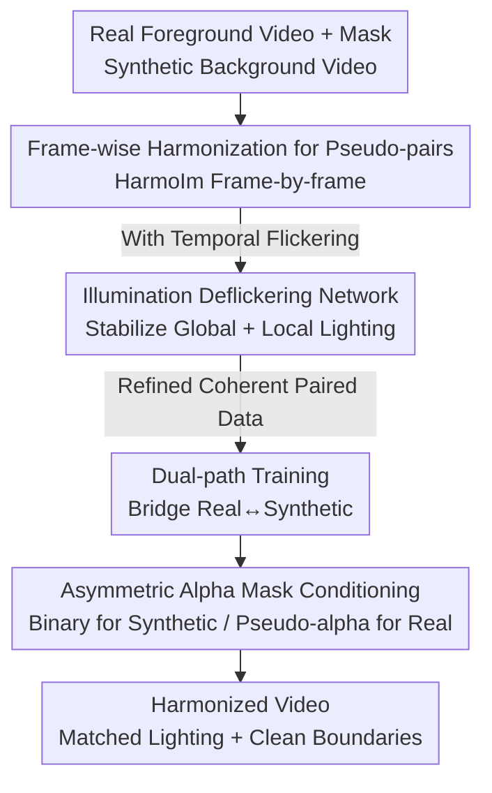

# HarmoVid: Relightful Video Portrait Harmonization

**Conference**: CVPR 2026  
**arXiv**: [2605.28811](https://arxiv.org/abs/2605.28811)  
**Code**: https://chedgekorea.github.io/HarmoVid (Project Page)  
**Area**: Video Generation / Diffusion Models / Video Harmonization  
**Keywords**: Video Harmonization, Relighting, Temporal Consistency, Deflickering, Video Diffusion

## TL;DR
HarmoVid adopts a two-stage data and model scheme consisting of "frame-wise harmonization → deflickering → dual-path training." In the absence of real paired data, it harmonizes the lighting, shadows, and tones of foreground portrait videos to match target backgrounds, achieving temporal stability, clean boundaries, and expressive relighting performance.

## Background & Motivation

**Background**: Image harmonization is relatively mature, involving the adjustment of synthesized/inserted foreground regions to match the lighting and color tones of the background. However, video harmonization remains challenging due to the added temporal dimension. The most direct approach applies image harmonization models frame-by-frame to video sequences.

**Limitations of Prior Work**: Frame-wise processing introduces severe **temporal jitter** (temporal flickering)—the same performance is relit independently in adjacent frames, leading to global tone jumps and local shadow/highlight oscillations that are visually jarring. Training a dedicated video harmonization model is hindered by the **scarcity of paired data**: it is impossible to have a person reenact identical actions, expressions, and poses under different lighting/background conditions, making "same video under different illuminations" annotations non-scalable and nearly impossible to collect in reality.

**Key Challenge**: Synthetic data can be scaled and cover diverse lighting but lack realism and natural temporal behavior. Real videos provide natural lighting and shadows with temporal supervision but lack diverse, expressive relighting effects. Both domains have complementary strengths and weaknesses; neither alone can train a model that is both realistic and expressive. Furthermore, existing generative methods often suffer from **identity shift** (unintentional changes to foreground/background content) and are extremely sensitive to mask quality, resulting in artifacts at boundaries when masks are imperfect.

**Goal**: Develop a video harmonization model **without requiring real paired data** that simultaneously satisfies four properties: (a) preservation of foreground/background identity and texture, (b) temporal consistency, (c) robustness to imperfect masks, and (d) expressive high-fidelity relighting performance across scenes.

**Key Insight**: The authors first generate flickering pseudo-paired data using "frame-wise harmonization," then refine it into high-quality temporally coherent data using a **specialized illumination deflickering network**. Finally, the video harmonization model is trained via **dual-path training** on both "real videos + refined synthetic videos" to bridge the physical plausibility of the real domain with the lighting expressiveness of the synthetic domain.

## Method

### Overall Architecture

The core of HarmoVid is a three-step pipeline: "data generation followed by model training." The input consists of a foreground portrait video, its mask, and a target background video, and the output is a harmonized video where the foreground lighting, shadows, and tones match the background while content, identity, and temporal stability are preserved.

The pipeline comprises three steps: **Step 1** composes real foregrounds onto synthetic backgrounds and applies a pre-trained image harmonization model, HarmoIm, frame-by-frame to obtain "pseudo-paired" but flickering intermediate synthetic data. **Step 2** trains an illumination deflickering network to clean the flickering video into high-quality temporally coherent paired data. **Step 3** trains the final video harmonization model, HarmoVid, which shares the same 3D latent diffusion Transformer architecture (based on CogVideoX DiT) with the deflickering network. It bridges the real and synthetic domains via Real→Synthetic and Synthetic→Real training paths. Foreground masks are applied as **asymmetric** conditions (binary masks for the synthetic path and pseudo-alpha masks for the real path).

### Key Designs

**1. Expressive Pseudo-paired Data Generation: Converting "No Pairs" into "Pseudo-pairs"**

The biggest obstacle in video harmonization is the lack of real paired data. The authors bypass this by composing real foreground videos $V_F^R$ onto synthetic backgrounds $V_B^S$ (generated by video generators with diverse lighting) and applying a pre-trained image harmonization model HarmoIm **frame-by-frame**:

$$V^S = \text{HarmoIm}(V_F^R, V_B^S, V^M)$$

This generates large-scale pseudo-paired sets $\{(V^S, V^R)\}$, where the synthetic side $V^S$ provides expressive lighting effects and the real side $V^R$ provides natural lighting and temporal GT. While it solves the data scarcity issue, independent frame-by-frame processing inevitably introduces temporal inconsistency.

**2. Illumination Deflickering Network: Specialized for Global + Local Illumination jitter**

The frame-wise generated data suffers from flickering, including both global tone jumps and rapid local shadow/highlight jitter. General video deflickering models (e.g., BVD) only stabilize global frame-to-frame flickering and fail to handle local illumination changes. The authors train a **specialized** illumination deflickering network based on the CogVideoX 3D latent diffusion Transformer. By jointly modeling space and time, the network suppresses both global and local flickering. It learns to predict noise given the flickering video and foreground mask:

$$\mathcal{L}_{\text{deflicker}} = \mathbb{E}_{t,\epsilon}\big[\|\epsilon - \epsilon_\theta(z^I, z^T_t, V^M, t)\|_2^2\big]$$

where $z^I$ is the latent representation of the composite and $z^T$ is the real target representation (encoded by a 3D-VAE). Once trained, it upgrades "dirty" pseudo-pairs into high-quality "clean" coherent data.

**3. Dual-path Training: Bi-directional Bridge between Real and Synthetic Domains**

To bridge the distribution gap between real and synthetic domains, HarmoVid predicts noise to reconstruct harmonized videos in latent space:

$$\mathcal{L}_{\text{harm}} = \mathbb{E}_{t,\epsilon}\big[\|\epsilon - \epsilon_\theta(z^I, z^B, z^T_t, V^M, t)\|_2^2\big]$$

It utilizes two complementary paths: The **Real→Synthetic** path composes real foregrounds $V_F^R$ onto synthetic backgrounds to generate synthetic harmonized videos, preserving the expressive relighting captured by image models. The **Synthetic→Real** path composes synthetic foregrounds onto real backgrounds $V_B^R$ to reconstruct real harmonized videos, incorporating the temporal coherence and physical plausibility found in real videos.

**4. Asymmetric Alpha Mask Conditioning: Learning Clean Boundaries with Pseudo-alpha Masks**

Binary masks often leave harsh artifacts at boundaries, especially in fine regions like hair. The authors apply masks **asymmetrically**: the synthetic path uses binary masks $V^M$, while the real path uses **pseudo-alpha masks** $V^{\tilde\alpha}$ with smoothed boundary attenuation. Since real videos naturally provide perfect boundary blending GT, learning with pseudo-alpha masks in the Synthetic→Real path allows the model to produce smooth foreground-background transitions that are robust to imperfect segmentation.

### Loss & Training

Both the deflickering and harmonization networks use standard L2 diffusion loss (noise prediction), corresponding to $\mathcal{L}_{\text{deflicker}}$ and $\mathcal{L}_{\text{harm}}$. Training was conducted on 8 A100 GPUs for 8 hours (1,200 iterations). The dataset consists of 10,000 portrait videos. During inference, temporal MultiDiffusion is applied for videos longer than 85 frames to support high-quality long-sequence harmonization.

## Key Experimental Results

### Main Results

Compared against image/video harmonization SOTAs on a synthetic test set constructed from real portraits and LUTs:

| Method | PSNR ↑ | SSIM ↑ | LPIPS ↓ | RMSE ↓ | CLIP Score ↑ | Motion Pres. ↓ | User·Temp ↑ | User·ID ↑ | User·Harm ↑ |
|------|--------|--------|---------|--------|--------------|----------------|-------------|-----------|-------------|
| IC-Light | 14.77 | 0.8889 | 0.0828 | 0.1881 | 0.9895 | 1.2928 | 56% | 57% | 27% |
| Relightful Harmonization | 15.89 | 0.9301 | 0.0581 | 0.1643 | 0.9907 | 1.0021 | 36% | 50% | 36% |
| RelightVid | 15.70 | 0.9214 | 0.0707 | 0.1711 | 0.9946 | 0.7096 | 35% | 51% | 27% |
| Light-A-Video | 15.64 | 0.8900 | 0.0791 | 0.1716 | 0.9955 | 0.5775 | 56% | 58% | 51% |
| **Ours (HarmoVid)** | **17.91** | **0.9306** | **0.0554** | **0.1325** | **0.9963** | **0.5264** | **82%** | **78%** | **72%** |

HarmoVid leads in all objective metrics: PSNR 17.91 (vs 15.89, +2.02) and Motion Preservation 0.5264 (lower is better). In the user study, the preference rates for temporal, ID, and harmonization were 82%, 78%, and 72% respectively.

### Ablation Study

**Deflickering (vs. General Baseline BVD)**:

| Setting | Method | CLIP Score ↑ | Motion Pres. ↓ |
|------|------|--------------|----------------|
| Frame-wise LUT jitter | BVD | 0.9950 | 0.5114 |
| Frame-wise LUT jitter | **HarmoVid** | **0.9967** | **0.3630** |
| Frame-wise harmonization | BVD | 0.9920 | 1.3439 |
| Frame-wise harmonization | **HarmoVid** | **0.9936** | **0.5395** |

**Stage 2 (Deflickering) and Stage 3 (Dual-path) Ablation**:

| Stage 2 | Stage 3 | SSIM ↑ | LPIPS ↓ | CLIP Score ↑ | Motion Pres. ↓ |
|---------|---------|--------|---------|--------------|----------------|
| – | ✓ | 0.9187 | 0.0613 | 0.9911 | 0.9376 |
| ✓ | – | 0.9217 | 0.0594 | 0.9937 | 0.5490 |
| **✓** | **✓** | **0.9306** | **0.0554** | **0.9963** | **0.5264** |

### Key Findings
- **Stage 2 is indispensable**: Without deflickering, flickering in the training pairs prevents the DiT from learning stable temporal representations, causing significant loss of harmonization quality.
- **Stage 3 is indispensable**: Using only the deflickering network for harmonization leads to long-term inconsistency (drifting tone/lighting) and lacks the naturalism provided by joint training with real videos.
- **Pseudo-alpha mask improves boundary quality**: Indicators focusing on boundaries (Laplacian Variance and Tenengrad) improved significantly, better preserving details in complex regions like hair.
- **Generalization**: Although trained on portraits, the model generalizes directly to non-human foreground objects.

## Highlights & Insights
- **Data over Architecture**: The core innovation lies in the "frame-wise generation → specialized deflickering" data refinement pipeline rather than a new network structure.
- **Specialized vs. General Deflickering**: Jointly modeling space and time with a 3D DiT allows the suppression of local shadow jitter that general methods cannot handle.
- **Asymmetric Mask Logic**: Leveraging real videos' natural boundary GT via pseudo-alpha masks provides a low-cost, high-impact improvement for complex boundary blending.
- **Dual-path Synergy**: The Real→Synthetic path ensures expressiveness, while the Synthetic→Real path ensures physical and temporal stability.

## Limitations & Future Work
- **Dependency on HarmoIm**: The upper limit of relighting expressiveness is determined by the frame-wise image model; its errors may be inherited.
- **Synthetic Background Constraints**: Background diversity and realism depend on the quality of the video generator used for data creation.
- **Training and Scale**: The training was relatively short (8 hours) and focused on portraits, with less systematic quantification for highly reflective materials.
- **Future Directions**: Exploring stronger/controllable relighting priors or incorporating explicit HDR/illumination conditions for better physical controllability.

## Related Work & Insights
- **vs Relightful Harmonization (HarmoIm)**: This is frame-wise; HarmoVid uses it as a "raw material" and adds deflickering + video training to solve temporal jumps (PSNR 15.89→17.91).
- **vs RelightVid**: While both condition on backgrounds, HarmoVid uses real videos to provide supervision, resulting in superior ID preservation and temporal stability.
- **vs Light-A-Video**: Light-A-Video is training-free; HarmoVid is a dedicated trained model that significantly outperforms it in boundary cleanliness and naturalism.
- **vs BVD**: BVD only stabilizes global flickering and loses spatial detail; HarmoVid's specialized network handles local illumination jitter effectively.

## Rating
- Novelty: ⭐⭐⭐⭐ The data refinement paradigm effectively solves the no-paired data hurdle.
- Experimental Thoroughness: ⭐⭐⭐⭐ Comprehensive comparisons and ablations, though non-portrait quantification is limited.
- Writing Quality: ⭐⭐⭐⭐ Motivation and principles are clearly articulated.
- Value: ⭐⭐⭐⭐ Directly addresses a high-demand need in film/AR; the data handling approach is broadly applicable.

<!-- RELATED:START -->

## Related Papers

- [\[CVPR 2026\] PersonaLive! Expressive Portrait Image Animation for Live Streaming](personalive_expressive_portrait_image_animation_for_live_streaming.md)
- [\[CVPR 2026\] PerformRecast: Expression and Head Pose Disentanglement for Portrait Video Editing](performrecast_expression_and_head_pose_disentanglement_for_portrait_video_editin.md)
- [\[CVPR 2026\] FaceCam: Portrait Video Camera Control via Scale-Aware Conditioning](facecam_portrait_video_camera_control_via_scale-aware_conditioning.md)
- [\[CVPR 2026\] FlashPortrait: 6× Faster Infinite Portrait Animation with Adaptive Latent Prediction](flashportrait_6x_faster_infinite_portrait_animation_with_adaptive_latent_predict.md)
- [\[CVPR 2026\] UniTalking: A Unified Audio-Video Framework for Talking Portrait Generation](unitalking_a_unified_audio-video_framework_for_talking_portrait_generation.md)

<!-- RELATED:END -->
