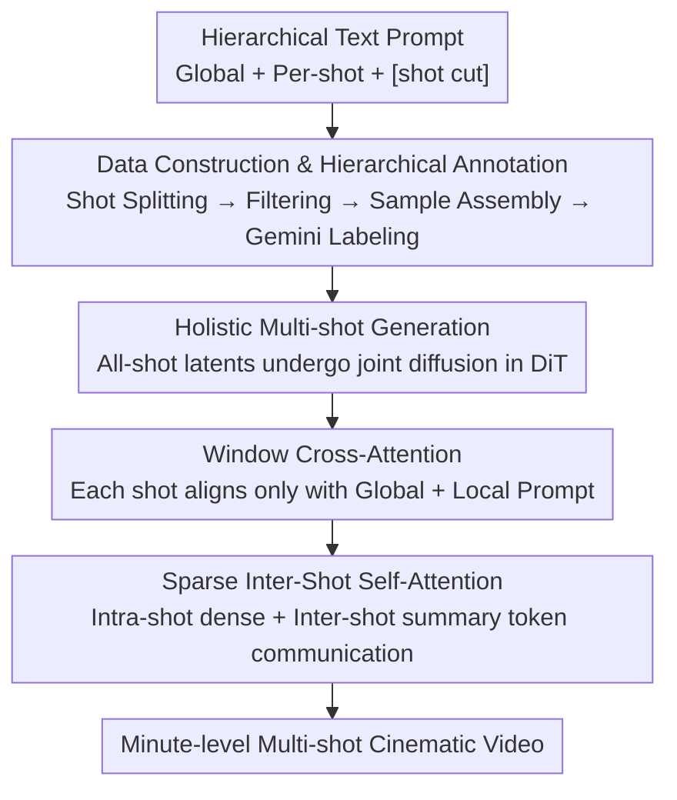

# HoloCine: Holistic Generation of Cinematic Multi-Shot Long Video Narratives

**Conference**: CVPR 2026  
**Paper**: [CVF Open Access](https://openaccess.thecvf.com/content/CVPR2026/html/Meng_HoloCine_Holistic_Generation_of_Cinematic_Multi-Shot_Long_Video_Narratives_CVPR_2026_paper.html)  
**Code**: Project Page holo-cine.github.io  
**Area**: Video Generation / Multi-Shot Long Video Narrative  
**Keywords**: Multi-shot video generation, holistic generation, window cross-attention, sparse inter-shot self-attention, minute-level long video

## TL;DR
Based on DiT video diffusion models like Wan2.2, HoloCine employs "Window Cross-Attention" to align each shot with its storyboard text and "Sparse Inter-Shot Self-Attention" to reduce the quadratic complexity of full-sequence self-attention to near-linear. This enables the **holistic, one-pass generation** of minute-long, character-consistent cinematic narratives with precise transition control.

## Background & Motivation
**Background**: Driven by diffusion models and DiT, Text-to-Video (T2V) can now generate high-fidelity single-shot clips (5-second range). However, movies, series, and documentaries are not single long takes but coherent narratives composed of a series of edited shots. Moving from single-shot generation to "scene-level, multi-shot" synthesis is the next major challenge, which authors describe as bridging the "narrative gap."

**Limitations of Prior Work**: Most existing multi-shot solutions use **decoupled generation**—either through autoregressive chunk-by-chunk generation or by generating keyframes first and then independently filling in the shots. Even with character/scene conditioning, individual shots are generated largely independently, leading to poor long-range consistency, error accumulation, and consistency drift (identity and background details degrading over time). Emerging **holistic** approaches (e.g., LCT) model the entire multi-shot sequence jointly to preserve global consistency but face two hard constraints: (1) **Difficulty in precise control**—instructions for individual shots are "diluted" by the global prompt; (2) **Computational explosion**—self-attention scales quadratically with sequence length, making minute-long videos nearly infeasible.

**Key Challenge**: There is a tension between the "global consistency" of holistic modeling and the need for "precise shot control + affordable computation." The more thorough the joint modeling, the more individual shot instructions are diluted, the longer the sequence, and the more expensive the attention.

**Goal**: While maintaining holistic consistency, resolve two issues: (1) Ensure each shot precisely follows its own storyboard instructions with clean transitions; (2) Compress attention costs to enable minute-level generation.

**Key Insight**: The authors observe that "intra-shot consistency" and "inter-shot consistency" require different types of information. Intra-shot requires dense frame-by-frame temporal modeling for motion continuity, while inter-shot only needs to maintain the persistence of characters/environments/styles without requiring every frame to attend to every other frame. Based on this, a structured sparsity can be designed.

**Core Idea**: Use two dedicated mechanisms—"Window Cross-Attention" to localize text control and "Sparse Inter-Shot Self-Attention" to compress global communication into summary tokens—allowing holistic generation to be both precisely controllable and scalable to minute-level lengths.

## Method

### Overall Architecture
The input to HoloCine is a **hierarchical text prompt** (a global prompt describing characters/environment/plot, plus a series of per-shot prompts describing motion/camera/characters, separated by a special `[shot cut]` tag). The output is a complete multi-shot video. Built on the 14B Wan2.2 DiT model, **latents for all shots are jointly processed during the diffusion process** (holistic), naturally maintaining long-range consistency of identity, background, and style through shared self-attention. Two mechanisms are inserted into this holistic backbone: **Window Cross-Attention** ensures visual tokens of each shot only align with the "global prompt + shot-specific prompt," providing precise control and clean transitions; **Sparse Inter-Shot Self-Attention** performs dense attention within shots and communicates across shots via a small set of summary tokens, reducing complexity from quadratic to near-linear. Prior to training, a data pipeline splits movies/series into shots, filters them, aggregates them into multi-shot samples by target duration, and uses Gemini 2.5 Flash for hierarchical annotation.

### Key Designs

**1. Data Construction and Hierarchical Annotation: Creating Structured Multi-shot Samples**

The biggest obstacle to multi-shot generation is the lack of data—public video datasets are mostly isolated clips. The authors built a pipeline: first, collect large-scale full videos and use shot boundary detection to split them into single shots with timestamps; then perform strict filtering (removing subtitles via OCR, discarding too short, dark, or low-aesthetic clips); then **sequentially aggregate continuous shots based on target durations (e.g., 5s / 15s / 60s)** into multi-shot samples until a threshold is reached (with tolerance). This produces samples with a controllable distribution of shots that can be packed into uniform batches. The final dataset contains **400k samples**. Each sample is **hierarchically annotated** by Gemini 2.5 Flash: a global prompt describes the overall scene, and a string of per-shot prompts describes motion/camera/characters, with `[shot cut]` tags inserted between them. This two-layer structure provides both global context and fine-grained, temporally localized guidance, which is the prerequisite for the two attention mechanisms to function.

**2. Window Cross-Attention: Aligning Shots to Specific Storyboard Text**

Addressing the issue where "per-shot instructions are diluted by the full prompt," the authors do not allow all video tokens to attend to the entire text. Instead, they **localize the cross-attention receptive field** based on the prompt hierarchy. Given the query $Q_i$ of the $i$-th shot, it is restricted to attend only to the key-values of the global prompt $KV^{txt}_{global}$ and the corresponding $i$-th per-shot prompt $KV^{txt}_i$:

$$\text{Attn}(Q_i, KV^{txt}) = \text{Attn}\big(Q_i,\,[KV^{txt}_{global},\,KV^{txt}_i]\big)$$

This localized alignment gives the model a clear signal to execute crisp, temporally-aligned transitions, effectively letting the text prompt "direct" every cut, determining both **what to generate** and **when to transition**. Since text sequences are short and compute-efficient, this is implemented via an attention mask with negligible overhead.

**3. Sparse Inter-Shot Self-Attention: Intra-shot Density and Inter-shot Summarization**

To solve the "quadratic complexity explosion of full-sequence self-attention," the authors apply structured sparsity based on the different information needs within and across shots. **Intra-shot**: Full bidirectional self-attention is performed within each shot $i$, where $Q_i$ attends to all $KV_i$ of the same shot to ensure motion continuity. **Inter-shot**: For each shot $j$, a small set of representative key-value tokens $KV_{summary,j}$ is selected (the tokens of the **first frame** are used in practice). These summaries are concatenated into a global bank $KV_{global}=[KV_{summary,1},\dots,KV_{summary,N_{shots}}]$, which $Q_i$ of every shot additionally attends to:

$$\text{Attn}(Q_i, KV) = \text{Attn}\big(Q_i,\,[KV_{global},\,KV_i]\big)$$

If a video has $N_s$ shots of length $L_{shot}$ using $S$ summary tokens each, the full attention complexity is $O((N_s L_{shot})^2)$, whereas this method reduces it to approximately $O\!\big(N_s\times(L_{shot}^2 + L_{shot}\cdot N_s\cdot S)\big)$. Since $S\ll L_{shot}$, the complexity is significantly reduced and scales near-linearly with the number of shots, making minute-level holistic generation feasible. This is implemented using `flash_attn_varlen_func` from FlashAttention-3: queries are packed, and local tokens are concatenated with global summaries as $[KV_1, KV_{global}, KV_2, KV_{global},\dots]$, using `cu_seqlens` for sequence boundary indexing for block-sparse attention without padding overhead.

### Loss & Training
The framework is based on 14B Wan2.2, trained on 400k multi-shot samples. Data includes 5s/15s/60s durations, up to 13 shots per video at 480×832 resolution. Training runs for 10k steps with lr $1\times10^{-5}$ and linear warmup on 128 H800 GPUs. Mixed parallelism is used: FSDP for parameters and Context Parallelism (CP) for long token sequences. Ablations were performed on the Wan2.2 5B model for efficiency.

## Key Experimental Results

### Main Results
The authors used Gemini 2.5 Pro to generate 100 diverse hierarchical prompts with explicit transition instructions as a new benchmark, comparing against three paradigms: pre-trained Wan2.2 14B (fed with full hierarchical prompts), two-stage keyframe-to-video (StoryDiffusion / IC-LoRA, using Wan2.2 14B for I2V), and the holistic CineTrans. Metrics cover transition control, inter-shot consistency, intra-shot consistency (VBench Subject/Background), aesthetic quality, and semantic consistency (Global/Shot). Transition control uses the proposed **Shot Cut Accuracy (SCA)**, which quantifies both the correctness of shot counts and the timing precision. Inter-shot consistency uses ViCLIP similarity for shot pairs labeled with the same character.

| Method | Shot Control↑ | Inter-shot Consist.↑ | Intra-shot Subj.↑ | Intra-shot Bg.↑ | Aesthetic↑ | Semantic Global↑ | Semantic Shot↑ |
|------|---------|-----------|------------|------------|------|----------|----------|
| Wan2.2 | 0.4843 | 0.6772 | 0.9054 | 0.9014 | 0.5568 | 0.1652 | 0.1364 |
| StoryDiffusion+Wan2.2 | - | 0.7364 | 0.8487 | 0.8927 | **0.5773** | 0.1453 | 0.1644 |
| IC-LoRA+Wan2.2 | - | 0.7096 | 0.9421 | 0.9303 | 0.5246 | 0.1808 | 0.1692 |
| CineTrans | 0.5370 | 0.6152 | 0.8990 | 0.8998 | 0.4789 | 0.1568 | 0.1159 |
| **Ours** | **0.9837** | **0.7509** | **0.9448** | **0.9352** | 0.5598 | **0.1856** | **0.1837** |

HoloCine outperforms others in terminal multi-shot metrics: shot control, inter-shot consistency, intra-shot consistency, and semantic alignment. Aesthetic quality is only slightly lower than StoryDiffusion+Wan2.2. Two-stage methods often suffer from prompt distortion and long-range consistency collapse (characters drifting by shots 4 or 5), while Wan2.2 fails to understand multi-shot instructions, producing only single static shots. CineTrans shows degraded quality and failed transitions under complex long prompts.

### Ablation Study
Component ablation performed on Wan2.2 5B (Tab. 2):

| Config | Shot Control↑ | Inter-shot Consist.↑ | Aesthetic↑ | Semantic Consist.↑ | Note |
|------|---------|-----------|------|---------|------|
| w/o window | 0.6266 | 0.7009 | 0.5755 | 0.1562 | Without window cross-attn, shot control fails and new prompts are ignored |
| full self-attn | 0.8923 | 0.7231 | 0.5700 | 0.1738 | High quality but unaffordable compute |
| sparse, w/o global | 0.9675 | 0.6761 | 0.5669 | 0.1642 | Without inter-shot summary tokens, character consistency collapses |
| sparse, with global (Full) | **0.9736** | **0.7225** | 0.5693 | **0.1739** | Full model, quality approaches full attention |

### Key Findings
- **Window cross-attention is vital for shot control**: Removing it drastically reduces SCA and semantic consistency; the model fails to execute cuts, stays locked in the initial scene, and ignores subsequent prompts.
- **Summary tokens are the lifeline for inter-shot consistency**: Restricting attention strictly within shots (removing global summaries) causes catastrophic identity changes—proving that a few summary tokens carry the narrative continuity across shots.
- **Sparsity ≈ Full Attention Quality**: Indicators for sparse-with-global approach those of full self-attn (Shot Control 0.9736 vs 0.8923, Inter-shot Consistency 0.7225 vs 0.7231) while providing fundamental efficiency and scalability.
- **Emergent Memory Capability**: The model demonstrates character/object persistence across views, A-B-A long-range recurrence (character successfully reappearing after intervening shots), and even persistence of non-salient details (e.g., a blue magnet in the background accurately restored after multiple shots), suggesting it learns an implicit, persistent scene representation.

## Highlights & Insights
- **"Divide and Conquer" in Attention**: Translating the observation that "intra-shot needs dense temporal and inter-shot needs character/style persistence" into structured sparsity is a brilliant example of baking domain priors into attention patterns—more targeted than generic sparse masks.
- **Using First-Frame Tokens as Summaries**: Simple yet effective. A small number of tokens maintain inter-shot consistency and allow for block-sparse implementation via FlashAttention-3's varlen interface, making it highly practical for engineering.
- **Window Cross-Attention Decouples "What to Generate" vs. "When to Cut"**: Localizing text control lets the prompt truly "direct" the cut. This alignment logic is transferable to any controllable generation task requiring segmented instructions for segmented outputs.
- **Emergent Memory Points to World Models**: Fine-grained detail persistence across shots implies that holistic modeling can learn implicit, persistent world representations, offering insights for generative world models.

## Limitations & Future Work
- Extremely high training cost: 14B model + 128 H800s makes reproduction difficult for smaller teams; ablations had to be downscaled to 5B.
- Sparse attention relies on the heuristic of using the first frame as a summary; the paper does not fully explore whether a single-frame summary suffices for complex scenes with dramatic camera motion or large internal changes ⚠️.
- Aesthetic quality is slightly inferior to two-stage methods like StoryDiffusion+Wan2.2, indicating room for improvement in holistic single-frame quality.
- Quantitative comparison with the most relevant LCT is missing (code not released), limited to qualitative comparisons with official results; horizontal conclusions should be taken with caution.
- Dataset is limited to 13 shots per video at 480×832; narratives beyond the minute-level or at higher resolutions remain to be verified.

## Related Work & Insights
- **vs Decoupled/Two-stage (StoryDiffusion, IC-LoRA + I2V)**: These methods generate keyframes first and fill shots independently, forcing consistency only at anchor points; shots remain independent, leading to character drift. Ours uses joint holistic modeling, leading in both long-range consistency and transition control.
- **vs Holistic LCT**: LCT pioneered holistic modeling using interleaved positional embeddings in MMDiT but struggled with the control vs. compute dilemma; HoloCine completes the puzzle with Window Cross-Attention (control) and Sparse Inter-Shot Self-Attention (efficiency).
- **vs Holistic CineTrans**: Another recent holistic method, but CineTrans suffers from quality degradation and transition failure under complex long prompts. HoloCine leads significantly in metrics like SCA (0.9837 vs 0.5370).
- **vs Efficient Attention for Long Video (STA, LinGen, Radial Attention, MoC)**: This paper is inspired by efficient Transformer routes but customizes sparsity patterns specifically for multi-shot structures (intra-shot dense + inter-shot summary) rather than general window or linear approximations.

## Rating
- Novelty: ⭐⭐⭐⭐ Cleanly translates domain priors (differing intra/inter-shot needs) into structured sparsity + window cross-attention, making a clear contribution to holistic multi-shot generation.
- Experimental Thoroughness: ⭐⭐⭐⭐ Comprehensive baseline comparison across three paradigms + custom benchmark + SCA metric + full ablation, though lacking quantitative comparison with LCT and relying on human eval for some aspects.
- Writing Quality: ⭐⭐⭐⭐⭐ Clear logical flow from motivation to contradiction to the two mechanisms to complexity derivation. Formulas and diagrams are well-integrated.
- Value: ⭐⭐⭐⭐⭐ Scales holistic multi-shot generation to minute-level lengths with precise control, taking a key step toward automated, end-to-end "directing a whole scene."

<!-- RELATED:START -->

## Related Papers

- [\[CVPR 2026\] STAGE: Storyboard-Anchored Generation for Cinematic Multi-shot Narrative](stage_storyboard-anchored_generation_for_cinematic_multi-shot_narrative.md)
- [\[CVPR 2026\] StoryTailor: A Zero-Shot Pipeline for Action-Rich Multi-Subject Visual Narratives](storytailora_zero-shot_pipeline_for_action-rich_multi-subject_visual_narratives.md)
- [\[CVPR 2026\] MultiShotMaster: A Controllable Multi-Shot Video Generation Framework](multishotmaster_a_controllable_multi-shot_video_generation_framework.md)
- [\[CVPR 2026\] OneStory: Coherent Multi-Shot Video Generation with Adaptive Memory](onestory_coherent_multi-shot_video_generation_with_adaptive_memory.md)
- [\[CVPR 2026\] ShotDirector: Directorially Controllable Multi-Shot Video Generation with Cinematographic Transitions](shotdirector_directorially_controllable_multi-shot_video_generation_with_cinemat.md)

<!-- RELATED:END -->
