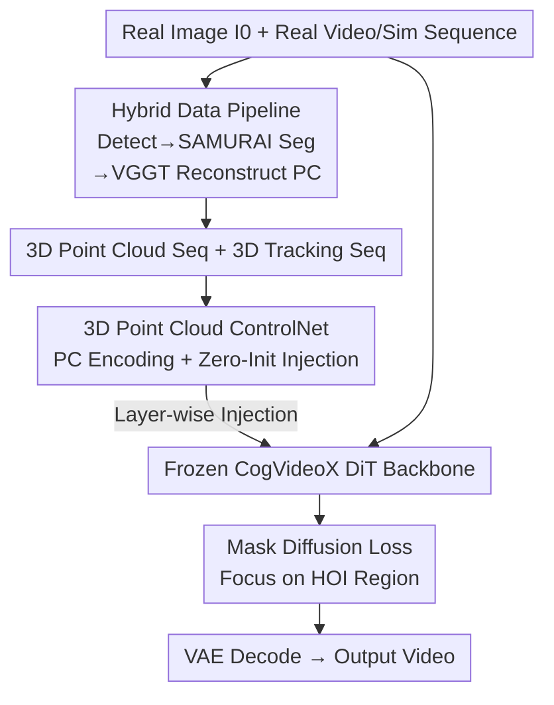

# HVG-3D: Bridging Real and Simulation Domains for 3D-Conditional Hand-Object Interaction Video Synthesis

**Conference**: CVPR 2026  
**Paper**: [CVF Open Access](https://openaccess.thecvf.com/content/CVPR2026/html/Chen_HVG-3D_Bridging_Real_and_Simulation_Domains_for_3D-Conditional_Hand-Object_Interaction_CVPR_2026_paper.html)  
**Area**: Video Generation / Diffusion Models / Hand-Object Interaction  
**Keywords**: Hand-Object Interaction Video Generation, 3D ControlNet, Point Cloud Conditions, CogVideoX, Sim-to-Real  

## TL;DR
HVG-3D connects a ControlNet, which accepts 3D point cloud sequences and 3D tracking signals, to an image-to-video diffusion model (CogVideoX-5B-I2V). Equipped with a hybrid data pipeline that constructs conditions from both real videos and simulators, the model generates geometrically accurate and temporally coherent hand-object interaction (HOI) videos driven by simulation data, achieving SOTA performance on TASTE-Rob.

## Background & Motivation

**Background**: Diffusion-based video generation (e.g., Sora, CogVideoX, Hunyuan Video) can yield high-quality, temporally consistent videos. Consequently, research has applied these models to "Hand-Object Interaction (HOI) video generation," which is valuable for learning robotic grasping strategies by generating large-scale training data.

**Limitations of Prior Work**: Most existing HOI generation methods rely on **2D control signals**—such as point trajectories, optical flow, bounding boxes, or masks. 2D signals inherently lack spatial expressiveness, providing only partial motion and geometric cues, which leads to unrealistic deformations and physically impossible contacts (e.g., hand-object interpenetration or object squashing). Crucially, these 2D conditions are typically extracted from real videos, making it difficult to utilize synthetic data efficiently generated by simulators, thus keeping data collection and annotation costs high.

**Key Challenge**: There is a tension between visual realism and precise physical control. Even recent works (e.g., Diffusion as Shader, DaS) that introduce 3D tracking videos for motion guidance eventually **project 3D cues back into 2D video sequences** to feed the model. This projection step discards 3D spatial structures and depth relationships—particularly under heavy occlusion or during movements perpendicular to the table (folding or lifting), where 2D representations fail to support depth reasoning.

**Goal**: To enable video diffusion models to **natively** ingest 3D conditions, thereby (1) enhancing the realism and physical plausibility of hand-object interactions; and (2) integrating with simulators so that synthetic 3D sequences can directly drive generation, enabling scalable data production.

**Core Idea**: Use **explicit 3D representations** (point cloud sequences + 3D tracking) as conditions. These geometric and motion cues are injected into a frozen image-to-video backbone via a specialized 3D ControlNet. A hybrid pipeline allows "real images + 3D conditions from real or sim sources" to be paired freely—bridging the "real domain" and "simulation domain."

## Method

### Overall Architecture

HVG-3D addresses the "3D-conditional HOI image-to-video (I2V)" task: given a real input image $I_0 \in \mathbb{R}^{H\times W\times 3}$, a 3D point cloud sequence $P=\{P_t\}_{t=1}^{T}$ ($P_t\in\mathbb{R}^{N\times 3}$) representing the geometry of $T$ frames, and an optional 3D tracking sequence $\mathcal{T}=\{T_t\}_{t=1}^{T}$, the goal is to generate a video $V_{out}=\{I_t\}_{t=1}^{T}$ that is visually realistic, temporally coherent, and faithful to 3D spatial constraints.

The system consists of two major components: the **3D-aware diffusion generation architecture** on the right—using a frozen CogVideoX-5B-I2V as the backbone with a trainable 3D point cloud ControlNet that injects encoded signals into each DiT block via zero-initialization layers; and the **hybrid data pipeline** on the left—responsible for recovering or constructing paired "input image + mask + point cloud + tracking" from real videos or simulators, allowing flexible condition sourcing during both training and inference. Finally, a mask diffusion loss focusing on the hand-object region concentrates training on key areas.

### Key Designs

**1. 3D Point Cloud ControlNet: Injecting explicit 3D geometry into a frozen video backbone instead of projecting back to 2D**

This design directly addresses the "2D condition depth loss" issue. The backbone uses CogVideoX-5B-I2V: the input image $I_0$ and the ground truth video $V_{gt}$ from training are encoded by a VAE into latents $Z_{I_0}, Z_{gt}\in\mathbb{R}^{T\times \frac{H}{8}\times\frac{W}{8}\times 16}$. The image latent is zero-padded in the time dimension to length $T$ and concatenated with the noisy $Z_{gt}$ for iterative denoising via the Diffusion Transformer, followed by 3D VAE decoding to produce $V_{out}$. On the condition side, given a point cloud sequence $P\in\mathbb{R}^{T\times N\times 3}$, a point cloud encoder yields latent features $Z_{pc}\in\mathbb{R}^{T\times L\times 768}$, while 3D tracking information is encoded as $Z_{tracking}\in\mathbb{R}^{T\times\frac{H}{8}\times\frac{W}{8}\times 16}$. To align heterogeneous conditions, $Z_{pc}$ passes through a learnable linear layer and is resampled to match the dimensions of $Z_{tracking}$ and $Z_{gt}$ before concatenation and input into the ControlNet.

The ControlNet architecture **replicates** all pre-trained DiT blocks of the backbone to learn conditions. Each layer's output is injected into the corresponding backbone DiT block through a **zero-initialized convolution**. Zero initialization ensures the injected term is zero at the start of training, preserving the pre-trained capability while gradually learning to incorporate 3D cues. Unlike DaS, which projects 3D into 2D images as conditions, the point cloud here maintains its 3D structure; the diffusion model effectively treats this as a **neural renderer** reading 3D directly, resulting in superior spatial consistency and physical plausibility under severe occlusion and complex articulated motion.

**2. Hybrid Data Pipeline: Bridging real and simulation domains to pair a real image with 3D conditions from any source**

The pain point is that "2D conditions must be extracted from real videos, making sim data unusable." HVG-3D designs a three-stage pipeline (training data construction → training → inference) to connect both domains. During training, as TASTE-Rob lacks mask and point cloud annotations, the authors recover these signals from monocular egocentric RGB videos: "frame difference maps (for static backgrounds) + YOLOv8-X detection (for dynamic hands)" are used to extract bounding boxes for hands and objects; SAMURAI is used to initialize from boxes and refine bidirectionally to obtain temporally consistent instance masks; these are fused into frame-wise HOI segmentations. VGGT is then used on video frames and masks to reconstruct frame-wise point clouds $P\in\mathbb{R}^{T\times N\times 3}$, while 3D tracking sequences are estimated by SpatialTracker.

The true value lies in the **swappable condition sources** during inference: the model requires only one real image and a 3D condition sequence. This condition can either (1) be extracted from real video using the same pipeline as training, or (2) come from simulation—editing/generating 3D hand-object mesh sequences in Blender or directly sampling from 3D HOI datasets like ARCTIC or HOT3D. All 3D mesh sequences are processed into compatible point clouds (including tracking sequences if necessary) and seamlessly fed into the same condition interface. This means one can script novel HOI actions in Blender that do not exist in the training set and have the model "render" them into real videos—the key to bridging real and sim domains for low-cost data augmentation.

**3. Mask Diffusion Loss: Focusing learning on the HOI region to resist background interference and accelerate convergence**

Explicit 3D conditions provide strong geometric control but may not suppress background interference in cluttered scenes. Borrowing from StableAnimator, the authors add a mask-weighted reconstruction term to the standard diffusion loss:

$$\mathcal{L}=\sum_{i=1}^{n}\mathbb{E}_{\varepsilon}\big\|(Z_{gt}-Z_{\varepsilon})\odot(1+M^{i})\big\|^{2}$$

where $Z_{gt}$ and $Z_{\varepsilon}$ are the ground truth and predicted video latents, and $M^{i}\in\{0,1\}^{1\times H\times W}$ is the hand-object mask for the $i$-th frame. The $(1+M^i)$ term doubles the error weight for the hand-object region while keeping the background weight at 1, forcing the model to prioritize accuracy in interaction-critical regions rather than averaging attention across the whole scene. Ablations show this not only improves quality but also leads to faster convergence and better robustness to other objects in complex scenes.

### Loss & Training
During training, **only the replicated condition DiT blocks are fine-tuned**, while the original denoising DiT backbone remains frozen to preserve pre-trained video generation capabilities. Each video is center-cropped and resized to $720\times 480$ with a fixed length of 49 frames. Each training sample includes an input image $I_0$, ground truth video $V_{gt}$, HOI mask sequence, point cloud sequence $P$, and tracking sequence. The optimizer is AdamW with a learning rate of $1\times10^{-4}$ for 20 epochs, using gradient accumulation to reach an effective batch size of 4, trained on 8 H20 GPUs.

## Key Experimental Results

The dataset is TASTE-Rob (egocentric HOI), specifically the Single Hand subset featuring office, dining, bedroom, kitchen, and dressing table scenes. 2% of candidates were sampled from each scene, with 100 segments randomly selected for the test set. Evaluation categories include image quality (L1, PSNR, SSIM, LPIPS, CLIP, FID, C-FID) and spatio-temporal similarity (FVD, ST-SSIM, GMSD-T).

### Main Results

In the Full Frame evaluation, HVG-3D achieved the lowest FVD (13.8), lowest FID (58.2), highest CLIP (0.96), and best GMSD-T (0.40). While some pixel-wise metrics were slightly trailing DaS, HVG-3D led across the board in the HOI mask region evaluation—the area critical for interaction.

| Evaluation Range | Method | PSNR↑ | SSIM↑ | LPIPS↓ | ST-SSIM↑ | FID↓ | C-FID↓ |
|---|---|---|---|---|---|---|---|
| Full Frame | DaS | **24.83** | **0.84** | **0.191** | 0.96 | 75.5 | **14.6** |
| Full Frame | InterDyn | 24.13 | 0.82 | 0.205 | 0.95 | 73.3 | 17.8 |
| Full Frame | **HVG-3D** | 24.15 | 0.81 | 0.193 | **0.97** | **58.2** | **14.6** |
| HOI Region | DaS | 17.41 | 0.96 | 0.039 | 0.88 | 128.0 | 16.0 |
| HOI Region | InterDyn | 19.03 | 0.96 | 0.034 | 0.92 | 104.5 | 14.5 |
| HOI Region | **HVG-3D** | **19.08** | **0.97** | **0.032** | **0.93** | **88.5** | **13.1** |

Qualitatively, only HVG-3D completed specified operations while maintaining the shape of hands and objects. DaS performed adequately for in-plane translation but showed significant deformation during folding or vertical motions. InterDyn was less stable, and general large models like CogVideoX, Wan2.2, Kling, or Sora2 failed to perform operations reliably.

### Ablation Study

| Configuration | PSNR↑ | SSIM↑ | LPIPS↓ | ST-SSIM↑ | Description |
|---|---|---|---|---|---|
| full model | **24.15** | **0.81** | **0.193** | **0.97** | Complete model |
| w/o 3D point cloud | 18.44 | 0.37 | 0.5957 | 0.91 | Removing PC condition caused the most degradation |
| w/o 3D tracking | 22.76 | 0.75 | 0.2054 | 0.95 | Poorer contact/trajectory alignment |
| w/o mask loss | 22.09 | 0.80 | 0.199 | 0.96 | Slower convergence, reduced robustness |

### Key Findings
- **3D point cloud condition makes the greatest contribution**: Without it, SSIM plummeted from 0.81 to 0.37 and LPIPS surged from 0.193 to 0.5957. The loss of depth perception led to severe distortion in folding or vertical motion scenes, confirming that 2D conditions cannot handle depth reasoning.
- **3D tracking provides complementary perspective info**: Without it, object shapes remained reasonable, but spatial alignment of contact points and trajectories worsened. Since the model was trained with both, tracking likely provides camera perspective cues that help the model learn better point cloud representations.
- **Mask loss mainly accelerates convergence and improves anti-interference**: At the same epoch, removing it consistently degraded metrics, as the model distributed attention across the whole scene rather than focusing on the interaction.
- **HOI region FVD further dropped to 9.6** (vs 13.8 full frame), whereas other methods typically regressed in mask regions, showing that HVG-3D's strength lies in local interaction details.

## Highlights & Insights
- **Reversing "3D-to-2D then Generate" to "Diffusion as Neural Renderer reading 3D"**: This is the core departure from DaS—preserving the 3D structure throughout, which benefits occlusion and vertical motion scenarios most.
- **Unified Real/Sim Interface**: The same interface accepts both reconstructed point clouds from real video and synthetic sequences from Blender or ARCTIC/HOT3D. This facilitates "rendering" real videos from novel simulated actions, offering a low-cost path for robotic data production.
- **Frozen Backbone + Zero-Init Injection**: Training only the replicated condition blocks preserves pre-trained video generation power while stabilizing training, a clean adaptation of the ControlNet paradigm to video I2V.
- **Mask-weighted $(1+M)$ Loss**: This lightweight formulation provides a triple benefit: quality improvement, accelerated convergence, and background noise resistance, making it highly transferable to other region-sensitive generation tasks.

## Limitations & Future Work
- **Strong Dependence on 3D Condition Quality**: Training point clouds are reconstructed by VGGT and tracking by SpatialTracker; errors in these upstream modules under heavy occlusion or fast motion propagate to the output.
- **Limited Scope**: Validated only on a single dataset (TASTE-Rob), single-hand interactions, and fixed 49-frame lengths. Scene categories are limited (5 types). Generalization across datasets and long-sequence generation remains to be fully explored.
- **Full-frame pixel metrics slightly trail DaS**: The authors focus their lead on mask regions, but if a downstream task requires high global pixel accuracy (e.g., background consistency), this trade-off is worth noting.
- **Lack of Robotic Policy Loop**: While positioned as a tool for creating grasping data, the paper provides no end-to-end evidence that generated videos actually improve downstream policy learning.

## Related Work & Insights
- **vs DaS (Diffusion as Shader)**: DaS uses 3D tracking for motion guidance but projects it back to 2D, losing spatial structure. HVG-3D uses explicit 3D point clouds, maintaining depth relationships and performing significantly better in depth-heavy scenarios.
- **vs InterDyn / TASTE-Rob**: These rely on masks or 2D conditions for HOI synthesis, which limits visual quality and physical consistency. This work uses explicit 3D conditions to improve geometric fidelity.
- **vs General Video Models (CogVideoX/Wan2.2/Kling/Sora2)**: While visually strong, they lack precise spatial control. HVG-3D adds a 3D ControlNet to these backbones to provide necessary controllability.
- **vs 3D HOI Reconstruction (ARCTIC/HOLD/HOIDiffusion)**: These focus on 3D pose reconstruction or generation of isolated objects without scene contexts. This work utilizes their data as swappable 3D sources to drive video generation in real scenes.

## Rating
- Novelty: ⭐⭐⭐⭐ Clear and targeted approach by natively injecting 3D point clouds and bridging real/sim domains with a hybrid pipeline.
- Experimental Thoroughness: ⭐⭐⭐ Main results and three ablations are consistent, but limited to a single dataset without cross-domain or downstream loop validation.
- Writing Quality: ⭐⭐⭐⭐ Smooth logic from motivation to experiment; clear diagrams and tables.
- Value: ⭐⭐⭐⭐ Provides a simulation-driven, controllable video generation path for robotic data production with clear application potential.

<!-- RELATED:START -->

## Related Papers

- [\[CVPR 2026\] Open-world Hand-Object Interaction Video Generation Based on Structure and Contact-aware Representation](open-world_hand-object_interaction_video_generation_based_on_structure_and_conta.md)
- [\[CVPR 2026\] Endless World: Real-Time 3D-Aware Long Video Generation](endless_world_real-time_3d-aware_long_video_generation.md)
- [\[CVPR 2026\] U-Mind: A Unified Framework for Real-Time Multimodal Interaction with Audiovisual Generation](u-mind_a_unified_framework_for_real-time_multimodal_interaction_with_audiovisual.md)
- [\[CVPR 2026\] Generative Video Motion Editing with 3D Point Tracks](generative_video_motion_editing_with_3d_point_tracks.md)
- [\[CVPR 2026\] Towards Realistic and Consistent Orbital Video Generation via 3D Foundation Priors](orbital_video_3d_foundation_priors.md)

<!-- RELATED:END -->
