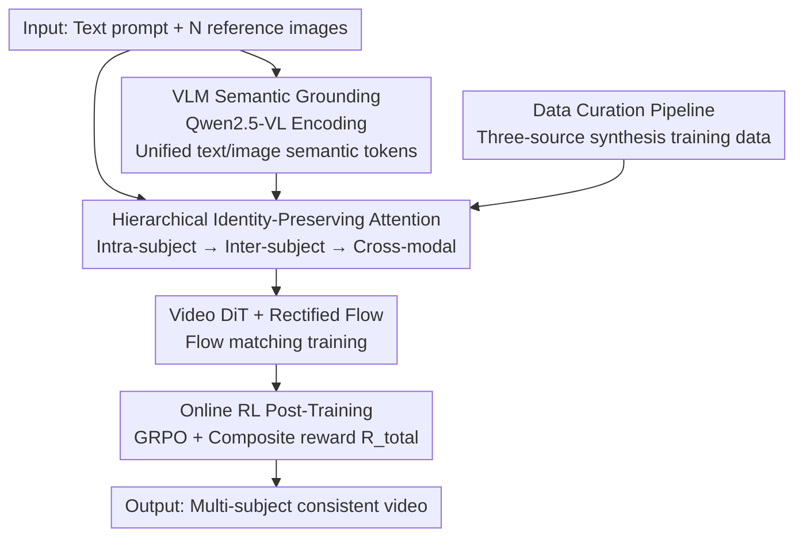

# ID-Crafter: VLM-Grounded Online RL for Compositional Multi-Subject Video Generation

**Conference**: CVPR 2026  
**Paper**: [CVF Open Access](https://openaccess.thecvf.com/content/CVPR2026/html/Pan_ID-Crafter_VLM-Grounded_Online_RL_for_Compositional_Multi-Subject_Video_Generation_CVPR_2026_paper.html)  
**Code**: [Project Page](https://angericky.github.io/ID-Crafter)  
**Area**: Video Generation / Multi-Subject Customization / Online Reinforcement Learning  
**Keywords**: Multi-subject video generation, identity preservation, VLM semantic grounding, Flow-GRPO, reward design

## TL;DR
ID-Crafter integrates "hierarchical identity-preserving attention + VLM semantic grounding + online RL post-training" into a unified framework. It specifically addresses the inherent contradiction in multi-subject video generation of "preventing identity leakage among subjects while maintaining natural and dynamic motion", achieving new SOTA on the open-source multi-subject S2V benchmark in metrics such as FaceSim.

## Background & Motivation

**Background**: Video generation models (such as Wan-Video and Kling) are already capable of generating high-fidelity videos. However, the vast majority only accept sparse inputs such as a text prompt or the first frame, offering little controllability in complex scenarios. "Multi-subject compositional generation" (providing several reference images to make designated people/objects appear simultaneously in the scene), which is already well-matured in the image domain, remains a hard nut to crack in the video domain.

**Limitations of Prior Work**: Directly scaling single-subject video generation methods to multi-subject scenarios leads to the critical issue of "identity crossover". Approaches like Phantom, ConcatID, SkyReels-A2, and CINEMA inject multi-subject features into pre-trained diffusion models, causing semantic conflicts between subjects where features of subject A bleed into subject B (identity leakage), thereby diluting the identity of each subject. In Fig.1 of the paper, Phantom's Face Score is only 0.32, whereas ID-Crafter achieves 0.84, visually demonstrating this gap.

**Key Challenge**: The root of the problem lies in an inherent tension: **preserving the independent identity of each subject** vs **generating coherent and dynamic overall scenes**. Simply concatenating and feeding multiple subject features into attention layers prevents the model from distinguishing "which features belong to which subject" and "how subjects should interact". Consequently, subjects either merge into each other, or the model freezes the frames without motion to preserve identities. Existing methods fail to find a good balance in this trade-off.

**Goal**: To simultaneously accomplish three tasks within a unified framework: (1) decouple multi-subject features to prevent identity leakage; (2) enable the model to genuinely "comprehend" complex multi-subject prompts (who is doing what and how they interact); and (3) directly optimize the tripartite trade-off among "identity preservation", "visual quality", and "motion smoothness".

**Key Insight**: The authors identify two exploitable leverages. First, if the attention is performed hierarchically as "intra-subject $\rightarrow$ inter-subject $\rightarrow$ cross-modal", the system can lock down the details of each subject before handling interactions, which naturally aligns with identity decoupling. Second, compared to traditional text encoders (like T5/CLIP), VLMs (such as Qwen2.5-VL) possess a fine-grained understanding of scene compositions, allowing them to act as "semantic guides" rather than just static encoders. Furthermore, since the rewards of diffusion models are inherently non-differentiable and credit assignment is difficult, online RL (such as group comparisons without a value network) is well-suited to directly align perceptual rewards.

**Core Idea**: Systematically resolve the identity-dynamics conflict in multi-subject video generation using a tripartite framework: "hierarchical attention for identity preservation + VLM as a semantic brain + online GRPO post-training to balance trade-offs."

## Method

### Overall Architecture

ID-Crafter is built upon the DiT-based latent video diffusion model, Wan-Video, using standard Rectified Flow (RF) as the base training. Given a text prompt $C_{txt}$ and $N$ reference images $I=\{I_k\}_{k=1}^N$ (each corresponding to a subject), the goal is to generate a temporally coherent video $V$ that matches the prompt while preserving the identities of all $N$ subjects with high fidelity.

The entire pipeline consists of three steps: **First**, the VLM (Qwen2.5-VL) is used to co-encode the text and reference images into semantically enhanced tokens, while an image encoder extracts tokens for each subject; **Second**, these conditioning tokens are fed into a hierarchical identity-preserving attention mechanism (the three-tier: intra-subject $\rightarrow$ inter-subject $\rightarrow$ cross-modal), which is integrated into the video DiT for flow matching training; **Finally**, an online RL (GRPO) stage is applied on top of the converged flow-matching model, leveraging a composite reward designed to balance identity fidelity and visual quality to further optimize the trade-off. The training data is synthesized through a custom-designed three-source curation pipeline, specifically addressing the "copy-paste" aesthetic artifact in multi-subject scenarios.

The training objective of RF is to regress the velocity field: predicting the constant velocity $v=\epsilon-z_0$ along the straight trajectory $z_t=(1-t)z_0+t\epsilon$. The loss is defined as:
$L_{RF}=\mathbb{E}_{t,z_0,\epsilon}[w(t)\|v_\theta(z_t,t,C_{ctx})-(\epsilon-z_0)\|_2^2]$.

### Key Designs

**1. Hierarchical Identity-Preserving Attention: Decoupling via "intra-subject $\rightarrow$ inter-subject $\rightarrow$ cross-modal" steps to prevent identity leakage**

Simply concatenating all subject tokens and text tokens for cross-attention hinders the model from distinguishing feature ownership. This leads to identity leakage (e.g., subject A's face bleeding into subject B), which is the direct source of identity crossover. ID-Crafter avoids this by decomposing the attention into three cascaded stages: it first applies **intra-subject attention** to aggregate fine-grained features within each subject, locking down who the subject is; then, **inter-subject attention** explicitly models interactions between distinct subjects, which directly suppresses identity leakage; finally, **cross-modal/multi-modal attention** integrates the subject features with the text and video tokens to ensure alignment with prompt semantics. Specifically, the reference images are first processed by an image encoder to extract feature maps $\{F_k\}_{k=1}^N$ ($F_k\in\mathbb{R}^{c\times h\times w}$), which are then flattened into token sequences $\{f_k\}_{k=1}^N$ ($f_k\in\mathbb{R}^{hw\times c}$). This sequential hierarchy of "focusing on individuals first, followed by interactions, and finally aligning with text" is significantly better at capturing multi-subject dynamics while preserving individual identities compared to a single concatenated step. Removing this component drops FaceSim by 11.7%, representing the most severe performance degradation in the ablation studies.

**2. VLM Semantic Grounding: Upgrading Qwen2.5-VL from a static encoder to a dynamic semantic guide**

Traditional text encoders (e.g., T5) have limited capability when parsing complex multi-subject descriptions like "two people, a phone and a laptop, who is using what". The model's inability to comprehend the scene composition easily leads to chaotic generations. ID-Crafter utilizes a pre-trained Qwen2.5-VL to process both the text prompt and reference images, generating semantically enhanced tokens $f_{txt}=\text{VLM}_{enc}(C_{txt},I)\in\mathbb{R}^{l'\times c}$, which are combined with the subject tokens to form the full conditioning context $C_{ctx}=[f_{txt};f_1;\dots;f_N]\in\mathbb{R}^{(l'+N\cdot hw)\times c}$. Crucially, the authors advocate that this does not merely employ the VLM as a stronger static encoder, but rather allows the VLM's fine-grained cross-modal reasoning to **actively guide** the aforementioned hierarchical attention mechanism, effectively providing a brain that understands scene structures. This is claimed to be the first work to integrate a VLM as a core reasoning engine into the open-source Wan-Video architecture. In practice, a dual-encoder setup of T5 + Qwen2.5-VL-7B-Instruct is deployed. In the ablation study, switching back to a pure T5 encoder ("w/o VLM Encoder") drops the perceptual quality metric Q-Align by 18.2%, demonstrating that the VLM's semantic grounding is indeed critical for visual quality.

**3. Online RL Post-Training: Utilizing value-network-free GRPO + composite rewards to directly balance the tripartite trade-off**

Identity preservation and other perceptual rewards are video-level and holistic. Backpropagating them to optimize the fine-grained computation within hierarchical ID-attention layers poses a severe credit assignment challenge. Offline methods like DPO are constrained because they run on static datasets and cannot undergo online updates. Standard policy-gradient methods require training an additional value network, which is unstable and sensitive to hyperparameters. ID-Crafter leverages Flow-GRPO, sampling a group of outputs $\{o_1,\dots,o_G\}$ from the old policy for each condition $q$, and estimating the advantage using **groupwise comparison** $\hat{A}_{i,t}=\frac{r_i-\text{Mean}(\{r\})}{\text{Std}(\{r\})}$, which bypasses the fragile value network. Meanwhile, the deterministic generation in RF is converted into a stochastic process (adding noise at each step, $\sigma_t=a\sqrt{t/(1-t)}$) to facilitate sample exploration. The reward is a carefully designed composite function $R_{total}(V)=w_{fid}R_{fid}(V,I)+w_{qual}R_{qual}(V)$ with weights $w_{fid}=0.6,\,w_{qual}=0.4$. The fidelity term is $R_{fid}=(1-\alpha)R_{face}+\alpha R_{subject}$ ($\alpha=0.5$). The face term,

$$R_{face}=(1-\gamma)\Big(\tfrac{1}{N}\sum_{k=1}^N R^k_{id}\Big)+\gamma\min_{k}R^k_{id},\quad \gamma=0.5$$

combines the mean ArcFace score with the score of the worst-performing subject, explicitly preventing any single subject from being sacrificed. The quality term is $R_{qual}=(1-\beta)R_{aes}+\beta R_{nat}$ ($\beta=0.4$), where $R_{aes}$ is the standard aesthetic score, and $R_{nat}$ is the NaturalScore evaluated by the VLM to penalize "good-looking but physically unrealistic" reward hacking. The paper also mentions a contrastive learning mechanism to provide stable training signals for hierarchical attention, maximizing identity fidelity while suppressing reward hacking (⚠️ details are not fully elaborated; refer to the original paper).

**4. Three-Source Data Curation Pipeline: Synthesizing cross-subject compositions to eliminate the "copy-paste" artifact**

Multi-subject S2V is limited by the scarcity of paired training data, making it difficult to cover the complex variations in subject motion, viewpoint, and layout in the real world. This often causes the model to generate "copy-paste" artifacts, where reference images are simply pasted onto the frames. ID-Crafter uses a pipeline driven by a modern VLM (QwenVL-72B) and a powerful image editing model (Nano Banana) to split data into three heterogeneous sources: (1) real subject-video pairs extracted from OpenS2V-Nexus to provide diverse real-world scenes and motions; (2) synthetic data, which places subjects into entirely new contexts using image editing models to **explicitly design cross-subject composition and fusion samples** — this part specifically provides training signals for inter-subject interactions and suppresses copy-paste artifacts; and (3) professionally captured videos with detailed annotations to guarantee high fidelity. In the ablation study, "w/o Curated Data" drops Video Quality by 7.7% and produces more severe copy-paste artifacts, validating the value of synthetic cross-subject samples for multi-entity interaction coherence.

### Loss & Training

Two-stage training: First, basic flow matching training is conducted using $L_{RF}$ initialized from Wan-Video-1.3B weights, trained on the custom dataset at 480p resolution for 30,000 steps using 16 H20 GPUs. Then, online GRPO post-training is applied with the clipped and KL-regularized objective $J_{GRPO}(\theta)$ ($-\beta D_{KL}(\pi_\theta\|\pi_{ref})$). Inference uses Euler sampling with 50 steps and a CFG scale of 2.5; generating a 480p video with the 1.3B model takes approximately 1 minute.

## Key Experimental Results

### Main Results

Evaluation is based on the OpenS2V-Nexus protocol, testing open-domain S2V on 180 held-out subject-text pairs. The Total Score is the normalized weighted sum of other sub-metrics (higher is better).

| Method | Total↑ | Aesthetics↑ | Motion↑ | FaceSim↑ | NexusScore↑ |
|------|--------|-------------|---------|----------|-------------|
| Kling 1.6 (Closed-source) | 54.46% | 44.60% | 41.60% | 40.10% | 45.92% |
| VACE-14B | 52.87% | 47.21% | 15.02% | 55.09% | 44.20% |
| Phantom-14B | 52.32% | 46.39% | 33.42% | 51.48% | 37.43% |
| SkyReels-A2-P14B | 49.61% | 39.40% | 25.60% | 45.95% | 43.77% |
| Ours-1.3B (Base) | 54.33% | 42.50% | 38.00% | 58.12% | 43.22% |
| Ours-1.3B (Base+online RL) | 55.16% | 48.85% | 36.50% | **66.10%** | 43.45% |
| Ours-14B | **57.05%** | 45.28% | 40.34% | 60.71% | 45.11% |

The most striking result is FaceSim: the 1.3B model with online RL surges to 66.10%, significantly higher than the 14B VACE (55.09%) and Phantom (51.48%), and the Total Score of the 1.3B model (55.16%) already outperforms all open-source 14B baselines and even the closed-source Kling 1.6.

### Ablation Study

Removing any of the three core components leads to a comprehensive decline in FaceSim / Q-Align / Video Quality / Total (percentages indicate relative decrease):

| Configuration | FaceSim↑ | Q-Align↑ | Video Quality↑ | Total↑ |
|------|----------|----------|----------------|--------|
| Ours-1.3B (Base, Full) | 58.12% | 0.351 | 48.91% | 54.33% |
| w/o Hierarchical Attention | 51.34% (↓11.7%) | 0.348 (↓0.9%) | 47.52% (↓2.8%) | 50.11% (↓7.8%) |
| w/o VLM Encoder | 56.98% (↓2.0%) | 0.287 (↓18.2%) | 46.88% (↓4.2%) | 49.89% (↓8.2%) |
| w/o Curated Data | 54.55% (↓6.1%) | 0.321 (↓8.5%) | 45.13% (↓7.7%) | 48.78% (↓10.2%) |

The division of labor is transparent: Hierarchical Attention dictates **FaceSim** (a critical drop of 11.7% when omitted), the VLM Encoder governs **perceptual quality Q-Align** (dropping by 18.2%), and Curated Data controls **Video Quality** (dropping by 7.7%).

Separate analysis of online RL (comparing against SFT / offline DPO, and decomposing the composite reward):

| Method | FaceSim↑ | Aesthetics↑ | Q-Align↑ | Total↑ |
|------|----------|-------------|----------|--------|
| SFT Baseline | 58.12% | 42.50% | 0.351 | 54.33% |
| DPO (Offline) | 62.35% | 45.15% | 0.382 | 54.80% |
| Ours (Online GRPO) | 66.10% | 48.85% | **0.410** | **55.16%** |
| Ours w/o Fidelity $R_{fid}$ | 45.32% | 47.10% | 0.391 | 53.50% |
| Ours w/o Quality $R_{qual}$ | 63.50% | 43.81% | 0.379 | 54.82% |
| Ours w/o Natural $R_{nat}$ | 69.30% | 50.83% | 0.361 | 53.01% |

### Key Findings
- **Online > Offline > SFT**: Compared to SFT, online GRPO improves FaceSim/Aesthetics/Q-Align by 13.7% / 14.9% / 16.8%, respectively. Offline DPO is constrained by static datasets and its improvements are far inferior to the active exploration of the generation space enabled by online RL.
- **Removing $R_{nat}$ exposes reward hacking**: Omitting the naturalness reward leads FaceSim to rise to 69.30% and Aesthetics to 50.83%, but Q-Align drops to 0.361 and the Total Score falls to 53.01%—a classic symptom of sacrificing realism to boost proxy scores. This indicates that NaturalScore acts as a vital valve to balance composite rewards and prevent reward hacking.
- **Human preference aligns with automatic metrics**: In a user study involving 30 participants and 200 questionnaires, the proposed method significantly outperforms four major competitors in terms of identity consistency (60%), motion naturalness (65%), aesthetics (54%), and visual quality (43%).

## Highlights & Insights
- **Using a hierarchical approach for identity decoupling is highly effective**: The cascade sequence of intra $\rightarrow$ inter $\rightarrow$ cross-modal is not arbitrary—locking individual features first, then managing interactions, and finally aligning with text closely aligns with the causal chain of "preventing identity leakage." It accounts for the largest drop in FaceSim when removed, proving this hierarchical hypothesis holds ground.
- **VLM serving as a "dynamic semantic guide" rather than a "stronger encoder"**: The authors specifically distinguish between these two modalities by allowing the VLM to actively guide the attention mechanism rather than just outputs tokens. Q-Align's high sensitivity to the VLM (dropping by 18.2% when omitted) shows that semantic comprehension directly determines perceptual quality, an insight transferable to any controllable generation task requiring fine-grained prompt parsing.
- **The "mean + worst subject" formulation of $R_{face}$ is a neat design to ignore underperforming subjects**: The $\gamma\min_k R^k_{id}$ term forces the model not to sacrifice a single subject to raise the overall average. This is highly practical in multi-subject scenarios and can be easily adopted in any multi-target reward formulation.
- **Explicitly resisting reward hacking via $R_{nat}$**: The ablation study quantitatively demonstrates reward hacking (FaceSim/Aesthetics rise while Q-Align/Total fall), providing strong empirical evidence for why this component is necessary.

## Limitations & Future Work
- **Limitations acknowledged by the authors**: The model still has shortcomings in modeling complex interactions and fine-grained dynamics. Future work plans to introduce physics-aware priors, mitigate biases in pre-trained components, and advance fine-grained controllable generation of attributes, actions, and interactions.
- **Identified omissions**: The contrastive learning mechanism is mentioned only in passing without equations or ablation results, making it difficult to judge its independent contribution (⚠️ details are subject to the original text). Additionally, the horizontal comparisons mostly feature 1.3B/14B models, making comparisons with closed-source systems like Kling/Pika/VIDU partial, and given that closed-source models have unknown scales and training data, claims of outperforming them should be taken with caution.
- **Future avenues**: The weight parameters of the composite rewards ($w_{fid}, w_{qual}, \alpha, \beta, \gamma$) are heuristically set. Exploring adaptive or prompt-dependent weight adjustments could be beneficial. The evaluation dataset is relatively small (180 pairs at 480p); supplementary analysis on scalability and failure modes as the number of subjects $N$ increases would be valuable.

## Related Work & Insights
- **vs Phantom / ConcatID / SkyReels-A2 / CINEMA**: These studies rely on "attention-based feature injection" to insert multi-subject information into pre-trained diffusion models, but suffer from subject-prompt semantic conflicts and identity loss. ID-Crafter uses hierarchical attention to enforce multi-level consistency paired with VLM semantic grounding and RL post-training, tackling the conflict from both architecture and optimization to yield a distinct lead in FaceSim.
- **vs DPO / DenseDPO (Offline RL)**: Offline preference optimization relies on static paired datasets and cannot update parameters based on active environment generation. This work opts for online GRPO to actively explore the generation space, which comprehensively outperforms offline DPO in the evaluation.
- **vs Flow-GRPO / DanceGRPO / Identity-GRPO**: While building upon the groupwise advantage estimation concept of Flow-GRPO, this is the first work to apply online RL to **multi-subject video** generation with custom task-specific composite rewards (including NaturalScore to counter reward hacking). This pushes the application of value-network-free group RL from images and single-target scenarios into the more challenging realm of multi-subject videos.

## Rating
- Novelty: ⭐⭐⭐⭐ First to combine online RL (GRPO) + VLM semantic grounding + hierarchical identity attention for multi-subject video generation. Though individual components migrate from existing concepts, the overall assembly and target-specific reward designs are innovative.
- Experimental Thoroughness: ⭐⭐⭐⭐ Main experiments, three sets of ablations, online RL analysis, and human preference studies offer good coverage, though the evaluation set remains small (180 pairs) and the contrastive learning mechanism lacks independent validation.
- Writing Quality: ⭐⭐⭐⭐ Clear structure, step-by-step motivation development, and complete formulations, though some segments (e.g., contrastive learning) lack thorough elaboration.
- Value: ⭐⭐⭐⭐ Multi-subject controllable video generation is highly demanded. A 1.3B model outperforming 14B baselines has substantial engineering and practical value (e.g., subject substitution, background editing).

<!-- RELATED:START -->

## Related Papers

- [\[CVPR 2026\] StoryTailor: A Zero-Shot Pipeline for Action-Rich Multi-Subject Visual Narratives](storytailora_zero-shot_pipeline_for_action-rich_multi-subject_visual_narratives.md)
- [\[CVPR 2026\] TGT: Text-Grounded Trajectories for Locally Controlled Video Generation](tgt_text-grounded_trajectories_for_locally_controlled_video_generation.md)
- [\[AAAI 2026\] MoFu: Scale-Aware Modulation and Fourier Fusion for Multi-Subject Video Generation](../../AAAI2026/video_generation/mofu_scale-aware_modulation_and_fourier_fusion_for_multi-subject_video_generatio.md)
- [\[CVPR 2026\] VIVA: VLM-Guided Instruction-Based Video Editing with Reward Optimization](viva_vlm-guided_instruction-based_video_editing_with_reward_optimization.md)
- [\[CVPR 2026\] Compressed-Domain-Aware Online Video Super-Resolution](compressed-domain-aware_online_video_super-resolution.md)

<!-- RELATED:END -->
