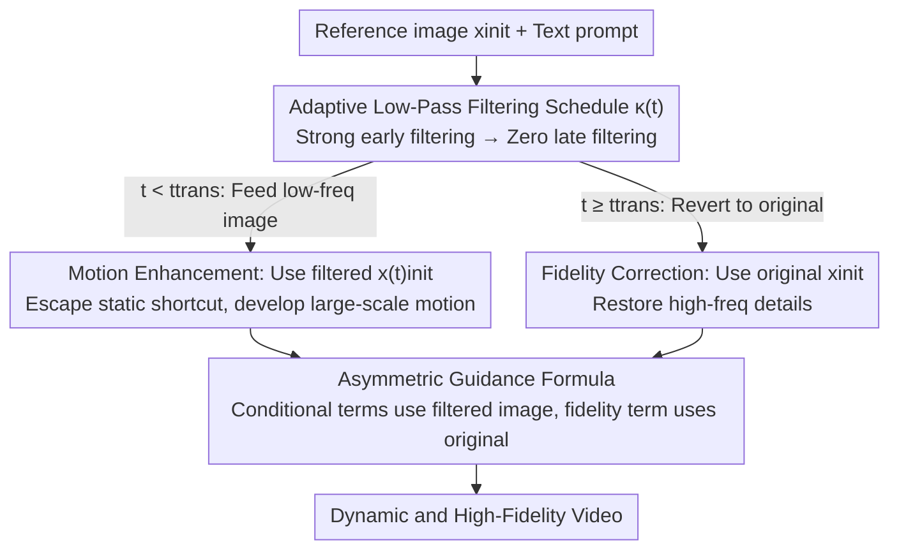

# Improving Motion in Image-to-Video Models via Adaptive Low-Pass Guidance

**Conference**: CVPR 2026  
**Paper**: [CVF Open Access](https://openaccess.thecvf.com/content/CVPR2026/html/Choi_Improving_Motion_in_Image-to-Video_Models_via_Adaptive_Low-Pass_Guidance_CVPR_2026_paper.html)  
**Code**: Source code available on project page (as stated in the paper); specific repository TBD  
**Area**: Video Generation / Image-to-Video / Diffusion Sampling Guidance  
**Keywords**: Image-to-Video, Motion Suppression, Low-Pass Filtering, Training-Free Guidance, Diffusion Sampling

## TL;DR
The authors discover that videos generated by I2V models are "stiffer" than those from homologous T2V models. The root cause is that high-frequency details from the reference image "lock" the generation trajectory into a static shortcut during the very early stages of denoising. Consequently, they propose Adaptive Low-Pass Guidance (ALG), a training-free method that applies low-pass filtering to the conditional image only during early sampling and reverts to the original image later. This improves the average dynamic degree on VBench by 33% with virtually no loss in image quality.

## Background & Motivation
**Background**: Current mainstream Image-to-Video (I2V) models are almost entirely fine-tuned from large-scale Text-to-Video (T2V) models. The reference image is fed as an additional condition (e.g., via channel concatenation, CLIP semantic features, or noisy initial frames as in-context conditions) to generate a "natural continuation starting from this image." This approach performs well in terms of image quality and consistency.

**Limitations of Prior Work**: Under the same architecture and training settings, I2V-generated videos are significantly more static than T2V ones—even when dynamic prompts are provided. The authors conducted a clean control experiment using Wan 2.1 (which has both T2V and I2V checkpoints): they first generated a video with T2V and then used its first frame as input for I2V. The results showed that the Dynamic Degree of I2V dropped by **18.6%** compared to T2V, while other quality metrics remained nearly identical. This suggests that the "stiffness" is introduced by the conditioning mechanism itself.

**Key Challenge**: The authors hypothesize that motion suppression stems from **premature exposure to high-frequency signals**. By extracting intermediate feature maps from the Wan 2.1 denoising backbone and visualizing them via PCA-to-RGB, they found that after just one denoising step ($t=0.02$ out of 50), the features already lock onto the fine details of the input image. This prematurely constrains the degrees of freedom for subsequent trajectories, preventing coarse, large-scale motion from developing. This is a "shortcut" where the model restores appearance immediately, bypassing the intended coarse-to-fine evolution.

**Background**: Since high-frequency details are the culprit, would removing them via low-pass filtering (e.g., downsampling) restore motion? Diagnostic experiments confirmed that the dynamic degree rises monotonically with filtering intensity. However, naive low-pass filtering throughout the process incurs a cost: the model receives only blurred images and cannot reconstruct fine details, leading to a drop in quality and fidelity. This presents a critical trade-off: **removing high frequencies facilitates motion, while retaining them ensures fidelity.**

**Core Idea**: Shortcuts occur only at the very beginning of generation. Thus, high frequencies should be removed only in the early stages and replaced with the original image later. This "time-divided frequency scheduling" achieves both motion and fidelity without requiring any training.

## Method

### Overall Architecture
ALG (Adaptive Low-Pass Guidance) is a training-free inference technique applied during the I2V sampling process. It does not modify model weights or add extra networks; it only changes "what kind of conditional image is fed to the model at each step."

The mechanism involves **adaptively modulating the frequency content of the conditional image along the time steps**: strong low-pass filtering is applied to the reference image during early denoising ($t\approx 0$) so the model only sees low-frequency contours, preventing it from falling into static shortcuts. As denoising progresses, the filtering intensity is gradually reduced, reverting to the full original high-frequency reference image in later stages ($t\approx 1$). This allows the model to start from a "moving but blurred" intermediate state and reconstruct sharp details. The workflow is illustrated below:

### Key Designs

**1. Adaptive Low-Pass Guidance Scheduling: Achieving both "Motion" and "Fidelity" via time-division**

Applying low-pass filtering throughout sampling enhances motion but sacrifices fidelity. ALG resolves this by recognizing the temporal structure: shortcuts primarily occur in the very early stages. Thus, filtering intensity decays over time. Formally, let $x^{(t)}_{\text{init}} = F_{\text{LP}}(x_{\text{init}}, \kappa(t))$ be the conditional image processed by a low-pass filter $F_{\text{LP}}$ (e.g., Gaussian blur or bilinear scaling). The intensity factor $\kappa(t):[0,1]\to\mathbb{R}$ is a decreasing function of time step $t$, where $F_{\text{LP}}(x_{\text{init}}, 0)=x_{\text{init}}$. Feeding low-frequency images early prevents the trajectory from collapsing into a shortcut, while late exposure to the original image allows for detail reconstruction. This is effective because generation is naturally coarse-to-fine: early stages should determine large structures and motion trends without being hijacked by high-frequency details.

**2. Asymmetric Guidance Formula: Retaining the original image in the unconditional term for fidelity correction**

Scheduling alone is insufficient; how the conditional image is integrated into CFG determines the balance between motion and fidelity. The key choice in ALG is to modify the standard I2V CFG formula ($v_{\text{CFG-I2V}} = v_\theta(x_t, x_{\text{init}}, t, \varnothing) + w[v_\theta(x_t, x_{\text{init}}, t, c) - v_\theta(x_t, x_{\text{init}}, t, \varnothing)]$) such that only the conditional terms use the filtered image $x^{(t)}_{\text{init}}$, while **the first unconditional term retains the original $x_{\text{init}}$**:

$$v_{\text{ALG}}(x_t, t) = v_\theta(x_t, x_{\text{init}}, t, \varnothing) + w\left[v_\theta(x_t, x^{(t)}_{\text{init}}, t, c) - v_\theta(x_t, x^{(t)}_{\text{init}}, t, \varnothing)\right]$$

This formulation can be algebraically rearranged into two components:

$$v_{\text{ALG}} = \underbrace{v_\theta(x_t, x^{(t)}_{\text{init}}, t, \varnothing) + (w-1)\left[v_\theta(x_t, x^{(t)}_{\text{init}}, t, c) - v_\theta(x_t, x^{(t)}_{\text{init}}, t, \varnothing)\right]}_{\text{(a) Motion Enhancement CFG}} + \underbrace{\left[v_\theta(x_t, x_{\text{init}}, t, \varnothing) - v_\theta(x_t, x^{(t)}_{\text{init}}, t, \varnothing)\right]}_{\text{(b) Fidelity Correction}}$$

Component (a) is a standard CFG using only the filtered image to catalyze dynamic motion. Component (b) is the difference between original and filtered unconditional predictions, which guides the high-frequency visual information back into the process. Experiments showed that using the filtered image for all three terms causes instability, such as distorted visuals or abrupt scene changes. This asymmetric split ensures both high motion and high fidelity.

**3. Specific forms of κ(t) and two zero-cost engineering tricks**

Any "strong early, weak late" schedule works; the authors use a simple step function: $\kappa(t)=\kappa^*$ for $t<t_{\text{trans}}$, otherwise 0. Parameters include the transition point $t_{\text{trans}}\in(0,1)$ and initial intensity $\kappa^*>0$. Defaults are $t_{\text{trans}}=0.1$ and $\kappa^*=2.5$ (bilinear downsampling factor). While any intensity boost improves motion, excessive $t_{\text{trans}}$ degrades fidelity.

Two zero-cost tricks further improve quality: first, **denoising for 1–2 steps with a clean latent** before switching to the filtered image slightly delays exposure to improve quality; second, **replacing the first-frame latent with the clean version during decoding** ensures the clarity of the reference frame itself. Neither adds computational overhead.

## Key Experimental Results

### Main Results
ALG was applied to three open-source I2V models (Wan 2.2, Wan 2.1, LTX-Video), compared against their default CFG settings. Metrics include Dynamic Degree (higher is better) and others like VBench-QS, VBench-I2V, DOVER, and VisionReward for quality/fidelity.

| Model | Method | Dynamic Degree | VBench-Avg. | VBench-QS | VBench-I2V | DOVER | VisionReward |
|------|------|----------------|-------------|-----------|-----------|-------|--------------|
| Wan 2.2 | CFG | 31.7 | 79.6 | 85.4 | 98.5 | 0.635 | 0.183 |
| Wan 2.2 | **ALG** | **39.0** | **80.5** | 85.2 | 98.5 | 0.637 | 0.182 |
| Wan 2.1 | CFG | 28.9 | 79.1 | 85.3 | 98.3 | 0.618 | 0.179 |
| Wan 2.1 | **ALG** | **39.4** | **80.0** | 84.5 | 98.0 | 0.614 | 0.176 |
| LTX-Video | CFG | 15.5 | 77.8 | 85.9 | 99.1 | 0.625 | 0.175 |
| LTX-Video | **ALG** | **21.5** | **78.2** | 85.4 | 98.9 | 0.626 | 0.175 |

Dynamic Degree increased by +23%, +36%, and +39% across the three models, while VBench-Avg increased and quality metrics remained stable. This indicates that motion gains do not come at the expense of fidelity. Results across three datasets (VBench, PVD, VidProM) for Wan 2.2 were similarly consistent:

| Dataset | Method | Dynamic Degree | VBench-Avg. | VBench-I2V |
|--------|------|----------------|-------------|-----------|
| VBench | CFG / ALG | 31.7 / **39.0** | 79.6 / **80.5** | 98.5 / 98.5 |
| PVD | CFG / ALG | 65.0 / **69.0** | 79.4 / **80.3** | 94.2 / **95.0** |
| VidProM | CFG / ALG | 27.3 / **30.5** | 79.1 / **79.5** | 98.2 / 98.0 |

### Ablation Study

| Configuration | Dynamic Degree | Description |
|------|----------------|------|
| $t_{\text{trans}}=0.06$ | Dynamic Degree +32% | Low-pass for only the first 6% of steps is enough to trigger motion without dropping quality. |
| $\kappa^*=1.6$ | Dynamic Degree +29% | Increases motion while VBench-QS drops only 0.5%; overall score increases. |
| Gaussian Blur | Positive gain | Gaussian blur also improves motion, but less effectively than downsampling. |
| ALG + Motion Prompt | 31.7 $\rightarrow$ 39.0 (base) | ALG is orthogonal to prompt engineering; combined effects are additive. |

### Key Findings
- **Early window is critical**: Even a small $t_{\text{trans}}$ significantly boosts motion while quality remains stable, confirming that high-frequency signals block motion formation during early steps.
- **Motion boost is nearly free**: Increasing $\kappa^*$ provides diminishing but consistent motion gains with negligible quality loss.
- **Filter type matters**: Downsampling is more effective than Gaussian blur because it removes high frequencies more aggressively.
- **Orthogonality**: ALG works independently of prompt-based motion augmentation and can be stacked for better results.

## Highlights & Insights
- **Mechanistic Diagnosis**: Instead of broad claims about "poor I2V motion," the authors used PCA feature visualization to identify the "shortcut" occurring at $t=0.02$, backed by a causal chain between filtering and motion.
- **Training-free and Plug-and-play**: Modifying only the conditional input during sampling without changing weights or adding inference cost makes it highly accessible.
- **Asymmetric CFG Splitting**: Rearranging the formula to separate motion enhancement and fidelity correction is an interpretable and clever design pattern.
- **Frequency Scheduling as a General Concept**: The idea that conditional granularity should align with the coarse-to-fine nature of diffusion denoising is a powerful perspective applicable to other over-conditioned tasks.

## Limitations & Future Work
- **Hyperparameter Dependency**: $\kappa^*$ and $t_{\text{trans}}$ require per-model tuning; a mechanism for automated scheduling is currently missing.
- **Heuristic Filter Selection**: The choice of downsampling over Gaussian blur is based on empirical observation rather than a principled selection criterion.
- **Reliance on Automated Metrics**: Evaluation relies on metrics like VBench/VisionReward; large-scale human subjective studies were not included.
- **Generalization across architectures**: Most mechanistic validation was performed on Wan 2.1; further investigation is needed for non-DiT or non-flow-matching architectures.

## Related Work & Insights
- **vs. Zhao et al. (Motion modules + Early denoising)**: They require training motion modules and modified noise initialization; ALG is training-free and lighter.
- **vs. Tian et al. / Ge et al. (Model merging/fine-tuning)**: These target over-conditioning via weight manipulation or fine-tuning; ALG operates purely on the sampling side by modulating input frequencies.
- **vs. Song et al. (History guidance)**: History guidance is model-specific (diffusion forcing); ALG is widely applicable to any I2V model.
- **Insight**: When a conditional signal is "too strong" and causes collapse, consider scheduling the granularity or intensity of that signal along the denoising timeline rather than adding new modules.

## Rating
- Novelty: ⭐⭐⭐⭐ The diagnosis of "shortcut = early high-freq lock" and the asymmetric CFG solution are novel and self-consistent.
- Experimental Thoroughness: ⭐⭐⭐⭐ Good cross-model and cross-dataset validation, though lacking in human studies.
- Writing Quality: ⭐⭐⭐⭐⭐ Extremely clear logical progression from observation to hypothesis to diagnosis to method.
- Value: ⭐⭐⭐⭐⭐ High practical value due to being training-free and providing significant performance boosts.

<!-- RELATED:START -->

## Related Papers

- [\[CVPR 2026\] TempoControl: Temporal Attention Guidance for Text-to-Video Models](tempocontrol_temporal_attention_guidance_for_text-to-video_models.md)
- [\[CVPR 2026\] Are Image-to-Video Models Good Zero-Shot Image Editors?](are_image-to-video_models_good_zero-shot_image_editors.md)
- [\[ICLR 2026\] Frame Guidance: Training-Free Guidance for Frame-Level Control in Video Diffusion Models](../../ICLR2026/video_generation/frame_guidance_training-free_guidance_for_frame-level_control_in_video_diffusion.md)
- [\[CVPR 2026\] 3D-Aware Implicit Motion Control for View-Adaptive Human Video Generation](3d-aware_implicit_motion_control_for_view-adaptive_human_video_generation.md)
- [\[CVPR 2026\] FlowMotion: Training-Free Flow Guidance for Video Motion Transfer](flowmotion_training-free_flow_guidance_for_video_motion_transfer.md)

<!-- RELATED:END -->
