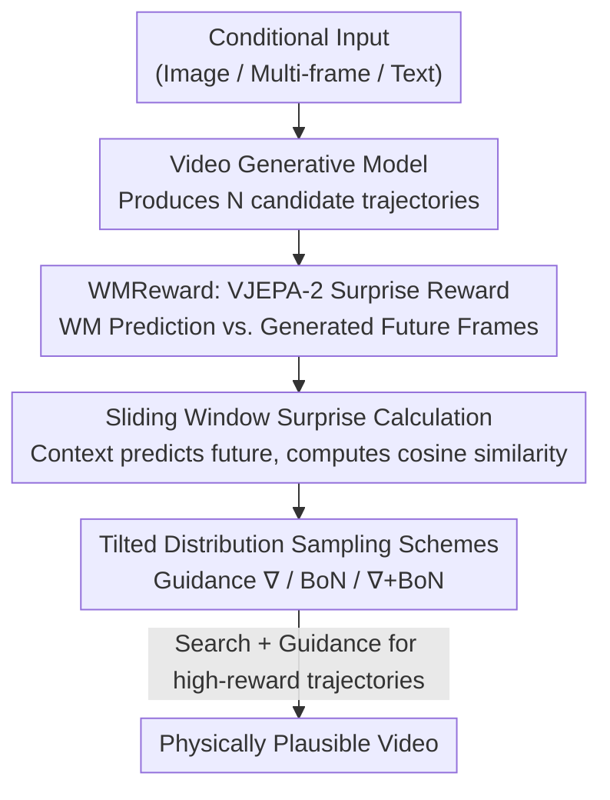

# Inference-time Physics Alignment of Video Generative Models with Latent World Models

**Conference**: CVPR 2026  
**Paper**: [CVF Open Access](https://openaccess.thecvf.com/content/CVPR2026/html/Yuan_Inference-time_Physics_Alignment_of_Video_Generative_Models_with_Latent_World_CVPR_2026_paper.html)  
**Code**: https://github.com/facebookresearch/WMReward  
**Area**: Video Generation / Diffusion Models / Inference-time Alignment  
**Keywords**: Video Generation, Physical Plausibility, Latent World Models, Inference-time Alignment, Reward-guided Sampling  

## TL;DR
This work utilizes the "surprise" score from a pre-trained latent world model (VJEPA-2) as a reward to search and guide the denoising trajectories of video diffusion models during inference. This approach aligns generated videos with physical laws, achieving a first-place score of 62.64% on the PhysicsIQ challenge, surpassing the Prev. SOTA by 7.42%.

## Background & Motivation
**Background**: Current SOTA video generation models (MAGI-1, Sora2, various vLDMs) demonstrate strong visual quality but frequently violate basic physical laws—such as solid objects interpenetrating, anomalous fluid behavior, and temporal inconsistencies. This is a critical failure for downstream applications like robotics and autonomous driving that utilize video generation as world simulators.

**Limitations of Prior Work**: Existing solutions primarily inject physical information during the **pre-training or post-training stages** (e.g., modifying data, adding physical losses, or physical post-training). This approach is computationally expensive and couples "physics" with "generative capability." Inference-time strategies remain underexplored; the few existing works rely on VLMs to rewrite prompts or plan motion and require the backbone to be a controllable generative model.

**Key Challenge**: The authors observe that physical implausibility stems **not only** from a lack of physical knowledge during pre-training but also from **sub-optimal inference sampling strategies**. In other words, physically plausible videos likely reside within the manifold already learned by the generative model, but standard sampling fails to select them.

**Goal**: To reformulate "enhancing physical plausibility" as an **inference-time alignment** problem—adjusting the distribution toward "physical plausibility" using an external reward during the sampling stage without freezing the generative model weights. This necessitates addressing two questions: (1) what to use as a reward for physical plausibility, and (2) how to use this reward to sample more plausible videos.

**Key Insight**: Latent world models learn state transitions in compressed latent spaces, naturally focusing on "predictable physical quantities" such as motion, object dynamics, and trajectory continuity while ignoring aesthetic details. Since these models predict "what should physically happen next," they can serve as evaluators: the more a generated video deviates from their prediction, the more likely it is physically incorrect.

**Core Idea**: The "surprise score" of VJEPA-2 is repurposed as a differentiable physical plausibility reward, WMReward. During inference, this reward is used for trajectory searching (Best-of-N) and gradient guidance to sample from a distribution "tilted" by the reward.

## Method

### Overall Architecture
The method, termed **WMReward**, transforms the prediction surprise of a latent world model (VJEPA-2) into a physical plausibility reward. This reward guides the denoising process of a video diffusion model during inference.

Pipeline: The video generation model produces several candidate denoising trajectories (videos) $\rightarrow$ For each video, a sliding window splits frames into "context frames + future frames." The VJEPA-2 predictor estimates the latent representation of future frames based only on the context. The cosine similarity between the predicted and actual latent representations defines the surprise reward $\rightarrow$ Using this reward $r(x)$ as a weight, a tilted distribution $p^*(x)\propto w(x)\,p(x)$ is defined. Three sampling schemes (Gradient Guidance / Best-of-N / Hybrid) push samples toward high-reward regions. The process requires no updates to the generative model.

### Key Designs

**1. WMReward: Repurposing VJEPA-2 Surprise as Physical Reward**

To address the choice of a physical evaluator, the authors repurpose the self-supervised VJEPA-2 model rather than training a new reward model. VJEPA-2 is trained to predict latent representations of masked video regions from unmasked ones: $\mathcal{L}=\|P_\phi(\Delta_m, E_\theta(x_{\text{masked}}))-\text{sg}(\bar{E}_\theta(x))\|_1$, where $E_\theta$ is the context encoder, $P_\phi$ is the predictor, and $\bar{E}_\theta$ is the EMA target encoder. Since prediction occurs in the feature space, the model learns "predictable high-level spatio-temporal features" like motion and object dynamics. The intuition is that a good world model accurately predicts the future of a **physically plausible** video; deviations (surprise) indicate physical errors. The paper demonstrates that latent-space surprise is a better proxy for physics than pixel-based (VideoMAE) or VLM-based (Qwen-VL) metrics.

**2. Sliding Window Surprise Calculation**

To transform the world model into a video-level scalar reward, a window of length $C+M$ ($C$ context frames, $M$ future frames) slides over the video. At each position $k$, the model predicts future representations $\hat{z}_k=P_\phi(\Delta_m, E_\theta(x^{k-C+1:k}))$ using only context. The actual representations $z_k=E_\theta(x^{k-C+1:k+M})$ are obtained by encoding the full window. The reward is the average cosine similarity of the future segments:

$$r(x)=\frac{1}{|\mathcal{K}|}\sum_{k\in\mathcal{K}}\left(1-\cos(\hat{z}_k^{\text{fut}}, z_k^{\text{fut}})\right)$$

Lower $r(x)$ indicates higher consistency and physical plausibility. This windowed design covers the temporal extent of the video and remains **differentiable** with respect to $x$.

**3. Three Tilted Distribution Sampling Schemes: Guidance, Best-of-N, and ∇+BoN**

To sample from $p^*(x)\propto w(x)\,p(x)$, three complementary schemes are proposed:

- **Gradient Guidance (∇)**: Uses weights $w(x)=\exp(\lambda r(x))$ with temperature $\lambda>0$. The tilted distribution score is the original score plus $\nabla_{x_t}\log\mathbb{E}[e^{\lambda r(x_0)}\mid x_t]$. Using the Tweedie formula to approximate $\mathbb{E}[x_0\mid x_t]$, an approximate score for SDE/ODE samplers is obtained: $\nabla_{x_t}\log p_t^*(x_t)\approx \nabla_{x_t}\log p_t(x_t)+\lambda\nabla_{x_t} r(x_{0|t}(x_t))$.
- **Best-of-N (BoN)**: Samples $N$ independent particles and selects $x^*=\arg\max_{x} r(x)$, equivalent to tilting by $w(x)=[F(r(x))]^{N-1}$, where $F$ is the reward CDF.
- **∇+BoN (Hybrid)**: Combines guidance and search. $N$ samples are generated via guidance, and the best is selected via BoN. This achieves stronger tilting without excessively high $\lambda$ (which distorts the score approximation) and allows BoN to filter inaccurate guided samples.

### Loss & Training
This is a **training-free** inference-time method. Both the generative model and VJEPA-2 use pre-trained weights. Configurations include the search budget (number of particles $N$), guidance temperature $\lambda$, and window parameters $C, M$. The trade-off is inference computation.

## Key Experimental Results

### Main Results
Evaluated on the PhysicsIQ benchmark for I2V and V2V generation (PhysicsIQ Score aggregates spatial IoU, spatio-temporal IoU, weighted spatial IoU, and pixel MSE). All search methods use 16 particles.

| Setting | Backbone + Scheme | PhysicsIQ Score ↑ | Relative Gain |
|------|------------|-------------------|----------|
| V2V | MAGI-1 (Prev. SOTA) | 55.22 | — |
| V2V | Ours (MAGI-1 + BoN) | 60.34 | +5.12 |
| V2V | Ours (MAGI-1 + ∇+BoN) | **62.00** | **+6.78** |
| I2V | Sora2 (Prev. SOTA) | 42.30 | — |
| I2V | Ours (Sora2 + BoN) | **46.43** | +4.13 |
| I2V | Ours (vLDM + ∇+BoN) | 33.44 | +5.68 |

> Official ICCV'25 PhysicsIQ Challenge Results: MAGI-1 I2V 37.39 (+7.62), V2V 62.64 (+7.42), winning first place and exceeding Prev. SOTA by 7.42%.

### Ablation Study
Comparison of reward signals under BoN search (Backbone: vLDM/MAGI-1):

| Reward Signal | vLDM (I2V) | MAGI-1 (I2V) | Note |
|----------|-----------|--------------|------|
| Vanilla | 27.76 | 29.77 | Baseline |
| VideoMAE (BoN) | 29.42 (+1.66) | 29.95 (+0.18) | Pixel reconstruction surprise |
| Qwen2.5-VL (BoN) | 26.21 (−1.55) | 24.99 (−4.78) | VLM scoring (performance drop) |
| Qwen3-VL (BoN) | 28.51 (+0.75) | 30.21 (+0.44) | VLM scoring (slight gain) |
| **WMReward (BoN)** | **32.90 (+5.14)** | **36.56 (+6.79)** | Latent space surprise (optimal) |

### Key Findings
- **Latent Surprise > Pixel Reconstruction > VLM Scoring**: WMReward significantly outperforms others. VLM rewards often degrade performance to near-random levels, suggesting that "describing physics" is not equivalent to "judging physics."
- **Scalability**: PhysicsIQ scores increase steadily with particle count $N$, plateauing after $N > 4$. Guidance (∇+BoN) further tightens the score distribution, showing superior scaling over pure BoN.
- **Human Study**: Side-by-side human evaluation on PhysicsIQ/VideoPhy confirms that WMReward(∇+BoN) significantly wins in both physical plausibility and visual quality.
- **Trade-offs**: While physical consistency (PC) improves in T2V (VideoPhy), semantic alignment (SA) slightly decreases because VJEPA surprise does not encode text semantics.
- **Computational Cost**: BoN increases time by $\times N$ with stable VRAM. Guidance (∇) per particle increases time by $\times 5$ and VRAM by $\times 2{\sim}4$.

## Highlights & Insights
- **"Surprise as Physical Reward"**: Repurposing prediction error from a self-supervised world model provides a more reliable physical reward than VLMs without additional training.
- **Differentiable Reward**: Differentiability allows for both gradient-free BoN and gradient-based score guidance, covering various compute/quality trade-offs.
- **Inference-side Alignment**: Improving physics without modifying weights allows plug-and-play enhancement for any model (including API-only models like Sora2).
- **Extensibility**: The paradigm of using "prediction-based surprise" as a reward is applicable to any property captureable by a predictive model (e.g., temporal coherence).

## Limitations & Future Work
- **Semantic Alignment Drop**: VJEPA surprise is text-agnostic; future work could explore compositional or text-conditioned physical rewards.
- **Computational Cost**: High inference overhead (time and VRAM) remains a barrier for real-time deployment.
- **World Model Upper Bound**: Reward quality is capped by the physical understanding of VJEPA-2; complex interactions that the world model cannot predict cannot be fixed.
- **Metric Limitations**: PhysicsIQ and VLM evaluators are proxy metrics; "physical plausibility" remains narrowly defined.

## Related Work & Insights
- **vs. Pre-/Post-training Injection**: Those methods modify weights and are costly. This method is training-free and plug-and-play but consumes more inference compute.
- **vs. VLM Prompt Rewriting (VLIPP, etc.)**: VLM-based intervention often targets text or motion planning. This work operates directly on denoising trajectories using world model rewards.
- **vs. Image Reward-guided Sampling**: This work migrates inference-time alignment to **video physical plausibility** and identifies latent world models as the optimal reward source.

## Rating
- Novelty: ⭐⭐⭐⭐⭐ Uses world model surprise as a physical reward for inference-time alignment; bridges search and guidance.
- Experimental Thoroughness: ⭐⭐⭐⭐⭐ Covers I2V/V2V/T2V settings, multiple backbones, reward comparisons, scaling curves, human studies, and won a challenge.
- Writing Quality: ⭐⭐⭐⭐ Clear motivation and derivation, though some notation directions for rewards are slightly ambiguous.
- Value: ⭐⭐⭐⭐⭐ Instant physical enhancement for arbitrary video models; directly valuable for robotics and simulation.

<!-- RELATED:START -->

## Related Papers

- [\[CVPR 2026\] LaVR: Scene Latent Conditioned Generative Video Trajectory Re-Rendering using Large 4D Reconstruction Models](lavr_scene_latent_conditioned_generative_video_trajectory_re-rendering_using_lar.md)
- [\[CVPR 2026\] PhysVid: Physics Aware Local Conditioning for Generative Video](physvid_physics_aware_local_conditioning_for_generative_video_models.md)
- [\[CVPR 2026\] ProPhy: Progressive Physical Alignment for Dynamic World Simulation](prophy_progressive_physical_alignment_for_dynamic_world_simulation.md)
- [\[CVPR 2026\] Ref4D-VideoBench: Four-Dimensional Reference-Based Evaluation of Text-to-Video Generative Models](ref4d-videobench_four-dimensional_reference-based_evaluation_of_text-to-video_ge.md)
- [\[CVPR 2026\] DriveLaW: Unifying Planning and Video Generation in a Latent Driving World](drivelaw_unifying_planning_and_video_generation_in_a_latent_driving_world.md)

<!-- RELATED:END -->
