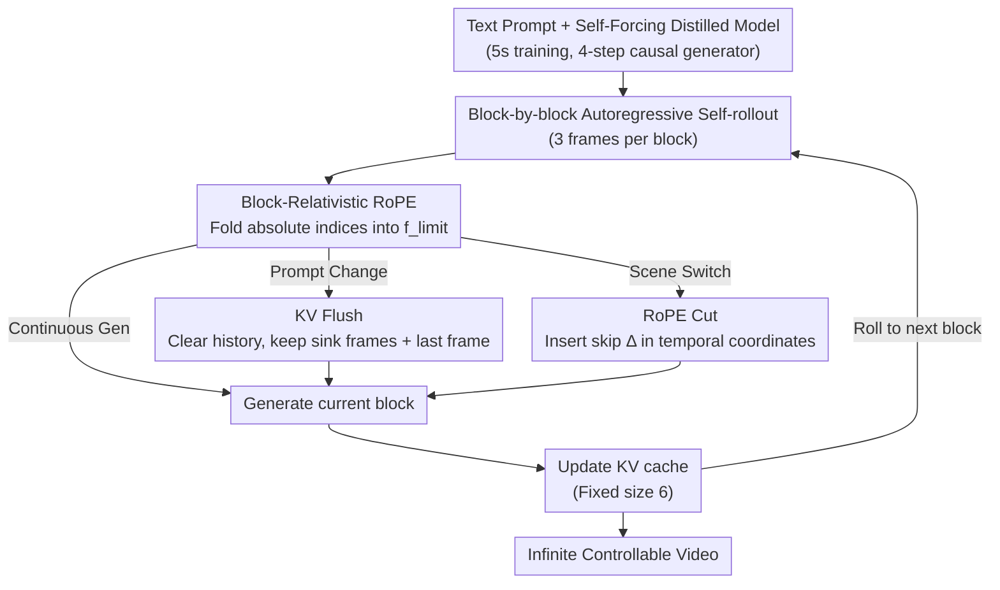

# Infinity-RoPE: Action-Controllable Infinite Video Generation Emerges From Autoregressive Self-Rollout

**Conference**: CVPR 2026  
**arXiv**: [2511.20649](https://arxiv.org/abs/2511.20649)  
**Code**: [Project Page](https://infinity-rope.github.io)  
**Area**: Video Generation / Diffusion Models  
**Keywords**: Autoregressive Video Generation, Rotary Positional Embedding, Infinite Video, Action Control, Inference-time Method

## TL;DR

∞-RoPE is proposed as a training-free inference-time framework. Through three components—Block-Relativistic RoPE, KV Flush, and RoPE Cut—it extends an autoregressive video diffusion model trained only on 5-second videos into a system capable of infinite-duration generation, fine-grained action control, and cinematic scene transitions.

## Background & Motivation

Current autoregressive video diffusion models face three core bottlenecks:

**Limited Temporal Horizon**: 3D-RoPE positional embeddings restrict generation to a fixed 1024-frame window, beyond which attention quality degrades sharply.

**Sluggish Action Response**: In long sequence rollouts, prompt changes fail to take effect immediately because old semantics in the KV cache continue to influence the generation.

**Lack of Scene Transition Ability**: Inability to achieve cinematic discontinuous scene switching within a single generation stream.

**Key Insight**: Models trained only on 5-second segments under the Self-Forcing paradigm actually possess the capacity for high-dynamic, infinite-length generation. The bottleneck lies not in model capacity, but in the absolute indexing mechanism of positional embeddings. The authors propose breaking this limit through relative positional embedding re-parameterization and KV cache management without any additional training.

## Method

### Overall Architecture

Ours aims to solve a specific problem: how a distilled autoregressive video diffusion model trained only on 5-second clips (specifically a Self-Forcing distilled Wan2.1-T2V-1.3B, 4-step causal generator) can be "induced" to generate infinite-length video with real-time action changes and scene cuts. The answer lies in modifying how the model reads temporal positions during inference without touching model weights. The pipeline remains a block-by-block (3 frames per group) autoregressive rollout, but each step performs "surgery" on the RoPE temporal coordinates and KV cache: Block-Relativistic RoPE folds infinite absolute frame indices back into the trained range; KV Flush clears old semantics during prompt changes; and RoPE Cut inserts controlled breakpoints in the timeline for cinematic cuts. Since all three share a relativized coordinate system, they can be used cumulatively.

### Key Designs

**1. Block-Relativistic RoPE: Folding absolute indices into a "moving local reference frame" to remove RoPE training range constraints**

The bottleneck is the absolute indexing of 3D-RoPE: as the autoregressive process advances by a block $\mathbf{B}_f = \{f-2, f-1, f\}$, once $f$ exceeds the training upper limit $f_{\text{limit}}$, attention falls into untrained positional regions, causing quality collapse. Block-Relativistic RoPE ensures that instead of new frames receiving ever-increasing absolute indices, the temporal coordinates of the current block are always rotated back within $f_{\text{limit}}$, while the phases of earlier blocks are inversely rotated to maintain the *relative* temporal geometry between any two blocks. Formally, coordinates for blocks beyond an onset index $f_0$ are fixed to the same reference point:

$$\tilde{\mathbf{B}}_i = \begin{cases} \mathbf{B}_i, & \text{if } i \leq f_0 \\ \mathbf{B}_{f_0} = \{f_0-2, f_0-1, f_0\}, & \text{otherwise} \end{cases}$$

This ensures the local temporal structure seen by the model remains consistent with training. The authors use a cognitive science analogy: long-term memory undergoes "semanticization" where precise timestamps are replaced by semantic content—earlier cached frames effectively collapse into a shared minimum index $\mathbf{B}_{\bar 1} = \{1,1,1\}$, providing semantic context without competing for precise temporal positioning.

**2. KV Flush: Clearing cache for zero-latency action response during prompt changes**

In long rollouts, prompt changes often fail to take effect because the KV cache is saturated with old action semantics. KV Flush addresses this by clearing intermediate history when a prompt changes, retaining only two minimal anchors: a global **sink frame** (to stabilize attention normalization and avoid numerical collapse) and the **last generated frame** (to maintain local motion continuity). The new action is conditioned directly on these two frames, making the transition nearly instantaneous. This outperforms naive methods: no-cache causes abrupt jumps, full-cache leads to semantic lag, and KV re-cache incurs high computational latency.

**3. RoPE Cut: Creating controlled temporal breakpoints for cinematic scene transitions**

While the first two designs ensure continuity, cinematography often requires "discontinuity"—cutting to a different shot. RoPE Cut leverages the lack of absolute positions in the relativized system to insert a jump $\Delta$ into the temporal coordinates of the current block:

$$\mathbf{B}_{f \to f+\Delta} = \{f-2,\; f+\Delta-1,\; f+\Delta\}$$

Frames after the jump are treated as "just-occurred past context," with generation restarting from a new primitive temporal position. Because the coordinate system is relative and self-shifts with each cut, subject identity remains consistent even across large temporal or semantic jumps.

### Loss & Training

Ours is a **pure inference-time method** and introduces no additional training. The underlying Self-Forcing model is trained via Rectified Flow with forward interpolation $\mathbf{x}_t = (1-t)\mathbf{x}_0 + t\boldsymbol{\epsilon}$, and the reverse process is solved via an ODE parameterized by a neural velocity field $v_\theta$. Key inference settings: fixed KV cache size of 6, onset index $f_0 = 21$, CFG scale 3.0, and timestep shift 5.0.

## Key Experimental Results

### Main Results

VBench evaluation for 5-second and 60-second video generation (table shows 60s data):

| Model | Background Consistency | Dynamic Degree | Subject Consistency | Overall |
|------|----------------------|---------------|-------------------|---------|
| NOVA | 0.8806 | 0.12 | 0.7750 | 0.6901 |
| SkyReels-V2 | 0.8995 | 0.44 | 0.8499 | 0.7768 |
| CausVid | 0.8985 | 0.52 | 0.8675 | 0.7940 |
| Self-Forcing | 0.8784 | 0.32 | 0.8360 | 0.7715 |
| Rolling-Forcing | 0.9447 | 0.36 | 0.9409 | 0.8146 |
| **Ours** | **0.9490** | **0.52** | **0.9444** | **0.8298** |

Ultra-long video (240s data):

| Model | Background Consistency | Dynamic Degree | Subject Consistency | Overall |
|------|----------------------|---------------|-------------------|---------|
| Rolling-Forcing | 0.9248 | 0.40 | 0.9080 | 0.8017 |
| **Ours** | **0.9361** | **0.64** | **0.9256** | **0.8309** |

### Ablation Study

| Configuration | Key Metrics | Description |
|------|---------|------|
| Block-Relativistic RoPE On vs Off | Self-Forcing alone cannot maintain dynamic long video | 5s trained model + BRRoPE generates high-quality 30s+ |
| KV cache size scan | Overall/Aesthetic/Dynamic vary with cache | Fixed cache size of 6 achieves best balance across durations |
| KV Flush vs others | Instant semantic response + motion continuity | KV Flush leads in efficiency and controllability |

### Key Findings

- Ours achieves the highest or joint-highest Overall scores across all durations (5s/60s/120s/240s).
- The primary advantages are in **Subject Consistency** and **Background Consistency**, which become more pronounced in ultra-long videos.
- Dynamic Degree reaches **0.64** at 240s, significantly higher than other methods (mostly 0.24-0.40), showing that long-term generation does not degrade into static frames.

## Highlights & Insights

- **Cognitive Science Inspired Design**: Folding temporal coordinates of long-term frames into "semantic memory" mimics the semanticization process in human memory.
- **Attention Map Interpretability**: Attention map visualizations clearly demonstrate the structures of BRRoPE (diagonal band + sink column), KV Flush (cutting intermediate history), and RoPE Cut (splitting into independent diagonal blocks).
- **Zero Training Overhead**: As a pure inference-time method, it can be plugged into any Self-Forcing variant.

## Limitations & Future Work

- Dependency on the Self-Forcing distilled base model means the upper bound of generation quality remains fixed.
- Semantic coherence during scene switching relies on global information from sink frames, which may be insufficient for complex scenes.
- Validation was performed on 1.3B parameter models; performance on 14B-scale models is unknown.

## Related Work & Insights

- **Self-Forcing / Self-Forcing++**: Provided the autoregressive rollout training paradigm upon which Ours achieves inference-time breakthroughs.
- **Rolling Forcing**: Progressive noise window method is the main competitor but remains limited by the RoPE range.
- **FLEX**: Subsequent work introducing frequency-aware RoPE modulation, complementary to this work.

## Rating

- **Novelty**: ★★★★☆ — Clever re-parameterization of RoPE relativity; cognitive science analogy is insightful.
- **Technical Depth**: ★★★★☆ — Three components are well-designed and integrated; thorough mechanistic analysis.
- **Experimental Thoroughness**: ★★★★☆ — Comprehensive VBench evaluation across multiple durations, though lacking user studies.
- **Value**: ★★★★★ — Training-free, plug-and-play, with significant practical deployment potential.

<!-- RELATED:START -->

## Related Papers

- [\[CVPR 2026\] FlashPortrait: 6× Faster Infinite Portrait Animation with Adaptive Latent Prediction](flashportrait_6x_faster_infinite_portrait_animation_with_adaptive_latent_predict.md)
- [\[CVPR 2026\] HandWorld: Hand-Centric Unified Video Action Generation](handworld_hand-centric_unified_video_action_generation.md)
- [\[CVPR 2026\] PerpetualWonder: Long-horizon Action-conditioned 4D Scene Generation](perpetualwonder_long-horizon_action-conditioned_4d_scene_generation.md)
- [\[CVPR 2026\] VISTA: A Test-Time Self-Improving Video Generation Agent](vista_a_test-time_self-improving_video_generation_agent.md)
- [\[NeurIPS 2025\] Self Forcing: Bridging the Train-Test Gap in Autoregressive Video Diffusion](../../NeurIPS2025/video_generation/self_forcing_bridging_the_train-test_gap_in_autoregressive_video_diffusion.md)

<!-- RELATED:END -->
