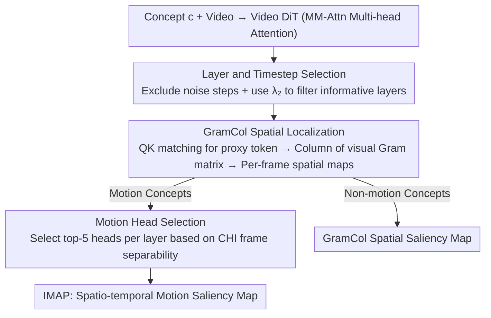

# I'm a Map! Interpretable Motion-Attentive Maps: Spatio-Temporally Localizing Concepts in Video Diffusion Transformers

**Conference**: CVPR 2026  
**arXiv**: [2603.02919](https://arxiv.org/abs/2603.02919)  
**Code**: [https://github.com/youngjun-jun/IMAP](https://github.com/youngjun-jun/IMAP)  
**Area**: Video Generation  
**Keywords**: Video Diffusion Models, Interpretability, Motion Localization, Attention Analysis, Saliency Maps

## TL;DR
IMAP (Interpretable Motion-Attentive Maps) is proposed as a training-free framework consisting of two modules: GramCol for spatial localization and Motion Head Selection for temporal localization. It extracts spatio-temporal saliency maps of motion concepts from Video DiTs, outperforming existing methods in motion localization and zero-shot video semantic segmentation.

## Background & Motivation
1. **Background**: Video Diffusion Transformers (e.g., CogVideoX, HunyuanVideo) generate high-quality videos, but their internal mechanisms remain poorly understood. Current interpretability work focuses primarily on image DiTs.
2. **Limitations of Prior Work**: Existing methods like ConceptAttention only provide spatial separation without handling motion or timing; DiTFlow and DiffTrack focus on dynamic correspondence of visual tokens between frames but do not analyze how text translates into motion. The **Core Problem** remains: Does a Video DiT truly understand and create motion?
3. **Key Challenge**: The primary difference between video and images is temporal motion information. Existing saliency map methods only perform spatial localization, failing to answer the critical question of "when and which object is moving."
4. **Goal**: Construct spatio-temporally localized saliency maps for motion concepts within Video DiTs.
5. **Key Insight**: Analysis of multi-head attention in Video DiT reveals that QK matching possesses strong spatial localization capabilities, and frame embedding separability correlates with motion localizability. Different attention heads play distinct roles—some specialize in temporal motion features.
6. **Core Idea**: Use GramCol for spatial localization (text proxy tokens + Gram matrix) and select motion heads based on frame separability scores for temporal localization.

## Method

### Overall Architecture
This paper addresses a question bypassed by previous work: "When and where" does a Video DiT process a motion concept? The proposed pipeline reads directly from the model's existing multi-head attention modules without training or gradients. The pipeline operates on the MM-Attn modules of the Video DiT through a three-step process: defining the scope, determining space, and then determining timing. The first step delimits where to read: since $L$ layers $\times$ $T$ timesteps form a massive search space, the authors exclude early timesteps (near pure noise) and use the second largest eigenvalue $\lambda_2$ to select the most semantically rich layers. The second step performs spatial localization: given a concept word (e.g., "running"), QK matching identifies the visual token most representative of the text concept in each frame, converting cross-modal localization into a uni-modal similarity problem. GramCol then extracts the corresponding column of the visual Gram matrix to obtain frame-wise spatial saliency maps. The third step applies motion head selection for "motion" concepts, retaining only heads with maximum inter-frame variance to filter spatial noise and produce the final IMAP.

### Key Designs

**1. Layer and Timestep Selection: Automatic bounding of informative ranges using $\lambda_2$**

**Design Motivation**: To prevent signal dilution from averaging $L$ layers and $T$ timesteps. For timesteps, early steps containing mostly noise or memory artifacts (like watermarks) are excluded. For layer selection, the authors adopt the DTMC perspective of TokenRank, treating the attention matrix as a transition matrix. The second largest eigenvalue $\lambda_2$ measures how informative a layer is; larger $\lambda_2$ indicates higher value. Thresholds are fixed by backbone: $\lambda_2 > 0.7$ for CogVideoX and $> 0.75$ for HunyuanVideo.

**2. GramCol Spatial Localization: Replacing cross-modal multiplication with uni-modal Gram matrices**

**Mechanism**: Within the selected range, spatial localization is performed frame-by-frame. Unlike previous methods that multiply text and visual features directly—which suffer from inconsistent behavior across heads—GramCol bypasses cross-modal instability. For each frame $f_i$, a "proxy" visual token is selected via QK matching: $s_{f_i}^c = \arg\max_p \text{row}_p(q_{f_i})k_c^\top$. The spatial map is then derived from the $s_{f_i}^c$-th column of the visual Gram matrix $G = h_x h_x^\top \in \mathbb{R}^{P\times P}$. Since it relies on uni-modal similarity, regions similar to the proxy token naturally receive high positive values.

**3. Motion Head Selection: Identifying "motion-aware" heads via frame separability**

**Key Insight**: Motion is defined by changes between frames. Attention heads processing motion should show high separability when visual tokens are clustered by frame. The authors use the Calinski-Harabasz Index (CHI) to quantify this: higher CHI indicates larger inter-frame variance relative to intra-frame variance. By recalculating GramCol using only the top-5 heads with the highest CHI per layer, spatial-only heads are filtered out, resulting in cleaner motion localization.

### Loss & Training
The method is entirely training-free and gradient-free. For real videos, features are extracted via an inversion process (noise-denoise). Computationally, GramCol requires $O(Pd)$ matrix multiplications and $O(P)$ indexing, making the overhead negligible relative to DiT inference.

## Key Experimental Results

### Main Results (Motion Localization)

| Method | Backbone | SL | TL | PR | SS | OBJ | Avg |
|------|----------|-----|-----|-----|-----|-----|------|
| ViCLIP | ViT-H | 0.33 | 0.17 | 0.35 | 0.29 | 0.28 | 0.28 |
| DAAM | VideoCrafter2 | 0.36 | 0.17 | 0.38 | 0.32 | 0.35 | 0.32 |
| ConceptAttn | CogVideoX-5B | 0.50 | 0.32 | 0.51 | 0.47 | 0.47 | 0.45 |
| **IMAP** | CogVideoX-5B | **0.58** | **0.65** | **0.64** | **0.52** | **0.59** | **0.60** |
| ConceptAttn | HunyuanVideo | 0.42 | 0.26 | 0.44 | 0.35 | 0.34 | 0.36 |
| **IMAP** | HunyuanVideo | **0.60** | **0.41** | **0.62** | **0.50** | **0.62** | **0.55** |

### Ablation Study

| Configuration | Avg Score | Description |
|------|-----------|------|
| Cross-Attention Map | 0.34 | Baseline attention map |
| GramCol (All heads) | ~0.45 | Spatial localization works, but temporal is imprecise |
| GramCol + Layer Selection | ~0.50 | Gain from excluding low-info layers |
| IMAP (GramCol + Motion Head) | 0.54-0.60 | Breakthrough in temporal localization via motion heads |

### Key Findings
- Temporal Localization (TL) is the primary advantage of IMAP, increasing from 0.56 to 0.62 on CogVideoX-2B and from 0.26 to 0.41 on HunyuanVideo.
- GramCol is more stable than ConceptAttention due to the use of uni-modal similarity, avoiding the heterogeneous behavior of cross-modal attention.
- The validity of motion head selection is confirmed by a Pearson correlation of $r=0.60$ between CHI and motion localization scores.

## Highlights & Insights
- **Ingenious Text Proxy Token**: Instead of direct cross-modal multiplication, finding a visual token that "represents" the text concept converts a cross-modal problem into a more stable uni-modal one.
- **Simplicity of Motion Hypothesis**: Using clustering separability (CHI) to measure motion content is computationally efficient yet highly effective, outperforming complex learning-based approaches.
- **Insights into DiT Internals**: The discovery that attention heads have clear division of labor (spatial vs. motion) and that high $\lambda_2$ layers are more semantic provides guidance for future Video DiT architectures.

## Limitations & Future Work
- **Reliance on LLM Evaluation**: MLS evaluation depends on OpenAI o3-pro, which raises concerns about reproducibility and consistency despite detailed rubrics.
- **Subtle Motion**: Localization of very subtle movements (e.g., micro-expressions) has not been verified, as CHI might not capture fine-grained inter-frame differences.
- **Generalization**: Experiments were limited to CogVideoX and HunyuanVideo; applicability to single-stream DiTs or cross-attention architectures requires further study.
- **Static Hyperparameters**: The $top-k=5$ for motion heads and $\lambda_2$ thresholds are manually set. Adaptive selection strategies are a potential future direction.

## Related Work & Insights
- **vs ConceptAttention**: ConceptAttention is limited to spatial separation; GramCol uses uni-modal Gram matrices to avoid head heterogeneity and extends to temporal localization without requiring a concept list for softmax competition.
- **vs DAAM**: DAAM is tailored for U-Net architectures and cannot be directly applied to joint-attention DiTs. IMAP leverages the specific QK matching of DiT MM-Attn.
- **Video Editing Potential**: The identification of motion heads suggests they could be manipulated to control motion during generation without affecting spatial appearance.
- **Zero-shot Video Segmentation**: GramCol's high performance in zero-shot segmentation indicates that internal representations of Video DiTs are valuable for perception tasks.

## Rating
- Novelty: ⭐⭐⭐⭐ Elegant design of GramCol and motion head selection; first systematic study of motion interpretability in Video DiTs.
- Experimental Thoroughness: ⭐⭐⭐⭐ Validated across multiple DiTs with ablation and zero-shot tasks; standardized benchmark construction.
- Writing Quality: ⭐⭐⭐⭐⭐ Clear hierarchy of analysis from timesteps to layers to heads, with sound theoretical and empirical grounding.
- Value: ⭐⭐⭐⭐ Opens the motion dimension for interpretability; GramCol and IMAP have significant practical utility.

<!-- RELATED:START -->

## Related Papers

- [\[CVPR 2026\] ActivityForensics: A Comprehensive Benchmark for Localizing Manipulated Activity in Videos](activityforensics_a_comprehensive_benchmark_for_localizing_manipulated_activity_.md)
- [\[CVPR 2026\] Composing Concepts from Images and Videos via Concept-prompt Binding](composing_concepts_from_images_and_videos_via_concept-prompt_binding.md)
- [\[CVPR 2026\] VMonarch: Efficient Video Diffusion Transformers with Structured Attention](vmonarch_efficient_video_diffusion_transformers_with_structured_attention.md)
- [\[CVPR 2026\] ReHyAt: Recurrent Hybrid Attention for Video Diffusion Transformers](rehyat_recurrent_hybrid_attention_for_video_diffusion_transformers.md)
- [\[CVPR 2026\] Towards Holistic Modeling for Video Frame Interpolation with Auto-regressive Diffusion Transformers](towards_holistic_modeling_for_video_frame_interpolation_with_auto-regressive_dif.md)

<!-- RELATED:END -->
