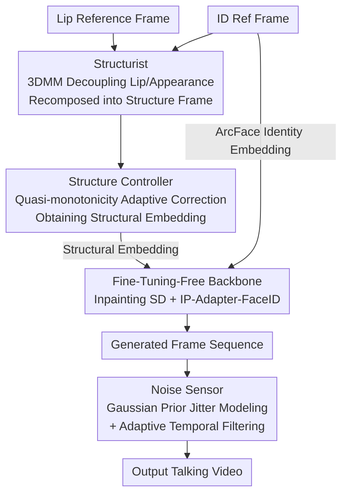

# IP-Adapter Is All You Need: Towards Fine-Tuning-Free Diffusion-Based Talking Face Generation

**Conference**: CVPR 2026  
**Paper**: [CVF Open Access](https://openaccess.thecvf.com/content/CVPR2026/html/Wu_IP-Adapter_Is_All_You_Need_Towards_Fine-Tuning-Free_Diffusion-Based_Talking_Face_CVPR_2026_paper.html)  
**Code**: https://github.com/tlemangen/FreeTalkDiff  
**Area**: Video Generation / Diffusion Models / Talking Face  
**Keywords**: Talking Face Generation, Fine-Tuning-Free, IP-Adapter, 3DMM, Temporal Consistency

## TL;DR
This paper proposes FreeTalkDiff, a **completely fine-tuning-free, zero-trainable-parameter** talking face generation framework. It directly leverages pre-trained Stable Diffusion + IP-Adapter as the backbone to mine lip semantics, and integrates three parameter-free modules: Structurist (decoupling lip shape and appearance via 3DMM), Structure Controller (adaptively correcting embeddings based on quasi-monotonicity), and Noise Sensor (modeling and filtering jitter/flicker with a Gaussian prior). With zero training steps, it outperforms state-of-the-art (SOTA) methods that require tens of thousands of fine-tuning steps on CREMA and HDTF (PCLD improved by at least 0.16, FID improved by at least 0.7).

## Background & Motivation

**Background**: Diffusion models have become the mainstream for talking face generation, significantly surpassing early GANs and autoregressive methods in both visual quality and multimodal controllability. However, all current diffusion-based approaches (such as AniPortrait, Loopy, MuseTalk, LatentSync, EchoMimic, Hallo2, Sonic, etc.) follow the same paradigm: **task-specific fine-tuning** of multi-billion parameter diffusion models on large-scale audio-visual datasets.

**Limitations of Prior Work**: Such fine-tuning is extremely costly. As compared in Table 1 of the paper, EchoMimic and Hallo2 are trained for 60k and 113k steps on 8 A100 GPUs, respectively, while Loopy utilizes 24 A100 GPUs. The number of trainable parameters generally ranges from 0.85B to 2.59B. This heavy reliance on computational resources and training time severely limits the scalability and accessibility of diffusion methods within the research community.

**Key Challenge**: There is a fundamental conflict between the massive parameters and complex optimization of diffusion models, and the desire to use them for talking face generation at a low cost. The problem lies not in the weaknesses of diffusion models, but in the **common assumption that fine-tuning is mandatory to align lip-sync capability**.

**Goal**: Can controllable, highly synchronized, and high-fidelity talking face generation be achieved using pre-trained diffusion models completely without fine-tuning? This raises three sub-problems that must be addressed: how to "mine" lip-related knowledge from pre-trained models, and how to suppress identity drift, synchronization errors, and temporal jitter without any training?

**Key Insight**: The authors conducted a detailed observation of pre-trained model behavior and discovered a key phenomenon: **when IP-Adapter is paired with SD, the structural embeddings extracted by its CLIP Image Encoder naturally exhibit strong attention toward the mouth region** (as the mouth often carries primary semantic cues in the context of human faces). This implies that lip control capabilities are already "latent" within the pre-trained weights, without needing to be re-learned.

**Core Idea**: Use the fine-tuning-free combination of "SD + IP-Adapter" as the backbone to inject the semantics of the lip reference. Then, employ three **parameter-free** post-processing/control modules to repair the three side effects—identity drift, synchronization accuracy, and temporal jitter—thereby delivering a complete, viable "zero-training" solution.

## Method

### Overall Architecture
FreeTalkDiff follows a few-shot routine (multi-frame ID references), with the backbone being "image inpainting Stable Diffusion 1.5 + IP-Adapter-FaceID". During generation, the encoded masked frames, random noise latents, and the scaled mask are concatenated and fed into the denoising U-Net. Each layer of the IP-Adapter receives the latents from the previous layer, an empty text prompt, and dual image prompts: identity and lip. The lip reference is first transformed into a "structure frame" by the **Structurist**, then encoded by the CLIP Image Encoder, and adaptively corrected by the **Structure Controller** to yield a structural embedding carrying lip-shape cues. The identity reference is processed via ArcFace to extract the identity embedding. The dual embeddings are fused to drive the SD generation, and finally, the **Noise Sensor** filters the frame sequence into a continuous, stable talking video. Throughout the entire pipeline, both SD and IP-Adapter are frozen pre-trained models, and the three new modules do not contain any trainable parameters.

### Key Designs

**1. SD + IP-Adapter Fine-Tuning-Free Backbone: Directly Leveraging Latent Lip Control Capabilities within Pre-trained Weights**

This serves as the foundation of the paper, specifically targeting the default assumption that fine-tuning is required for talking face generation. The authors observe that the structural embedding of the IP-Adapter naturally exhibits strong attention toward the mouth region (Fig. 2a), because its CLIP Image Encoder tends to align image regions with textual concepts, where the mouth is the key semantic point in facial contexts. Therefore, a frozen "image inpainting SD 1.5 + IP-Adapter-FaceID" is directly adopted as the backbone: the inpainting paradigm retains non-mouth areas of the ID reference (the source of few-shot advantages), while the lip reference is injected as an image prompt to represent mouth semantics, leaving the text prompt empty to avoid semantic interference. With zero trainable parameters and zero training steps, this stands in stark contrast to diffusion baselines that possess 0.85B to 2.59B parameters and require tens of thousands of fine-tuning steps: rather than training better, it **does not train at all**.

**2. 3DMM-based Structurist: "Disassembling and Reassembling" Lip Shape from Appearance in 3D Parameter Space**

Directly feeding the lip reference to the IP-Adapter introduces redundant textures and colors, leading to identity drift and appearance distortion (Fig. 2b). Structurist explicitly decouples these traits within the 3DMM shape and texture parameter space. 3DMM represents the shape $P\in\mathbb{R}^{3n}$ and texture $Q\in\mathbb{R}^{3n}$ of an arbitrary face as a linear combination of mean components and principal basis vectors:

$$P = \bar{P} + \sum_{i=1}^{M}\alpha_i\sigma_i^{P}v_i^{P}, \quad Q = \bar{Q} + \sum_{i=1}^{M}\beta_i\sigma_i^{Q}v_i^{Q}$$

where shape coefficients $\alpha_i$ capture lip movement geometry, and texture coefficients $\beta_i$ retain color and appearance details. The key step is **cross-recomposition**: combining the texture parameters of the target identity reference with the shape parameters of the lip reference to construct a parameter representation where "the appearance belongs to the target person, and the lip shape belongs to the reference lip". This is then rendered back to the image domain via a renderer to obtain the "structure frame", which is finally sent to the CLIP Image Encoder to acquire the structural embedding. This preserves the desired lip movement while stripping away unrelated textures, mitigating identity drift and appearance distortion at the source.

**3. Quasi-Monotonicity Adaptive Structure Controller: Compensating for Subtle Lip Movements in the Embedding Space following Reference Trends**

Relying solely on the backbone, IP-Adapter struggles to capture subtle lip movements (Fig. 2c). The authors first analyze the mapping from the structural embedding space $E$ to the lip shape, finding two properties: **locality/continuity** (embeddings of the same identity form a dense and smooth cluster) and **quasi-monotonicity** (the lip distance changes approximately monotonically along a specific direction). Formally, for any $e_1,e_2\in E$, the lip distance mapping $f:E\to\mathbb{R}^+$ satisfies piecewise monotonic constraints across different interpolation/extrapolation intervals (taking a lower bound for $\lambda\le0$, bounded between two endpoints for $\lambda\in(0,1)$, and taking an upper bound for $\lambda\ge 1$). Utilizing this property, the Controller dynamically adjusts the embedding according to the reference lip movement trend: let $S_{\text{anchor}}$ be the structure frame with the minimum mouth opening, and let $\gamma(\cdot)$ be the lip distance metric. The adjusted embedding for the current frame is expressed as:

$$e_{\text{current}} = (1-\lambda)\,\mathrm{CLIP}(S_{\text{anchor}}) + \lambda\,\mathrm{CLIP}(S_{\text{current}}),\quad \lambda = \frac{\gamma(L_{\text{current}})}{\gamma(L_{\text{previous}})}$$

When the reference lip is opening ($\gamma(L_{\text{current}})>\gamma(L_{\text{previous}})$, and thus $\lambda>1$), extrapolation is applied toward the "wider open" direction according to quasi-monotonicity, generating a larger mouth. When closing ($\lambda < 1$), the embedding is pulled back toward the anchor, creating a smaller mouth. This leverages the geometric properties of the embedding space to apply directional correction to the generated lip shape along the reference trend, filling in the subtle dynamics missed by the backbone.

**4. Gaussian Prior Noise Sensor: Modeling Jitter and Flicker via Statistical Hypotheses, followed by Spatially Adaptive Temporal Filtering**

Flickering and jitter often occur in the generated mouth area, disrupting temporal smoothness (Fig. 2d). Instead of empirical tuning, Noise Sensor first establishes a statistical model: **Hypothesis 1** assumes that the optical flow vector $V_{ij}\sim\mathcal{N}(\mu_{ij},\Sigma_{ij})$ of neighboring frame pixels $(i,j)$ follows a 2D Gaussian distribution. Verified via the Shapiro-Wilk test, $92.4\%$ to $96.3\%$ of the pixels in the lip area satisfy this Gaussian distribution at a $0.99$ confidence level, validating the prior. Under this assumption, **Theorem 1** provides a closed-form characterization of the jitter/flicker noise variance in the generated video:

$$\sigma_{\hat{\mathbf{R}}_{ij}}^2 = \sigma_{\mathbf{V}_{ij}^{fake}}^2 - \frac{\mathrm{Cov}^2(\mathbf{V}_{ij}^{fake}, \mathbf{V}_{ij}^{real})}{\sigma_{\mathbf{V}_{ij}^{real}}^2} \ge 0$$

Accordingly, the noise pattern is defined as $D_{ij}=\sigma_{\hat{\mathbf{R}}_{ij}}=\sqrt{\sigma_{\hat{R}_{ij,x}}^2+\sigma_{\hat{R}_{ij,y}}^2}$, where a larger $D_{ij}$ indicates more severe pixel jitter and flickering. Finally, **spatially adaptive temporal filtering** is performed: using the $D_{ij}$ of each pixel as the standard deviation of a 1D Gaussian kernel $G_{ij}(k)=\mathrm{softmax}(-k^2/2D_{ij}^2)$ (where $k$ represents the temporal offset relative to the current frame). This applies stronger smoothing to regions with higher noise, effectively suppressing flicker while preserving authentic lip movements. (⚠️ The complete proof of Theorem 1 is provided in the supplementary material; the main text presents only the final conclusion. Formulas are subject to the original text.)

### Loss & Training
**There is no training loss and no training phase**—this is precisely the key selling point of this paper. All three modules are analytic or statistical post-processing methods without any trainable parameters, while the backbone SD 1.5 and IP-Adapter-FaceID remain frozen throughout. Inference employs the DPM-Solver++ scheduler with 20 sampling steps; Noise Sensor uses an adaptive Gaussian temporal filter with a kernel size of 5; all videos are standardized to 512×512, 25 fps, and 16 kHz.

## Key Experimental Results

### Main Results
On the CREMA and HDTF datasets, the method is compared against 10 representative approaches (including GANs, autoregressive models, and diffusion models). Metrics: PD (Procrustes Disparity, geometric discrepancy after aligning 3D lip landmarks) ↓, CSLD (Cosine Similarity of Lip Distance) ↑, PCLD (Pearson Correlation of Lip Distance) ↑, FID ↓, LPIPS ↓, and CPBD (sharpness) ↑.

| Dataset | Method | Type | PD↓ | CSLD↑ | PCLD↑ | FID↓ | CPBD↑ |
|--------|------|------|------|-------|-------|------|-------|
| CREMA | LatentSync | few-shot diffusion | 0.01767 | 0.762 | 0.429 | 2.2 | 0.189 |
| CREMA | Sonic(CVPR'25) | one-shot diffusion | 0.01774 | 0.707 | 0.408 | 32.9 | 0.104 |
| CREMA | **Ours** | few-shot diffusion | **0.00860** | **0.887** | **0.711** | **1.5** | **0.218** |
| HDTF | LatentSync | few-shot diffusion | 0.01483 | 0.827 | 0.540 | 1.5 | 0.255 |
| HDTF | Hallo2(ICLR'25) | one-shot diffusion | 0.01524 | 0.844 | 0.547 | 3.9 | 0.211 |
| HDTF | **Ours** | few-shot diffusion | **0.01026** | **0.883** | **0.718** | **0.5** | **0.289** |

Ours achieves state-of-the-art results across all 6 metrics on both datasets, despite having 0.00 trainable parameters and 0 training steps (in contrast to baselines requiring 0.85B to 2.59B parameters and 60k to 110k fine-tuning steps). The improvement in lip-sync is mainly due to the Structure Controller, while cross-dataset generalization stems from the large-scale pre-training of the backbone.

### Ablation Study
The quantitative ablation is shown in the table below:

| Configuration | Dataset | Key Metrics | Description / Note |
|------|--------|---------|------|
| w/o Structure Controller | CREMA | PD 0.0103 / CSLD 0.858 / PCLD 0.650 | Large discrepancy in lip shapes |
| w/ Structure Controller | CREMA | PD 0.0086 / CSLD 0.887 / PCLD 0.711 | Better alignment in both amplitude and dynamics |
| w/o Structure Controller | HDTF | PD 0.0114 / CSLD 0.859 / PCLD 0.686 | Same as above |
| w/ Structure Controller | HDTF | PD 0.0103 / CSLD 0.883 / PCLD 0.718 | Same as above |
| w/o Noise Sensor | CREMA | FVD 349.7 / MNP 0.775 | More temporal jitter |
| w/ Noise Sensor | CREMA | FVD 141.3 / MNP 0.120 | Significant decrease in FVD and MNP |
| w/o Noise Sensor | HDTF | FVD 537.9 / MNP 1.316 | Same as above |
| w/ Noise Sensor | HDTF | FVD 115.3 / MNP 0.118 | Same as above |

Here, MNP (Mean of Noise Pattern) refers to the mean of $D_{ij}$ across the entire image; a lower value indicates weaker jitter and flicker. The ablation with respect to Structurist and ArcFace is primarily verified qualitatively: removing Structurist allows the texture/color of the structure frame to leak into the output, causing identity drift; removing ArcFace (with the IP-Adapter degrading to the base version) causes mismatched mouth colors and jawlines compared to the ground-truth identity.

### Key Findings
- **Noise Sensor makes the most significant contribution to temporal metrics**: On HDTF, FVD drops from 537.9 to 115.3, and MNP decreases from 1.316 to 0.118, demonstrating the efficacy of modeling jitter/flicker as Gaussian noise followed by adaptive filtering.
- **Structure Controller is the primary contributor to lip synchronization**: Without it, PCLD on CREMA drops from 0.711 to 0.650, validating its role in compensating for subtle lip movements via quasi-monotonicity.
- **A clear trade-off exists regarding kernel size**: A larger kernel suppresses MNP (flicker) more effectively but leads to decreased CPBD (causing mouth blurring and ghosting artifacts); a kernel size of 5 achieves the optimal trade-off between smoothness and clarity.
- Due to retaining unmasked regions, few-shot approaches generally exhibit higher overall visual quality than one-shot counterparts, and this work further enhances mouth realism.

## Highlights & Insights
- **"Zero training" is not a downgrade, but a reframing of the problem**: The authors discovered that lip control capabilities are already latent within the IP-Adapter's attention maps. Thus, the problem shifts from "how to train lip control" to "how to extract existing capabilities and repair their side effects." This paradigm shift is the most insightful ("aha") moment of the work.
- **Using 3DMM for decoupling-recomposition instead of end-to-end learning**: Standard textures are derived from the target identity, and shapes are derived from the reference lip. This geometrically decouples identity and lip motion cleanly without requiring any trainable disentanglement networks.
- **Modeling "jitter" as a statistical variable**: Validating the Gaussian prior via the Shapiro-Wilk test + providing a closed-form noise variance in Theorem 1, and then directly employing $D_{ij}$ as the standard deviation for the filter kernel. This methodology of "modeling noise first, then adaptively filtering based on intensity" can be migrated to temporal de-jittering in other diffusion-based video generation tasks.
- The observation of **quasi-monotonicity in embedding interpolation** (where lip distance varies approximately monotonically along the embedding direction) is highly likely to apply to other fine-grained attribute controls (e.g., facial expressions, gaze) based on IP-Adapter.

## Limitations & Future Work
- **Authors' acknowledgement**: Currently, only lip-sync driving is addressed. Future plans include incorporating multimodal fusion of semantics/emotions/expressions to enhance naturalness, and combining LLMs with diffusion models to realize end-to-end parameter-frozen audio-visual generation.
- **Identified limitations**: The method heavily relies on the off-the-shelf capabilities of IP-Adapter-FaceID and 3DMM. The 3DMM fitting quality might become a bottleneck under extreme poses/occlusions. Additionally, both the quasi-monotonicity and the Gaussian prior are statistical hypotheses verified **on the lip region optical flow** (with 92.4% to 96.3% pixels conforming), and whether they hold for large head movements or non-frontal faces remains insufficiently discussed.
- The evaluation is limited to the CREMA (green screen) and HDTF datasets at 512×512 resolution. Crucially, the driving signal is lip reference frames rather than direct audio, and sync errors from the end-to-end "audio-to-video" pipeline are not evaluated.
- Directions for improvement: relaxing the Gaussian prior in the Noise Sensor to a mixture distribution to cover more drastic movements, or replacing the anchor selection in the Structure Controller from "the frame with minimum mouth opening" to a learnable/adaptive anchor.

## Related Work & Insights
- **vs. Fine-tuning-based diffusion methods (EchoMimic / Hallo2 / Loopy / Sonic)**: These methods fine-tune 0.85B to 2.59B parameters for tens of thousands of steps on large-scale audio-visual data. In contrast, this study uses 0 parameters and 0 training steps, reaching or even exceeding baseline metrics by mining pre-trained capabilities combined with parameter-free modules. The core difference is "training vs. no training".
- **vs. Early GAN/Autoregressive models (Wav2Lip / MakeItTalk / SadTalker)**: While their lip-sync is acceptable, their image quality is blurry and details are coarse due to capacity limitations. This work significantly leads in FID/CPBD by virtue of SD's generation quality.
- **vs. Standard IP-Adapter image-based control**: Directly injecting image prompts via the original IP-Adapter introduces redundant appearance traits. This work first strips away appearance in the 3DMM space using Structurist, and then fine-tunes the embeddings via the Structure Controller based on quasi-monotonicity, advancing IP-Adapter from "coarse-grained style injection" to "fine-grained lip shape control".

## Rating
- Novelty: ⭐⭐⭐⭐⭐ "Fine-tuning-free + zero trainable parameters" represents a completely new paradigm for talking face generation, with each of the three parameter-free modules backed by clear statistical or geometric rationales.
- Experimental Thoroughness: ⭐⭐⭐⭐ Standard benchmarks, 10 baselines, 2 datasets, 6 metrics, and comprehensive module-by-module ablation studies are provided. However, experiments are limited to 512×512 resolution and lack end-to-end audio evaluation.
- Writing Quality: ⭐⭐⭐⭐ The progression among motivation, observation, and proposed solution is clear, and the mathematical formulas are well-integrated with visual illustrations. Some theorem proofs are appropriately moved to the supplementary materials.
- Value: ⭐⭐⭐⭐⭐ Strikingly lowers the deployment barrier for diffusion-based talking faces from "tens of thousands of fine-tuning steps" to "plug-and-play with zero training," which holds great significance for practical application and research community accessibility.

<!-- RELATED:START -->

## Related Papers

- [\[CVPR 2026\] Tea-Adapter: Teacher Adapter for Efficient Conditional Generation](tea-adapter_teacher_adapter_for_efficient_conditional_generation.md)
- [\[CVPR 2026\] One-to-All Animation: Alignment-Free Character Animation and Image Pose Transfer](one-to-all_animation_alignment-free_character_animation_and_image_pose_transfer.md)
- [\[CVPR 2026\] What Are You Doing? A Closer Look at Controllable Human Video Generation](what_are_you_doing_a_closer_look_at_controllable_human_video_generation.md)
- [\[ICLR 2026\] Controllable First-Frame-Guided Video Editing via Mask-Aware LoRA Fine-Tuning](../../ICLR2026/video_generation/controllable_first-frame-guided_video_editing_via_mask-aware_lora_fine-tuning.md)
- [\[CVPR 2026\] Real-Time Generation of Streamable Talking Portrait Video with Reference-Guided Deep Compression VAEs](real-time_generation_of_streamable_talking_portrait_video_with_reference-guided_.md)

<!-- RELATED:END -->
