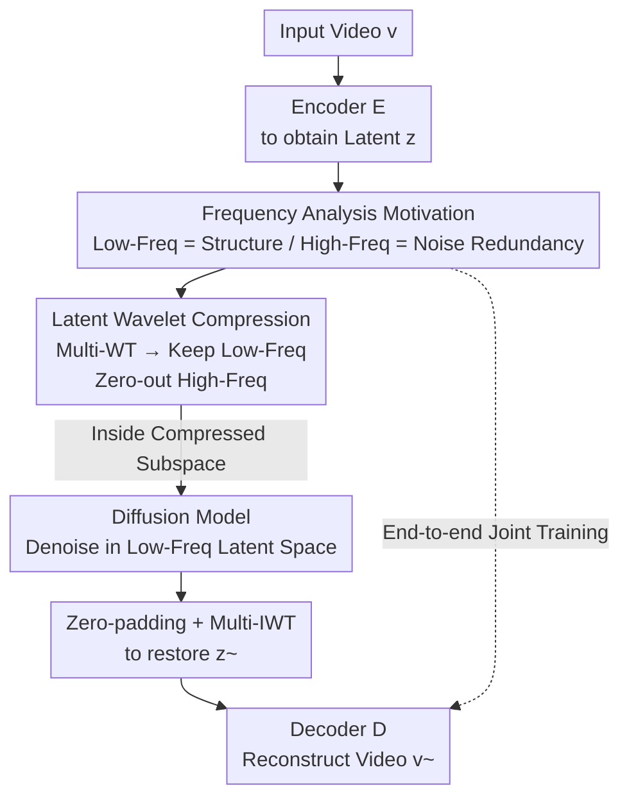

# Latent-Compressed Variational Autoencoder for Video Diffusion Models

**Conference**: CVPR 2026  
**arXiv**: [2604.16479](https://arxiv.org/abs/2604.16479)  
**Code**: https://1mather.github.io/LC-VAE/ (Project Page)  
**Area**: Video Generation / Diffusion Models / VAE  
**Keywords**: Video VAE, Latent Space Compression, 3D Wavelet Transform, Frequency Domain Analysis, Latent Diffusion Models

## TL;DR
To resolve the dilemma where a high number of latent channels slows down diffusion convergence while reducing channels hurts reconstruction quality, LC-VAE applies multi-level 3D wavelet transforms in the latent space and zeros out high-frequency subbands. At equal compression ratios, it outperforms the strong baseline WF-VAE (PSNR improves by 0.81~1.82 dB on WebVid-10M) and enhances downstream diffusion generation.

## Background & Motivation
**Background**: The success of Latent Diffusion Models (LDM) relies on using a Variational Autoencoder (VAE) to compress images/videos into a compact latent space, where the diffusion process is executed to reduce computation. Video generation models (e.g., Sora, CogVideoX, Open-Sora, MovieGen) follow this paradigm, making latent space design a core research focus.

**Limitations of Prior Work**: Video VAEs typically require "enough" latent channels to ensure high-quality reconstruction. However, recent research indicates two drawbacks of high channel counts: first, the enlarged latent search space makes diffusion training harder to converge, leading to degraded generation quality (even if reconstruction remains high); second, high-channel latent representations contain massive **disordered high-frequency components**, which conflict with the "coarse-to-fine" synthesis nature of diffusion. The authors also observe (Fig. 2) that increasing WF-VAE channels from 4 to 32 yields diminishing returns in PSNR, suggesting significant redundancy.

**Key Challenge**: There is a trade-off between "compressing the latent space to ease diffusion" and the "significant loss in reconstruction fidelity when directly reducing channels." Naive channel reduction is a blunt compression method that loses information indiscriminately.

**Goal**: Further compress video latent representations **without reducing the number of latent channels**, achieving dimensionality reduction and redundancy removal without sacrificing reconstruction quality, while stabilizing downstream diffusion training.

**Key Insight**: Instead of modifying the VAE architecture or disentangling content/motion, the authors **analyze the frequency structure of the latent representations learned by the VAE itself**. Applying a 3D Haar wavelet decomposition to WF-VAE latents (Fig. 3) reveals that low-frequency subbands have high energy and strong inter-frame temporal autocorrelation (carrying structural information), while high-frequency subbands have low energy and are disordered (mostly texture/noise). Crucially, removing high frequencies from the latent space severely degrades reconstruction (Fig. 8), indicating that baseline latent representations are "overly sensitive" to high frequencies and lack robustness—a signal of suboptimal representation learning.

**Core Idea**: Use "wavelet decomposition in latent space, retaining only low-frequency subbands and zeroing high-frequency subbands" to replace "direct channel reduction." This forces the encoder to focus on low-frequency structural information that is diffusion-friendly and compression-efficient, while delegating high-frequency detail recovery to the decoder.

## Method

### Overall Architecture
The LC-VAE (Latent-Compressed VAE) backbone follows the main baseline WF-VAE (using the same 3D causal convolutional encoder-decoder), but inserts a "Compression-Reconstruction" operator pair in the latent space. The input video $v \in \mathbb{R}^{C\times T\times H\times W}$ is first processed by the encoder to obtain $z=E(v)$. Then, a **Multi-level 3D Haar Wavelet Transform (Multi-WT)** is applied to $z$, decomposing the latent representation into subbands of different frequencies. Only the low-frequency subbands $\{LLL, LLH, LHL, HLL\}$ are retained, while all other high-frequency subbands are **directly zeroed**. This stores only non-zero subbands, resulting in a compressed latent representation that is ~50% of the original size but retains ~85% energy. The diffusion process runs in this compressed subspace. For generation (or reconstruction), the sampled low-frequency latents are zero-filled in high-frequency positions and restored via **Multi-level Inverse Wavelet Transform (Multi-IWT)** to $\tilde z$, which is then fed into the decoder $\tilde v=D(\tilde z)$. This compression-reconstruction is **trained end-to-end with the VAE**, which is the key distinction from "post-hoc compression."

### Key Designs

**1. Frequency Analysis: Proving "Low-Frequency Carries Structure, High-Frequency is Redundant Noise"**

This is the foundation of the paper, answering why high frequencies can be discarded. The authors apply a one-level 3D Haar wavelet transform to the video latent $z=E_\theta(v)$ from WF-VAE, obtaining 8 subbands. They measure them using two metrics: energy distribution and inter-frame lag-1 temporal autocorrelation (measuring linear dependence/temporal continuity). Results (Fig. 3) show that low-frequency subbands ($B_{LLL}, B_{LLH}, B_{LHL}$) have significantly higher energy and stronger temporal autocorrelation, indicating they contain **structural information** that evolves smoothly over time. High-frequency subbands have low energy and disordered distributions, containing textures and noise. This leads to the hypothesis: structural information can be efficiently compressed into the latent space, while detailed textures can be "outsourced" to the decoder (conditioned on low-frequency content).

**2. Latent Wavelet Compression: Wavelets on Latents instead of Channel Reduction**

To address the fidelity loss in channel reduction, LC-VAE applies a Multi-level 3D Haar Wavelet Transform $B^{(\ell)}_{abc}=B^{(\ell-1)}\circledast(\xi_a\otimes\xi_b\otimes\xi_c)$ (where $\xi\in\{\phi,\psi\}$ are low/high-pass filters and $B^{(0)}=z$) to the latent $z$, followed by a fixed hard-zeroing:

$$\tilde B^{(\ell)}_{abc}=\begin{cases}B^{(\ell)}_{abc}, & abc\in\{LLL,LLH,LHL,HLL\}\\ 0, & \text{otherwise (High-Freq)}\end{cases}$$

Only 4 low-frequency subbands are kept. Before decoding, high-frequency positions are zero-filled and transformed back via $\tilde z=W^{-1}(\{\tilde B^{(\ell)}_{abc}\})$. This "fixed zeroing" adapts classic compression ideas (like discarding high-freq coefficients in JPEG). The difference from "channel reduction" is that while the latter loses information across all frequencies, LC-VAE **selectively discards high frequencies that have low energy, small contribution to reconstruction, and are detrimental to diffusion**. This maintains quality at the same compression ratio while providing a cleaner low-frequency latent space for diffusion.

**3. Joint Training: Forcing Robust Low-Frequency Learning**

Applying compression to a **pre-trained** VAE yielded poor results. The authors' PTLC (post-training latent compression) experiment confirmed this: zeroing high frequencies in pre-trained WF-VAE latents caused severe artifacts (Fig. 8). This is because pre-trained high frequencies are disordered, and the decoder was never trained to recover details without them. Consequently, LC-VAE embeds wavelet compression-reconstruction **throughout the entire VAE training process**. The encoder is forced to pack information into low-frequency subbands, and the decoder learns to recover high-frequency textures conditioned on low-frequency data. This results in a more robust and generalizable representation. The loss function follows WF-VAE without additional terms.

### Loss & Training
The loss follows existing work: $L=L_{recon}+\lambda_{adv}L_{adv}+\lambda_{KL}L_{KL}$, covering L1 reconstruction, adversarial, and KL regularization losses. Training is simpler than WF-VAE: while WF-VAE uses three stages, LC-VAE uses a **single-stage** training with fixed losses and hyperparameters. It uses AdamW ($\beta_1=0.9, \beta_2=0.999$), a learning rate of $1\times10^{-5}$, and is trained for 200,000 steps on Kinetics-400 using 8 H200 GPUs (~5 days). The denoising model (Latte-L) is trained for 100,000 steps.

## Key Experimental Results

### Main Results: Reconstruction Quality (Table 1, WebVid-10M / Panda-70M)
All methods use a Token Compression Ratio (TCPR) of 256 (4×8×8). LC-VAE is compared against WF-VAE at the same channel counts.

| Dataset | Channels | Method | PSNR↑ | SSIM↑ | LPIPS↓ | rFVD↓ |
|--------|------|------|-------|-------|--------|-------|
| WebVid-10M | 4 | WF-VAE | 30.68 | 0.9071 | 0.0344 | 179.13 |
| WebVid-10M | 4 | **LC-VAE** | **31.49** | **0.9207** | **0.0249** | **165.88** |
| WebVid-10M | 8 | WF-VAE | 31.96 | 0.9281 | 0.0242 | 101.06 |
| WebVid-10M | 8 | **LC-VAE** | **33.78** | 0.9208 | **0.0211** | 135.99 |
| WebVid-10M | 16 | WF-VAE | 34.62 | 0.9301 | 0.0193 | **68.72** |
| WebVid-10M | 16 | **LC-VAE** | **35.59** | **0.9439** | **0.0152** | 73.66 |
| Panda-70M | 8 | WF-VAE | 32.41 | 0.8982 | 0.0348 | 156.95 |
| Panda-70M | 8 | **LC-VAE** | **33.64** | **0.9447** | **0.0165** | **93.89** |

LC-VAE consistently leads in PSNR: performing **0.81 / 1.82 / 0.97 dB** better on WebVid-10M for 4/8/16 channels respectively. While some metrics (like rFVD at 16 channels) are slightly lower, PSNR/LPIPS are generally superior.

### Zero-shot Generalization (Table 2, OpenVid-1M)
Reconstruction on unseen datasets to verify the robust low-frequency representation hypothesis.

| Dataset | Channels | Method | PSNR↑ | SSIM↑ | LPIPS↓ |
|--------|------|------|-------|-------|--------|
| OpenVid-1M | 8 | WF-VAE | 34.20 | 0.9066 | 0.0311 |
| OpenVid-1M | 8 | **LC-VAE** | **35.27** | **0.9253** | **0.0172** |
| OpenVid-1M | 16 | WF-VAE | 36.28 | 0.9332 | 0.0167 |
| OpenVid-1M | 16 | **LC-VAE** | **37.06** | **0.9463** | **0.0123** |

WF-VAE drops 0.5–1.5 dB on unseen datasets, whereas LC-VAE shows smaller drops and better stability.

### Ablation Study: Joint Training vs. Post-Training Compression (Table 4, WebVid-10M)
PTLC = Post-training wavelet compression on pre-trained WF-VAE (e.g., 16/8 channels compressed to effective 8/4).

| Method | Channels | PSNR↑ | SSIM↑ | LPIPS↓ |
|------|------|-------|-------|--------|
| WF-VAE (PTLC) | 8 | 29.24 | 0.8393 | 0.0675 |
| **LC-VAE** | 8 | **31.49** | **0.9207** | **0.0249** |
| WF-VAE (PTLC) | 16 | 30.49 | 0.8725 | 0.0545 |
| **LC-VAE** | 16 | **33.78** | **0.9208** | **0.0211** |

Post-training compression results in 2-3 dB lower PSNR than joint training, proving that integrating compression into training is critical.

### Key Findings
- **8 channels is the sweet spot**: The PSNR gain is highest (+1.82 dB) at 8 channels, showing where latent high-frequency redundancy removal is most effective.
- **Joint training is essential**: PTLC ablation shows that without end-to-end training, the same wavelet zeroing operation drops performance by 2-3 dB.
- **SkyTimelapse failure case**: For static videos with few high frequencies, baseline compact latents are sufficient; LC-VAE provides no advantage here.

## Highlights & Insights
- **Novel perspective on "Compression ≠ Reducing Channels"**: Reframing latent compression as "frequency reduction" rather than "dimensionality reduction" bypasses the fidelity loss of channel reduction. This is a reusable insight for any channel redundancy problem.
- **Solid Frequency Analysis**: Using energy and temporal autocorrelation to prove "low-freq = structure" provides a strong theoretical basis.
- **Simplicity & Plug-and-Play**: Fixed zeroing without new hyperparameters allows for easy reproduction and transfer (already verified on WanVAE-2.1).
- **Honest reporting**: The inclusion of failure cases (e.g., SkyTimelapse) adds credibility to the findings.

## Limitations & Future Work
- **Fixed zeroing/compression ratio**: The model currently uses a one-size-fits-all frequency mask, rather than adaptively adjusting based on video content.
- **Generation SOTA**: Downstream diffusion architectures were not optimized, so FVD gains are limited.
- **Basic Haar Wavelets**: The choice of simplest Haar wavelets leaves room to explore higher-order or learnable filters.
- **Future Directions**: Developing data-driven masks for frequency selection and verifying end-to-end gains on large-scale text-to-video models.

## Related Work & Insights
- **vs. WF-VAE**: While WF-VAE integrates wavelet energy into the VAE layers for **pixel-domain** compression, LC-VAE applies it to the **latent domain** and actively zeros subbands.
- **vs. Channel Reduction**: Channel reduction loses information across all frequencies; LC-VAE preserves structural information by selectively discarding high-frequency noise.
- **vs. Content/Motion Decomposition**: Those works focus on temporal redundancy; LC-VAE takes an orthogonal approach by shaping the frequency distribution of learned latents.

## Rating
- Novelty: ⭐⭐⭐⭐ 
- Experimental Thoroughness: ⭐⭐⭐⭐ 
- Writing Quality: ⭐⭐⭐⭐⭐ 
- Value: ⭐⭐⭐⭐

<!-- RELATED:START -->

## Related Papers

- [\[CVPR 2026\] Inference-time Physics Alignment of Video Generative Models with Latent World Models](inference-time_physics_alignment_of_video_generative_models_with_latent_world_mo.md)
- [\[CVPR 2026\] Compressed-Domain-Aware Online Video Super-Resolution](compressed-domain-aware_online_video_super-resolution.md)
- [\[CVPR 2026\] FlashLips: 100-FPS Mask-Free Latent Lip-Sync using Reconstruction Instead of Diffusion or GANs](flashlips_100-fps_mask-free_latent_lip-sync_using_reconstruction_instead_of_diff.md)
- [\[CVPR 2026\] RFDM: Residual Flow Diffusion Models for Video Editing](rfdm_residual_flow_diffusion_models_for_video_editing.md)
- [\[CVPR 2026\] DriveLaW: Unifying Planning and Video Generation in a Latent Driving World](drivelaw_unifying_planning_and_video_generation_in_a_latent_driving_world.md)

<!-- RELATED:END -->
