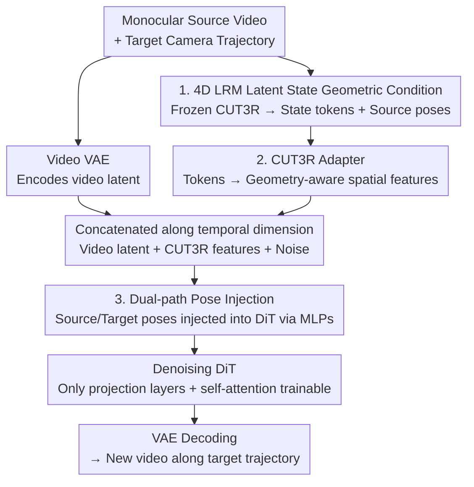

# LaVR: Scene Latent Conditioned Generative Video Trajectory Re-Rendering using Large 4D Reconstruction Models

**Conference**: CVPR 2026  
**Paper**: [CVF Open Access](https://openaccess.thecvf.com/content/CVPR2026/html/Xie_LaVR_Scene_Latent_Conditioned_Generative_Video_Trajectory_Re-Rendering_using_Large_CVPR_2026_paper.html)  
**Code**: None (Project page only: lavr-4d-scene-rerender.github.io)  
**Area**: Video Generation  
**Keywords**: Video Re-rendering, Dynamic Novel View Synthesis, 4D Reconstruction Models, Video Diffusion, Camera Trajectory Control

## TL;DR
Given a monocular video, LaVR feeds the latent states of a pre-trained 4D reconstruction model (CUT3R) as "soft" geometric conditions into a video diffusion model. This allows for both preserving the visual quality of the diffusion prior and maintaining geometric consistency when re-rendering the scene along any novel camera trajectory—outperforming both explicit point cloud conditioning and unconditional baselines in terms of consistency and pose recovery accuracy.

## Background & Motivation
**Background**: Video re-rendering (dynamic novel view synthesis) aims to "re-shoot" a monocular video along a completely new, unobserved camera trajectory. Unlike standard video generation, it must simultaneously model both scene dynamics and the underlying geometry to maintain temporal and spatial coherence under arbitrary camera movements. Existing methods follow two paradigms: **geometric conditioning methods** (Gen3C, TrajectoryCrafter, EX-4D), which first estimate depth and reconstruct point clouds/meshes to render the point cloud from target views as conditions; and **unconditional methods** (ReCamMaster), which directly feed the input video and target trajectory to a video diffusion model for generation.

**Limitations of Prior Work**: Both paradigms suffer from severe limitations. Geometric conditioning methods are physically grounded, but any errors in depth estimation propagate directly to the re-rendered point cloud—causing objects to stretch/compress along the depth direction, parallax inconsistencies, and holes. Furthermore, once baked into a 2D condition map, the point cloud acts as a **rigid constraint**, leaving almost no room for the generative model to correct these errors. Unconditional methods inherit the diffusion prior and exhibit strong visual realism, but lack spatial awareness. Consequently, they drift, deform, and **hallucinate** non-existent content in unobserved regions under large viewpoint changes (e.g., generating an extra arm or an irregular cat tail).

**Key Challenge**: There exists a trade-off between geometric consistency and visual quality—explicit geometry provides consistency but sacrifices quality and is fragile to depth errors, while pure generation provides quality but loses consistency. The root cause lies in the **"hard" vs. "soft" nature of the conditioning signals**: point cloud rendering imposes pixel-aligned rigid constraints, leaving too little margin for the diffusion prior to rectify errors.

**Goal**: To find a conditioning mechanism that provides geometric guidance without relying on precise depth, while still allowing the diffusion prior to correct potential errors.

**Key Insight**: The authors observe that recent large 4D reconstruction models (LRMs, such as CUT3R/MegaSAM) demonstrate that feed-forward networks can **implicitly** extract latent representations rich in geometry and motion from monocular frames without explicit optimization or volumetric reconstruction. Such latent states encode the entire 4D scene structure within a continuous high-dimensional feature space, which naturally forms a "non-pixel-aligned, continuous, and corrigible by the prior" soft representation.

**Core Idea**: Instead of using point cloud rendering maps, this work utilizes the **latent states** of a 4D LRM as geometric conditions for the video diffusion model. While preserving the complete 4D structure, it replaces hard constraints with soft ones, giving the pre-trained diffusion prior the flexibility to regularize geometric inconsistencies.

## Method

### Overall Architecture
LaVR is a "video-to-video" diffusion re-renderer. Given a monocular source video and a user-specified target camera trajectory, it outputs a new video re-rendered along the target trajectory that remains consistent with the scene and dynamics of the source video. The key aspect of the pipeline is **the absence of explicit reconstruction**—it feeds the source video into a frozen CUT3R (a 4D LRM) to obtain frame-wise scene latent tokens and source camera poses. These tokens are processed through a lightweight adapter to convert them into geometry-aware spatial features aligned with the video VAE latents, which are then concatenated along the temporal dimension with the source video latents and noise latents before being fed into a Denoising DiT. The source/target camera poses are injected into each layer of the DiT via two small MLP adapters, respectively. Only the projection layers and self-attention layers in the DiT are trainable, while the remaining parts (including the video VAE) are kept frozen to preserve the pre-trained prior.

### Key Designs

**1. 4D LRM Latent States as "Soft" Geometric Conditions: Replacing Rigid Point Cloud Renderings with a Continuous Latent Space**

This is the core contribution of the paper, directly addressing the pain point that "point-cloud-rendered maps impose rigid constraints where depth errors cannot be corrected." The authors adopt CUT3R as a representative 4D LRM: it performs feed-forward reconstruction on the monocular video, maintaining a **persistent latent state** updated over time to aggregate multi-view information and reflect an evolving 3D understanding of the scene. This state comprises a set of $s$ tokens $\{\ell_i \in \mathbb{R}^d\}_{i=1}^{s}$, which is updated by a ViT encoder upon the arrival of each frame. LaVR extracts the state tensor $S=\{\{\ell_i^t\}_{i=1}^{s}, t=1,\dots,T\}$ across all $T$ frames, thereby preserving temporal variations in both scene content and camera poses. Crucially, while prediction heads in CUT3R can decode poses, world-coordinate point maps, and depth from these states—demonstrating that the tokens indeed encode strong geometric and motion cues—LaVR **does not decode them into explicit geometry**. Instead, it directly uses the latent state as a condition. This preserves the complete 4D structure and, as high-dimensional continuous features (not pixel-aligned), provides the pre-trained diffusion prior with the flexibility to regularize local inconsistencies. This is the definition of "soft": carrying sufficient information while remaining robust to depth noise.

**2. CUT3R Adapter: Translating Latent State Tokens into Spatial Features for DiT**

The challenge is concrete—the CUT3R state is a token-based implicit scene representation, which is **incompatible** with the spatial video latent interface required by the diffusion backbone, preventing direct injection. To address this, the authors design a lightweight adapter to perform the "translation": starting from a state tensor of shape $(T, s, d)$, it first downsamples every $k$ frames to obtain $T/k$ groups of tokens (to reduce computation). Each group of tokens is embedded through an MLP adapter and then fed into a **query-based transformer**. Using a set of spatial queries corresponding to the target $h\times w$ grid, cross-attention is performed over the CUT3R tokens. Consequently, each output position aggregates information from the entire token group, transforming the unstructured token collection into a spatial feature map. This is then projected to the channel dimension $c$ of the video VAE latent, yielding geometry-aware latent features of shape $(T/k, h, w, c)$. Finally, the adapted CUT3R features are **concatenated along the temporal dimension** with the source video latents and noise latents before being fed into the DiT. The key advantage represents injecting geometric conditions **without modifying the backbone architecture**, ensuring compatibility with the spatiotemporal organization during diffusion prior training and thus maximizing prior preservation.

**3. Dual-Path Camera Pose Injection: Source Poses for Context, Target Poses for Control**

While the latent states address "what the scene looks like," the model still needs to clarify "from which perspective to view it." LaVR utilizes two independent lightweight MLP adapters to process the source and target camera poses: the source pose (also extracted from CUT3R) is mapped by an MLP and **added to the intermediate activations of each DiT block** to provide geometric context for the input frames; the user-specified target pose is processed by another MLP to act as a **control signal** guiding the denoising process along the desired camera path. Additionally, a text prompt is used as a secondary condition to describe the scene. The two-way pose injection allows each path to serve its dedicated purpose—enabling the model to follow the trajectory without interference. Ablations (shown below) demonstrate that pose conditioning is a beneficial supplement to the latent-state conditioning, though its contribution magnitude is significantly smaller than the latent states themselves.

### Loss & Training
During training, the CUT3R adapter and the two pose MLP adapters are trained from scratch, while only a subset of the DiT—the projection layers (projectors) and all self-attention blocks—is fine-tuned. The remaining DiT layers and the video VAE are frozen to preserve the pre-trained prior. The training objective employs the standard **conditional flow-matching loss**: given a clean target latent $z_0$, noise $\epsilon \sim \mathcal{N}(0, I)$, and timestamp $t \sim U(0,1)$, an interpolated latent $z_t = (1-t)z_0 + t\epsilon$ is constructed, and the DiT predicts the velocity field conditioned on the adapted CUT3R latent state $Z_c$ and the source video latent $Z_s$:

$$\mathcal{L}_{\text{FM}} = \mathbb{E}_{t, z_0, \epsilon}\left[\left\| v_\theta(z_t, t, Z_c, Z_s) - (\epsilon - z_0) \right\|_2^2\right]$$

To allow the geometric conditioning pathway to converge rapidly without disrupting the pre-trained prior, a **3x higher learning rate** is applied to the CUT3R adapter compared to other components (CUT3R adapter: $6\times10^{-5}$, others: $2\times10^{-5}$). The model contains approximately 1.3B parameters and is trained for 15K steps with a batch size of 8 on 8 H200 GPUs using the synthetic dataset MultiCamVideo (derived from ReCamMaster, where two trajectories are randomly sampled as source and target for each scene).

## Key Experimental Results

### Main Results
Evaluation Set: 100 dynamic scene videos from Pexels and 50 static scene videos from DL3DV, uniformly resampled to 33 frames at 480x832. Each video is evaluated under 4 different novel trajectories, using the same text caption across all methods. Baselines: Gen3C, TrajectoryCrafter (point-cloud-conditioned), and ReCamMaster (unconditional).

| Method | Cycle PSNR↑ | Cycle LPIPS↓ | Cycle CLIP↑ | Subject↑ | Multi-view↑ | Background↑ | Params |
|------|-------------|--------------|-------------|----------|-------------|-------------|--------|
| Gen3C | 20.62 | 23.23 | 97.47 | 92.07 | 7.695 | 90.91 | ~7B |
| TrajectoryCrafter | 14.84 | 41.59 | 95.05 | 93.38 | 15.57 | 92.21 | ~5B |
| ReCamMaster | 17.75 | 32.63 | 97.03 | 94.95 | 5.975 | 92.76 | ~1.3B |
| **Ours (LaVR)** | **20.74** | **22.47** | **98.07** | **95.22** | **17.11** | **92.83** | ~1.3B |

(All metrics for LPIPS/CLIP/VBench are scaled by $\times10^{-2}$.) LaVR achieves the best or tied-for-best performance on all consistency metrics, surpassing the 5B/7B point-cloud-conditioned baselines with only ~1.3B parameters. Pose reconstruction accuracy (measured by aligning the trajectory reconstructed via BA-Track with the ground truth to calculate error):

| Method | Abs(t)↓ (mm) | Rel(t)↓ | Rel(R)↓ (deg) |
|------|--------------|---------|---------------|
| Gen3C | 24.45 | 12.00 | 0.641 |
| TrajectoryCrafter | 16.53 | 10.52 | 0.442 |
| ReCamMaster | 21.83 | 12.43 | 0.518 |
| **Ours** | **14.39** | **7.798** | **0.411** |

LaVR aligns most closely with the target trajectories; the unconditional ReCamMaster has the highest Abs(t) error, confirming that it "fails to follow the trajectory."

### Ablation Study
Ablation study on source pose conditioning (static scenes, Tab. 3):

| Configuration | Cycle PSNR↑ | Multi-View↑ | Abs(t)↓ | Rel(t)↓ | Rel(R)↓ | Explanation |
|------|-------------|-------------|---------|---------|---------|------|
| No latents, No pose | 17.75 | 5.975 | 21.83 | 12.43 | 0.518 | Equivalent to unconditional baseline |
| No CUT3R latents | 17.90 | 6.832 | 19.70 | 11.84 | 0.489 | Only latent states removed, negligible gain |
| No CUT3R pose | 20.70 | 16.08 | 16.93 | 9.460 | 0.467 | Only source pose removed, still close to full |
| **Ours (full)** | **20.74** | **17.11** | **14.39** | **7.798** | **0.411** | Full model |

### Key Findings
- **Latent state conditioning is the primary driver of performance gains**: Removing CUT3R latent states (No CUT3R latents) drops Multi-view consistency from 17.11 to 6.832 and Cycle PSNR from 20.74 to 17.90, almost reverting to the level of the unconditional baseline. Conversely, removing only the source pose (No CUT3R pose) leads to only a slight drop in metrics (Multi-view 17.11 $\rightarrow$ 16.08). This indicates that the geometric conditioning is mainly derived from the latent states, with pose acting as a supplement.
- **Soft conditioning outperforms hard conditioning**: Point-cloud-conditioned baselines (Gen3C/TrajectoryCrafter) yield distorted conditional maps due to depth scale ambiguities, empirical camera intrinsic estimation, and point cloud holes/misalignments, leading to unnatural outputs (stretching, loss of details). Unconditional ReCamMaster fails to preserve object consistency across occlusions (e.g., lamp legs disappearing, a cardboard box appearing opened after being re-observed, or a third arm emerging). LaVR's soft latent state conditioning bypasses both types of artifacts.
- **Punching above its weight**: Achieving superior performance across all consistency metrics compared to 5B/7B parameter point-cloud-conditioned models using only 1.3B parameters demonstrates a clear efficiency advantage.

## Highlights & Insights
- **The dichotomy of "soft vs. hard geometric conditioning" is highly explanatory**: Viewing point-cloud-rendered maps as pixel-aligned rigid constraints and LRM latent states as continuous, corrigible soft constraints clearly explains why explicit geometry is undermined by depth errors. This perspective is transferable to any "geometry-guided generation" tasks (e.g., controllable image synthesis, 3D editing).
- **Reusing the latent states of a pre-trained 4D LRM as conditions instead of its decoded outputs**: While most studies use models like CUT3R to obtain decoded depth or point clouds, LaVR does the opposite by directly leveraging the intermediate latent states. This preserves the information and continuity lost during the decoding process—a clever "less is more" design choice.
- **Translating tokens into spatial features via an adapter followed by temporal concatenation**: Using a query-based transformer to project unstructured state tokens into spatial maps aligned with VAE latents, and then concatenating them along the temporal dimension, completes cross-modal condition injection with almost zero modifications to the backbone. This "translation + concatenation" paradigm can be adapted to other scenarios requiring heterogeneous conditioning in diffusion models.

## Limitations & Future Work
- **The authors acknowledge poor performance on transparent moving objects** (e.g., a glass being lifted by a person), which is fundamentally due to CUT3R's struggle to estimate reliable geometry for such scenes. Thus, the geometric quality of LaVR is capped by the LRM it relies on.
- **The CUT3R conditioning mechanism incurs additional computational overhead** (running an extra 4D LRM, an adapter, and processing longer concatenated sequences along the temporal dimension).
- **Self-identified limitations**: Training is conducted solely on the synthetic MultiCamVideo dataset, leaving generalization to real-world scenes not fully validated. Evaluation metrics like cycle consistency and VBench serve as indirect proxies; since generative tasks lack a single ground truth, conducting rigorous geometric comparisons remains difficult (as also acknowledged by the authors). The effectiveness of latent-state conditioning is tightly bound to the chosen LRM, and while transitioning to a stronger 4D LRM should yield direct benefits, this has not been experimentally tested.
- **Future directions**: Replacing CUT3R with a 4D LRM that is more robust to transparent/reflective objects, or applying uncertainty weighting to the latent states to give the diffusion prior higher corrective weight in regions where the LRM is uncertain.

## Related Work & Insights
- **vs. TrajectoryCrafter / Gen3C (point-cloud-conditioned)**: These models reconstruct point clouds and render them from target views as conditions. Although geometrically rigid, they are hindered by depth errors, holes, and intrinsic camera ambiguities, resulting in distorted outputs. LaVR utilizes continuous latent states as soft conditions; it preserves geometric information while allowing correction by the prior, achieving a win-win in both quality and consistency with a fraction of the parameter count.
- **vs. ReCamMaster (unconditional)**: It takes only the input video and target trajectories, relying entirely on the diffusion prior. Although flexible, it lacks spatial awareness and hallucinates content under large viewpoints. At the same 1.3B parameter scale, LaVR integrates latent-state geometric conditioning, yielding significantly better pre- and post-occluding consistency and trajectory-following accuracy.
- **vs. DUST3R / CUT3R (4D LRMs)**: These constitute "upstream" works for LaVR. LaVR does not compete with them; instead, it reuses their latent states as geometric priors, presenting a bridging paradigm for "reconstruction model $\rightarrow$ generative model conditioning."

## Rating
- Novelty: ⭐⭐⭐⭐⭐ "Using 4D LRM latent states instead of decoded outputs as soft geometric conditions" is a clean and insightful new perspective.
- Experimental Thoroughness: ⭐⭐⭐⭐ Evaluation is conducted across three baseline categories and multiple dimensions (consistency/pose/VBench). However, the ablation studies only evaluate pose, lacking ablations on the adapter design.
- Writing Quality: ⭐⭐⭐⭐⭐ The dichotomy of soft/hard conditioning is clearly explained, with smooth motivation derivation.
- Value: ⭐⭐⭐⭐ Punching above its weight with a transferable paradigm, though restricted by its reliance on synthetic training data and the upper bound of the upstream LRM.

<!-- RELATED:START -->

## Related Papers

- [\[ICLR 2026\] Light-X: Generative 4D Video Rendering with Camera and Illumination Control](../../ICLR2026/video_generation/light-x_generative_4d_video_rendering_with_camera_and_illumination_control.md)
- [\[CVPR 2026\] Inference-time Physics Alignment of Video Generative Models with Latent World Models](inference-time_physics_alignment_of_video_generative_models_with_latent_world_mo.md)
- [\[CVPR 2026\] CineBrain: A Large-Scale Multi-Modal Audiovisual Brain Dataset for Brain-Conditioned Video Generation](cinebrain_a_large-scale_multi-modal_audiovisual_brain_dataset_for_brain-conditio.md)
- [\[CVPR 2026\] SpaceTimePilot: Generative Rendering of Dynamic Scenes Across Space and Time](spacetimepilot_generative_rendering_of_dynamic_scenes_across_space_and_time.md)
- [\[CVPR 2026\] Diff4Splat: Repurposing Video Diffusion Models for Dynamic Scene Generation](diff4splat_controllable_4d_scene_generation_with_latent_dynamic_reconstruction_m.md)

<!-- RELATED:END -->
