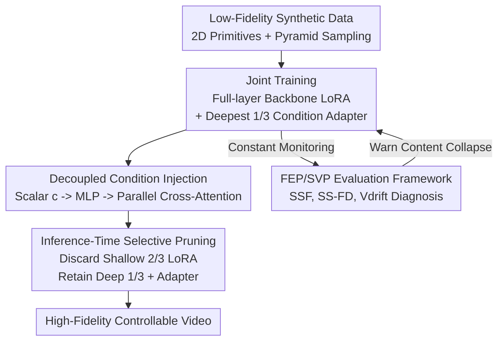

# Less is More: Data-Efficient Adaptation for Controllable Text-to-Video Generation

**Conference**: CVPR 2026  
**Paper**: [CVF Open Access](https://openaccess.thecvf.com/content/CVPR2026/html/Cheng_Less_is_More_Data-Efficient_Adaptation_for_Controllable_Text-to-Video_Generation_CVPR_2026_paper.html)  
**Code**: https://github.com/csh-apprentice/Less_Is_More  
**Area**: Video Generation / Controllable Text-to-Video  
**Keywords**: Text-to-Video, Controllable Generation, Data-Efficient Fine-Tuning, Catastrophic Forgetting, LoRA

## TL;DR
When adding continuous control over physical camera parameters such as shutter speed, aperture, and color temperature to pre-trained text-to-video models (WAN 2.1), this paper finds that fine-tuning with sparse, low-fidelity synthetic data performs better than using photorealistic data. This is because photorealistic data destroys the backbone's pre-trained priors, leading to "content collapse," whereas simple synthetic data merely "coaxes out" existing priors. High-fidelity controllable generation is achieved through a design incorporating "decoupled cross-attention + joint LoRA training + inference-time pruning."

## Background & Motivation

**Background**: Large Text-to-Video (T2V) diffusion foundation models (e.g., Wan, Hunyuan Video, Sora) can generate high-quality videos, but pure text control is too coarse. To add extra control signals like images, depth, or camera trajectories, the mainstream approach involves taking a large foundation model and fine-tuning it with a carefully curated task-specific small dataset to "focus" the model on a specific identity, style, or effect.

**Limitations of Prior Work**: Adding control over **low-dimensional physical/optical attributes** (shutter speed $\rightarrow$ motion blur, aperture $\rightarrow$ depth of field, color temperature $\rightarrow$ tint) requires massive, high-fidelity real video datasets with precise physical parameter annotations—data that is extremely difficult to collect. Furthermore, this is the **first** work attempting to integrate conditional control of camera effects (shutter, focal length, etc.) into pre-trained video generation models, meaning no off-the-shelf data is available.

**Key Challenge**: Intuitively, it is believed that "the closer the fine-tuning data is to the real output domain, the better," leading to efforts in photorealistic rendering. However, this paper discovers a counter-intuitive phenomenon: **although photorealistic synthetic data appears to have higher fidelity, it pollutes the backbone's pre-trained priors, triggering "catastrophic forgetting" and "content collapse"**—fine-tuning pushes the model away from the distribution it originally mastered. The semantic complexity of real data acts as a "poison."

**Goal**: (1) To learn precise continuous physical control for T2V models using extremely minimal and simple synthetic data; (2) To provide a framework that quantitatively explains "why simple data is better" and diagnoses/prevents backbone erosion during training.

**Key Insight**: The authors hypothesize that the latent space of the foundation model already implicitly contains strong priors regarding realism. The role of fine-tuning should be to "coax out" these existing attributes rather than extending or extrapolating to a new domain. Therefore, the data **does not need to be realistic; it only needs to have clean, observable variations along the control axes**.

**Core Idea**: Instead of pursuing an "as realistic as possible" fine-tuning dataset, it is better to construct a "as decoupled (disentangled) as possible" dataset, completely abandoning realism. By using simple synthetic scenes with 2D geometric primitives to isolate physical effects, combined with decoupled condition injection and prunable LoRA, data-efficient controllable generation is achieved.

## Method

### Overall Architecture

The system aims to insert scalar physical controls (e.g., $c \in [-1, 1]$ representing short to long shutter) into a frozen T2V backbone without destroying original generation capabilities. The pipeline consists of four parts: **First**, simple synthetic data (2D primitives + pyramid scalar sampling) is used as supervision. **During training**, backbone LoRAs are injected into every layer of the DiT to absorb "synthetic domain shifts," while a **condition cross-attention adapter parallel to text cross-attention** is inserted only in the deepest 1/3 of the transformer blocks to learn physical effects. **During inference**, the LoRA weights in the shallow 2/3 blocks are discarded, retaining only the LoRA and condition adapters in the deepest 1/3 blocks to recover most of the network's original priors. **Throughout the process**, the FEP/SVP two-stage evaluation framework monitors backbone drift and diagnoses catastrophic forgetting.

### Key Designs

**1. Decoupled Condition Injection: Separating physical control from text semantics via parallel cross-attention**

The pain point: if physical control signals are mixed directly with text (e.g., via prompts like "extreme motion blur"), the model suffers from **semantic entanglement**—misinterpreting shutter speed as something else or "warm color temperature" as "snowy weather." This work normalizes the scalar condition $c \in [-1, 1]$, projects it via a small MLP into a high-dimensional embedding $e_{cond} = \text{MLP}_{cond}(c)$, and injects it using a **condition cross-attention that is parallel to and independent of the text cross-attention**. For a query $q$ of the video latent, the cross-attention output is a linear combination of the text condition $y_{text}$ and the attribute condition $y_{cond}$. Crucially, this adapter is only inserted into the deepest 1/3 of the transformer blocks, where abstract, high-level semantics are encoded. Injecting control here influences global effects without disrupting content generation in shallow layers.

**2. Joint LoRA Training + Inference-Time Selective Pruning: Offloading synthetic domain shift to LoRA and discarding it**

The pain point: fine-tuning with out-of-domain simple synthetic data inevitably introduces "content drift"—the model's output begins to resemble the simple style of synthetic primitives. Rather than curating real videos, this paper adopts a "separation of concerns" joint training strategy: backbone LoRAs are injected in **all** DiT blocks and optimized alongside the condition adapter. The backbone LoRAs specifically absorb domain shifts from synthetic data, allowing the condition adapter to **focus solely on decoupling physical control signals**. The "selective pruning" during inference is the key: backbone LoRA weights in blocks **without condition adapters (shallow 2/3)** are discarded. This restores the original pre-trained prior in most of the network while preserving the learned control mechanism. SVD analysis of "intruder dimensions" proves that photorealistic training creates high-rank "intruder dimensions" (a mathematical signature of forgetting) in $W_{lora} = W_{pre} + \Delta W_{lora}$, whereas synthetic training produces almost none.

**3. Low-Fidelity Synthetic Data + Pyramid Scalar Sampling: Isolating effects with 2D primitives and ensuring continuous response**

This is the core of "Less is More." The pain point: the high semantic complexity of photorealistic data introduces "confounding complexity" that erodes the backbone. This work conversely designs **geometric primitive** synthetic data—scenes are procedurally generated with randomly combined moving shapes, ensuring conditions for physical control are visible (e.g., motion blur from trajectories, depth of field from overlapping planes) while **stripping away unnecessary semantic details**. For the control scalars, a **multi-level stratified "pyramid" sampling strategy** is used: the range $[-1, 1]$ is divided into $N$ bins, which are sampled uniformly and stacked across levels to concentrate density toward the center. This allows sparse datasets to provide rich, continuous control signals without over-fitting to discrete values. Effective rank analysis proves that after joint training, the singular value spectrum of $y_{cond}$ shows a clear "elbow" and an **effective rank of 1** (learning the essence of the effect); without backbone LoRA, $y_{cond}$ is high-rank and mirrors $y_{text}$, indicating the adapter **memorized content rather than isolating effects**. This failure is termed the "Bulldozer Effect."

**4. FEP/SVP Two-Stage Evaluation Framework: Quantifying data complexity as drift rates**

The pain point: existing metrics (FVD, CLIP Score, VBench) cannot **quantify the intrinsic complexity of fine-tuning data and its impact on backbone drift**. This paper proposes a two-stage framework. **Stage 1: FEP (Fast Evaluation Protocol)**: Generates minimal 4-frame outputs via single-step denoising from fixed seeds across diverse prompts. Two metrics are calculated in CLIP space—SSF (Single-Step Fidelity), the average cosine similarity between adapted and original backbone embeddings (closer to 1.0 means semantics are preserved), and SS-FD (Single-Step Fréchet Distance), measuring distribution shift. The **distribution drift rate** $V_{drift} = \delta(\text{SS-FD}) / \delta(\text{steps})$ acts as a proxy for data complexity. **Stage 2: SVP (Slow Validation Protocol)**: Uses full multi-step denoising to calculate semantic fidelity (X-CLIP, VQA) and 6 VBench quality metrics. FEP provides low-cost, early warnings of over-fitting, while SVP evaluates final quality.

### Loss & Training

Experiments utilize WAN 2.1 as the T2V backbone. Group 1 (Data Complexity Comparison) uses one-shot setups: two models per camera parameter, one with a single synthetic scene and one with a single photorealistic scene, each with 7 scalar conditions. Group 2 (Inference Strategy Comparison) uses models trained on full pyramid synthetic datasets, evaluated with 50-step denoising for 49 frames. The framework only requires standard LoRA layers and decoupled cross-attention paths, ensuring architectural compatibility with standard DiT backbones.

## Key Experimental Results

### Main Results

**Group 1: Synthetic vs. Real Data (One-shot, closer to Baseline is better)**. The semantic scores for Real (photorealistic) data collapse, particularly for aperture VQA; Syn (synthetic) data closely follows the baseline.

| Control | Metric | Baseline | Syn (Ours) | Real |
| :--- | :--- | :--- | :--- | :--- |
| Shutter | X-CLIP | 25.390 | 24.777 | 23.278 |
| Shutter | VQA | 0.522 | 0.352 | 0.096 |
| Aperture | X-CLIP | 25.390 | 25.105 | 19.824 |
| Aperture | VQA | 0.522 | 0.343 | **0.021** (Collapse) |
| Temp | X-CLIP | 25.390 | 25.015 | 24.456 |
| Temp | VQA | 0.522 | 0.431 | 0.281 |

**Group 2: Decoupled Inference vs. Full-LoRA Inference (SVP, closer to Baseline is better)**. Decoupled inference (pruning shallow LoRA) preserves the backbone better, with metrics closer to the original model.

| Metric | Baseline | Shutter-Full | Shutter-Dec | Aperture-Full | Aperture-Dec | Temp-Full | Temp-Dec |
| :--- | :--- | :--- | :--- | :--- | :--- | :--- | :--- |
| X-CLIP | 25.390 | 25.295 | 25.587 | 25.181 | 25.595 | 25.487 | 25.595 |
| VQA | 0.522 | 0.453 | 0.521 | 0.427 | 0.513 | 0.550 | 0.532 |
| Subject Consistency | 0.951 | 0.939 | 0.946 | 0.968 | 0.951 | 0.960 | 0.950 |
| Motion Smoothness | 0.988 | 0.983 | 0.987 | 0.994 | 0.987 | 0.990 | 0.989 |
| Image Quality | 0.618 | 0.531 | 0.596 | 0.596 | 0.633 | 0.664 | 0.623 |

### Ablation Study

| Configuration | Key Observation | Description |
| :--- | :--- | :--- |
| Synthetic Data | Low $V_{drift}$, SSF $\approx$ baseline, few intruder dimensions | Benign adaptation without destroying backbone |
| Photorealistic Data | High $V_{drift}$, X-CLIP/VQA collapse, high intruder dimensions | Catastrophic forgetting / content collapse |
| Joint Training (LoRA+Adapter) | $y_{cond}$ effective rank = 1, "elbow" in spectrum | Adapter learns essence of the effect |
| Adapter Only Training | $y_{cond}$ high rank, mirrors $y_{text}$ | Bulldozer Effect; memorized content instead of effect |
| Decoupled Inference | SVP score variation < 2% | Minimal erosion of backbone priors |

### Key Findings
- **Data complexity is more critical than realism**: The "malignant drift" of photorealistic data caused aperture VQA to drop from 0.522 to 0.021, while synthetic data remained near baseline—proving fine-tuning data should prioritize "decoupling" over "realism."
- **Backbone LoRA is a prerequisite for adapter decoupling**: Removing backbone LoRA causes the adapter's effective rank to increase, triggering the Bulldozer Effect—highlighting that "separation of concerns" is a necessity.
- **Decoupled inference is a "free lunch"**: Discarding shallow LoRA at inference yields X-CLIP/VQA scores closer to baseline than Full-LoRA without sacrificing control capability.
- **Extreme data efficiency**: One-shot synthetic data is sufficient to learn continuous physical controls comparable to data-intensive specialized methods like Bokeh Diffusion.

## Highlights & Insights
- **Counter-intuitive "Less is More"**: The authors justify the use of simple data through geometric analyses (intruder dimensions and effective rank) from both weight and functional output perspectives.
- **The "Bulldozer Effect" diagnosis**: Explaining failure as "high rank + large amplitude + orthogonal to content space" providing a mechanistic explanation for why adapters suppress text signals.
- **FEP Monitoring**: Using single-step denoising as an early warning for backbone drift is highly efficient and predictive of final SVP performance.
- **Pruning as a "Regret" Mechanism**: The "pollute then purify" design (LoRA absorbing drift, then being discarded) effectively circumvents the dilemma of fine-tuning damaging the backbone.

## Limitations & Future Work
- **Limited to scalar control**: Only shutter, aperture, and color temperature were tested; performance on higher-dimensional or spatial controls (e.g., pixel-wise depth) is unknown.
- **Single backbone**: All experiments were conducted on WAN 2.1; cross-backbone validation is required.
- **Independent parameters**: Each control axis is trained separately; a unified model for multiple parameters is future work.
- **Details in Supplementary**: Pyramid sampling levels and specific $V_{drift}$ thresholds $\epsilon$ are partially omitted in the main text.

## Related Work & Insights
- **vs. ControlNet / T2I-Adapter**: These focus on spatial control (depth, mask); this work targets low-dimensional physical parameters via decoupled cross-attention rather than encoding branches.
- **vs. Bokeh Diffusion**: These are data-intensive image-domain methods; the proposed method achieves comparable quality in the video domain with one-shot synthetic data.
- **vs. LoRA Spectral Analysis**: Leverages "intruder dimensions" to diagnose forgetting but advances it into a proactive data strategy and adds the $V_{drift}$ metric for complexity quantification.

## Rating
- Novelty: ⭐⭐⭐⭐⭐ 
- Experimental Thoroughness: ⭐⭐⭐⭐ 
- Writing Quality: ⭐⭐⭐⭐⭐ 
- Value: ⭐⭐⭐⭐ 

<!-- RELATED:START -->

## Related Papers

- [\[CVPR 2026\] M4V: Multimodal Mamba for Efficient Text-to-Video Generation](m4v_multimodal_mamba_for_efficient_text-to-video_generation.md)
- [\[CVPR 2026\] RAPID: Reusing Attention Sparsity with Inter-step Adaptation for Efficient Video Diffusion](rapid_reusing_attention_sparsity_with_inter-step_adaptation_for_efficient_video_.md)
- [\[ICCV 2025\] EfficientMT: Efficient Temporal Adaptation for Motion Transfer in Text-to-Video Diffusion Models](../../ICCV2025/video_generation/efficientmt_efficient_temporal_adaptation_for_motion_transfer_in_text-to-video_d.md)
- [\[CVPR 2026\] SynMotion: Semantic-Visual Adaptation for Motion Customized Video Generation](synmotion_semantic-visual_adaptation_for_motion_customized_video_generation.md)
- [\[CVPR 2026\] Tea-Adapter: Teacher Adapter for Efficient Conditional Generation](tea-adapter_teacher_adapter_for_efficient_conditional_generation.md)

<!-- RELATED:END -->
