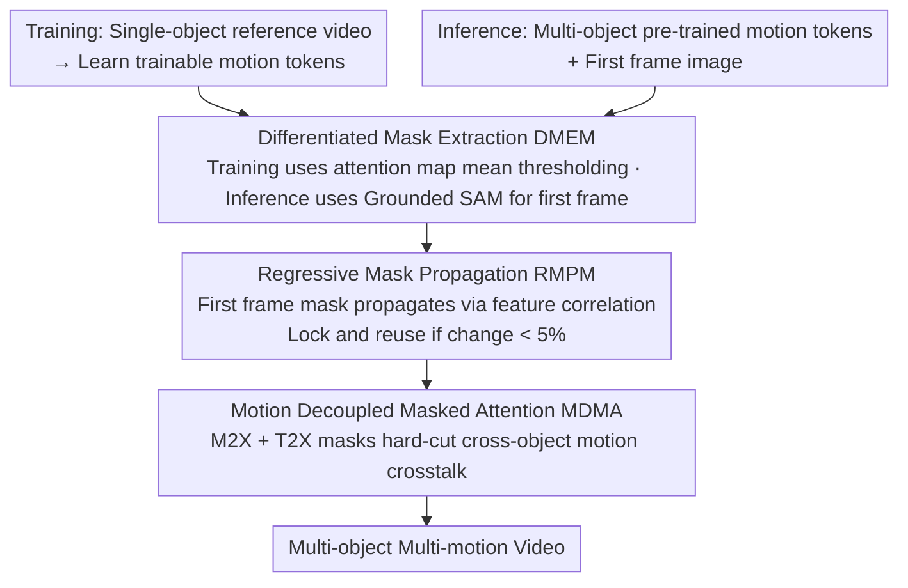

# Let Your Image Move with Your Motion! – Implicit Multi-Object Multi-Motion Transfer

**Conference**: CVPR 2026  
**arXiv**: [2603.01000](https://arxiv.org/abs/2603.01000)  
**Code**: [Project Page](https://ethan-li123.github.io/FlexiMMT_page/)  
**Area**: Video Generation  
**Keywords**: Motion Transfer, Multi-Object Multi-Motion, Masked Attention, Video Diffusion Models, I2V Generation

## TL;DR

This paper proposes FlexiMMT, the first I2V framework supporting implicit multi-object multi-motion transfer. By utilizing a Motion Decoupled Masked Attention (MDMA) mechanism to constrain motion/text tokens to affect only corresponding target regions and a Differentiated Mask Extraction Mechanism (DMEM) to derive target masks from diffusion attention for progressive propagation, it achieves precise compositional multi-object motion transfer.

## Background & Motivation

1. **Background**: Motion transfer is a significant direction in controllable video generation, aiming to capture motion dynamics from a reference video and apply them to a target subject. Existing methods are categorized into explicit (pose/optical flow/trajectory) and implicit (encoding motion embeddings from reference videos) approaches. Implicit methods learn motion representations via trainable motion tokens from reference videos.

2. **Limitations of Prior Work**: Almost all existing implicit motion transfer methods can only handle single-object single-motion scenarios. When multiple objects exist in a scene and require different motion patterns, existing methods cannot independently assign different motions to different objects.

3. **Key Challenge**: Directly injecting multiple sets of motion tokens into 3D full attention layers results in global entanglement of interactions—the motion tokens of one object affect the video tokens of others, leading to motion confusion and erroneous transfer.

4. **Goal**: To achieve independent multi-object motion transfer in I2V generation, allowing each object to move according to its specified reference video.

5. **Key Insight**: Perform motion decoupling at the attention level—using object-specific masks to constrain motion and text tokens so they only interact with video tokens of the corresponding target.

6. **Core Idea**: Implement motion decoupling via masked attention, ensuring each object only "sees" its own motion signals and text descriptions.

## Method

### Overall Architecture

FlexiMMT addresses a specific task: given an image with multiple objects, each object should move according to a different reference video. Existing implicit motion transfer methods only serve single-object scenarios, and multiple motion signals tend to crosstalk. Based on CogVideoX-5B-I2V, the pipeline is divided into training and inference stages. During training, only single-object reference videos are used to learn trainable motion tokens. Meanwhile, the Differentiated Mask Extraction Mechanism (DMEM) extracts target masks from attention maps to enforce motion decoupling via MDMA. During inference, pre-trained motion tokens for multiple objects are concatenated into the text and video token sequences. DMEM uses Grounded SAM to extract masks for the first frame, followed by Regressive Mask Propagation (RMPM) to propagate masks frame-by-frame. Finally, Motion Decoupled Masked Attention (MDMA) locks each motion signal to its target region to prevent crosstalk.

### Key Designs

**1. Motion Decoupled Masked Attention (MDMA): Hard-cutting cross-object crosstalk in attention**

The limitation lies in the 3D full attention of the original MM-DiT, where all tokens interact globally. MDMA adds a mask matrix $\mathcal{M}$ to the attention logits to block unintended interactions:

$$ \text{Attn}(Q,K,V) = \text{softmax}\!\left(\frac{QK^\top}{\sqrt{d}} + \mathcal{M}\right)V $$

$\mathcal{M}$ is divided into Motion-to-X (M2X) and Text-to-X (T2X) sub-masks. M2X ensures each set of motion tokens only interacts with corresponding video tokens ($\mathcal{M}_{m \to v}$ passes, others set to $-\infty$), and sets $\mathcal{M}_{m \to m} = \mathbf{0}$ to cut crosstalk between different motion tokens. T2X ensures text tokens describing specific object motions only attend to their respective regions. This hard isolation is more reliable than soft constraints via loss functions.

**2. Differentiated Mask Extraction Mechanism (DMEM): Dual strategies for mask acquisition**

Training involves single-object scenarios where masks are extracted by binarizing the attention maps between text queries $Q_y^k$ and video keys $K_v$ using a mean threshold. This avoids external segmentation overhead and ensures consistency between training and inference signals. During multi-object inference, attention maps become entangled, so Grounded SAM is used for the first frame, followed by RMPM for subsequent frames.

**3. Regressive Mask Propagation (RMPM): Accurately propagating masks across frames**

RMPM maintains an anchor set within a sliding window (first frame plus adjacent frames, window $W=2$) and propagates masks to the current frame via a feature correlation matrix $\mathcal{C}_l^k$. A dynamic version stops updates when the mask change between denoising steps falls below a threshold $\alpha = 5\%$, as motion transfer primarily occurs in early denoising steps.

### A Complete Example

Assume an input image with a cat and a dog. The goal is for the cat to follow reference video A (jumping) and the dog to follow video B (wagging tail). Pre-trained motion tokens $m_{\text{cat}}$ and $m_{\text{dog}}$ are loaded. Grounded SAM extracts separate masks for the cat and dog in the first frame. In MDMA, $m_{\text{cat}}$ only calculates attention with video tokens in the cat's region, while $m_{\text{dog}}$ does the same for the dog. The two sets are isolated by $\mathcal{M}_{m \to m} = \mathbf{0}$. As denoising progresses, RMPM propagates the masks, and the process eventually locks once the mask stabilizes.

### Loss & Training

Training follows the standard noise prediction loss of CogVideoX-5B-I2V, optimizing only the new motion tokens. Each set of tokens is trained for 2000 steps using the AdamW optimizer with a learning rate of 3e-3 and a batch size of 1. Videos are $720 \times 480$ resolution with 49 frames. Experiments were conducted on 6 NVIDIA A800 GPUs.

## Key Experimental Results

### Main Results

| Dataset | Metric | Ours (FlexiMMT) | Prev. SOTA | Gain |
|--------|------|------|----------|------|
| 200 Pairs | Trajectory Fidelity (TF) | 0.577 | 0.488 (Go-with-Flow) | +0.089 |
| 200 Pairs | Flow Fidelity (FF) | 0.723 | 0.648 (Go-with-Flow) | +0.075 |
| 200 Pairs | Appearance Consistency | 0.904 | 0.939 (FlexiAct) | Slightly lower |
| 200 Pairs | Human Eval - Motion Fidelity | 89.475% | 6.500% (FlexiAct) | Dominant lead |
| 200 Pairs | Human Eval - Temporal Consistency | 83.875% | 11.550% (FlexiAct) | Dominant lead |

### Ablation Study

| Configuration | TF↑ | FF↑ | Description |
|------|---------|---------|------|
| Full FlexiMMT | 0.577 | 0.723 | Baseline |
| w/o M2X Mask | 0.381 | 0.618 | TF drops 34%, M2X is core to decoupling |
| w/o T2X Mask | 0.461 | 0.665 | TF drops 20%, T2X is also important |
| w/o Training Mask | 0.440 | 0.656 | Unable to accurately learn reference motion |
| w/o Inference Mask (DMEM) | 0.373 | 0.602 | Motions fully entangled |
| w/o RMPM | 0.377 | 0.607 | Results similar to w/o inference mask |

### Key Findings

- In human evaluation, FlexiMMT received 89.475% of votes for motion fidelity, far exceeding all baselines.
- CLIP-based metrics (AC and TC) tend to favor static or weak-motion videos; failed motion methods might yield higher scores.
- The proposed Flow Fidelity (FF) metric provides a more comprehensive measure of motion similarity than Trajectory Fidelity.
- Dynamic RMPM significantly reduces inference time without performance loss.

## Highlights & Insights

- First framework to solve the implicit multi-object multi-motion transfer problem.
- The MDMA mechanism is simple yet effective: hard isolation at the attention level is more reliable than soft loss constraints.
- Utilizing different mask extraction strategies for training and inference is a pragmatic engineering choice.
- Motion tokens can be arbitrarily recombined, achieving true compositional motion transfer.

## Limitations & Future Work

- Training relies on single-object videos, requiring curated datasets.
- Inference depends on external semantic segmentation models (Grounded SAM).
- RMPM may fail during occlusions or rapid motion that causes drastic appearance changes.
- Lower AC and TC scores may indicate that generated motions introduce some degree of appearance drift.

## Related Work & Insights

- **vs FlexiAct**: FlexiAct extracts motion via spatio-temporal attention features but suffers from signal entanglement in multi-object scenes; FlexiMMT provides explicit isolation via MDMA.
- **vs Go-with-the-Flow**: Uses explicit optical flow, requiring flow estimators and geometric constraints; FlexiMMT is an implicit method and more flexible.
- **vs MotionDirector**: LoRA-based decoupling for T2V; cannot handle I2V appearance preservation requirements.
- **Insight**: Implementing structural constraints at the attention level (rather than pure loss constraints) is an effective paradigm for decoupled control.

## Rating

- Novelty: ⭐⭐⭐⭐⭐ 
- Experimental Thoroughness: ⭐⭐⭐⭐ 
- Writing Quality: ⭐⭐⭐⭐ 
- Value: ⭐⭐⭐⭐ 

<!-- RELATED:START -->

## Related Papers

- [\[CVPR 2026\] Anti-I2V: Safeguarding your photos from malicious image-to-video generation](anti-i2v_safeguarding_your_photos_from_malicious_image-to-video_generation.md)
- [\[CVPR 2026\] Attention Surgery: An Efficient Recipe to Linearize Your Video Diffusion Transformer](attention_surgery_an_efficient_recipe_to_linearize_your_video_diffusion_transfor.md)
- [\[CVPR 2026\] SymphoMotion: Joint Control of Camera Motion and Object Dynamics for Coherent Video Generation](symphomotion_joint_control_of_camera_motion_and_object_dynamics_for_coherent_vid.md)
- [\[CVPR 2026\] VideoWeaver: Multimodal Multi-View Video-to-Video Transfer for Embodied Agents](videoweaver_multimodal_multi-view_video-to-video_transfer_for_embodied_agents.md)
- [\[CVPR 2026\] 3D-Aware Implicit Motion Control for View-Adaptive Human Video Generation](3d-aware_implicit_motion_control_for_view-adaptive_human_video_generation.md)

<!-- RELATED:END -->
