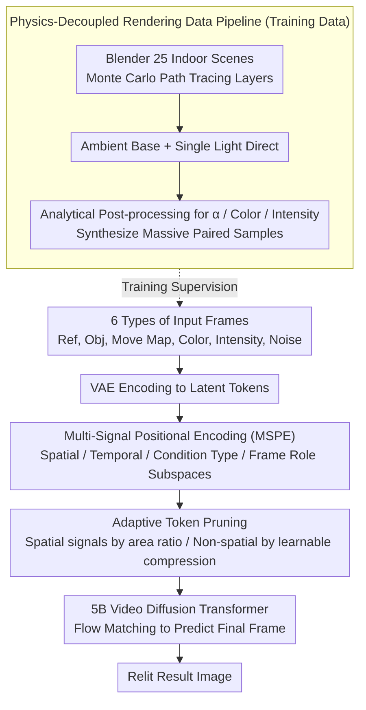

# LightMover: Generative Light Movement with Color and Intensity Controls

**Conference**: CVPR 2026  
**arXiv**: [2603.27209](https://arxiv.org/abs/2603.27209)  
**Code**: [Project Page](https://gengzezhou.github.io/LightMover/)  
**Area**: Video Generation  
**Keywords**: Light source manipulation, video diffusion models, lighting editing, adaptive token pruning, physical rendering data

## TL;DR

LightMover leverages video diffusion priors to model light source editing as a sequence-to-sequence prediction problem. By utilizing a unified control token representation for precise manipulation of light position, color, and intensity, and introducing an adaptive token pruning mechanism that reduces control sequence length by 41%, the method outperforms existing approaches in both light movement and object movement tasks.

## Background & Motivation

Editing illumination precisely from a single image is a highly challenging task because lighting involves complex global interactions between geometry, materials, and occlusions. Existing methods fall into two categories: (1) Inverse rendering methods (e.g., reconstructing geometry, materials, and lighting before re-rendering), which are highly ill-posed and computationally expensive for a single image; (2) Diffusion-based editing methods (e.g., LightLab) that can adjust hue and ambient light but fail to model the spatial movement of light sources. General image editing models (SDEdit, InstructPix2Pix, Gemini, etc.) lack explicit lighting parameterization and cannot achieve physically plausible lighting control.

**Key Challenge**: Existing methods either lack the ability to model the spatial position of light sources or implicitly integrate lighting into object movement frameworks, failing to correctly propagate shadows, reflections, and light attenuation. The **Core Idea** of this paper is to extend the token sequence framework of ObjectMover to the domain of lighting editing, designing specialized control tokens for color and intensity, and achieving physically consistent light source manipulation through a "2.5D" learning paradigm (using video diffusion models to approximate 3D light transport on 2D images).

## Method

### Overall Architecture

LightMover reformulates "editing the lighting of a single image" as "predicting the next frame in a video." Since video diffusion models naturally understand how light and shadow should transition continuously between frames, this prior is used to approximate 3D light transport without explicit geometry and material reconstruction. The approach concatenates all inputs into a pseudo-video sequence fed into a 5B-parameter Video Diffusion Transformer to generate the relit result in the final frame. The input sequence contains six types of frames: (1) Reference image $I_{\text{ref}}$; (2) Target object crop $I_{\text{obj}}$; (3) Movement map $I_{\text{move}}$ (R channel encodes source region, GB channels encode target region); (4) Color control frame $I_{\text{color}}$; (5) Intensity control frame $I_{\text{intensity}}$; (6) Noisy frame to be generated $X^t$. After all frames are encoded into latent tokens via a VAE, **Multi-Signal Positional Encoding (MSPE)** is applied to distinguish the semantic roles of each frame, followed by **Adaptive Token Pruning** to compress control signals. Finally, the Diffusion Transformer processes them jointly to infer coordinated changes in light position, color, and intensity. The learning is supported by a **Physics-Decoupled Rendering Data Pipeline**, which synthesizes massive pairs of "same scene, different lighting" samples during post-processing.

### Key Designs

**1. Multi-Signal Positional Encoding (MSPE): Distinguishing "Reference" from "Instruction"**

When six types of inputs are concatenated into a pseudo-video sequence, standard positional encoding only sorts them by "frame index," failing to capture their distinct semantic roles—the reference image is the base, the movement map is a spatial instruction, and the color frame is an attribute instruction. MSPE decomposes positional information into four orthogonal subspaces: spatial encoding $(W,H)$ preserves 2D structures within frames, temporal encoding $T$ records sequence order, condition type encoding $C$ identifies the modality, and frame role encoding $R$ distinguishes between conditional inputs and predicted outputs. These are combined additively after projection and modulated into attention via a RoPE-like mechanism. Consequently, the model understands both spatial alignment and whether a frame is an instruction to follow or a target to generate.

**2. Adaptive Token Pruning: Preventing Sequence Explosion from Control Signals**

Color and intensity signals could be treated as full-resolution frames, but this leads to linear expansion of token counts, consuming compute and limiting output resolution. LightMover differentiates two types of control signals: for signals with spatial structure (like movement maps), it determines whether to keep full resolution or downsample based on the area ratio of the target bounding box to the full image. For non-spatial signals like color and intensity, it uses a learnable downsampling rate to compress tokens significantly. Together, these reduce the total control sequence length by 41% with almost no loss in precision (PSNR 20.39 with pruning vs. 20.38 without).

**3. Physics-Decoupled Rendering Data Pipeline: Synthesizing Paired Lighting Samples**

To teach the model how light moves and how shadows correspond, paired "same scene, different lighting" data is required, which is nearly impossible to collect in the real world. The authors used 25 indoor scenes with 100 light source assets in Blender, using Monte Carlo path tracing to decompose each frame into two layers: an ambient base $I_{\text{amb}}$ and the direct light contribution $I_{\text{light}}$ from a single source. Relighting then becomes an analytical post-processing step:

$$I_{\text{relit}}(\alpha, G_{\text{illum}}, \mathbf{c}_t) = \alpha\, I_{\text{amb}} + G_{\text{illum}}\, I_{\text{light}} \odot \mathbf{c}_t$$

where $\alpha$ adjusts ambient intensity, $\mathbf{c}_t$ colors the light source, and intensity gain $G_{\text{illum}} = 2^{S_{\text{EV}}}$ is based on exposure values (EV). This allows for infinite variations of color and intensity variations from a single render, saving significant computation. Crucially, this decouples the causal effects of light (shadow movement, reflection brightening, indirect light propagation) from surface pixel correlations.

### Loss & Training

The model is trained using a flow matching objective: $\mathcal{L} = \mathbb{E}_{t,X^0,X^1}[\|v(S^t, t; \theta)_{[6]} - V^t\|^2]$

A multi-task hybrid strategy is employed, with a 10:1 ratio of synthetic to real data. The ratio for seven tasks (Light Move : Object Move : Color Change : Intensity Change : Joint Change : Light Removal : Light Insertion) is 6:3:3:3:1:1. Training resolutions are a mix of 512×512 and 1024×1024 (1:1 ratio).

## Key Experimental Results

### Main Results

**Light Movement (LightMove-A)**:

| Method | PSNR ↑ | DINO ↑ | CLIP ↑ |
|------|--------|--------|--------|
| Qwen-Image | 19.01 | 69.94 | 87.27 |
| Gemini-2.5-Flash | 19.59 | 72.46 | 89.72 |
| ObjectMover | 19.49 | 78.12 | 90.48 |
| **Ours** | **20.38** | **81.27** | **91.85** |

**Light Color/Intensity Changes (LightMove-B)**:

| Method | Color PSNR | Intensity PSNR | Combined PSNR |
|------|----------|----------|----------|
| Gemini-2.5-Flash | 22.14 | 25.09 | 18.42 |
| **Ours** | **24.06** | **27.12** | **19.97** |

**General Object Movement (ObjMove-A)**:

| Method | PSNR ↑ | DINO ↑ | CLIP ↑ |
|------|--------|--------|--------|
| ObjectMover | 25.27 | 85.07 | 93.16 |
| **Ours** | **25.73** | **88.59** | **91.86** |

### Ablation Study

| Configuration | PSNR | DINO | CLIP | Description |
|------|------|------|------|------|
| w/o Light Aug/Color/Intensity | 19.88 | 79.93 | 91.06 | Baseline, no auxiliary tasks |
| +Light Aug | 20.07 | 79.73 | 91.62 | Light augmentation improves quality |
| +All (Full Model) | 20.38 | 81.27 | 91.85 | Multi-task joint training is best |
| w/o frame-as-condition | 19.53 | 77.32 | 90.01 | Frame encoding exceeds embedding encoding |
| w/o adaptive downsample | 19.38 | 75.62 | 89.81 | Adaptive pruning is indispensable |

### Key Findings

- Multi-task joint training creates a strong mutual enhancement effect: position, color, and intensity signals regularize each other, improving accuracy across all lighting tasks.
- Adaptive token pruning reduces the control sequence length by 41% with almost no performance loss (PSNR 20.39 with pruning vs. 20.38 without).
- LightMover not only leads in light source manipulation but also outperforms ObjectMover in general object movement tasks, demonstrating the generalization capability of the unified framework.

## Highlights & Insights

- The "2.5D" paradigm is highly clever—using video diffusion models to approximate 3D light transport in 2D space avoids the computational cost of full 3D reconstruction.
- Unifying light editing into an object movement framework is a natural progression; the control token design allows a single model to support both object and light source editing.
- The physics-decoupled rendering pipeline is a model of data engineering: by separating ambient and direct light, it generates infinite variations in post-processing.

## Limitations & Future Work

- Currently only supports manipulation of visible light sources; control over invisible sources (e.g., natural light from outside a window) is limited.
- Synthetic data uses only 25 indoor scenes; scene diversity could be further increased.
- Modeling of long-distance light transport effects (e.g., caustics, subsurface scattering) during light movement may be inaccurate.
- Only supports single image input; extension to light manipulation in video sequences is yet to be explored.

## Related Work & Insights

- **vs ObjectMover**: LightMover extends the ObjectMover token framework by adding lighting-specific control signals and performs better even on object movement tasks.
- **vs LightLab**: LightLab supports hue and on/off control but not spatial movement; LightMover achieves precise control of light source positions for the first time.
- **vs Gemini-2.5-Flash-Image**: General LLM editors lack lighting parameterization and are significantly inferior to LightMover in physical consistency of light propagation.
- **Insight**: The idea of encoding non-spatial attributes (color, intensity) as frame tokens is worth referencing in other controllable generation tasks.

## Rating

- Novelty: ⭐⭐⭐⭐ First to unify spatial light movement with color/intensity control in a video diffusion framework; adaptive token pruning is elegantly designed.
- Experimental Thoroughness: ⭐⭐⭐⭐⭐ Covers light movement/color/intensity/joint control/object movement/insertion/removal with comprehensive ablations.
- Writing Quality: ⭐⭐⭐⭐ Clear methodological descriptions, rigorous physical modeling formulas, and high-quality pipeline visualization.
- Value: ⭐⭐⭐⭐ Direct application value for photo post-editing and virtual scene production, advancing research in fine-grained lighting control.

<!-- RELATED:START -->

## Related Papers

- [\[ICLR 2026\] Light-X: Generative 4D Video Rendering with Camera and Illumination Control](../../ICLR2026/video_generation/light-x_generative_4d_video_rendering_with_camera_and_illumination_control.md)
- [\[CVPR 2026\] V-RGBX: Video Editing with Accurate Controls over Intrinsic Properties](v-rgbx_video_editing_with_accurate_controls_over_intrinsic_properties.md)
- [\[CVPR 2026\] FastLightGen: Fast and Light Video Generation with Fewer Steps and Parameters](fastlightgen_fast_and_light_video_generation_with_fewer_steps_and_parameters.md)
- [\[CVPR 2026\] Generative Neural Video Compression via Video Diffusion Prior](generative_neural_video_compression_via_video_diffusion_prior.md)
- [\[CVPR 2026\] SwitchCraft: Training-Free Multi-Event Video Generation with Attention Controls](switchcraft_training-free_multi-event_video_generation_with_attention_controls.md)

<!-- RELATED:END -->
