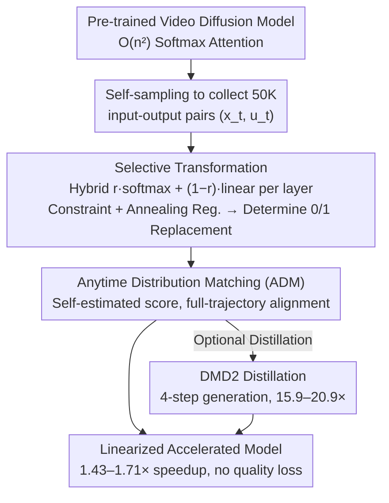

# LinVideo: A Post-Training Framework towards O(n) Attention in Efficient Video Generation

**Conference**: CVPR2026  
**arXiv**: [2510.08318](https://arxiv.org/abs/2510.08318)  
**Code**: None  
**Area**: Video Generation  
**Keywords**: linear attention, video diffusion, post-training, efficient inference, distribution matching

## TL;DR

LinVideo is proposed as a data-free post-training framework that selectively replaces quadratic attention with linear attention in video diffusion models. It achieves a 1.43–1.71× speedup (up to 15.9–20.9× when combined with distillation) while maintaining generation quality.

## Background & Motivation

Video diffusion models (e.g., Wan, CogVideoX, Sora) have achieved breakthroughs in generation quality. However, the computational complexity of self-attention is $\mathcal{O}(n^2)$. When video sequence lengths $n$ are large (often exceeding 50K tokens for 10s videos), inference costs become a deployment bottleneck.

Existing acceleration solutions fall into two categories:

**Attention Sparsification** (SVG, XAttention, etc.): These skip redundant computations but struggle to achieve high sparsity at medium sequence lengths, typically retaining >50% of dense attention computations.

**Linear Attention** (SANA-Video, LinGen, etc.): These reduce complexity to $\mathcal{O}(n)$, but replacing all layers requires expensive pre-training from scratch.

The Key Challenge lies in the significant representation gap between linear and softmax attention. Combined with the spatio-temporal modeling complexity of video generation, inexpensive post-training is often ineffective. The Core Problem addressed in this paper is: **Can as many quadratic attention layers as possible be replaced with linear attention through efficient post-training to achieve significant speedup without quality loss?**

## Method

### Overall Architecture

Ours is a **data-free post-training framework** designed to replace as many quadratic attention layers as possible with linear attention without retraining the entire model or sacrificing quality. The process consists of three stages: first, sampling 50K input-output pairs $(x_t, u_t)$ from the pre-trained model itself to serve as training data, eliminating the need for external video datasets; second, using learnable parameters to automatically select layers suitable for replacement (**Selective Transformation**); and finally, using **Anytime Distribution Matching (ADM)** to align the distribution of the linearized model across the sampling trajectory with the original model. Self-sampling and the output model serve as the framework, while selective transformation and ADM are the two core contributions.

### Key Designs

**1. Selective Transformation: Automated Identification of Replaceable Layers**

The authors observed that replaceability varies significantly across layers—shallow layers (e.g., layers 2–11) recover accuracy more easily, likely because subsequent layers compensate for errors, whereas others (e.g., layer 1) collapse irreversibly upon replacement. Layer replacement is modeled as a binary classification problem: a learnable scalar $r \in [0,1]$ is introduced for each layer using hybrid attention:

$$o_i = r \cdot \text{SoftmaxAttn}(q_i, K, V) + (1-r) \cdot \text{LinearAttn}(q_i, K, V)$$

$r=1$ retains softmax, while $r=0$ uses linear attention. After training, $r$ is rounded to determine the final selection. To control the number of replacements, a constraint loss $\mathcal{L}_{\text{con}} = \left(\sum_{l=1}^{N} \lceil r^{(l)} \rfloor - \text{target}\right)^2$ is applied. To prevent $r$ from stagnating near 0.5, a regularization loss is added:

$$\mathcal{L}_{\text{reg}} = \sum_{l=1}^{N} (1 - |2r^{(l)} - 1|^\alpha)$$

where $\alpha$ is annealed from large to small values, encouraging exploration early on and forcing $r$ toward 0 or 1 later. Ablations show that removing $\mathcal{L}_{\text{reg}}$ causes Imaging Quality to plummet from 66.07 to 18.62. The linear attention kernel follows the Hedgehog design $\phi(q) = \text{softmax}(q\widetilde{W}_q) \oplus \text{softmax}(-q\widetilde{W}_q)$, ensuring non-negativity via softmax transformation.

**2. Anytime Distribution Matching (ADM): Self-Estimated Score for Full-Trajectory Alignment**

Standard MSE loss $\mathcal{L}_{\text{mse}} = \|u_t - \hat{u}_\theta(x_t, t)\|^2$ fails to maintain joint distributions between frames, leading to temporal artifacts like flickering. Distribution matching used in few-step distillation (like DMD) only aligns the final distribution $p_0$ at $t=0$, ignoring intermediate timesteps and requiring an additional model to estimate the score, which incurs 5–10× training overhead. ADM instead matches distributions at **any timestep** $t$ along the sampling trajectory by minimizing:

$$\mathcal{L}_{\text{ADM}} = \mathbb{E}_{\hat{x}_t \sim q_t}\left[\log \frac{q_t(\hat{x}_t)}{p_t(\hat{x}_t)}\right]$$

A key insight is that since LinVideo transitions progressively from softmax to linear attention, $\hat{u}_\theta$ can always be viewed as a flow model. Thus, it can estimate its own score without an auxiliary model—the score difference simplifies to:

$$s_t(\hat{x}_t) - \hat{s}_t(\hat{x}_t) = -\frac{1-t}{t}(u_\theta(\hat{x}_t) - \hat{u}_\theta(\hat{x}_t))$$

This avoids extra models (accelerating training by ~4.4×) and is more stable than matching only the endpoint.

### Loss & Training

Total Loss: $\mathcal{L}_{\text{total}} = \mathcal{L}_{\text{ADM}} + \lambda(\mathcal{L}_{\text{con}} + \mathcal{L}_{\text{reg}})$, where $\lambda = 0.01$

- Wan 1.3B: Replaced 16/30 layers, trained for 3K steps on 8×H100.
- Wan 14B: Replaced 22/40 layers, trained for 3K steps on 32×H100.
- Optional: Additional DMD2 distillation for 2K steps to achieve 4-step generation.

## Key Experimental Results

### Main Results: VBench 8-Dimension Performance Comparison (Wan 1.3B, 480p)

| Method | Latency (s) | Gain | Imaging Quality | Aesthetic Quality | Motion Smooth. | Dynamic Degree | BG Consist. | Subject Consist. |
|------|---------|--------|-----------------|-------------------|----------------|----------------|-------------|-----------------|
| FlashAttention2 | 97.32 | 1.00× | 66.25 | 59.49 | 98.42 | 59.72 | 96.57 | 95.28 |
| SVG | 74.52 | 1.31× | 65.78 | 59.16 | 97.32 | 58.87 | 95.79 | 93.94 |
| SVG2 | 84.91 | 1.15× | 66.03 | 59.31 | 98.07 | 59.44 | 96.61 | 94.95 |
| **LinVideo** | **68.26** | **1.43×** | **66.07** | **59.41** | **98.19** | **59.67** | **96.72** | **95.12** |
| LinVideo+DMD2 | 6.11 | **15.9×** | 65.62 | 57.74 | 97.32 | 61.26 | 95.47 | 93.74 |

On Wan 14B (720p), LinVideo achieves a **1.71×** speedup (1127s vs 1931s), reaching **20.9×** gain with DMD2. VBench-2.0 total score: LinVideo (56.74) = FA2 (56.74) > SVG2 (55.81).

### Ablation Study

| Ablation Dimension | Key Finding |
|---------|---------|
| Target Count | Speedup increases but quality decreases from target=10→20; performance is stable for target≤18, drops significantly at ≥20. |
| Selection Strategy | LinVideo (automated) >> Manual (hand-picked layers) >> Heuristic (grid search). |
| $\mathcal{L}_{\text{reg}}$ | Imaging Quality drops from 66.07 to 18.62 without it, proving regularization of $r$ is essential. |
| ADM vs MSE | ADM (66.07) >> MSE (61.56) >> DMD (57.44); MSE introduces temporal artifacts. |
| Score Estimation | Using self-estimation for $\hat{s}_t$ (66.07) outperforms training an extra model (65.61) and is ~4.4× faster. |
| $\lambda$ Sensitivity | Performance fluctuates by ~1% for $\lambda \in \{0.001, 0.01, 0.1\}$, indicating low sensitivity. |

### Key Findings

Automated layer selection results: Replaced layers include $\{2\text{–}8, 10\text{–}13, 15\text{–}16, 23, 25, 30\}$, concentrating in shallow stages, consistent with the observation that shallow layers are more easily replaced.

## Highlights & Insights

1. **Data-Free Post-Training Paradigm**: Training requires no external video data, using only self-sampled pairs to avoid data privacy and copyright issues.
2. **Automated Layer Selection**: Modeling layer selection as a learnable binary classification problem provides a fundamental advantage over manual or heuristic methods (Imaging Quality: 66.07 vs 62.97 vs 60.74).
3. **ADM Training Efficiency**: Utilizing the model itself to estimate the score function eliminates extra model training, improving efficiency by ~4.4×.
4. **Orthogonal Design**: LinVideo exclusively replaces attention types (dense linear vs dense quadratic) and is orthogonal to sparse attention methods, allowing for future combinations.
5. **Extreme Acceleration Potential**: The 4-step distilled version achieves 15.9–20.9× speedup with only ~1% quality loss, demonstrating significant value for practical deployment.

## Limitations & Future Work

1. **Lack of Specialized Kernels**: Current linear attention does not use custom CUDA kernels, leaving room for further speedup.
2. **Replacement Upper Bound**: Quality drops significantly when the target is too high (>18/30), indicating some softmax attention layers are indispensable.
3. **Restricted Validation**: Generalization has not been verified on other architectures like CogVideoX or HunyuanVideo.
4. **Training Resource Requirements**: Training 1.3B models requires 8×H100 and 14B requires 32×H100, which remains a barrier for small teams.
5. **Combination with Sparsity**: As LinVideo is orthogonal to methods like SVG, exploring combined schemes is a promising direction.

## Related Work & Insights

- **Linear Attention Pre-training**: While SANA-Video, LinGen, and Matten require expensive pre-training starting from image models, LinVideo provides a post-training alternative.
- **SLA** (concurrent work): Focuses on intra-layer hybrid attention, whereas LinVideo focuses on inter-layer replacement; the two are complementary.
- **Few-step Distillation**: DMD/DMD2 are used for final acceleration, but direct distillation on linear attention models often fails catastrophically; LinVideo serves as a necessary prerequisite.
- **Hedgehog Kernel**: The chosen kernel design ensures non-negativity through softmax transformation.
- Insight: Similar progressive linearization and distribution matching strategies may be effective for diffusion models in other modalities (e.g., audio, 3D).

## Rating

- Novelty: ⭐⭐⭐⭐ — Selective Transformation and ADM are both innovative; modeling layer selection as binary classification is a novel perspective.
- Experimental Thoroughness: ⭐⭐⭐⭐⭐ — Covers two model scales, two benchmarks, and exhaustive ablations (target count, strategy, loss, regularization, efficiency).
- Writing Quality: ⭐⭐⭐⭐ — Clear structure with a complete logical chain from motivation to experiment.
- Value: ⭐⭐⭐⭐ — Provides a practical video generation acceleration scheme; introducing linear attention to video diffusion via post-training is a meaningful direction.

<!-- RELATED:START -->

## Related Papers

- [\[CVPR 2026\] FrameDiT: Diffusion Transformer with Matrix Attention for Efficient Video Generation](framedit_diffusion_transformer_with_matrix_attention_for_efficient_video_generat.md)
- [\[CVPR 2026\] SwitchCraft: Training-Free Multi-Event Video Generation with Attention Controls](switchcraft_training-free_multi-event_video_generation_with_attention_controls.md)
- [\[CVPR 2026\] Efficient Long-Context Modeling in Diffusion Language Models via Block Approximate Sparse Attention](efficient_long-context_modeling_in_diffusion_language_models_via_block_approxima.md)
- [\[CVPR 2026\] VMonarch: Efficient Video Diffusion Transformers with Structured Attention](vmonarch_efficient_video_diffusion_transformers_with_structured_attention.md)
- [\[CVPR 2026\] When to Lock Attention: Training-Free KV Control in Video Diffusion](when_to_lock_attention_training-free_kv_control_in_video_diffusion.md)

<!-- RELATED:END -->
