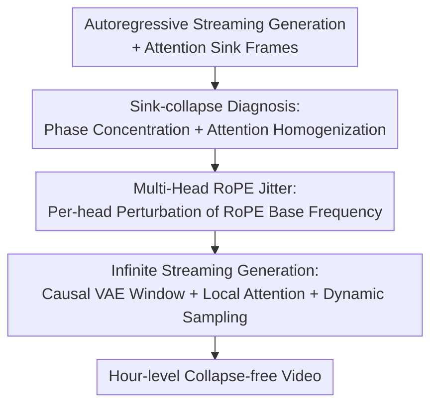

# LoL: Longer than Longer, Scaling Video Generation to Hour

**Conference**: CVPR 2026  
**Paper**: [CVF Open Access](https://openaccess.thecvf.com/content/CVPR2026/html/Cui_LoL_Longer_than_Longer_Scaling_Video_Generation_to_Hour_CVPR_2026_paper.html)  
**Code**: To be confirmed  
**Area**: Video Generation / Diffusion Models  
**Keywords**: Autoregressive long video, attention sink, RoPE, sink-collapse, streaming generation

## TL;DR
Addressing the "sink-collapse" phenomenon in autoregressive ultra-long video generation—where the video suddenly reverts to the first few frames—this paper identifies its root cause as "multi-dimensional phase synchronization + multi-head attention homogenization" induced by RoPE periodicity. The authors propose **Multi-Head RoPE Jitter**, a **training-free** method that perturbs the RoPE base frequency per head to break such synchronization. Combined with causal VAE sliding window decoding, this work achieves real-time, streaming, and nearly quality-lossless **infinite** video generation for the first time (demonstrated up to 12 hours).

## Background & Motivation

**Background**: Long video generation is shifting from bidirectional diffusion models to autoregressive models, which predict the next frame based on previously generated content to support significantly longer temporal modeling. To maintain stability across long sequences, state-of-the-art (SOTA) methods like LongLive, Self-Forcing++, and Rolling-Forcing adopt the **attention sink** concept from LLMs (originating from StreamingLLM): keeping the initial frames (sink frames) permanently in the KV cache to anchor global alignment and stability.

**Limitations of Prior Work**: The authors identify a fatal flaw common to methods using attention sinks, termed **sink-collapse**: the generated content **periodically and abruptly reverts to sink frames**, resulting in scene resets and looped imagery. Intriguingly, both LongLive and Self-Forcing++ collapse at **identical latent frame indices (132, 201)**, regardless of input noise or prompts, with more collapse points appearing as the sequence lengthens.

**Key Challenge**: While repetition also occurs in bidirectional models, RIFLEx attributes it to a "single specific temporal dimension" and attempts to fix it by modifying that dimension's frequency. The authors demonstrate that this approach fails in autoregressive settings—sink-collapse is not caused by a single dimension. The root cause lies in the **periodic trigonometric functions** of RoPE: while rotation preserves relative phase differences in short contexts, periodicity leads to phase aliasing over long ranges. Multiple distant frames share nearly identical positional embeddings, causing the attention mechanism to over-emphasize these sink positions.

**Key Insight**: The authors proceed from two complementary observations. First, when considering the phase alignment across all temporal dimensions, collapse points coincide with **local maxima of phase concentration**, suggesting a "collective force of all dimensions" rather than a single one. Second, by analyzing multi-head attention heatmaps, it is observed that **nearly all attention heads simultaneously** assign extremely high weights to sink frames during collapse, indicating a momentary degradation of "representation diversity" across subspaces.

**Core Idea**: Since collapse stems from all heads "marching in step" regarding phase, the authors **intentionally slightly offset the RoPE base frequency for each attention head** to break global synchronization. This perturbation, requiring no retraining and only a few lines of code, fundamentally suppresses sink-collapse.

## Method

### Overall Architecture
The logic of LoL follows a pipeline of "diagnosis, treatment, and extension": building upon existing autoregressive streaming generation + attention sink frameworks, it first clarifies the root causes of sink-collapse (phase concentration + attention homogenization). It then introduces Multi-Head RoPE Jitter as a training-free fix. Finally, leveraging the inherent properties of causal VAEs and local attention, it extends generation length from minutes to infinity. The entire method involves no weight updates or training, intervening purely during inference.

### Key Designs

**1. Sink-collapse Diagnosis: Phase Concentration + Attention Homogenization**

This discovery serves as the foundation of the paper and explains why RIFLEx-style solutions are ineffective. In bidirectional models, RIFLEx assumes repetition is dominated by a single intrinsic frequency dimension. In the autoregressive setting, the authors provide two sets of evidence to the contrary. The first is **intra-head phase concentration**: given RoPE frequencies $\omega_i = \theta_0^{-2i/d}$ ($i=1,\dots,K$, $K=d/2$), a phase coherence kernel is defined as $C(\Delta) = \left|\frac{1}{K}\sum_{i=1}^{K} e^{j\omega_i \Delta}\right|$, and the phase concentration of a generated frame $g$ relative to sink frame $s$ is denoted as $R_{\text{sink}}(g)=C(g-s)$. A high $R_{\text{sink}}$ indicates multiple RoPE frequency components are phase-synchronized with the sink frame. Experiments show sink-collapse occurs precisely at local maxima of $R_{\text{sink}}$—confirming a multi-dimensional collective effect.

The second is **inter-head attention homogenization**: Transformer models rely on multi-head attention to capture diverse representations. In normal frames, the model distributes weights primarily to recent frames. However, in collapse frames, **nearly all attention heads within the same layer** simultaneously assign massive weights to sink frames, effectively "copying" the sink frame across all subspaces and causing the video to revert.

**2. Multi-Head RoPE Jitter: Per-head Frequency Perturbation to Break Synchronization**

To prevent heads from aligning, LoL assigns each head a **slightly different RoPE base frequency**. As shown in Algorithm 1: while the standard base frequency is $\theta_0$ (usually 10,000), a perturbation $\epsilon_h \sim \mathcal{U}[-1,1]$ is sampled for the $h$-th head. The modified base frequency becomes $\hat\theta_h = \theta_0(1+\sigma_\theta \epsilon_h)$, from which the frequency vector $\omega_h = [\hat\theta_h^{\nu_0}, \dots, \hat\theta_h^{\nu_{D/2-1}}]$ (where $\nu_i=-2i/d_{\text{time}}$) is derived. $\sigma_\theta$ is the sole hyperparameter for jitter intensity.

This is effective because RoPE periodicity makes phase alignment highly sensitive to the base frequency. By offsetting frequencies, phase maxima no longer fall on the same frame across heads, breaking the condition for collapse. This differs fundamentally from modifying the global $\theta$, which only shifts collapse points along the timeline; per-head jitter eliminates the "synchronization" itself.

**3. Infinite Streaming Generation: Causal VAE Sliding Window + Local Attention + Dynamic Sampling**

Solving collapse is one part; ultra-long generation also faces constraints from RoPE sequence length and VAE memory. LoL points out that existing architectures possess two "infinitely extendable" properties. First, the base model Wan-2.1 uses a **3D causal VAE**, ensuring temporal causality and allowing sliding window decoding, which reduces memory and compute. Second, these models use **local attention** for the most recent $N$ latent frames. Since attention scores $\langle q'_m, k'_n\rangle = \langle q_m, R(n-m)k_n\rangle$ depend only on relative position differences, both initial noise and RoPE can be **dynamically sampled in a streaming fashion**. This allows the model to continuously output frames under fixed memory constraints, achieving theoretically infinite length—demonstrated by 12-hour videos at 20 fps on a single H100.

### Loss & Training
LoL **does not introduce any additional training or loss functions**. It is a training-free, plug-and-play modification during inference. The base models (LongLive / Self-Forcing++) follow their original extended Distribution Matching Distillation (extended DMD). LoL only intervenes during the RoPE rotation step within the attention layers. Inference configuration: local attention window of 12, 3 sink frames, standard RoPE base 10,000, $\sigma_\theta=0.8$, and all heads jittered.

## Key Experimental Results

### Main Results
LoL was applied to LongLive and Self-Forcing++ and compared against position embedding extension methods: PE (Extrapolation), PI (Interpolation), NTK, YaRN, and RIFLEx. Metrics included **Sink-Collapse Max/Avg** (normalized L2 distance drop towards sink frames, lower is better) and VBench (Dynamic Degree, etc., higher is better). Results for 100s video:

| Base Model | Method | SC-Max ↓ | SC-Avg ↓ | Dynamic Degree ↑ | Imaging Quality ↑ |
|------|------|---------|---------|------------------|-------------------|
| LongLive | PE (Baseline) | 73.06 | 30.54 | 34.62 | 69.59 |
| LongLive | PI (Interpolation) | **4.97** | **2.27** | 0.35 (Motion Static) | 56.47 |
| LongLive | NTK | 41.11 | 11.64 | 28.72 | 69.83 |
| LongLive | YaRN | 11.17 | 5.08 | 2.67 (Motion Static) | 68.89 |
| LongLive | RIFLEx | 70.95 | 29.93 | 35.11 | 69.47 |
| LongLive | **Ours (LoL)** | 16.67 | 3.93 | **35.27** | 69.45 |
| Self-Forcing++ | PE | 68.07 | 34.11 | 83.32 | 63.06 |
| Self-Forcing++ | PI | 17.07 | 2.62 | 1.95 (Motion Static) | 69.80 |
| Self-Forcing++ | **Ours (LoL)** | 22.70 | 6.12 | **81.20** | 62.92 |

**Core Conclusion**: While PI/YaRN suppress collapse (low SC), they **freeze motion** (Dynamic Degree drops to 0.35~2.67). NTK/RIFLEx preserve motion but **fail to suppress collapse** (SC remains 41~71). LoL achieves the best of both worlds: suppressing SC near PI levels while maintaining Dynamic Degree near or above the PE baseline.

### Ablation Study

| Configuration | Conclusion | Explanation |
|------|------|------|
| Single RIFLEx/Random dimension | Ineffective | Proves collapse is not caused by a single RoPE dimension. |
| Global RoPE base $\theta$ modification | Shift only | Collapse indices move but the phenomenon persists. |
| Jitter strength $\sigma=0.1 / 0.5 / 0.8$ | $\sigma=0.8$ optimal | 0.1 allows severe collapse; 0.5 collapses at ~750 frames; 0.8 is smooth. |
| Jittered head count | More is better | Suppressing collapse improves as more heads are jittered; all-head is best. |

### Key Findings
- **Motion vs. Collapse Suppression is a real trade-off**: Traditional PE methods generally sacrifice one for the other. LoL is among the few that balance both.
- **Collapse points are reproducible and prompt-agnostic**: The fact that different models collapse at the same latent indices strongly suggests a structural issue with positional embeddings rather than content.
- **The Sweet Spot**: $\sigma_\theta=0.8$ with all heads jittered provides the best balance between quality and collapse suppression.

## Highlights & Insights
- **Diagnosis is more brilliant than the remedy**: Quantifying a "mysterious" visual fallback as local maxima of phase coherence $C(\Delta)$ and multi-head homogenization provides powerful explanatory power.
- **Minimalist Correction**: Applying a $\mathcal{U}[-1,1]$ jitter to RoPE base frequencies per head is an elegant "symmetry-breaking" approach that requires near-zero overhead.
- **Engineering Synergy**: Combining causal VAE windowing, local attention, and dynamic RoPE sampling demonstrates that current architectures already possess infinite-length potential once the collapse issue is resolved.

## Limitations & Future Work
- **Ours vs. Training**: While training-free, fine-tuning might yield further improvements. Quality is still capped by the base model and its reliance on local attention/sink frames.
- **Long-term Memory**: Ensuring global consistency (e.g., character/scene stability over hours) remains an open challenge.
- **Hyperparameter Sensitivity**: The jitter strength $\sigma$ is currently empirical. Future work could explore learnable or adaptive per-head frequencies.

## Related Work & Insights
- **vs. RIFLEx**: RIFLEx focuses on **bidirectional** models and single-dimension frequencies; LoL addresses **autoregressive** collapse through multi-head synchronization breaking.
- **vs. PI / NTK / YaRN**: These methods were designed for context extension but fail to balance motion and stability in video; LoL focuses on breaking synchronization rather than interpolation.
- **vs. StreamingLLM**: While the sink frame concept originated in LLMs, this work reveals a specific failure mode (sink-collapse) when that concept is applied to video autoregression.

## Rating
- Novelty: ⭐⭐⭐⭐⭐ Systematic definition and attribution of sink-collapse.
- Experimental Thoroughness: ⭐⭐⭐⭐ Extensive comparisons across bases and baselines.
- Writing Quality: ⭐⭐⭐⭐ Clear logic from diagnosis to treatment.
- Value: ⭐⭐⭐⭐⭐ Highly practical for world models and real-time long video generation.

<!-- RELATED:START -->

## Related Papers

- [\[CVPR 2026\] Scaling Zero-Shot Reference-to-Video Generation](scaling_zero-shot_reference-to-video_generation.md)
- [\[CVPR 2026\] Scaling Instruction-Based Video Editing with a High-Quality Synthetic Dataset](scaling_instruction-based_video_editing_with_a_high-quality_synthetic_dataset.md)
- [\[CVPR 2026\] FFP-300K: Scaling First-Frame Propagation for Generalizable Video Editing](ffp-300k_scaling_first-frame_propagation_for_generalizable_video_editing.md)
- [\[CVPR 2026\] Endless World: Real-Time 3D-Aware Long Video Generation](endless_world_real-time_3d-aware_long_video_generation.md)
- [\[NeurIPS 2025\] Scaling RL to Long Videos](../../NeurIPS2025/video_generation/scaling_rl_to_long_videos.md)

<!-- RELATED:END -->
