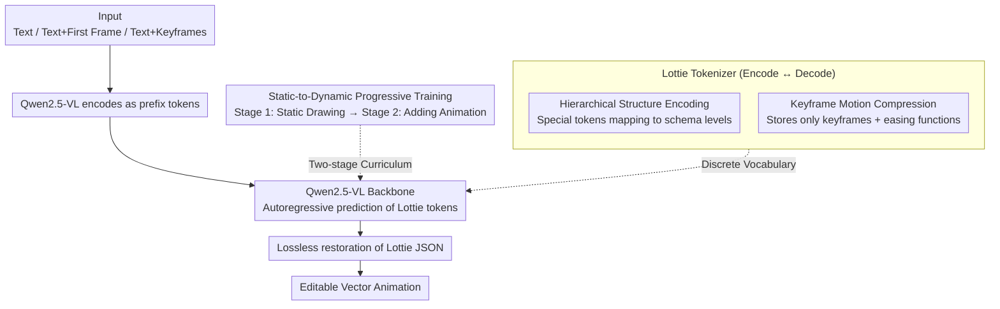

# LottieGPT: Tokenizing Vector Animation for Autoregressive Generation

**Conference**: CVPR 2026  
**arXiv**: [2604.11792](https://arxiv.org/abs/2604.11792)  
**Code**: [https://lottiegpt.github.io/](https://lottiegpt.github.io/)  
**Area**: Video Generation  
**Keywords**: Vector Animation, Lottie, Autoregressive Generation, Tokenizer, Multimodal

## TL;DR

Ours proposes LottieGPT, the first autoregressive generation framework for vector animations. It designs a Lottie tokenizer to encode hierarchical geometries, transformations, and keyframe motions into compact token sequences. By constructing a 660K animation dataset and fine-tuning Qwen-VL, it achieves direct generation of editable vector animations from text or images.

## Background & Motivation

**Background**: The field of video generation (e.g., Sora, Kling) can already produce high-quality raster videos. however, all existing generative models operate in pixel space and cannot generate vector animations—a resolution-independent, editable, and compact mainstream format for multimedia.

**Limitations of Prior Work**: Vector animations (such as UI motions, branding animations, and After Effects motion graphics) possess key attributes that pixel videos lack: infinite resolution, semantic manipulability, parametric motion, and small file sizes. Existing SVG generation methods are limited to static outputs and lack temporal modeling capabilities.

**Key Challenge**: Vector animations contain both hierarchical structures and time-dependent transformation logic. Encoding these into token sequences suitable for autoregressive modeling is the core challenge. Furthermore, the lack of large-scale vector animation datasets is a major bottleneck.

**Goal**: (1) Design a tokenizer capable of unifying the encoding of hierarchical geometry and temporal motion; (2) Construct a large-scale vector animation dataset; (3) Train the first multimodal model for vector animation generation.

**Key Insight**: The Lottie format (a widely deployed JSON animation standard) is adopted, leveraging its parametric representation of keyframes and easing functions to achieve compact encoding.

**Core Idea**: Tokenize vector animations by replacing frame-by-frame data with keyframes and interpolation functions, significantly reducing sequence length while preserving structural fidelity.

## Method

### Overall Architecture

LottieGPT addresses the problem of enabling autoregressive models to directly generate editable vector animations. The difficulty lies in the fact that vector animations are not sequences of pixels but JSON files with hierarchical structures (assets → layers → shapes → attributes) and temporal logic (keyframes + easing). The core of the system is translating this JSON into a sequence of discrete tokens: a Lottie tokenizer encodes the animation into a compact sequence, which is then fed to a Qwen2.5-VL backbone for autoregressive prediction under text/image conditions. The generated tokens are restored losslessly to Lottie JSON by a decoder. Training follows a two-stage curriculum: "learn to draw static images first, then learn to add animation." Inputs can be pure text, text + initial frame, or text + several keyframes. The output is always a vector animation that is infinitely scalable and editable in software like After Effects.

### Key Designs

**1. Hierarchical Structure Encoding of Lottie Tokenizer: Preserving Schema Instead of Degrading to Plain Text**

Vector animations are ill-suited for being treated as arbitrary strings in language models, as this loses structural semantics like "layers containing shapes with fills." The tokenizer assigns a special token to each structural boundary in the Lottie schema (e.g., `<|LAYER|>` marks the start of a layer, `<|ty|>` marks a type field), ensuring the token sequence corresponds one-to-one with the nested hierarchy of the JSON. Unlike OmniSVG, which breaks graphics into atomic drawing commands, ours encodes shape primitives like ellipses, fills, gradients, and strokes as unified semantic units. This ensures the model predicts "the next structurally valid animation component" rather than just the "next character," facilitating the learning of reusable structural patterns and ensuring JSON validity.

**2. Keyframe Motion Compression: Replacing Frame-by-Frame Data with Keyframes and Easing Functions**

The temporal dimension is the source of sequence length explosion. If a 300-frame animation recorded every attribute per frame, the token count would exceed the context window. This design captures the essence of vector animation: motion is inherently "a few keyframes + interpolation curves." Consequently, the tokenizer only encodes keyframe timestamps `<|t|>`, attribute values at those moments, and Bezier easing functions `<|ease|>` connecting adjacent keyframes. A 100-frame translation animation often requires tokens for only 6 keyframes, achieving a compression rate of up to 98% at 300 frames. Explicitly encoding easing functions as first-class primitives is crucial; the same two keyframes with a "bounce" easing versus a "linear" easing produce entirely different motions, which the model must learn to predict.

**3. Static-to-Dynamic Progressive Training: Mastering the Drawing Before the Motion**

Training on mixed static graphics and animation samples from the start leads to unstable convergence because animation token counts dominate the gradients. The curriculum strategy splits training into two stages: Stage 1 focuses on static vector graphics (50% Text-to-Lottie, 50% Image-to-Lottie) to master basic structural drawing. Stage 2 introduces temporal dynamics, using a mix of pure text, text + first frame, and text + video keyframe conditions (roughly 34%/33%/33%) to overlay motion modeling onto the established static foundation. Experiments confirm that this sequential approach at the static stage conversely improves the final animation quality.

### Loss & Training

The training objective is the standard cross-entropy for causal language models, predicting tokens sequentially under multimodal conditions $\mathbf{c}$:

$$\mathcal{L} = -\sum_{i=1}^{N} \log P(t_i \mid t_{<i}, \mathbf{c})$$

The tokenizer supports lossless round-tripping—the decoded animation is identical to the original Lottie rendering. Therefore, the cross-entropy objective learns authentic, executable animation structures without information loss from encoding.

## Key Experimental Results

### Main Results

| Method | Input | CLIP↑ | SSIM↑ | LPIPS↓ | DINOv2↑ | JSON↑ | Validity |
|------|------|-------|-------|--------|---------|-------|-------|
| OmniSVG-7B | Text | 0.832 | 0.563 | 0.512 | 0.727 | N/A | N/A |
| Ours-7B | Text | **0.933** | **0.810** | **0.176** | **0.857** | 0.824 | 98.3% |
| StarVector-8B | Image | 0.766 | 0.385 | 0.465 | 0.529 | N/A | N/A |
| OmniSVG-7B | Image | 0.900 | 0.705 | 0.251 | 0.848 | N/A | N/A |
| Ours-7B | Image | **0.945** | **0.835** | **0.154** | **0.876** | 0.843 | 98.8% |

### Ablation Study

| Config | CLIP↑ | SSIM↑ | Efficiency |
|------|-------|-------|-------|
| Full Model (Stage 1+2) | 0.933 | 0.810 | 98.3% |
| Stage 1 Only (No Animation) | 0.928 | 0.805 | 97.5% |
| No Hierarchical Encoding | 0.891 | 0.752 | 92.1% |
| Frame-by-frame instead of Keyframe | 0.875 | 0.701 | 85.6% |

### Key Findings

- Keyframe encoding is critical for efficiency: frame-by-frame encoding leads to excessive sequence lengths, dropping validity from 98.3% to 85.6%.
- Temporal modeling enhances static vector understanding: LottieGPT achieves new SOTA in SVG generation.
- JSON structure scores prove that the generated Lottie files possess high structural fidelity.

## Highlights & Insights

- The keyframe + easing function encoding is an elegant design: it preserves full animation semantics (motion curves as first-class primitives) while achieving extremely high compression. This approach is generalizable to other parametric generation tasks.
- The dataset contribution is significant: 660K vector animations + 15M static vector graphics constitute the first large-scale resource in this domain.
- Analogizing 2D animation generation to 3D production paradigms (structure first, then animation) is an insightful perspective.

## Limitations & Future Work

- Currently supports only the Lottie format; does not cover SVG SMIL or CSS animations.
- Token sequences for complex animations remain long, limited by the VLM context window.
- Human evaluation of temporal consistency and motion naturalness has not been fully assessed.
- Potential to extend to interactive animation editing and conditional generation.

## Related Work & Insights

- **vs OmniSVG/StarVector**: These methods only generate static SVGs; LottieGPT is the first to support temporal modeling and animation generation.
- **vs Pixel Video Generation**: Pixel-based methods produce fixed-resolution, non-editable outputs, whereas LottieGPT outputs are infinitely scalable and fully editable.

## Rating

- Novelty: ⭐⭐⭐⭐⭐ First autoregressive framework for vector animation, opening a new direction.
- Experimental Thoroughness: ⭐⭐⭐⭐ Proposed LottieBench with multi-dimensional evaluation.
- Writing Quality: ⭐⭐⭐⭐⭐ Clear motivation and well-defined contributions.
- Value: ⭐⭐⭐⭐⭐ Full contribution of dataset, benchmark, and method.

<!-- RELATED:START -->

## Related Papers

- [\[CVPR 2026\] OmniLottie: Generating Vector Animations via Parameterized Lottie Tokens](omnilottie_generating_vector_animations_via_parameterized_lottie_tokens.md)
- [\[CVPR 2026\] Vector Prism: Animating Vector Graphics by Stratifying Semantic Structure](vector_prism_animating_vector_graphics_by_stratifying_semantic_structure.md)
- [\[ICML 2026\] VAnim: Rendering-Aware Sparse State Modeling for Structure-Preserving Vector Animation](../../ICML2026/video_generation/vanim_rendering-aware_sparse_state_modeling_for_structure-preserving_vector_anim.md)
- [\[CVPR 2026\] STARFlow-V: End-to-End Video Generative Modeling with Autoregressive Normalizing Flows](starflow-v_end-to-end_video_generative_modeling_with_autoregressive_normalizing_.md)
- [\[CVPR 2026\] One-to-All Animation: Alignment-Free Character Animation and Image Pose Transfer](one-to-all_animation_alignment-free_character_animation_and_image_pose_transfer.md)

<!-- RELATED:END -->
