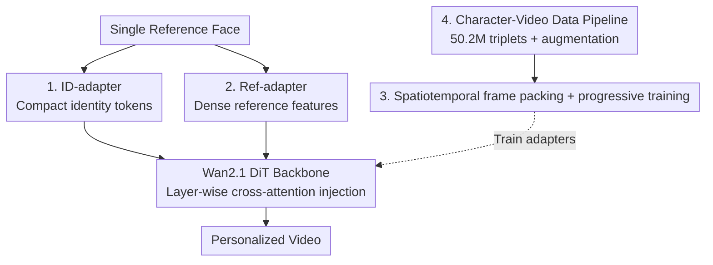

# Lynx: Towards High-Fidelity Personalized Video Generation

**Conference**: CVPR 2026  
**Paper**: [CVF Open Access](https://openaccess.thecvf.com/content/CVPR2026/html/Sang_Lynx_Towards_High-Fidelity_Personalized_Video_Generation_CVPR_2026_paper.html)  
**Code**: Project Page https://byteaigc.github.io/Lynx/  
**Area**: Video Generation / Personalized Generation / Diffusion Models  
**Keywords**: Personalized Video Generation, Identity Preservation, DiT, Adapter, ArcFace

## TL;DR
Lynx equips the open-source video foundation model Wan2.1-14B (DiT) with two lightweight adapters: an ID-adapter that compresses ArcFace face vectors into 16 identity tokens for injection, and a Ref-adapter that extracts dense VAE features from a frozen reference branch to inject layer-by-layer. With only a single reference face image, it generates personalized videos with high identity similarity and natural motion, achieving state-of-the-art face similarity across a benchmark of 800 cases (40 subjects × 20 prompts).

## Background & Motivation
**Background**: Diffusion models have advanced text-to-image generation to text-to-video (e.g., CogVideoX, HunyuanVideo, Wan2.1), where the DiT architecture offers stronger expressiveness for spatiotemporal modeling. Personalized generation—synthesizing content while preserving identity based on a provided reference image—has been extensively studied in the image domain. The mainstream approach utilizes lightweight conditioning modules (such as IP-Adapter and InstantID) to inject identity features into the diffusion process, thereby avoiding retraining the entire model.

**Limitations of Prior Work**: Extending personalization from images to videos introduces new challenges: identity features must maintain temporal consistency across frames, generalize across varying viewpoints and lighting conditions, and preserve motion naturalness. Existing video personalization methods generally follow two paradigms, each with its own drawbacks: one type (e.g., ConsistID, HunyuanCustom) designs modal-specific modules but achieves limited identity similarity; the other type (e.g., SkyReels-A2, VACE, Phantom) directly concatenates reference conditions with the noisy latent for denoising, which often leads to "copy-pasting" artifacts of the background/lighting and poor prompt following.

**Key Challenge**: There is a long-standing trade-off between identity resemblance and editability/prompt following. Overly tight alignment with the reference yields high identity similarity at the expense of text-based editing of scenes and motions; conversely, looser alignment facilitates editing but causes identity drift.

**Goal**: Given a single reference face image, the goal is to simultaneously achieve high-fidelity identity preservation, superior prompt following, and high video quality.

**Key Insight**: Instead of fine-tuning the entire foundation backbone, two complementary adapters are designed to divide the workload: one provides compact identity semantics of "who the person is," while the other supplies dense appearance details of "what the person looks like." This feeds the identity information from coarse to fine.

**Core Idea**: Dual adapters—an ID-adapter (compact identity tokens) and a Ref-adapter (dense VAE reference features)—are utilized to inject features into a frozen DiT backbone via layer-wise cross-attention, enabling high-fidelity personalized video generation.

## Method

### Overall Architecture
Lynx uses Wan2.1-14B as its frozen backbone (DiT + Flow Matching, where each DiT block performs spatiotemporal self-attention followed by text cross-attention). Instead of reconstructing or fine-tuning the backbone, it inserts two extra sets of cross-attention in each transformer block. These receive identity conditions from two adapters: the **ID-adapter** utilizes a Perceiver Resampler to map identity vectors extracted by a face recognition network into a small set of identity tokens, providing compact semantic information of "who the person is"; the **Ref-adapter** runs the reference face image through a frozen copy of the backbone (similar to ReferenceNet) to extract dense activations at each layer, providing fine-grained details of "what the person looks like." The tokens from both paths are incorporated back into the main branch after layer-wise cross-attention. On the training side, spatial-temporal frame packing and a progressive curriculum are adopted for efficient throughput of heterogeneous image/video data. On the data side, a character-video triplet pipeline outputs a training dataset of over 50 million pairs.

### Key Designs

**1. ID-adapter: Compressing faces into 16 identity tokens for compact semantics of "who the person is"**

Addressing the challenge of how to stably represent identity with minimal parameters, Lynx adopts the IP-Adapter / InstantID paradigm from the image domain and transfers it to video DiTs. First, a face recognition network (ArcFace) extracts a $512$-dimensional feature vector from the reference image. Since this vector is not directly suitable as key/value for cross-attention (as it is a single vector rather than a sequence), a Perceiver Resampler (i.e., Q-Former) maps it to a fixed-length token sequence, producing $16$ token embeddings of dimension $5120$. These are concatenated with $16$ register tokens (32 tokens in total) and injected back into the main branch via cross-attention with visual tokens. Because ArcFace features are trained specifically for face verification, this path provides highly discriminative identity semantics. Converting them to a small number of tokens using a Resampler preserves identity information with negligible computational overhead. A key empirical finding: a Resampler trained from scratch struggles to capture face similarity; initializing it with an image-domain pretrained checkpoint (InstantID) is crucial for fast convergence (see Training Strategy).

**2. Ref-adapter: Extracting layer-wise dense VAE features via a frozen reference branch for detailed appearance**

Although ID tokens carry strong identity semantics, they are highly compressed and lose fine-grained appearance details such as textures, hairstyles, and wrinkles. The Ref-adapter is designed to compensate for this limitation. Instead of directly concatenating reference feature maps in front of the noisy latents (image-to-image style, which prone to copy-paste artifacts) as in SkyReels-A2 or Phantom, it draws inspiration from ReferenceNet: the reference face image is fed into a **frozen copy of the backbone** with the noise level set to 0 and the text prompt fixed to "image of a face", allowing this copy to generate intermediate activations (i.e., dense reference tokens) across **all DiT layers** during the forward pass. Then, a separate cross-attention in each layer of the main generation branch fuses the corresponding reference tokens. This ensures that spatial details are captured and injected at multiple levels rather than just once at the input; using a frozen copy instead of direct latent concatenation prevents "copy-pasting" artifacts that replicate the background or lighting of the reference image. The ID-adapter determines "identity resemblance," while the Ref-adapter guarantees "detail fidelity," complementing each other.

**3. Spatiotemporal frame packing + progressive training: Efficient throughput of heterogeneous images/videos to learn appearance then motion**

Video training data varies significantly in spatial resolution and temporal duration. Traditional image-domain "bucketing" (cropping samples to predefined aspect ratios/resolutions and batching within the same bucket) is unsuitable for videos—adding the temporal dimension makes bucketing by "resolution × duration" highly inflexible. Lynx adopts Patch n' Pack (NaViT) to pack patchified tokens of each video into a single long sequence, treating it as a unified batch. Attention masks ensure that tokens only attend to their respective video, avoiding cross-talk, while 3D-RoPE is applied independently to each video for positional encoding. This is coupled with a **progressive curriculum**: first, image pretraining is conducted (treating each image as a single-frame video and reusing the same frame packing) to establish appearance and identity representation using massive image datasets (initializing the Resampler with InstantID allows face resemblance to emerge in just 10k steps, with the first phase totaling 40k steps). Since the videos generated from image pretraining tend to be static, the second phase continues with large-scale video data for 60k steps to restore motion patterns, scene transitions, and temporal consistency. This "appearance-first, motion-second" paradigm decouples "identity fidelity" and "motion learning" into two separate training phases to prevent mutual interference.

**4. Character-video data pipeline: Generating over 50 million triplets via expression and relighting augmentations**

Personalized video training requires reliable "character reference image - target video" pairs. However, simply cropping faces from the target video to form pairs causes the model to overfit to fixed expressions and lighting, while natural multi-scene data of the same person is inherently scarce. Lynx categorizes raw data into four types: single image, single video, multi-scene image set, and sub-scene video set, and expands them with two augmentations: **expression augmentation** uses X-Nemo to edit the source face into target expressions, enriching expression diversity; **portrait relighting** uses LBM to relight portraits under different illuminations and replace backgrounds, enhancing robustness to lighting changes. After performing augmentations, a face recognition model verifies identities, discarding pairs with low similarity (the same filtering is applied to raw multi-scene data). For single-scene pairs where reference images are directly cropped from the target, background augmentation (segmenting the subject and replacing the background) is applied. The pipeline ultimately outputs $50.2$M pairs: $21.5$M single-scene + $7.7$M multi-scene + $21.0$M augmented single-scene, which are weighted-sampled by type during training to balance diversity.

### Loss & Training
The foundation model Wan2.1 is trained using the Flow Matching framework, and Lynx only trains the two adapters on top of it (the backbone remains frozen). It uses the AdamW optimizer with a learning rate of $1\text{e-}5$, weight decay of $0.01$, and is trained on 128 80G GPUs. Because the tokens are packed, the training throughput is measured in "tokens per iteration" rather than batch size, utilizing $33{,}600$ tokens per GPU per step. Phase one (image pretraining) runs for 40k steps (Resampler initialized with InstantID), and phase two (video training) runs for 60k steps.

## Key Experimental Results

### Main Results
Evaluation benchmark: 40 subjects (10 celebrity photos + 10 AI-synthesized portraits + 20 self-licensed portraits, covering diverse ethnicities) × 20 unbiased text prompts = 800 test videos. Identity similarity is measured by cosine similarity via three independent face recognizers (facexlib, insightface, and an in-house model); prompt following and video quality are evaluated using a Gemini-2.5-Pro automated evaluation pipeline.

Face similarity comparison (Table 1, higher is better):

| Model | facexlib | insightface | in-house |
|------|----------|-------------|----------|
| SkyReels-A2 | 0.715 | 0.678 | 0.725 |
| VACE | 0.594 | 0.548 | 0.615 |
| Phantom | 0.664 | 0.659 | 0.689 |
| MAGREF | 0.575 | 0.510 | 0.591 |
| Stand-In | 0.611 | 0.576 | 0.634 |
| **Lynx (ours)** | **0.779** | **0.699** | **0.781** |

Lynx ranks first in identity similarity across all three evaluators. SkyReels-A2 ranks second but relies on "copy-paste" style generation, leading to weak prompt following (see Table 2).

Gemini-2.5-Pro perceptual quality comparison (Table 2, higher is better):

| Model | Prompt Following | Aesthetic Quality | Motion Naturalness | Video Quality |
|------|------------|---------|-----------|---------|
| SkyReels-A2 | 0.471 | 0.704 | 0.824 | 0.870 |
| VACE | 0.691 | 0.846 | **0.851** | 0.935 |
| Phantom | 0.690 | 0.825 | 0.828 | 0.888 |
| MAGREF | 0.612 | 0.787 | 0.812 | 0.886 |
| Stand-In | 0.582 | 0.807 | 0.823 | 0.926 |
| **Lynx (ours)** | **0.722** | **0.871** | 0.837 | **0.956** |

Lynx wins in prompt following, aesthetics, and video quality. For motion naturalness, VACE performs slightly higher due to its strong temporal modeling (0.851 vs 0.837). Phantom follows the route of strong prompt adherence but weaker identity, which validates the identity-editability trade-off, whereas Lynx achieves the best balance. (Note: Although the paper's abstract claims "best in 4 out of 5 metrics", Table 2 lists 4 perceptual metrics where Lynx is best in 3/4. The table in the paper is used as the ground truth.)

### Ablation Study
Removing either Ref-adapter or ID-adapter from the full Lynx configuration (Table 3):

| Configuration | ID-insightface | Prompt Following | Video Quality | Description |
|------|---------------|------------|---------|------|
| Lynx-id-only | 0.655 | 0.624 | 0.925 | Without Ref-adapter: minor identity drop, major prompt drop |
| Lynx-ref-only | 0.523 | 0.738 | 0.921 | Without ID-adapter: slight prompt gain, severe identity drop |
| **Lynx (full)** | **0.699** | 0.722 | **0.956** | Full model achieves the best overall performance |

### Key Findings
- **Complementary and indispensable adapters**: Removing the Ref-adapter (Lynx-id-only) drops prompt following from 0.722 to 0.624 due to insufficient appearance details. Removing the ID-adapter (Lynx-ref-only) slightly bumps prompt following to 0.738 but causes identity similarity to plunge from 0.699 to 0.523—indicating that while Ref-adapter enhances semantic control, it cannot sustain identity on its own. The full model achieves the best trade-off in identity, prompt, and quality.
- **Resampler initialization is critical**: Training the Perceiver Resampler of the ID-adapter from scratch yields almost no face similarity learning (even with long training). It must be initialized with image-domain pretraining (InstantID) to observe resemblance in 10k steps and complete phase one in 40k steps.
- **Qualitative comparison**: Baselines frequently exhibit identity drift, unrealistic motion, or background/lighting copy-pasting. Lynx maintains identity consistency, natural motion, and seamless scene integration under diverse prompts.

## Highlights & Insights
- **Two-path division of "compact semantics + dense details"**: By explicitly decomposing identity information into "who the person is" (ArcFace token, highly discriminative) and "what the person looks like" (layer-wise VAE dense features) and injecting them through two separate cross-attention paths, the model secures both identity similarity and detailed realism. This decoupling is a valuable paradigm that can be applied to any identity-preserving tasks.
- **Replacing latent concatenation with frozen reference branches**: Utilizing a ReferenceNet-style frozen copy to extract features layer-by-layer instead of directly concatenating the reference image to the noisy latent successfully avoids copy-paste artifacts of backgrounds/lighting. This design choice is the key reason for its superior prompt-following compared to SkyReels-A2.
- **Frame packing + image-to-video progressive training**: Employing NaViT-style token packing to process heterogeneous image/video throughput, combined with a progressive curriculum ("image for appearance -> video for motion"), provides a practical engineering solution for large-scale personalized video training.

## Limitations & Future Work
- **Limitations acknowledged by the authors**: Identity injection may amplify implausible dynamics or interactions—e.g., a train moving backward before going forward, or a violin bow not touching the strings (Figure 7). This is partly due to the Wan2.1 backbone itself; identity conditioning tends to amplify these flaws, which the authors suggest could be mitigated with training regularizations.
- **Reliance on closed-source/in-house evaluation components**: Prompt following and video quality ratings rely on Gemini-2.5-Pro, and identity similarity evaluation includes an in-house face recognizer, raising reproduction barriers. In addition, the claim of "best in 4/5" in the abstract slightly deviates from the tables.
- **Single-subject and primary focus on visual modality**: Currently, only single-identity personalization is supported. The authors look forward to extending this to multi-subject, cross-modal (visual + audio) personalization, and controllable motion editing.
- **High training costs**: It is difficult for average research teams to replicate the training with 128×80G GPUs and 50 million pairs.

## Related Work & Insights
- **vs SkyReels-A2 / VACE / Phantom (Concatenation-based)**: These models directly concatenate reference conditions with noisy latents. While they achieve decent identity alignment, they are prone to copy-pasting reference backgrounds/lighting, resulting in poor prompt following (e.g., SkyReels-A2 has the second-highest identity score but a prompt following score of only 0.471). Lynx uses a frozen reference branch to inject features layer-by-layer, attaining higher identity fidelity and significantly better prompt following.
- **vs HunyuanCustom / ConsistID (Modal-specific)**: These methods rely on frequency decomposition or multimodal customized modules. Lynx adopts a more lightweight dual-adapter approach without fine-tuning the backbone, making it easier to scale in engineering.
- **vs IP-Adapter / InstantID (Image domain)**: Lynx directly leverages the ArcFace+Resampler paradigm and initializes with InstantID weights, successfully transferring image personalization to video DiTs, while complementing it with the Ref-adapter to resolve video details and temporal consistency.

## Rating
- Novelty: ⭐⭐⭐⭐ The combination of dual adapters is not entirely new, but the formula of "compact identity + frozen reference dense features" on video DiTs, along with its solid engineering integration, is exceptional.
- Experimental Thoroughness: ⭐⭐⭐⭐ 800 test cases, three evaluators, and clear ablations, but relies on closed-source Gemini and in-house model evaluations.
- Writing Quality: ⭐⭐⭐⭐ Clear structure and well-formulated motivation, though some metrics in the text have minor discrepancies with the tables.
- Value: ⭐⭐⭐⭐ State-of-the-art identity preservation for personalized video generation; the adapter paradigm is practical and highly transferable.

<!-- RELATED:START -->

## Related Papers

- [\[CVPR 2026\] Soul: Breathe Life into Digital Human for High-fidelity Long-term Multimodal Animation](soul_breathe_life_into_digital_human_for_high-fidelity_long-term_multimodal_anim.md)
- [\[ICLR 2026\] PreciseCache: Precise Feature Caching for Efficient and High-fidelity Video Generation](../../ICLR2026/video_generation/precisecache_precise_feature_caching_for_efficient_and_high-fidelity_video_gener.md)
- [\[ICLR 2026\] ReactID: Synchronizing Realistic Actions and Identity in Personalized Video Generation](../../ICLR2026/video_generation/reactid_synchronizing_realistic_actions_and_identity_in_personalized_video_gener.md)
- [\[ECCV 2024\] MagDiff: Multi-Alignment Diffusion for High-Fidelity Video Generation and Editing](../../ECCV2024/video_generation/magdiff_multi-alignment_diffusion_for_high-fidelity_video_generation_and_editing.md)
- [\[CVPR 2026\] DreamShot: Personalized Storyboard Synthesis with Video Diffusion Prior](dreamshot_storyboard_synthesis.md)

<!-- RELATED:END -->
