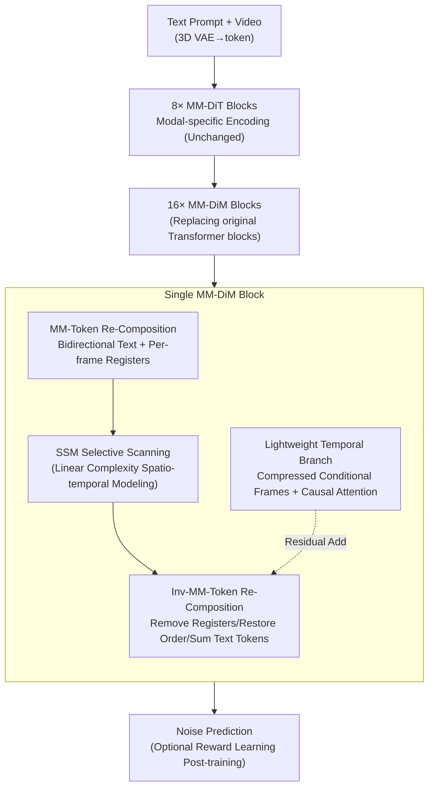

# M4V: Multimodal Mamba for Efficient Text-to-Video Generation

**Conference**: CVPR 2026  
**Paper**: [CVF Open Access](https://openaccess.thecvf.com/content/CVPR2026/html/Huang_M4V_Multimodal_Mamba_for_Efficient_Text_to_Video_Generation_CVPR_2026_paper.html)  
**Code**: Project Page https://huangjch526.github.io/M4V_project/ (Code TBD)  
**Area**: Video Generation / Diffusion Models / Efficient Architecture (Mamba)  
**Keywords**: Text-to-Video, Mamba/State Space Models, Multimodal Fusion, Linear Complexity, Diffusion Models

## TL;DR
M4V replaces the quadratic complexity attention blocks in text-to-video diffusion models with linear complexity Mamba blocks (MM-DiM). Utilizing a "multimodal token re-composition" scheme, it enables unidirectional scanning SSMs to perform text-conditional fusion and spatio-temporal modeling. It reduces mixed-layer FLOPs by approximately 45% on 768×1280 long videos, maintaining quality comparable to the PyramidFlow baseline and even surpassing the original model when transferred to Wan2.1.

## Background & Motivation

**Background**: Text-to-Video (T2V) generation has surged with models like Sora. Leading high-quality models (Sora, Kling, HunyuanVideo, Wan2.1) are predominantly built on the Diffusion Transformer (DiT) architecture, relying on 3D full attention to model the joint spatio-temporal distribution of video.

**Limitations of Prior Work**: Attention exhibits quadratic complexity relative to sequence length. The number of video tokens ($T$ frames × $M$ spatial tokens per frame) is massive, making the cost of 3D full attention $O((TM)^2)$ prohibitively expensive for training and deployment, especially at high resolutions and long durations.

**Key Challenge**: High quality requires modeling a vast spatio-temporal space, yet the attention mechanism capable of joint modeling is the source of the complexity explosion—creating a fundamental trade-off between visual quality and computational resources. While linear complexity Mamba (Selective State Space Models) is a natural alternative, it faces two critical issues: (1) it is designed for **unidirectional 1D sequences**, whereas video requires complex 2D spatial + temporal modeling; (2) it **lacks a multimodal interaction mechanism**, relying on hidden state serial propagation rather than explicit QKV, making it difficult to inject text conditions. Consequently, Mamba's application in text-conditional visual generation has been limited, with some works only using Mamba for unimodal processing followed by external cross-attention.

**Goal**: Design a unified Mamba block capable of multimodal text-visual fusion while rearranging 3D video latents into 1D sequences suitable for SSMs, replacing attention with linear complexity without sacrificing quality.

**Key Insight**: Instead of modifying Mamba itself, the authors perform **token re-composition before and after the SSM**. Text tokens are placed at the start and end of the sequence to create a bidirectional conditioning path, per-frame registers are inserted into the video sequence with zigzag scanning to preserve spatio-temporal structure, and a lightweight temporal branch is added for long-range dependency. These elements form the MM-DiM block that replaces Transformer blocks.

## Method

### Overall Architecture

M4V adopts the macro-structure of PyramidFlow (multi-stage compression and autoregressive flow-matching): text is encoded via a text encoder, and video is tokenized using 3D VAE + patchify. The first 8 MM-DiT blocks use independent parameters to encode text and vision separately (unchanged). The subsequent 16 **unified Transformer blocks are entirely replaced by the proposed MM-DiM blocks**, which use shared parameters to process text and visual tokens simultaneously to predict noise. The core of the paper is the design of this MM-DiM block.

An MM-DiM block consists of two parallel branches: the **Main Branch** applies MM-Token Re-Composition, passes tokens through the SSM (including Conv), and restores them via Inv-MM-Token Re-Composition. the **Temporal Branch** is a lightweight causal attention component for long-range temporal modeling, added residually to the main branch. This decouples spatio-temporal modeling into "2D spatial scanning (Main SSM) + 1D temporal processing (Temporal Branch)," aligning with the natural unidirectional autoregressive property of video along the time dimension without significantly increasing complexity.

### Key Designs

**1. MM-Token Re-Composition: Using "Sequence Rearrangement" to Enable Unidirectional SSMs to Handle Text Conditions and 3D Structure**

This is the engine of the paper, addressing Mamba's lack of explicit cross-modal interaction and 3D perception by rearranging sequences before scanning.

First, **Text Token Re-Composition**: Given input $X=[Z, X_v]$ ($Z$ text, $X_v$ visual), text is placed at the front with zero-padding on the left $Z_l=[\varnothing, Z]$. Since the hidden state $h$ is zero-initialized, this ensures the SSM reading text before vision injects clean conditions. To allow visual information to flow back to text for bidirectional alignment, text is **duplicated at the end of the sequence** with zero-padding on the right $Z_r=[Z, \varnothing]$. The sequence becomes $\hat{X}=[Z_l, \hat{X}_v, Z_r]$, creating a bidirectional multimodal path within a unidirectional SSM.

Second, **Video Token Re-Composition**: To prevent the loss of spatio-temporal structure when flattening 3D tensors, zigzag scanning is used (alternating eight paths across layers to capture rich spatial relations). Furthermore, as PyramidFlow's conditional frames and resolutions vary dynamically, the authors insert **Per-Frame Registers**—learnable tokens for different resolution stages—to mark frame starts and resolution switches. The visual sequence $X_v=[x_0,\dots,x_i]$ is rearranged as $\hat{X}_v=[r_0, x_0, \dots, r_1, x_{i-1}, r_2]$.

Third, **Inv-MM-Token Re-Composition**: After SSM output $\hat{X}'=[Z_l', \hat{X}_v', Z_r']$, reverse operations are applied—removing registers, restoring visual order, and summing the two text sequences $Z'=Z_l'+Z_r'$ for consistency in the next layer. This transforms Mamba's inherent weaknesses into a pure sequence arrangement engineering task with zero additional attention overhead.

**2. Lightweight Temporal Branch: Using Cheap Causal Attention for Mamba's Long-range Temporal Weakness**

While pure Mamba struggles with extremely long contexts, hybrid "Mamba+Transformer" designs often perform best. This paper uses a **parallel lightweight temporal branch**. Conditional latents $X_C=[x_0,\dots,x_{i-1}]$ are downsampled to the minimum spatial resolution $x_s\in\mathbb{R}^{\frac{H}{K_s}\times\frac{W}{K_s}\times c\times i}$, and the spatial dimension is compressed into the channel dimension to form a short sequence $x_s\in\mathbb{R}^{i\times S}$ ($S=c\cdot\frac{H}{K_s}\cdot\frac{W}{K_s}$). Noise latent $x_i$ is partitioned into $K_s$ tokens. Causal attention is applied along the temporal dimension. Since attention only operates on extremely compressed sequences, the $O(T^2)$ cost is negligible, while regaining attention's long-range modeling strengths.

**3. Reward Learning Post-training: Using Reward Models to Enhance Quality Under Data Constraints**

With limited public video data quality, the authors employ post-training. During flow-matching at random step $t$ (noise scale $\sigma_t$), the predicted velocity $\hat{v}_i$ for the final frame is used to estimate the clean latent:

$$\hat{x}_1^i=\frac{1}{\sigma_e}\Big[x_t^i+\frac{\sigma_e-\sigma_t}{\sigma_e-\sigma_s}\hat{v}_i-(1-\sigma_e)x_0^i\Big]$$

After decoding, reward models HPSv2 ($r_1$) and CLIP ($r_2$) provide scores, and the reward loss is backpropagated:

$$L_{\text{reward}}=-r_1(D(\hat{x}_1^i))-r_2(D(\hat{x}_1^i))$$

where $D$ is the 3D VAE decoder. This loss corrects movement artifacts and improves semantic alignment without expanding the dataset.

### Loss & Training
The primary loss is the flow-matching objective, optionally followed by $L_{\text{reward}}$ post-training. Training follows a progressive strategy: starting with 384p text-to-image (T2I), then increasing to 768p, and lengthening video duration from 57 to 121 and finally 241 frames. Image and video data are mixed. Mamba blocks are initialized with pre-trained attention weights to accelerate convergence, and conditional frames receive linearly increasing noise. For the Wan2.1 transfer, as it is non-autoregressive and non-pyramidal, all self-attention layers are replaced with MM-DiM.

## Key Experimental Results

### Main Results
Evaluated on VBench with 1000 prompts, 121 frames at 768p. Bold indicates the best result in the public data category:

| Model | Training Data | Total | Semantic | Aesthetic | Dynamic Degree |
|------|---------|-------|----------|-----------|----------------|
| PyramidFlow† | Public | 81.61 | 73.90 | 63.96 | 66.66 |
| **Ours (PyramidFlow)** | Public | 81.55 | 74.47 | 64.08 | 60.55 |
| Wan2.1 | Proprietary | 84.70 | 80.95 | 61.53 | 94.35 |
| **Ours\* (Wan2.1)** | Public | **86.14** | 80.45 | **67.52** | 96.70 |
| HunyuanVideo | Proprietary | 83.24 | 75.82 | 60.36 | 70.83 |

Key Observations: Using PyramidFlow as a baseline, M4V achieves virtually the same Total Score (81.55 vs 81.61) with significantly reduced compute. When transferred to Wan2.1 and fine-tuned on public data, M4V*(Wan2.1) **surpasses original Wan2.1** (86.14 vs 84.70) with faster inference.

Efficiency comparison (Inference time, lower is better):

| Model | Video Size | Time (s) |
|------|---------|--------|
| PyramidFlow | 768×1280×241 | 812 |
| Ours (PyramidFlow) | 768×1280×241 | 613 |
| Wan2.1 | 720×1280×81 | 1700 |
| Ours (Wan2.1) | 720×1280×81 | 1210 |

Full attention is $O((TM)^2)$, while the hybrid SSM + temporal branch is $O(TM+T^2)$. At 241 frames, mixed-layer FLOPs drop from 55.44 to 29.52 TFLOPs (~−45%).

### Ablation Study

Component ablation (Fast Evaluation Protocol, 50 prompts):

| Text | Vis | Temp | Overall-Cons | Aes-Qual | Img-Qual | Avg. |
|:---:|:---:|:---:|:---:|:---:|:---:|:---:|
| | | | 19.77 | 46.60 | 63.16 | 55.70 |
| ✓ | | | 21.23 | 45.39 | 54.83 | 53.41 |
| | ✓ | | 18.86 | 48.69 | 64.18 | 56.79 |
| ✓ | ✓ | | 21.26 | 49.82 | 63.79 | 57.10 |
| ✓ | ✓ | ✓ | **21.68** | **51.25** | **66.38** | **58.75** |

Architecture selection and compute (241 frames, A100):

| Architecture | TFLOPs | Inference (s) | Avg. Score |
|------|:------:|:------:|:----------:|
| Full Attn | 55.44 | 812 | 59.84 |
| Parallel | 82.03 | 858 | 59.97 |
| Full (Pure Mamba) | 26.64 | 570 | 57.10 |
| Full+Temp-Branch | 29.52 | 613 | **58.75** |

### Key Findings
- **Text re-composition improves alignment but marginally lowers image quality**: Adding "Text" increases Overall-Cons (21.23) but decreases Img-Qual (54.83); combining with "Vis" recovers quality.
- **Per-frame registers consistently improve image quality**: Adding "Vis" boosts Img-Qual to 64.18, confirming that registers help Mamba capture spatio-temporal dependencies.
- **Pure Mamba saves compute but loses performance; Temporal Branch recovers it**: Pure Mamba TFLOPs (26.64) are much lower than Full Attention (55.44), but Average score drops to 57.10. Adding the temporal branch brings it to 58.75 while keeping FLOPs (29.52) significantly lower than attention. This represents the optimal efficiency-quality balance.
- **Reward Learning + Synthetic Data improves semantics**: Reward Learning boosts VBench Semantic from 74.47 to 75.27. Adding 80k synthetic videos further increases it to 76.10.

## Highlights & Insights
- **Reducing architectural challenges to "sorting problems"**: Instead of modifying the SSM kernel, Mamba's lack of multimodal and 3D awareness is solved by token arrangement (text sandwich, registers, zigzag)—an elegant and transferable approach with near-zero overhead.
- **Zero-init hidden state trick**: Utilizing the fact that $h$ remains zero until the first text token ensures clean conditioning.
- **Economic hybrid approach**: Compressing conditional frames into short temporal sequences allows $O(T^2)$ attention to cover long-range modeling strengths without the full cost of attention.
- **Fast Evaluation Protocol**: Guided selection using a subset of prompts and metrics for rapid iteration in large-scale generative research.
- **Plug-and-play generalization**: The MM-DiM block works across both autoregressive (PyramidFlow) and non-autoregressive (Wan2.1) frameworks.

## Limitations & Future Work
- **Absolute quality gap**: M4V (PyramidFlow) matches the baseline but lags behind closed-source models in motion smoothness and semantic coherence. Public data quality is likely the bottleneck.
- **Front-end MM-DiT blocks remain unchanged**: The first 8 blocks still use modal-specific attention, meaning the efficiency potential is not yet fully realized.
- **Reward Learning gains are marginal**: Only +0.16% on VBench Total and depends on the bias and ceilings of CLIP/HPSv2.
- **Inconsistent efficiency comparisons**: Due to varying resolutions/frame counts across models, strict fairness in speed comparisons is difficult.
- **Future Work**: Mamba-fication of the entire network, exploring stronger and video-specific reward signals, and validating quality ceilings on larger datasets.

## Related Work & Insights
- **vs DiT / Sora / HunyuanVideo**: These rely on 3D full attention with $O((TM)^2)$ complexity; M4V uses linear SSMs to slash FLOPs by ~45% while maintaining parity or better.
- **vs PyramidFlow**: Direct baseline; replaces 16 Transformer blocks with MM-DiM to save compute (812s -> 613s for 241 frames).
- **vs Previous Vision Mamba**: Earlier works relegated Mamba to unimodal tasks or relied on external cross-attention; M4V is the first to integrate high-res free-text drive T2V entirely within the sequence via token re-composition.
- **vs Block-level Hybrid (e.g., Parallel)**: M4V shows that "Full Mamba + Lightweight Temporal Branch" is more efficient than block-level attention insertion on the quality-efficiency curve.

## Rating
- Novelty: ⭐⭐⭐⭐ Systematic push for Mamba in high-res text-driven T2V; elegant token re-composition.
- Experimental Thoroughness: ⭐⭐⭐⭐ Complete VBench results, ablations on architecture/components, and cross-backbone validation.
- Writing Quality: ⭐⭐⭐⭐ Clear motivation and explanation of the three-step re-composition.
- Value: ⭐⭐⭐⭐ Viable path for linear complexity T2V; MM-DiM is highly reusable for reducing long-video generation costs.

<!-- RELATED:START -->

## Related Papers

- [\[CVPR 2026\] Less is More: Data-Efficient Adaptation for Controllable Text-to-Video Generation](less_is_more_data-efficient_adaptation_for_controllable_text-to-video_generation.md)
- [\[CVPR 2026\] Thinking with Video: Video Generation as a Promising Multimodal Reasoning Paradigm](thinking_with_video_video_generation_as_a_promising_multimodal_reasoning_paradig.md)
- [\[CVPR 2026\] Archon: A Unified Multimodal Model for Holistic Digital Human Generation](archon_a_unified_multimodal_model_for_holistic_digital_human_generation.md)
- [\[CVPR 2026\] U-Mind: A Unified Framework for Real-Time Multimodal Interaction with Audiovisual Generation](u-mind_a_unified_framework_for_real-time_multimodal_interaction_with_audiovisual.md)
- [\[CVPR 2026\] Soul: Breathe Life into Digital Human for High-fidelity Long-term Multimodal Animation](soul_breathe_life_into_digital_human_for_high-fidelity_long-term_multimodal_anim.md)

<!-- RELATED:END -->
