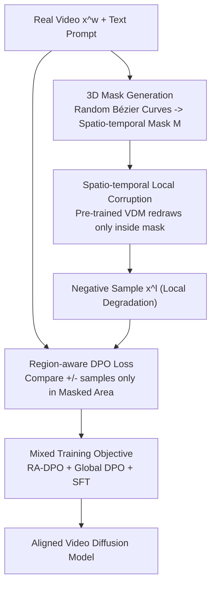

# LocalDPO: Direct Localized Detail Preference Optimization for Video Diffusion Models

**Conference**: CVPR 2026  
**arXiv**: [2601.04068](https://arxiv.org/abs/2601.04068)  
**Code**: Yes  
**Area**: Video Generation  
**Keywords**: Video Diffusion Models, DPO Preference Optimization, Local Corruption, Region-Aware Loss, Spatio-Temporal Mask

## TL;DR
LocalDPO is proposed, which generates negative samples by locally corrupting real high-quality videos using random spatio-temporal Bézier masks (single inference, no external ranking). Combined with a region-aware DPO loss for preference alignment at the local detail level, it consistently surpasses traditional DPO and SFT in video quality on Wan2.1 and CogVideoX.

## Background & Motivation

**Background**: Text-to-Video diffusion models (VDMs) can generate high-quality videos but often exhibit flickering, motion inconsistency, and local artifacts. DPO has been introduced as a post-training preference alignment strategy.

**Limitations of Prior Work**:
   - **(1) High Cost and Inefficiency**: Requires multiple video generations per prompt plus human or critic model ranking—leading to high inference and annotation costs.
   - **(2) Ambiguous Global Scoring**: Videos with high overall scores may be poor in local dimensions (e.g., overall smooth but flickering in one region), leading to blurred or contradictory supervision signals.
   - **(3) Neglect of Region-level Preferences**: Scoring is performed at the global video level, ignoring local artifacts and detail richness crucial to human perception.

**Key Challenge**: DPO requires high-quality positive and negative sample pairs, but current global-level construction fails to capture localized quality differences, preventing the model from learning to correct fine defects.

**Key Insight**: Use real videos as positive samples (naturally higher quality than model generation) and their locally corrupted versions as negative samples (single inference, guaranteed lower quality than positives, and confined to specific regions).

**Core Idea**: (1) Generate spatio-temporal masks using random Bézier curves to select corruption regions; (2) Use the pre-trained VDM itself to redraw the masked regions (generating negative samples); (3) Apply a region-aware DPO loss to calculate preference differences only within the masked areas.

## Method

### Overall Architecture
The core problem LocalDPO solves is that traditional video DPO scores at the "entire video" level, which is expensive and misses local defects. The breakthrough is fixing the positive sample as a real high-quality video $\mathbf{x}^w$, letting the model "draw poorly" in a specific local region to obtain a negative sample $\mathbf{x}^l$, and finally calculating preference loss only on the corrupted area. The pipeline is: given a real video and a text prompt, an irregular spatio-temporal mask $\mathbf{M}$ is created via random Bézier curves; the pre-trained VDM redraws only inside the mask while keeping the outside unchanged, resulting in a negative sample with "only local degradation"; during training, a region-aware DPO loss compares samples only within the mask, regularized by global DPO and SFT. This process requires only one inference per video without external ranking models.

### Key Designs

**1. 3D Mask Generation: Enclosing Local Corruption with Irregular Shapes**

The key for negative samples is "local and natural degradation." LocalDPO avoids regular rectangular boxes, instead sampling $P$ cubic Bézier curves in the first frame to form a closed contour, then applying random rotation and translation. This 2D contour is broadcast along the time axis into a 3D mask $\mathbf{M}$ and downsampled to latent resolution. Bézier curves are chosen because real-world artifacts (flickering objects, blurred textures) have irregular boundaries; these contours are more effective than rectangles, as confirmed in ablation studies.

**2. Spatio-temporal Local Corruption: Self-generated "Poor" Regions**

To corrupt the region into a credible negative sample, the pre-trained VDM redraws inside the mask. The original video latent $\mathbf{z}_0^{orig}$ is noised to timestep $k = \lceil T \times \alpha \rceil$ ($\alpha$ controls corruption intensity), followed by iterative denoising and latent fusion at each step:

$$\mathbf{z}_{t-1} = \mathbf{M} \odot \hat{\mathbf{z}}_{t-1} + (1-\mathbf{M}) \odot \mathbf{z}_{t-1}^{orig}$$

The denoised result is used inside the mask (lower quality than real video), while the original content is precisely restored outside. Crucially, the outside region is re-noised at each step to maintain consistent noise levels, avoiding distribution mismatch. This ensures defects happen at the boundaries of the model's current capabilities, providing highly relevant training signals that evolve as the model improves.

**3. Region-Aware DPO Loss: Localized Preference Comparison**

Since positive and negative samples differ only inside the mask, the loss is restricted to this area to prevent gradient dilution. The RA-DPO loss is defined as:

$$\mathcal{L}_{RA\text{-}DPO} = -\mathbb{E}\left[\log\sigma\left(-\beta \cdot (1+\eta(\alpha)) \cdot \mathbb{E}_t[\Delta'_w - \Delta'_l]\right)\right]$$

The preference terms are cropped by the mask and normalized by its area:

$$\Delta'_* = \frac{N_M}{\|\mathbf{M}\|_1}\left(\|\mathbf{M} \odot (\mathbf{y}^* - f_\theta)\|^2 - \|\mathbf{M} \odot (\mathbf{y}^* - f_{\tilde{\theta}})\|^2\right)$$

The coefficient $\eta(\alpha) = \frac{\alpha - \alpha_l}{\alpha_h - \alpha_l}$ dynamically adjusts the penalty based on corruption intensity $\alpha$: stronger corruption leads to a higher penalty.

**4. Mixed Training Objective: Ensuring Global Quality**

Focusing only on local details risks overfitting localized patterns and damaging global structure. The final objective weights three terms:

$$\mathcal{L}_{total} = \lambda_{RA\text{-}DPO}\mathcal{L}_{RA\text{-}DPO} + \lambda_{DPO}\mathcal{L}_{DPO} + \lambda_{SFT}\mathcal{L}_{SFT}$$

RA-DPO fixes local details, while Global DPO and SFT serve as regularizers to preserve global generation capability and consistency.

### Training Strategy
63K high-quality Pexels videos are used as positives, with captions from Qwen2.5-VL. Each video yields a negative sample via a single inference pass, requiring no critic models. GPU overhead is approximately 1/4 of traditional DPO.

## Key Experimental Results

### Main Results (VBench Evaluation)

| Method | Aesthetic Quality | Imaging Quality | HPS-v2 | PickScore | VQ | TA |
|------|:---:|:---:|:---:|:---:|:---:|:---:|
| CogVideoX-2B (Base) | Baseline | Baseline | Baseline | Baseline | Baseline | Baseline |
| + SFT | + Slight | + Slight | + Slight | + Slight | + Improvement | + Improvement |
| + Vanilla DPO | + Improvement | + Improvement | + Improvement | + Improvement | + Improvement | + Improvement |
| **+ LocalDPO** | **Best** | **Best** | **Best** | **Best** | **Best** | **Best** |

Similar consistent gains were achieved on Wan2.1 across all post-training methods.

### Preference Pair Construction Efficiency (Fig 1c)

| Method | GPU Time/Pair | External Evaluation Req. |
|------|-----------|-------------|
| Vanilla DPO | ~4x | Needs critic/human |
| **LocalDPO** | **~1x** | **None** |

### Ablation Study

| Configuration | Aesthetic Score | Imaging Quality | Note |
|------|-------|---------|------|
| Global DPO only | Baseline | Baseline | Traditional method |
| RA-DPO only | + but unstable | + but unstable | Lacks regularization |
| RA-DPO + Global DPO | + Better | + Better | Complementary |
| **RA-DPO + DPO + SFT** | **Best** | **Best** | Most stable |
| Rect vs Bézier Mask | Bézier Better | Bézier Better | Natural boundaries are effective |

### Key Findings
- Qualitative analysis shows LocalDPO significantly enriches **localized details**—textures, facial expressions, and edges of moving objects are clearer.
- The quality gap is unambiguous (Real > Corrupted), eliminating ranking ambiguity found in traditional DPO.
- $\alpha$ selection is critical: too high leads to pure noise; too low leads to imperceptible differences.
- SFT regularization is vital for maintaining global consistency.

## Highlights & Insights
- **Innovative Self-generated Negatives**: Leveraging the model's redirection of its own "local weakness" as a negative signal aligns sample quality with the model's current stage, creating a natural curriculum.
- **Granular Breakthrough**: Shifting from global to region-level preference alignment matches human perception (which notices specific flickering rather than overall degradation).
- **Engineering Ingenuity**: Bézier masks simulate natural artifact shapes better than rectangles.
- **Efficiency Gains**: Single inference without external ranking reduces GPU costs to 1/4 of vanilla DPO, making preference alignment feasible in resource-constrained settings.

## Limitations & Future Work
- Mask placement is currently random; "intelligent selection" of weak areas could be more valuable.
- Latent space corruption might not perfectly map to pixel-level perceptual degradation due to VAE errors.
- Currently verified on T2V; applicability to I2V and V2V protocols remains to be explored.
- The three $\lambda$ weights in the loss require empirical tuning.

## Related Work & Insights
- **vs Vanilla Video DPO**: High cost and blurred signals vs LocalDPO's low cost and precision.
- **vs Diffusion DPO (Image)**: Image DPO also suffers from global scoring; the region-aware concept is transferable.
- **vs SFT**: SFT lacks relative quality learning; DPO provides explicit preference directions.
- **vs InstructPix2Pix**: Editing methods change semantics; LocalDPO optimizes generation quality.

## Rating
- Novelty: ⭐⭐⭐⭐⭐ Elegant localized corruption and region-aware loss.
- Experimental Thoroughness: ⭐⭐⭐⭐ Validated on Wan2.1 and CogVideoX with extensive ablations.
- Writing Quality: ⭐⭐⭐⭐⭐ Strong motivation analysis and intuitive pipeline.
- Value: ⭐⭐⭐⭐⭐ Efficient and effective preference alignment for video.

<!-- RELATED:START -->

## Related Papers

- [\[CVPR 2026\] DynamicsBoost: Dynamic Plausible Video Generation via Annotation-Free Continuation Preference Optimization](dynamicsboost_dynamic_plausible_video_generation_via_annotation-free_continuatio.md)
- [\[NeurIPS 2025\] DenseDPO: Fine-Grained Temporal Preference Optimization for Video Diffusion Models](../../NeurIPS2025/video_generation/densedpo_finegrained_temporal_preference_optimization_for_vi.md)
- [\[CVPR 2026\] Goal-Driven Reward by Video Diffusion Models for Reinforcement Learning](goal-driven_reward_by_video_diffusion_models_for_reinforcement_learning.md)
- [\[CVPR 2026\] Diff4Splat: Repurposing Video Diffusion Models for Dynamic Scene Generation](diff4splat_controllable_4d_scene_generation_with_latent_dynamic_reconstruction_m.md)
- [\[CVPR 2026\] MotionEnhancer: Leveraging Video Diffusion for Motion-Enhanced Vision-Language Models](motionenhancer_leveraging_video_diffusion_for_motion-enhanced_vision-language_mo.md)

<!-- RELATED:END -->
