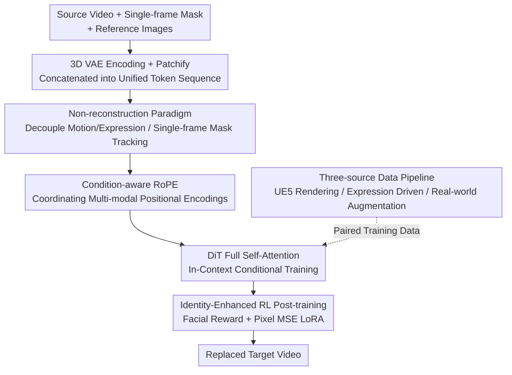

# MoCha: End-to-End Video Character Replacement without Structural Guidance

**Conference**: CVPR 2026  
**Paper**: [CVF Open Access](https://openaccess.thecvf.com/content/CVPR2026/html/Xu_MoCha_End-to-End_Video_Character_Replacement_without_Structural_Guidance_CVPR_2026_paper.html)  
**Area**: Video Generation / Video Editing  
**Keywords**: Video Character Replacement, Video Diffusion Models, in-context conditional training, condition-aware RoPE, RL post-training

## TL;DR
MoCha shifts video character replacement from the "frame-by-frame mask + skeleton/depth-guided reconstruction paradigm" to an end-to-end non-reconstruction paradigm. By providing only a single arbitrary frame mask and no structural guidance, the model leverages the inherent tracking capabilities of video diffusion models to transfer the source character's motion and expressions to a reference identity. Utilizing condition-aware RoPE for multi-modal condition fusion and RL post-training for enhanced facial consistency, it outperforms VACE, HunyuanCustom, and Wan-Animate across both synthetic and real-world benchmarks.

## Background & Motivation
**Background**: Video character replacement (replacing a person in a video with a user-specified new identity while preserving the original background, scene dynamics, and character motion) holds significant commercial value in film post-production, personalized advertising, virtual try-ons, and digital humans. The current dominant approach is the **reconstruction-based paradigm**: it involves **frame-by-frame segmentation masks** to label and erase the original ID, followed by extracting explicit structural guidance such as **skeletons or depth maps**. These are fed into a diffusion model along with a reference image to "reconstruct" the video. Representative works include HunyuanCustom, VACE, and Wan-Animate.

**Limitations of Prior Work**: This paradigm performs adequately in simple scenarios but often fails in complex ones. Under conditions such as occlusions, rare poses (e.g., acrobatics), or physical contact between characters, frame-by-frame masks and structural information are prone to extraction errors. These errors are then **propagated and amplified frame-by-frame** during generation, resulting in visual artifacts, discontinuous motion, and temporal flickering. Furthermore, the reconstruction paradigm relies heavily on information being erased from the original video, preventing the model from **learning precise lighting and shadows**, as much of the original illumination information is lost. Additionally, dense frame-by-frame guidance incurs high computational costs.

**Key Challenge**: The reconstruction paradigm relies on dense explicit guidance to "control character motion," yet this guidance is both fragile (errors propagate) and lossy (shading information is lost). The denser the guidance, the more it is limited by the quality ceiling of that guidance.

**Goal**: Is it possible to achieve character replacement without frame-by-frame masks or any structural guidance, using only **a single arbitrary frame mask** while preserving motion, expression, background dynamics, and lighting?

**Key Insight**: The authors note that recent research indicates video diffusion models inherently possess **temporal awareness and implicit reasoning capabilities**, particularly **video tracking**. If given a target position in one frame, the model can track that subject across the entire video. Since the model has built-in tracking capabilities, frame-by-frame masks are redundant.

**Core Idea**: Decouple the character's "motion + expression" from the "background scene." Through in-context conditional training, the model is tasked with transferring these dynamics to a new reference identity. The model's internal tracking capability replaces frame-by-frame masks, requiring only a single-frame mask and zero structural guidance.

## Method

### Overall Architecture
MoCha is based on a pre-trained text-to-video latent diffusion model (Wan-2.1-T2V-14B) and trained using the Rectified Flow framework. Inputs consist of a source video $V_s$, a mask $M$ for a specified frame, and a set of reference character images $\{I_i\}$. Output is the target video $V_t$, where the character is replaced by the reference identity while retaining the original motion, background, and lighting. The pipeline comprises two training stages: **(a) In-Context Conditional Training**, where all conditional tokens are concatenated along the frame dimension into a unified sequence for the DiT, using condition-aware RoPE to coordinate positional encodings; and **(b) Identity-Enhanced RL Post-training**, using a differentiable facial reward and pixel-wise MSE LoRA post-training to specifically boost facial identity consistency. A three-source data construction pipeline is utilized to address the lack of paired training data.

### Key Designs

**1. Non-reconstruction Paradigm: Leveraging Diffusion Tracking to Eliminate Dense Guidance**

This design directly addresses the fragility and lossiness of dense guidance in reconstruction paradigms. While those rely on frame-by-frame masks and skeletons/depth, MoCha requires only **a single arbitrary frame mask and zero structural guidance**. This is supported by the observation that video diffusion models, during temporal modeling, spontaneously form cross-frame attention correspondences between mask latents and source video latents—essentially "tracking" the masked character. Attention visualization confirms this: given a single-frame mask, the corresponding character region maintains high attention scores across different frames. The task is thus reformulated as decoupling the source motion and expression and transferring them to a new identity, a process learned implicitly through in-context training of video content, frame masks, and reference identities. This avoids the amplification of extraction errors and preserves original lighting information.

**2. In-Context Conditional Training + Condition-aware RoPE: Harmonizing Multi-modal Conditions**

MoCha encodes the target, source, mask, and references using a 3D VAE for spatio-temporal compression, patchifies them into visual tokens, and concatenates them along the frame dimension into a unified sequence $x = [x_t, x_s, x_m, x_{I_1}, x_{I_2}, ...]$. The sequence length is $b\times(2f+1+j)\times c\times h\times w$ ($j$ is the number of reference images), processed jointly via **full self-attention** in the DiT. This in-context approach avoids structural changes to the DiT. To prevent the model from being "locked" into a fixed output length due to naive temporal indexing, the authors propose **condition-aware RoPE**. For 3D RoPE, source tokens $x_s$ and target tokens $x_t$ are assigned **identical frame indices** from $0$ to $f-1$ due to their frame-to-frame correspondence. Reference tokens are assigned a fixed index of $-1$, with different images distinguished by height/width offsets. The mask token index is **variable**, calculated based on the specified frame $F$:

$$f_M = (F - 1)\,//\,4 + 1$$

This variable $f_M$ enables MoCha to support **mask selection from any frame**, while the design also unlocks variable generation lengths and flexible multi-reference inputs.

**3. Identity-Enhanced RL Post-training: Face Reward + Anti-cheating MSE**

After in-context training, inconsistencies between the generated face and reference identity often persist. Borrowing from RL alignment in diffusion models, a post-training phase focuses on facial consistency. The core is a **facial reward** $R_{face}$: Arcface is used to extract facial embeddings from the generated video and reference image, calculating their cosine similarity. To prevent "reward hacking"—where the model might simply "paste" the reference image onto the video—a **pixel-wise MSE** between the generated and GT video provides dense supervision. The total loss is:

$$L_{RL} = (1 - R_{face}) + \|V_t - \hat{V}_t\|^2$$

Since fine-grained details are synthesized during **later sampling timesteps**, gradients are only backpropagated through the last $K$ sampling steps to save memory and speed up training. LoRA (rank 64 on all DiT linear layers) is used instead of full fine-tuning to avoid degrading the base model's capabilities.

**4. Three-source Paired Data Pipeline: Creating "Same Motion, Different Identity" Pairs**

Training MoCha requires strictly aligned paired videos—identical motion, expression, and background, but with the character replaced. Such data is scarce, so the authors aggregate three sources: (I) **UE5 Rendered Data**: Using Unreal Engine 5 to combine 3D scenes/characters/actions/expressions for batch rendering. For each video, characters are swapped while all other parameters are locked. (II) **Expression-driven Facial Animation**: Using Flux inpainting to change foreground characters in movie frames, then using LivePortrait to drive both original and swapped images with the **same facial drive video**. To prevent copy-pasting, reference images are pose-augmented via Flux Kontext to **force the model to decouple identity from spatial position**. (III) **Real Video-Mask Augmentation**: Utilizing VIVID-10M and VPData, filtering non-human videos with YOLOv12. This compensates for the lack of realism in synthetic data. A total of 100K samples were collected.

### Loss & Training
Base model: Wan-2.1-T2V-14B. The in-context phase fine-tunes all self-attention layers on 8×H20 GPUs for 30K steps (lr=2e-5, batch=8). Post-training uses rank 64 LoRA for 500 steps. Training includes a 50% stochastic reference-dropout with a face-centric reference image to build robustness against sparse cues. A curriculum from short (21 frames) to long (81 frames) snippets is employed. Resolution is fixed at 480×832.

## Key Experimental Results

### Main Results
Synthetic benchmark (UE5-built, perfectly paired, unseen scenes/characters):

| Method | SSIM↑ | LPIPS↓ | PSNR↑ |
|------|-------|--------|-------|
| VACE | 0.572 | 0.253 | 17.10 |
| HunyuanCustom | 0.644 | 0.257 | 17.70 |
| Wan-Animate | 0.692 | 0.213 | 19.20 |
| **MoCha** | **0.746** | **0.152** | **23.09** |

Real-world benchmark (100 videos with multi-person interaction, fast motion, complex lighting; masks via SAM2):

| Method | Subject Consistency↑ | Background Consistency↑ | Aesthetic Quality↑ | Imaging Quality↑ | Temporal Flickering↑ | Motion Smoothness↑ |
|------|------------|------------|----------|----------|----------|----------|
| VACE | 71.19 | 77.89 | 56.76 | 60.88 | 97.04 | 97.87 |
| HunyuanCustom | 90.03 | 93.68 | 56.77 | 58.92 | 97.98 | 98.62 |
| Wan-Animate | 91.25 | 93.42 | 54.60 | 58.48 | 97.27 | 98.25 |
| **MoCha** | **92.25** | **94.40** | **60.24** | 59.58 | **97.98** | **98.79** |

MoCha leads across all synthetic benchmark metrics (PSNR nearly 4 dB higher than Wan-Animate). In the real-world benchmark, it ranks first in five out of six dimensions.

### Ablation Study
Qualitative observations:

| Configuration | Key Findings |
|------|---------|
| Full model | Best realism and facial fidelity. |
| w/o Real human data | Appearance of over-smoothed/oily synthetic artifacts; facial fit degrades. |
| w/o RL post-training | Facial identity consistency significantly worsens. |

### Key Findings
- **Real human data is crucial for de-synthesizing**: While UE5 data provides strict alignment, relying solely on it leads to "plastic" textures. Expression-driven and real augmented data enhance facial expressions and overall realism.
- **RL post-training fixes facial inconsistency**: In-context training alone leaves an ID gap; the reward LoRA significantly improves identity retention without hurting generation quality.
- **Tracking capability is verifiable**: Attention visualizations demonstrate that the character region maintains high attention cross-frames, proving that single-frame masks are sufficient.
- **Zero-shot spillover**: Although designed for characters, MoCha can replace non-human subjects and assist in tasks like face-swapping or virtual try-ons when paired with editing models.

## Highlights & Insights
- **Redefining "frame-by-frame masks" as redundant**: The core insight that video diffusion contains inherent tracking allows MoCha to treat dense masks as professional "crutches" that can be discarded.
- **Condition-aware RoPE elegance**: The $f_M$ formula enables arbitrary frame mask selection and handles heterogeneous positional relationships between source, target, and multiple references in a mathematically clean way.
- **Pragmatic anti-cheating RL**: Recognizing that facial rewards encourage "pasting," the inclusion of pixel-wise MSE and limited backpropagation to late timesteps pragmatically balances memory and diffusion priors.
- **Transferable data decoupling trick**: Pose-augmenting reference images to force identity-position decoupling is a valuable strategy for any task where reference images are derived from video frames.

## Limitations & Future Work
- **Heavy reliance on synthetic data**: 70% of the 100K samples are UE5 renders. The gap between synthetic and real domains is bridged by only 30K real samples, potentially limiting generalization in extreme real-world lighting or occlusions.
- **Qualitative Ablation**: Some ablations lack quantitative tables, making it difficult to measure the exact numerical contribution of each component.
- **Tracking boundary cases**: The robustness of inherent tracking in scenarios with very similar characters or prolonged, total occlusions has not been systematically analyzed.
- **Face-centric post-training**: The RL stage focuses only on facial consistency; body and clothing consistency are not explicitly reinforced beyond the in-context stage.

## Related Work & Insights
- **vs. Reconstruction Paradigms**: Unlike HunyuanCustom or VACE which rely on dense explicit guidance (brittle and lossy), MoCha uses a non-reconstruction approach. This preserves original lighting but requires carefully constructed paired data.
- **vs. Kling**: While Kling supports online replacement and identity preservation, it struggles to maintain original motion and integrate naturally. MoCha shows stronger consistency in both identity and motion.
- **vs. In-context Training**: Following works like Recammaster, MoCha adapts the paradigm for character replacement specifically via the condition-aware RoPE design.

## Rating
- Novelty: ⭐⭐⭐⭐⭐ Shifting from reconstruction to non-reconstruction and leveraging inherent tracking is a significant perspective shift.
- Experimental Thoroughness: ⭐⭐⭐⭐ Strong benchmark performance, although quantitative ablations are somewhat sparse.
- Writing Quality: ⭐⭐⭐⭐ Clear logic across motivation, method, and data sections.
- Value: ⭐⭐⭐⭐⭐ High potential for film, advertising, and virtual subjects; the commitment to open-sourcing the dataset enhances its impact.

<!-- RELATED:START -->

## Related Papers

- [\[CVPR 2026\] STARFlow-V: End-to-End Video Generative Modeling with Autoregressive Normalizing Flows](starflow-v_end-to-end_video_generative_modeling_with_autoregressive_normalizing_.md)
- [\[CVPR 2026\] AutoCut: End-to-end Advertisement Video Editing Based on Multimodal Discretization and Controllable Generation](autocut_end-to-end_advertisement_video_editing_based_on_multimodal_discretizatio.md)
- [\[CVPR 2026\] Gloria: Consistent Character Video Generation via Content Anchors](gloria_consistent_character_video_generation_via_content_anchors.md)
- [\[CVPR 2026\] FlowPortal: Residual-Corrected Flow for Training-Free Video Relighting and Background Replacement](flowportal_residual-corrected_flow_for_training-free_video_relighting_and_backgr.md)
- [\[CVPR 2026\] One-to-All Animation: Alignment-Free Character Animation and Image Pose Transfer](one-to-all_animation_alignment-free_character_animation_and_image_pose_transfer.md)

<!-- RELATED:END -->
