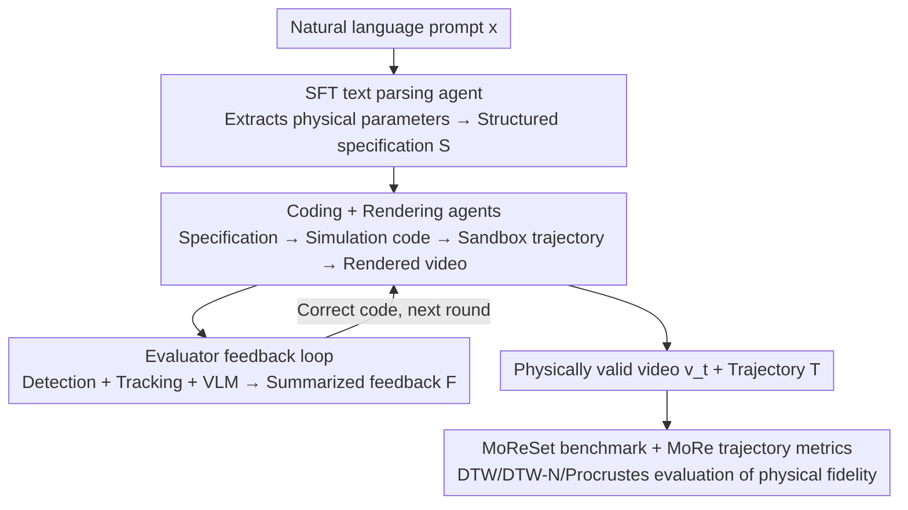

# MoReGen: Multi-Agent Motion-Reasoning Engine for Code-based Text-to-Video Synthesis

**Conference**: CVPR 2026  
**Paper**: [CVF Open Access](https://openaccess.thecvf.com/content/CVPR2026/html/Bai_MoReGen_Multi-Agent_Motion-Reasoning_Engine_for_Code-based_Text-to-Video_Synthesis_CVPR_2026_paper.html)  
**Code**: None (The paper claims the code/dataset is available on the GitHub homepage, but no specific address is provided ⚠️ Subject to the original text)  
**Area**: Video Generation  
**Keywords**: Text-to-Video, Physical Consistency, Multi-Agent, Code Generation, Trajectory Evaluation

## TL;DR
Instead of diffusion denoising, MoReGen utilizes multiple LLM agents to convert natural language into executable physical simulation code—a text parsing agent extracts physical parameters, a coding agent generates simulation scripts, a rendering agent plots trajectories into videos, and an evaluator provides loopback corrections to generate videos that strictly adhere to Newtonian mechanics. Additionally, the MoReSet benchmark with 1,275 annotated trajectories and the MoRe metric based on trajectory alignment are proposed, demonstrating that existing SOTA text-to-video models collectively fail in physical accuracy.

## Background & Motivation
**Background**: The text-to-video (T2V) field has developed rapidly in visual quality. The mainstream method is "inflating" the 2D transformer of image diffusion backbones into 3D (DiT architecture), scaling up data and compute to achieve photorealistic visual fidelity, as seen in Sora 2, Veo3, and Grok Imagine.

**Limitations of Prior Work**: These models are "visually appealing but lack logic." Figure 1 of the paper shows common failures of Sora 2, Veo3, and Grok—wrong ball counts, violation of momentum conservation, incorrect Newtonian forces, and reversed velocity/pressure. While they can replicate visual patterns seen in the training set, they struggle to infer the physical laws governing motion, deviating significantly from reality when encountering out-of-distribution (OOD) physical prompts.

**Key Challenge**: Pure data-driven transformers naturally prefer "memorizing statistical correlations" over "causal reasoning," and their optimization objectives reward "reproducing observed appearances" rather than "inferring what should happen." Worse, evaluation metrics also fail: FVD/FID/PSNR only measure pixel distribution similarity, completely ignoring physical laws. Human scoring is too subjective and lacks precise physical quantification.

**Goal**: This is split into two sub-problems: (1) how to generate Newtonian motion videos that are truly physically accurate; (2) how to quantitatively evaluate the "physical validity" of a video rather than just judging its visual appeal.

**Key Insight**: The authors' key observation is that physical laws are deterministic and can be accurately solved by simulators. Rather than making neural networks "guess" physics, it is better to have LLMs translate language into **executable simulation code** and let physical engines (Pymunk/Blender/Manim) handle the calculations. In this way, videos are no longer products of probabilistic sampling, but reproducible, trackable simulation playbacks.

**Core Idea**: Replacing pixel-domain "diffusion denoising" with a code-domain pipeline containing a "multi-agent LLM + physical simulator + renderer", and using trajectory alignment (rather than pixel similarity) as a direct measure of physical validity.

## Method

### Overall Architecture
MoReGen redefines "text-to-video" as "text-to-executable simulation code then render". Given a natural language prompt $x$ (e.g., "a ball is thrown at 10 m/s at 45°"), the system consists of three collaborative LLM agents and one evaluator: **text parsing agent $A_\text{text}$** parses free text into structured Newtonian specifications $S$ (including objects, parameters, and initial conditions); **coding agent $A_\text{coder}$** translates $S$ into executable physical simulation code $C_t$, producing scene configuration $C$ and frame-by-frame trajectory $T$ in a sandbox; **rendering agent $A_\text{render}$** consumes trajectories to generate rendering scripts, producing video $v_t$ and telemetry data; **evaluator $E$** analyzes the video using object detection + point tracking + VLM, summarizing trajectory alignment, physical plausibility, and intent alignment as feedback $F$ returned to $A_\text{coder}$ for the next iteration of correction. All three agents are LLMs (Qwen in this paper), and only $A_\text{text}$ requires a small amount of supervised fine-tuning.

### Key Designs

**1. Supervised Fine-Tuned Text Parsing Agent: Completing Fragmented Colloquial Descriptions into Structured Physical Specifications**

The limitation is specific: natural language descriptions often **omit parameters** (saying "a ball is thrown" without providing angles, initial velocities, or mass), and different physical phenomena depend on completely different control variables (inclined planes rely on tilt angles, projectiles rely on initial velocity). Un-tuned general LLMs would just guess, outputting incomplete or contradictory specifications. To address this, the authors first design a **structured schema** for nine Newtonian phenomena, stipulating legal parameter ranges, units, required physical entities (objects/anchors/constraints), geometric and mechanical consistency requirements, and physically self-consistent initial conditions. Task-specific prompts are used to generate structured specifications, which are manually verified to construct 1200 pairs of (text, specification) as SFT data. Fine-tuning is performed on Qwen2.5-Coder-14B using the next-token supervised loss:

$$\mathcal{L}_\text{SFT} = -\mathbb{E}_{(x,S)\sim D}\Big[\sum_{t=1}^{|S|} \log p_\theta(S_t \mid x, S_{<t})\Big]$$

The key benefit of fine-tuning is that the agent **internalizes** the "language → physical parameter" mapping: it no longer relies on phenomenon-specific prompt templates, enabling a single general instruction to output complete specifications across all phenomena. It also learns to translate linguistic cues like "the first two balls" or "push from the right" into object indices and force directions, and **infers reasonable default values instead of hallucinating details** when parameters are missing. This step is the source of physical accuracy for the entire pipeline—downstream coding and rendering both rely on this specification as the authoritative input.

**2. Coding + Rendering Dual Agents: Converting Specifications into Simulation Code and Videos Using a Unified Prompt while Decoupling Trajectory and Rendering**

Once the structured specification is obtained, $A_\text{coder}$ operates based on a **unified prompt** that provides a general Python class framework (consisting of spatial initialization, object creation, constraint setup, and simulation loop). The agent reads the specification field-by-field, fills in numerical parameters, selects the appropriate open-source physics engine API (Pymunk/Blender/Manim) to instantiate rigid bodies, shapes, and constraints, and records the position, velocity, and orientation at each simulation step $\Delta t$, forming a complete temporal trajectory for each object. The essential difference here is that motion is calculated by a real physics engine according to mechanical laws, rather than statistical approximations from a neural network.

On the rendering side, $A_\text{render}$ also utilizes a single general prompt, executing the code $C_t$ in a sandbox to produce two synchronous outputs—step-by-step telemetry data (position/velocity/orientation) and rendered video $v_t$ (seamlessly integrated with Pymunk using pygame, reconstructing geometry to replay states in real-time). The authors emphasize that this design of **decoupling trajectory generation from video rendering** is crucial: since visualization is fundamentally just "reconstructing geometry + replaying state trajectories", the same rendering logic naturally generalizes to all physical phenomena. Moreover, decoupling allows easy replacement with more realistic 3D rendering engines like Unreal, Blender, or Unity without affecting the preceding physical simulation.

**3. Multi-Round Evaluator Feedback Loop: Transforming 'Physical Correctness' into Feed-forward Correction Signals Using Trajectory Tracking + VLM**

Generating once is not stable enough; a 14B model might initially fail to even generate runnable code. The evaluator's role is to quantify "whether the video is physically correct" into feedback digestible by $A_\text{coder}$. Specifically, three parallel tracks are evaluated: **GroundedDINO** (guided by object descriptors extracted by $A_\text{text}$) detects object positions in the video, and **CoTracker3** estimates the normalized trajectory $T_\text{est}$ to let the LLM compare its similarity/deviation with the ground-truth simulation trajectory $T$; concurrently, **Qwen2.5-VL** evaluates the video from two perspectives—plausibility based on physical rules and alignment with the original prompt's intent. Finally, the LLM summarizes these three outputs into feedback $F$:

$$F = \text{LLM}\big(\text{“Summarize”},\ \langle \text{LLM}(\text{“Traj”}, T_\text{est}, T),\ \text{VLM}(\text{“Phys”}, v_t),\ \text{VLM}(\text{“Intent”}, v_t, x)\rangle\big)$$

$F$ is fed back to the coding agent to guide the next round of code and video refinement (including debugging when grammatical errors occur). Ablation studies show that this feedback loop revives an otherwise unusable 14B model and brings stable cross-metric improvements even for GPT-5.

**4. MoReSet Benchmark + MoRe Trajectory Metric: Directly Quantifying Physical Validity via Trajectory Alignment instead of Pixel Similarity**

The authors argue that pixel or latent space similarity metrics (like FID, FVD, PSNR, LPIPS) fail to evaluate "physical correctness," so they rebuild evaluation based on **object motion trajectories**. MoReSet contains 1,275 videos covering nine categories of Newtonian phenomena: gravity, acceleration, collision, oscillation, momentum, buoyancy, inertia, pendulum, and pulley. The training set consists of 1,200 Blender simulations, each set paired with a free-text description and a complete structured JSON specification. The test set comprises 75 real laboratory videos with human annotations for scene descriptions, object identities, and dense pixel-level trajectories (automatically extracted by CoTracker3 and manually corrected). Inspired by point tracking models, the accompanying **MoRe metric** is a trajectory fidelity suite: (1) **DTW** (Dynamic Time Warping) aligns estimated trajectories with the ground truth in non-linear space across different durations; (2) **DTW-N** first centers the trajectories and then scales them to unit arc length, normalizing the effects of different scales/durations; (3) **Procrustes analysis score** measures the geometric alignment between the estimated and ground-truth trajectories. All three are "lower is better" metrics, directly measuring the trajectory fidelity of key moving objects, thus avoiding the vulnerability of pixel-level metrics to OOD data.

## Key Experimental Results

### Main Results
We evaluate three categories of T2V models on the MoReSet test set using MoRe metrics: medium-sized open-source (Wan2.2, LTX, CogVideoX), large-scale commercial (Veo3, Sora2, Grok), and physics-enhanced (NewtonGen, WISA). All models use the same prompt, with videos downsampled to 480p / 10fps.

| Model | DTW ↓ | DTW-N ↓ | Procrustes ↓ |
|------|-------|---------|--------------|
| Wan2.2-TI2V-5B | 17.18 | 0.10 | 0.65|
| LTXV-2B-Distilled | 16.99 | 0.11 | 0.71 |
| CogVideoX-5B | 12.94 | 0.09 | 0.62 |
| Veo3 | 13.35 | 0.07 | 0.57 |
| Grok | 13.00 | 0.08 | 0.55 |
| Sora2 | 11.21 | 0.08 | 0.55 |
| NewtonGen | 17.88 | 0.11 | 0.62 |
| WISA | 12.67 | 0.09 | 0.68 |
| **MoReGen (Ours)** | **8.93** | **0.06** | **0.48** |

MoReGen leads comprehensively across all three trajectory metrics, reducing DTW from the strongest commercial model, Sora2 (11.21), to 8.93. An interesting finding: commercial models dominate smaller open-source ones in visual aesthetics, but this advantage **does not translate to motion trajectory accuracy**—medium-sized open-source models like CogVideoX-5B and WISA can match Sora2 under the MoRe metrics. Baseline models also exhibit standard deviations (e.g., Wan2.2 DTW $\pm$ 15.88), indicating uneven physical distribution in their training data and varied performance across different physical domains; MoReGen behaves stably due to its rule-driven nature.

The authors also evaluated models using existing data-driven physical metrics from the community (AJ/OA from Trajan, SA/PC from VideoPhy2), concluding that **these metrics are unreliable under OOD conditions**: Trajan gives high scores to the low-fidelity LTX (AJ 0.79, even exceeding Veo3/Grok); VideoPhy2's SA correlates strongly with visual quality rather than physics, ranking visually appealing but physically incorrect models like Sora2/Grok first. Only PC (Physical Commonsense) reflects dynamics relatively well—MoReGen scores the highest PC (4.53), but it still incorrectly ranks CogVideoX above physically more accurate systems. This further demonstrates the necessity of the MoRe trajectory metrics.

### Ablation Study
The impact of Coder agent selection, SFT, and evaluator feedback is dissected on a dedicated evaluation set:

| Coder | SFT | Feedback | DTW ↓ | Procrustes ↓ | PC ↑ |
|-------|-----|----------|-------|--------------|------|
| Qwen2.5-Coder-14B | × | × | Almost completely failed (syntax errors, code unrunnable) | — | — |
| Qwen2.5-Coder-14B | × | ✓ | 18.01 | 0.70 | 4.49 |
| **Qwen2.5-Coder-14B** | **✓** | **×** | **8.93** | **0.48** | **4.53** |
| GPT-5 | × | × | 15.47 | 0.58 | 4.53 |
| GPT-5 | × | ✓ | 14.13 | 0.51 | 4.57 |

### Key Findings
- **SFT is the greatest contributor to physical accuracy**: The 14B model with SFT alone (no feedback) reaches DTW 8.93 (the main table results), beating its non-SFT counterpart and **outperforming un-tuned GPT-5** (15.47). This shows that translating language into precise physical specifications is more critical than scaling up the model size.
- **Evaluator feedback first 'rescues' and then 'improves'**: The vanilla 14B model fails to generate runnable code due to syntax errors; adding one round of feedback pulls it from "unusable" to "usable" with a DTW of 18.01. For GPT-5 (which is runnable out of the box), feedback yields stable gains across all metrics (DTW 15.47 $\rightarrow$ 14.13).
- **Data-driven metrics systematically clash with trajectory metrics**: Trajan/VideoPhy2 continuously penalize simulation-rendered videos (due to deviation from their training distribution), whereas PC scores code-driven methods higher than data-driven T2V across all trials—revealing inherent biases in those metrics.
- **Qualitative analysis** (Newton's cradle case study): Most data-driven models struggle even with the number of balls (given an instruction of five balls, LTX/Sora2/Veo3/NewtonGen/WISA all started with four, Wan2.2 popped up a sixth ball in between, and CogVideoX remained static), and mistakenly interpret momentum transfer as the addition/removal of objects. MoReGen delivers correct ball counts and physically valid motion, even capturing the slight oscillation of the middle balls observed in real-world scenarios.

## Highlights & Insights
- **"Leveraging LLMs to write simulation code and letting physical engines handle physics" is the smartest paradigm shift of this paper**: Physical laws are deterministic and solvable; forcing neural networks to fit them is counterproductive. By generating in the code domain, videos are naturally reproducible and trackable to exact trajectories—something diffusion pipelines cannot provide.
- **Trajectory alignment as a first-class citizen in evaluation**: Measuring object trajectories directly via DTW/Procrustes bypasses the critical flaw of pixel metrics ("looking good equals high score") and exposes the contrast where commercial large models "win in image quality but lose in physics." This evaluation perspective is a contribution in itself.
- **Engineering design of decoupling trajectories and rendering is highly practical**: Once the physical simulation is completed, the rendering layer can be hot-swapped (e.g., to Unreal/Blender) for photorealism. This "compute physics first, render later" concept is transferable to any physically controllable generation task (robotic simulation, educational animation, data synthesis).
- **An SFT small model outperforming GPT-5** serves as a reminder: for specialized, narrow tasks with clear schemas like "language $\rightarrow$ structured specification", task-specific fine-tuning is significantly more cost-effective than using giant general-purpose LLMs.

## Limitations & Future Work
- **Coverage is bounded by physical engines' representation capabilities**: The nine categories of Newtonian phenomena are all rigid-body/classical mechanics that can be modeled by 2D engines like Pymunk. Fluid, soft-body, complicated contact, and deformation are difficult to model using ready-made engine code. The ceilings of these methods are determined by the engine rather than the LLM.
- **Visual realism is a weakness**: Current rendering relies on pygame/Pymunk 2D playback, making the geometry and textures look very "simulated"—far from the photorealistic quality of commercial models. The authors acknowledge that future integration with 3D engines is required, but that part is not yet implemented.
- **Reliance on external detector/tracker/VLM evaluators**: If any link in GroundedDINO + CoTracker3 + Qwen-VL fails, it corrupts the feedback signal. This partly explains why metrics like SA are lower across all models. Furthermore, the feedback loop only validates the benefit of "one round," leaving the performance of multiple rounds (whether it continues to improve or oscillates) unexplored.
- **Code and data availability**: The paper claims these are available on GitHub, but no exact link is provided in the main text. The bar for replication depends on whether they genuinely open-source the simulation/rendering prompts and schemas.

## Related Work & Insights
- **vs. Diffusion/DiT-based T2V (Sora2, Veo3, Wan2.2, CogVideoX)**: These models perform probabilistic denoising in the pixel domain and scale visual quality using data and compute; physics is "memorized." MoReGen performs deterministic simulation in the code domain; physics is "computed." The cost is a loss of visual realism and open-world diversity compared to diffusion models, but physical accuracy and reproducibility are overwhelmingly superior.
- **vs. Physics-enhanced fine-tuned T2V (NewtonGen, WISA)**: These are still based on diffusion backbones (derived from Wan and CogVideo respectively), attempting to inject physical priors through fine-tuning. Experiments show that "patching data-driven models" has limited returns—NewtonGen matches Wan2.2, and WISA matches Sora2 in accuracy, indicating that the inductive bias of the backbone remains the bottleneck. MoReGen bypasses the diffusion paradigm completely.
- **vs. Physics evaluation benchmarks (VideoPhy, T2VPhysBench, PhyWorld)**: The former rely heavily on LLM/VLM descriptions and grading, which are prone to hallucination and bias, and often lack ground-truth trajectory annotations. MoReSet is the only benchmark providing real experimental videos, physical prompts, and dense trajectory annotations. The MoRe metric also steers evaluation from "common sense grading" back to quantitative "trajectory geometric alignment."

## Rating
- Novelty: ⭐⭐⭐⭐⭐ Reconceptualizing T2V from pixel denoising into code-domain generation ("LLM-generated simulation code + physical engine") coupled with trajectory evaluation is a paradigm-level innovation.
- Experimental Thoroughness: ⭐⭐⭐⭐ Solid evaluation comparing three categories of eight SOTA models with both data and trajectory metrics, plus three-factor ablations. However, physical phenomena are limited to rigid bodies, and visual quality quantitative analysis is missing.
- Writing Quality: ⭐⭐⭐⭐ Clear motivation and methodology flow; Algorithms and figures correspond well. Some minor presentation issues exist (such as missing GitHub links).
- Value: ⭐⭐⭐⭐⭐ Highly meaningful for "physically consistent video generation", providing both a viable path for physically controllable generation and a benchmark/metric capable of exposing the flaws in current evaluation metrics.

<!-- RELATED:START -->

## Related Papers

- [\[CVPR 2026\] VISTA: A Test-Time Self-Improving Video Generation Agent](vista_a_test-time_self-improving_video_generation_agent.md)
- [\[CVPR 2026\] Let Your Image Move with Your Motion! – Implicit Multi-Object Multi-Motion Transfer](let_your_image_move_with_your_motion_--_implicit_multi-object_multi-motion_trans.md)
- [\[CVPR 2026\] SVBench: Evaluation of Video Generation Models on Social Reasoning](svbench_evaluation_of_video_generation_models_on_social_reasoning.md)
- [\[ACL 2026\] TeachMaster: Generative Teaching via Code](../../ACL2026/video_generation/teachmaster_generative_teaching_via_code.md)
- [\[CVPR 2026\] Reasoning Diffusion for Unpaired Test Time Out-of-distribution Text-Image to Video Generation](reasoning_diffusion_for_unpaired_test_time_out-of-distribution_text-image_to_vid.md)

<!-- RELATED:END -->
