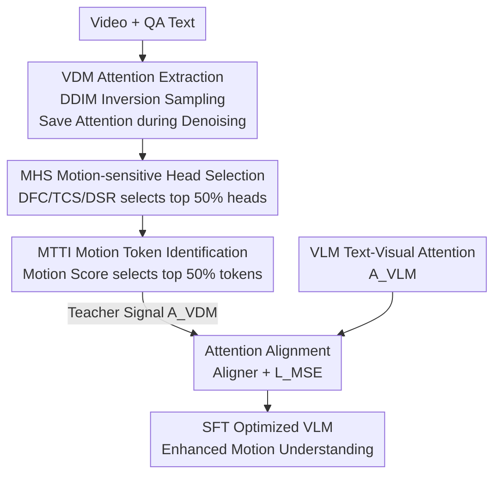

# MotionEnhancer: Leveraging Video Diffusion for Motion-Enhanced Vision-Language Models

**Conference**: CVPR 2026  
**arXiv**: [2606.06853](https://arxiv.org/abs/2606.06853)  
**Code**: https://motion-enhancer.github.io/ (Project Page)  
**Area**: Video Understanding / Multimodal VLM / Diffusion Models  
**Keywords**: Video Motion Understanding, Video Diffusion Models, Attention Alignment, Knowledge Distillation, Parameter-free Modules

## TL;DR
The authors distill the "motion priors" naturally encoded in Video Diffusion Models (VDMs) to serve as auxiliary supervision for aligning VLM text-visual attention. This significantly enhances the VLM's fine-grained motion understanding without adding trainable parameters or modifying the architecture.

## Background & Motivation

**Background**: The dominant framework for video understanding is VLM—extracted keyframes are encoded by an image encoder and fed into a multimodal LLM for alignment and reasoning (e.g., Qwen2.5-VL, InternVL3). These models demonstrate strong performance in event-level and story-level understanding (video captioning, QA).

**Limitations of Prior Work**: VLMs struggle to capture **fine-grained inter-frame motion**. They often fail to answer questions like "run then stop," "camera movement direction," or "repetition counts." Existing improvements rely on either extra modules (intra-group self-attention in TE Fusion) or external tools (object highlights and motion blur in MotionSight), which are often heavy or complex.

**Key Challenge**: The authors provide a theoretical explanation at the distribution level. VLMs trained with autoregressive objectives learn a **discriminative conditional distribution $p(t\mid V)$**—"given the frames, what is the probability of this token occurring." The model can satisfy this objective using static appearance cues (background, context) **without modeling temporal changes**. In contrast, motion understanding requires an **evidential distribution $p(V\mid t)$**—"given a semantic concept $t$ (e.g., a verb), where is its visual evidence in the video space-time and how does it evolve." The paper grounds motion evidence on inter-frame feature differences via $\mathbf{E}[\mathrm{Motion}(s,f)]\propto\|V_{f+1}(s)-V_{f}(s)\|$. The mismatch between these two distributions is the root cause of the "appearance bias and temporal insensitivity" in VLMs.

**Key Insight**: In VDM denoising, the model must ensure adjacent frames constitute valid motion, forcing it to learn physical laws of object movement, scene transitions, and inter-frame dependencies. Its text-visual cross-attention $A^{VDM}(t,s,f)\approx p_\phi(v_{s,f}\mid t,\mathbf{z}_k)$ closely approximates the evidential distribution $p(V\mid t)$ and is naturally "motion-calibrated"—regions with large temporal changes (hard to reconstruct) receive more modeling attention. Thus, VDM attention is an off-the-shelf source of motion priors.

**Core Idea**: Use VDM internal attention as a "teacher" to distill motion priors into the VLM through attention alignment. This is a cross-paradigm knowledge transfer—using internal signals from one model family (generative VDM) to guide another (discriminative VLM)—requiring only VDM attention maps and not its raw training data.

## Method

### Overall Architecture
MotionEnhancer takes a video + QA text pair as input and outputs a VLM with enhanced motion understanding. The pipeline consists of two stages: **offline**, attention maps are extracted from a frozen VDM (CogVideoX-1.5-5B) and filtered through two parameter-free modules to isolate motion-related attention (Teacher Signal $A_{\text{VDM}}$); **online**, during SFT, a lightweight aligner aligns the VLM attention at the same position $A_{\text{VLM}}$ to $A_{\text{VDM}}$, jointly optimized with the original autoregressive loss. Crucially, both the MHS and MTTI modules **introduce no trainable parameters**, relying on statistical calculations over existing attention. The teacher signals are extracted once (approx. 20-30s/sample on A100) and can be reused across different VLMs.

### Key Designs

**1. VDM Attention Extraction: "Reading" Motion Priors without Disrupting the Model**

To use VDM attention as a teacher, it must be extracted stably. The authors use a 5-step DDIM inversion to map the input video back to noise, followed by a 5-step denoising sampling for reconstruction. Since CogVideoX is trained with zero terminal SNR, direct inversion causes sampling shift; the authors use classifier-free guidance for reconstruction and introduce a parallel DDIM inversion path to provide "cross-stream memory" for correction. At each denoising step, multimodal attention $A_{\text{mm}}=\mathrm{Softmax}(Q_{\text{mm}}K_{\text{mm}}^T/\sqrt{d})$ is computed and saved, followed by average pooling over layer and timestep dimensions to obtain a stable attention map.

**2. MHS (Motion-Sensitive Head Selection): Picking Heads Focused on Motion**

Not every VDM attention head models temporal dynamics—many focus on spatial appearance. MHS leverages the observation from SparseVideoGen: motion-related frame-level attention often exhibits a **diagonal pattern** (temporal continuity of the same region across frames). It uses a diagonal mask $\mathcal{M}$ to identify such structures and calculates three **parameter-free** metrics for each vision-to-vision attention map $A_{\text{v2v}}$: ① Diagonal Focus Coefficient (DFC), measuring attention concentration on the diagonal; ② Temporal Consistency Score (TCS), measuring the average length of continuous segments exceeding a threshold $\tau$; ③ Diagonal Saliency Ratio (DSR), measuring high-attention density in diagonal regions. These metrics are normalized and summed to score each head, and the **top 50%** are selected and averaged.

**3. MTTI (Motion Token Tracking & Identification): Filtering Motion-Irrelevant Tokens**

After head selection, the text-visual attention $A_{\text{t2v}}\in\mathbb{R}^{T\times S}$ is obtained, but not all tokens relate to motion (e.g., "the", "which"). MTTI applies spatial average pooling to obtain attention over frames $A_{\text{t2f}}\in\mathbb{R}^{T\times F}$ and calculates a motion score $\mathrm{MS}(t)=\mathrm{Mean}_f(A_{\text{t2f}}^t)+\frac{1}{F-1}\sum_{f=1}^{F-1}|A_{\text{t2f}}^t(f+1)-A_{\text{t2f}}^t(f)|$. The first term is overall importance (mean), and the second is the **average first-order temporal difference**—dynamic events (verbs and their subjects/objects) fluctuate more than static elements. The **top 50%** tokens are chosen for alignment.

**4. Attention Alignment: Pulling VLM Attention Toward the VDM Teacher**

The VLM attention $A_{\text{VLM}}\in\mathbb{R}^{T'\times S}$ is averaged across heads and layers (no MHS here as VLM heads are "general-purpose"). $A_{\text{VLM}}$ is interpolated to match the size of $A_{\text{VDM}}$, and a 3-layer MLP aligner minimizes $\mathcal{L}_{\text{MSE}}=\|\mathrm{Aligner}(A_{\text{VLM}})-A_{\text{VDM}}\|_2$ only for tokens selected by MTTI. This teaches the VLM's text-visual attention to focus on "motion evidence" rather than just appearance.

### Loss & Training
The total loss is a weighted sum of the original autoregressive loss and the attention alignment loss: $\mathcal{L}_{\text{total}}=\mathcal{L}_{\text{AR}}+\lambda\mathcal{L}_{\text{MSE}}$ with $\lambda=1$. Training data includes the full 5k pairs from MotionBench-Train plus 20k sampled pairs from MotionVid-QA. VDM attention extraction is performed offline via 5-step inversion/sampling. During SFT, the vision tower, merger, and LLM backbone are all trainable using AdamW (Learning rates: LLM/merger $1\mathrm{e}{-5}$, vision tower $2\mathrm{e}{-6}$, weight decay 0.1, cosine schedule + 0.03 warmup), batch size 8, 1 epoch, on 8×A100(80GB) with DeepSpeed.

## Key Experimental Results

### Main Results
Evaluation was conducted on two motion-centric benchmarks: MotionBench (5,385 videos / 8,052 QA, 6 motion tasks) and FAVOR-Bench (1,776 videos / 8,184 QA, 6 dimensions). MotionEnhancer consistently improved performance across various backbone sizes.

| Benchmark | Backbone | Overall | Average | Gain (Overall) |
|-----------|----------|---------|---------|------|
| MotionBench | Qwen2.5-VL-3B | 53.56 → 56.60 | 49.45 → 52.51 | +3.04 |
| MotionBench | Qwen2.5-VL-7B | 52.81 → 57.04 | 48.29 → 52.92 | +4.23 |
| MotionBench | InternVL3-2B | 53.96 → 55.50 | 49.69 → 51.35 | +1.54 |
| MotionBench | InternVL3-8B | 54.88 → 57.69 | 50.81 → 53.22 | +2.81 |
| FAVOR-Bench | Qwen2.5-VL-3B | 37.43 → 44.53 | 38.07 → 43.94 | +7.10 |
| FAVOR-Bench | Qwen2.5-VL-7B | 42.61 → 46.88 | 42.58 → 47.01 | +4.27 |
| FAVOR-Bench | InternVL3-2B | 39.27 → 43.71 | 39.11 → 45.35 | +4.44 |
| FAVOR-Bench | InternVL3-8B | 45.82 → 48.94 | 46.35 → 49.25 | +3.12 |

Key comparison: Qwen2.5-VL-7B + MotionEnhancer reached 57.04 on MotionBench, **outperforming the motion-specialized MotionSight (55.30)**. Furthermore, Qwen2.5-VL-3B + MotionEnhancer **surpassed the base Qwen2.5-VL-7B**, and the 7B version approached the performance of Qwen2.5-VL-72B (MotionBench 58.30 / FAVOR 48.14).

### Ablation Study
Contributions of MHS and MTTI on Qwen2.5-VL-7B (Overall/Average):

| Configuration | MotionBench | FAVOR-Bench | Description |
|------|-------------|-------------|------|
| Baseline (Average Pooling) | 54.83 / 51.51 | 44.83 / 44.54 | SFT on 25k data only |
| + MHS only | 56.60 / 52.51 | 46.65 / 46.55 | Overall +1.77 / +1.82 |
| + MTTI only | 55.80 / 51.31 | 45.47 / 45.99 | Less gain than MHS alone |
| + MHS + MTTI (Full) | 57.04 / 52.92 | 46.88 / 47.01 | Complementary gains |

### Key Findings
- **MHS contributes more**: Adding MHS alone results in more significant improvements than MTTI alone. MTTI relies on MHS to filter motion heads first; otherwise, token screening is less effective.
- **Small models benefit more**: The 3B backbone saw an Overall +7.10 gain on FAVOR-Bench, suggesting motion priors are most effective at filling gaps in smaller models.
- **Dimension-specific boost**: 7B performance on MotionBench "Camera Motion" improved by ~11.7%, the dimension most dependent on temporal dynamics.
- **Teacher signals are reusable**: Offline extraction takes 20-30s per sample but is performed once and reused across VLMs and ablations.

## Highlights & Insights
- **Cross-Paradigm Knowledge Transfer**: The most innovative point is using generative model (VDM) internal attention as a teacher for a discriminative model (VLM), leveraging "motion knowledge" without requiring VDM training data.
- **Parameter-free Prior Filtering**: MHS/MTTI utilize statistics (diagonal focus, temporal differences) on existing attention. They require zero extra parameters and zero architectural changes.
- **Theoretical Foundation**: The use of $p(t\mid V)$ vs $p(V\mid t)$ explains why VLMs struggle with motion and why VDMs are appropriate teachers, moving beyond purely experimental trial-and-error.
- **Reusable Trick**: The "mean + first-order difference" for temporal saliency (MTTI MS formula) is a lightweight trick that can facilitate dynamic vs. static element separation in other tasks.

## Limitations & Future Work
- **Limitations**: For videos where the subject occupies the whole frame and remains static, error correction rates remain low. VDM attention becomes diffused for such subjects, likely due to training bias toward small moving objects.
- **MTTI Precision**: It primarily filters functional words rather than precisely isolating verbs; motion semantics are often shared between verbs and their arguments.
- **Dependence on VDM Quality**: Performance is capped by the selected VDM (CogVideoX). Future directions include better motion extraction and using VDM motion latents as signals for downstream tasks like robotic manipulation.

## Related Work & Insights
- **vs. MotionSight**: While MotionSight relies on explicit enhancements like motion blur, Ours adds no external tools, relying purely on VDM attention distillation, and achieves higher accuracy (57.04 vs 55.30).
- **vs. Lavender**: Lavender aligns VLM attention to Stable Diffusion for visual expertise in **images**. Ours extends this to **videos** by introducing MHS/MTTI for temporal adaptation.
- **vs. DIVA / GenHancer**: These use diffusion feedback to optimize CLIP features or reconstruct via denoising for image quality. Ours focuses specifically on **video motion understanding** and emphasizes parameter-free reusability.

## Rating
- Novelty: ⭐⭐⭐⭐⭐ Cross-paradigm distillation justified by distribution theory
- Experimental Thoroughness: ⭐⭐⭐⭐ Extensive verification across two benchmarks and multiple backbones; lacks comparison between different VDMs
- Writing Quality: ⭐⭐⭐⭐ Clear motivation and concise methodology
- Value: ⭐⭐⭐⭐ High engineering utility due to zero-parameter, plug-and-play nature

<!-- RELATED:START -->

## Related Papers

- [\[CVPR 2026\] LAMP: Language-Assisted Motion Planning for Controllable Video Generation](lamp_language-assisted_motion_planning_for_controllable_video_generation.md)
- [\[CVPR 2026\] Efficient Long-Context Modeling in Diffusion Language Models via Block Approximate Sparse Attention](efficient_long-context_modeling_in_diffusion_language_models_via_block_approxima.md)
- [\[ICML 2026\] MiVE: Multiscale Vision-language features for reference-guided video Editing](../../ICML2026/video_generation/mive_multiscale_vision-language_features_for_reference-guided_video_editing.md)
- [\[CVPR 2026\] Diff4Splat: Repurposing Video Diffusion Models for Dynamic Scene Generation](diff4splat_controllable_4d_scene_generation_with_latent_dynamic_reconstruction_m.md)
- [\[CVPR 2026\] Goal-Driven Reward by Video Diffusion Models for Reinforcement Learning](goal-driven_reward_by_video_diffusion_models_for_reinforcement_learning.md)

<!-- RELATED:END -->
