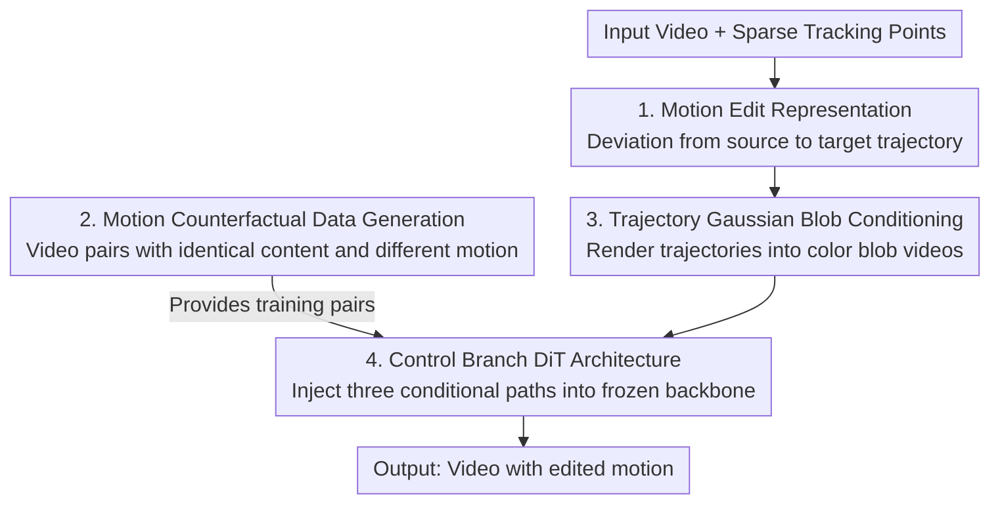

# MotionV2V: Editing Motion in a Video

**Conference**: CVPR 2026  
**Paper**: [CVF Open Access](https://openaccess.thecvf.com/content/CVPR2026/html/Burgert_MotionV2V_Editing_Motion_in_a_Video_CVPR_2026_paper.html)  
**Code**: Project page ryanndagreat.github.io/MotionV2V (provided in the paper, open-source repository unconfirmed)  
**Area**: Video Generation / Video Editing  
**Keywords**: Video Motion Editing, Sparse Trajectories, Counterfactual Data, Video Diffusion, ControlNet Control Branch

## TL;DR
MotionV2V redefines "video motion editing" as "directly editing sparse trajectories extracted from the input video". The deviation between the source and target trajectories is defined as a "motion edit". By fine-tuning a video diffusion model with a control branch using self-constructed "motion counterfactual" video pairs, the method enables editing object motion, camera paths, and temporal timing starting from any arbitrary frame, while strictly preserving the unedited content of the original video. It achieves a preference rate exceeding 65% in a 4-way user study.

## Background & Motivation
**Background**: Generative video models have achieved high fidelity and temporal consistency. Consequently, numerous works have focused on "motion controllability" as a means to enhance text-to-video generation or image animation. Trajectory-based methods use point trajectories to precisely control object paths, while optical flow-based methods employ dense correspondences for fine-grained motion transfer.

**Limitations of Prior Work**: These methods are essentially "generators" rather than "editors"—they synthesize an entirely **new** video starting from a single image or text prompt, instead of modifying an **existing** video. Specifically, they exhibit three types of failures: (1) Image-to-video (I2V) methods (e.g., ReVideo, Go-with-the-Flow) can only generate based on a single frame. Regions not visible in the first frame are completed purely through hallucination, whereas in true video editing, these regions are known and should remain unchanged. ReVideo attempts to use inpainting to recover original video information, but completely fails when camera motion is introduced. (2) Human-specific methods (e.g., MotionFollower, MotionEditor) can only edit full-body human actions and cannot handle general objects and scenes. (3) Methods like ReCapture and ReCamMaster can only edit camera trajectories and cannot modify primary object motion.

**Key Challenge**: Appearance editing (e.g., changing style while maintaining motion structure) and motion editing belong to fundamentally different levels of difficulty. When changing appearance, the structural correspondence between input and output frames remains intact, allowing standard techniques like DDIM inversion to be used. However, once the motion of an object is modified (e.g., making a person walk in a different direction), the structural correspondence between the input and output is broken, directly violating the temporal alignment assumption on which inversion methods rely.

**Goal**: To perform "general-purpose motion editing" on a user-provided real video—enabling modification of object motion, camera trajectories, and the timing of specific elements, starting from any arbitrary frame, while strictly preserving unedited content on a pixel-by-pixel basis.

**Key Insight**: Rather than conditioning on a single frame to "regenerate", it is superior to **condition on the full video** and explicitly represent the editing signal as the "change in motion". Given an input video and sparse tracking points, the system automatically tracks these points across the entire video. The user then chooses to either anchor (keep original motion) or modify (edit trajectories) these points. The model learns how the discrepancy between the source and target trajectories maps onto the video frames.

**Core Idea**: Defining "motion editing" as the deviation between the source trajectory and the target trajectory (motion edit = target trajectory − source trajectory) and pairing it with a powerful video diffusion backbone, which unifiedly supports four types of edits: object motion, camera movement, temporal timing, and editing from arbitrary frames.

## Method

### Overall Architecture
MotionV2V is a video-to-video (V2V) motion editing framework. The input consists of a real video and sparse tracking points specified on an object, and the output is a new video with preserved content but modified motion according to the user's intent. The problem is decomposed into three components: (1) encoding the user's intent into source and target trajectory sets using the "motion edit" representation; (2) since paired training data with "identical content but different motion" is unavailable in reality, the authors construct a **motion counterfactual data generation pipeline** to synthesize such video pairs; (3) incorporating a **control branch** into a pre-trained T2V DiT to inject the counterfactual video, source trajectory, and target trajectory as three conditional paths into the frozen backbone, generating the final edited result.

The flowchart below illustrates the overall pipeline from user input and training data to the output video. The four contribution nodes sequentially correspond to the "Key Designs" outlined below:

### Key Designs

**1. Motion Edit Representation: Representing motion edits as sparse trajectory deviation**

Addressing the limitation where directly editing at the pixel or appearance level breaks structural correspondence once motion changes, thereby causing standard inversion to fail, the authors represent edits at the level of **sparse trajectories**. The user places several tracking points on target objects, and the system uses a point tracker to obtain the source trajectory $T_\text{src}$ across the full video. The user then modifies a subset of these trajectories to target trajectories $T_\text{tgt}$ (while maintaining anchored points as unchanged); the difference between the two defines the "motion edit". This representation naturally unifies four capabilities: **Object Motion** (editing specific object trajectories while anchoring background trajectories, e.g., moving a dog while keeping the scene static); **Camera Control** (estimating a dynamic pointmap, reprojecting to each frame using user-specified camera intrinsic/extrinsic parameters, and back-solving the offset of each point trajectory to modify camera position/focal length while preserving scene content, such as keeping water ripples under a panning camera as a swan swims); **Temporal Control** (decoupling the trajectory of an element from the global timeline, e.g., delaying a duck's appearance from the 2nd second to the 5th second while the background follows the original timing); **Arbitrary Frame Editing** (as the model is conditioned on the full video, it can control objects appearing only in the middle of the sequence, like a stop sign that appears midway, which is impossible for first-frame-only I2V methods).

**2. Motion Counterfactual Data Generation: Generating video pairs with "identical content but different motion"**

The primary bottleneck is training data—real-world videos with identical content but distinct motions do not exist. The authors devise a systematic pipeline to generate target videos $V_\text{target}$ and counterfactual videos $V_\text{cf}$ from an original video $V_\text{full}$ of length $F_\text{full}$ frames. The target video is a directly cropped sequence of $F$ consecutive frames (start frame $f_\text{start}\sim\text{Uniform}(0, F_\text{full}-F)$), which **retains the real video** to ensure the model learns realistic motion and appearance. The counterfactual video is generated by randomly sampling start/end frames $f^\text{cf}_\text{start}, f^\text{cf}_\text{end}$, and applying one of two strategies: **Frame Interpolation**—conditioning a video diffusion model on the start and end frames to generate $F$ frames of new content based on an LLM-generated prompt (e.g., instructing a walking person to "twirl") to inject new motion; **Temporal Resampling**—equidistantly sampling $F$ frames between $f^\text{cf}_\text{start}$ and $f^\text{cf}_\text{end}$ to introduce speed changes, temporal shifts, or backward playback when $f^\text{cf}_\text{start} > f^\text{cf}_\text{end}$. Point correspondences are then established: randomly spawning $N\sim\text{Uniform}(1,64)$ tracking points and tracking them on $V_\text{full}$ via the bidirectional point tracker TAPNext to obtain target trajectories $T_\text{target}$. The counterfactual trajectories $T_\text{cf}$ reuse the Same tracking result in the resampling scenario, while in the interpolation scenario, the corresponding frames are replaced with interpolated frames before tracking. Finally, geometric augmentations such as random sliding crops, rotation, and scaling are applied (with synchronized transformation of trajectory points to preserve correspondence). These "synthetic moving crops" approximate multi-view videos and guarantee perfect temporal synchronization, imparting a prior to the model to synchronize appearance when unspecified. A key elegant design is **anchoring the counterfactual trajectories to directly match the start and end frames of the original video**, ensuring reliable point correspondences between both trajectory sets.

**3. Trajectory Gaussian Blob Conditioning: Visualizing sparse points into videos ingestible by the diffusion model**

Instead of feeding coordinates directly, the model rasterizes trajectories into **color Gaussian blob videos** as motion conditioning channels. The model is conditioned on three video sequences: the counterfactual video $V_\text{cf}$, the rendered counterfactual trajectories $B_\text{cf}$, and the rendered target trajectories $B_\text{target}$, each of dimensions $\mathbb{R}^{F\times 3\times H_\text{rgb}\times W_\text{rgb}}$. Each sample randomly selects $N$ distinct colors, rendering each tracking point on a black background as a Gaussian blob with a standard deviation of 10 pixels. Importantly, the blob is **only drawn when the point is visible (not occluded)**—with visibility determined by the point tracker, thereby encoding the appearance/disappearance of objects. The authors experimented with representations similar to DiffusionAsShader but found that having too many points lacking distinctive colors weakened the control signal, motivating the "sparse, colored, visibility-conditioned" approach. During training, trajectories undergo dropout, where the **dropout rate for the target trajectories $T_\text{target}$ is higher than that of the conditional trajectories $T_\text{cf}$** to enhance robustness and prevent overfitting to specific motion patterns. At inference time, the number of point correspondences is restricted to approximately 20, as the model fails to track all correspondences when too many points are provided.

**4. Control Branch DiT Architecture: ControlNet-style injection of three-way conditions into the frozen backbone**

The base model is a pre-trained text-to-video DiT (CogVideoX-5B). To inject motion and video conditions without compromising the generative capability of the backbone, the authors **replicate the first 18 transformer blocks of the DiT to serve as a control branch**. The control branch tokens are added to the corresponding backbone block tokens via a zero-initialized MLP—conceptually equivalent to applying ControlNet to a DiT. Inspired by DiffusionAsShader but with a key difference: the patchifier of the control branch must handle $48 = 3\times 16$ input channels (each of the three conditioning videos occupies 16 channels in the latent space). All video inputs are compressed using a 3D Causal VAE into latents ($C_\text{latent}=16$, $F_\text{latent}=\lfloor (F-1)/4\rfloor+1$, $H_\text{latent}=H_\text{rgb}/8$, $W_\text{latent}=W_\text{rgb}/8$). **The backbone is frozen, and only the control branch is trained** using a standard L2 latent diffusion loss. The authors highlight that this task is significantly harder than typical ControlNets: while input edges and output images in edge-to-image ControlNets are spatially aligned, here the inputs (counterfactual video + motion blobs) and outputs are spatiotemporally unaligned. Yet, the model successfully functions—the authors speculate that the transformer blocks perform highly non-trivial operations to achieve this cross-spatiotemporal alignment. ⚠️ This speculative explanation is subject to the original text.

### Loss & Training
Standard latent diffusion training structure with an L2 loss. The base model is CogVideoX-5B, trained on 8 H100 GPUs for one week. The sequence length is $F=49$ with an input resolution of $480\times 720$ (corresponding to a latent size of $60\times 90$). $N$ varies from 1 to 64; learning rate is set to $10^{-4}$. The training set comprises 100K videos, with 15K iterations and an effective batch size of 32. An internal video dataset contains 500K samples. Both the counterfactual generation model and the V2V editing model are based on the same CogVideoX-5B.

## Key Experimental Results

### Main Results
Baselines compared in a 4-way user study include: ATI (trajectory-guided I2V based on WAN 2.1, the strongest baseline), ReVideo, and Go-with-the-Flow (GWTF). The evaluation uses 20 manually curated test videos covering object motion, camera changes, and complex multi-element scenes, with 41 participants choosing the "best video" across three questions.

| Question | Ours | ATI | ReVideo | GWTF |
|------|------|------|---------|------|
| Q1 Content Preservation (↑) | 70% | 24% | 1% | 5% |
| Q2 Motion Alignment (↑) | 71% | 24% | 2% | 3% |
| Q3 Overall Editing Quality (↑) | 69% | 25% | 1% | 5% |

The preference rates for the proposed method are around 70% across all three questions, significantly outperforming ATI (~25%) and ReVideo/GWTF (<5%), demonstrating clear superiority in both content preservation and motion control.

Quantitative evaluation uses "photometric reconstruction error": 100 test videos are constructed, sliced at the midpoint into $V_0$ and $V_1$. To ensure continuity between the last frame of $V_0$ and the first frame of the reversed sequence, $V_1$ is temporally reversed to obtain $V_1'$. Web videos containing "elements emerging midway that are invisible in the first frame" are selected (bidirectionally tracked using 25 points, retaining videos where many points are occluded when traced to the first/last frames). Using $V_0$ as the input, $V_1$ as the target, and providing both the proposed method and ATI with the same trajectories extracted from $V_1$, reconstruction quality is measured via frame-wise L2 error: $L_2 = \frac{1}{F}\sum_{i=1}^{F}\lVert I^\text{pred}_i - I^\text{target}_i\rVert_2^2$.

| Method | L2 (↓) | SSIM (↑) | LPIPS (↓) |
|------|--------|----------|-----------|
| Ours | 0.024 | 0.098 | 0.031 |
| ATI | 0.038 | 0.094 | 0.072 |
| Go-with-the-Flow | 0.067 | 0.089 | 0.088 |
| ReVideo | 0.096 | 0.080 | 0.106 |

The proposed method achieves significantly lower L2 and LPIPS and the highest SSIM, especially in scenarios where "content is absent from the first frame", confirming that "conditioning on the full video" preserves content better than "first-frame generation". ⚠️ The SSIM values in the table (e.g., 0.098) are unusually low; refer to the original paper for authoritative values.

### Ablation Study
The paper does not provide a standard modular ablation table, but presents several comparative conclusions regarding design trade-offs in the method and discussion sections:

| Design Choice | Phenomenon / Conclusion | Description |
|----------|-------------|------|
| Trajectory Representation: sparse + colored blobs vs. DiffusionAsShader-like representation | Too many points lacking distinctive colors → weakened control signal | Hence, the sparse, colored, visibility-conditioned rendering is adopted |
| Higher dropout rate for target trajectories than conditional trajectories | Enhances robustness and prevents overfitting to specific motion patterns | Asymmetric dropout during training |
| Inference point count restricted to ~20 | Too many points result in the model failing to track all correspondences | Upper limit during inference |
| Conditioning on full video vs. first-frame only (I2V) | Full video preserves midway and out-of-frame content | See Table 2 and the 8 qualitative cases |

### Key Findings
- **"Conditioning on the full video" is the key winning factor**: Eight qualitative scenarios (moving a boat + modifying camera to reveal a mountain, raising a cheerleader's arm while preserving a red pom-pom absent in the first frame, controlling a cyclist appearing only in the final frame, differential deceleration in a dog race to let a Corgi overtake, applying the correct color to a balloon appearing midway, swan zoom-out, taxi retiming, and moving an off-screen motorcycle behind a red car) consistently demonstrate: I2V only observes the first frame → out-of-frame or midway content can only be hallucinated, whereas V2V accesses content bidirectionally from any frame, accurately handling off-screen elements, camera changes, and retiming.
- **Iterative Editing**: The output of one edit can serve as the input for the next, allowing complex edits (object motion + camera changes) to be decomposed into multiple sequential steps. This provides more immediate feedback and a highly controllable pipeline. The authors acknowledge some degree of subject drift, which is partially attributed to the quality of the base video model.
- **Control under Spatiotemporal Asynchrony**: Despite the input conditions (video + motion blobs) and outputs being spatiotemporally unaligned, the control branch still enables the model to align them. The authors speculate that the transformer blocks perform highly non-trivial operations. ⚠️ The speculative explanation is subject to the original text.

## Highlights & Insights
- **Reducing "motion editing" to "editing the discrepancy of sparse trajectories"**: This representation unifies four types of edits—object, camera, temporal, and arbitrary frame editing—under a single interface. It naturally supports fine-grained selection between "anchoring vs. modifying" without manual masking and generalizes to arbitrary objects, representing the cleanest abstraction of the methodology.
- **Clever generation of counterfactual data**: Anchoring the sequence with initial and final real frames ensures correct point correspondences between the two trajectory sets, and applying geometric augmentations to approximate multi-view perspectives solves the fundamental data scarcity of having no paired videos with identical content but different motions. The dual-track approach of "frame interpolation + temporal resampling" successfully covers both novel movements and speed/reverse variations.
- **Visibility-driven blob rendering**: Encoding "when objects appear/disappear" directly into the conditioning signal enables the model to control the timing of elements and handle out-of-frame content, which is structurally impossible for first-frame-driven approaches.
- **Transferable Paradigm**: The paradigm of "counterfactual paired data + ControlNet-style control branch injection into a frozen large model" can be readily transferred to other editing tasks where one wishes to modify specific attributes while preserving the rest of the content (e.g., editing lighting or object poses while preserving the background).

## Limitations & Future Work
- **Drift accumulation during iterative editing**: The authors acknowledge that multi-step sequential editing accumulates subject drift, which is partially constrained by the base video model. They express the ambition to support "infinite" iterations in future versions.
- **Constraint on inference point count**: Exceeding approximately 20 point correspondences causes the model to fail to track all targets, imposing a limit on the number of controllable points in complex multi-object scenes.
- **Reliance on point tracking and pointmap quality**: Source trajectories are obtained from TAPNext, and camera control relies on dynamic pointmap estimation; tracking and reprojection errors inevitably propagate to the final edit.
- **High computation and base model barriers**: Training requires one week on 8×H100 GPUs using CogVideoX-5B, exhibiting non-trivial replication costs. The SSIM and other quantitative metrics show anomalous magnitudes (⚠️ refer to the original paper for authoritative data), and the quantitative evaluation protocol mainly revolves around "reconstructing a known target", leaving the quality assessment of "open-ended creative editing" relatively under-explored.

## Related Work & Insights
- **vs. ATI / Go-with-the-Flow / MotionPrompting (trajectory-guided I2V)**: These methods perform "generation" conditioned on a single frame, leading to reliance on hallucination for areas beyond the first frame. Conversely, the proposed method performs "editing" conditioned on the full video, successfully retaining out-of-frame and mid-sequence content—the fundamental reason for its comprehensive superiority in Tables 1 and 2. Even though ATI leverages the stronger WAN 2.1 backbone (compared to CogVideoX), it remains inferior to the proposed method.
- **vs. ReVideo (first-frame preservation + inpainting)**: ReVideo attempts to inpaint original video information back into the edited result, but fails when camera movement reveals content absent from the first frame. The proposed method bidirectionally extracts content from any frame, naturally managing camera motion.
- **vs. MotionFollower / MotionEditor (human-specific motion editing)**: These methods are tailored solely for full-body human actions, whereas the proposed method is generic to arbitrary objects and scenes.
- **vs. ReCapture / ReCamMaster (camera trajectory editing)**: These methods only modify camera motion and cannot change subject movement. In contrast, the proposed method uses a unified trajectory discrepancy representation to simultaneously support both subject and camera edits.
- **vs. DDIM Inversion-based appearance editing**: Appearance editing preserves structure, rendering inversion methods applicable. Motion editing breaks structural correspondences, making inversion fail. The proposed method specifically bypasses inversion, directly learning "motion shifts" using counterfactual data paired with a control branch.

## Rating
- Novelty: ⭐⭐⭐⭐⭐ The first general-purpose V2V motion editing framework for existing videos; the combination of "motion edit = trajectory discrepancy" with counterfactual data is highly original.
- Experimental Thoroughness: ⭐⭐⭐⭐ User study + quantitative reconstruction + 8 qualitative cases provide a solid evaluation, though it lacks a standard module-wise ablation and the SSIM magnitude remains questionable.
- Writing Quality: ⭐⭐⭐⭐ Well-articulated motivation and methodology, accompanied by rich qualitative examples; minor flaws exist in some quantitative table annotations (such as "ATR" and SSIM values).
- Value: ⭐⭐⭐⭐⭐ Reduces labor-intensive motion re-authoring in VFX to simple "point dragging", offering broad applicability and a highly transferable design paradigm.

<!-- RELATED:START -->

## Related Papers

- [\[CVPR 2026\] Generative Video Motion Editing with 3D Point Tracks](generative_video_motion_editing_with_3d_point_tracks.md)
- [\[CVPR 2026\] V-RGBX: Video Editing with Accurate Controls over Intrinsic Properties](v-rgbx_video_editing_with_accurate_controls_over_intrinsic_properties.md)
- [\[CVPR 2026\] WorldReel: 4D Video Generation with Consistent Geometry and Motion Modeling](worldreel_4d_video_generation_with_consistent_geometry_and_motion_modeling.md)
- [\[CVPR 2026\] 3D-Aware Implicit Motion Control for View-Adaptive Human Video Generation](3d-aware_implicit_motion_control_for_view-adaptive_human_video_generation.md)
- [\[CVPR 2026\] CamDirector: Towards Long-Term Coherent Video Trajectory Editing](camdirector_towards_long-term_coherent_video_trajectory_editing.md)

<!-- RELATED:END -->
