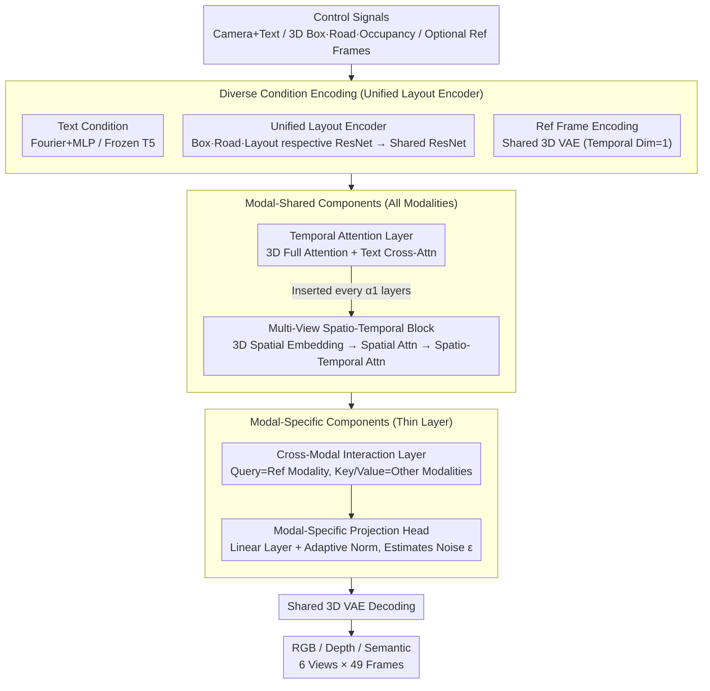

# MoVieDrive: Urban Scene Synthesis with Multi-Modal Multi-View Video Diffusion Transformer

**Conference**: CVPR 2026 Findings  
**arXiv**: [2508.14327](https://arxiv.org/abs/2508.14327)  
**Code**: None  
**Area**: Video Generation  
**Keywords**: Multimodal video generation, Multi-view consistency, Diffusion Transformer, Urban scene synthesis, Autonomous driving data augmentation

## TL;DR

MoVieDrive proposes a unified multi-modal multi-view video diffusion Transformer. Through a dual-layer architecture design of modal-shared and modal-specific components, it simultaneously generates RGB videos, depth maps, and semantic maps within a single model. Combined with diverse conditional inputs (text, layout, context references), it achieves an FVD of 46.8 on nuScenes (SOTA), while attaining high-quality driving scene synthesis with cross-modal consistency.

## Background & Motivation

**Background**: Video generation models (SVD, CogVideoX) perform excellently in general video generation, but their direct application to autonomous driving requires multi-view spatio-temporal consistency and high controllability. Methods like DriveDreamer and MagicDrive have explored multi-view urban scene generation but only support the RGB modality.

**Limitations of Prior Work**: Autonomous driving requires not only RGB video but also depth and semantic maps for comprehensive scene understanding. Existing solutions use **multiple independent models** to generate different modalities, leading to: (a) high deployment complexity; (b) inability to utilize cross-modal complementary information to improve generation quality; and (c) inability to guarantee consistency between modalities.

**Key Challenge of UniScene**: UniScene attempts to generate RGB and LiDAR simultaneously but still employs multiple independent models without constructing a truly unified multi-modal generation framework.

**Key Insight**: Different modalities (RGB, depth, semantics) share a common latent space after being encoded by a shared 3D VAE. Only a few modal-specific components are needed to distinguish them—thus, a unified model can complete multi-modal generation.

## Method

### Overall Architecture

MoVieDrive aims to solve a task that previously required "model ensemble": simultaneously outputting RGB video, depth maps, and semantic maps in an autonomous driving scene using **one** diffusion model, ensuring consistency across 6 camera views and adjacent frames. The pipeline first encodes various control signals (camera parameters, text descriptions, layout maps projected from 3D boxes/roads/occupancy, and optional initial reference frames) into conditional features. These are fed into a unified diffusion Transformer for denoising. Finally, a 3D VAE shared by all modalities decodes the denoised latents into multi-modal multi-view videos.

The interior of this unified Transformer is divided into two layers based on "what should be the same for all modalities" and "what should differ for each": the **modal-shared layer** handles temporal consistency and multi-view spatio-temporal consistency required by all modalities, while the **modal-specific layer** handles complementary communication between modalities and final noise estimation. The core hypothesis of the method is that RGB, depth, and semantics, when encoded by the same 3D VAE, fall into a sufficiently close latent space where most computations can be shared, and modalities only need to be distinguished in a very thin layer.

### Key Designs

**1. Diverse Condition Input Encoding: Clarifying "what to draw" using three levels of granularity and consolidating branches with a Unified Layout Encoder**

Controllability in driving scenes comes from constraints at different levels. MoVieDrive splits conditions into three granularities: **Textual conditions** (coarsest), where camera parameters are encoded via Fourier embedding + MLP and scene descriptions via a frozen T5 encoder, concatenated as $f^{text}$ and injected via cross-attention to govern global style; **Layout conditions** (middle), where 3D boxes are projected into box maps $c^b$, road structures into road maps $c^r$, and sparse occupancy into layout maps $c^o$, governing fine-grained object and road structures; and **Contextual reference frames** (finest, optional), encoded via the shared 3D VAE with temporal dimension=1 to provide a starting point for future scene prediction. The layout branch is the most sophisticated engineering part—instead of independent VAEs, it uses a **Unified Layout Encoder**: each condition passes through its own causal ResNet block, followed by a shared causal ResNet block for fusion:

$$f^{layout} = E_s^l\big(E_b^l(c^b) \otimes E_r^l(c^r) \otimes E_o^l(c^o)\big)$$

**2. Modal-Shared Components: A shared temporal layer and multi-view spatio-temporal block for consistent motion and cross-view alignment**

Temporal and multi-view consistency are hard constraints for every modality. The base is the **Temporal Attention Layer $D^{tem}$**, using 3D full attention from CogVideoX for inter-frame coherence. A **Multi-View Spatio-Temporal Block $D^{st}$** is inserted every $\alpha_1$ temporal layers to address cross-camera consistency. It performs four steps: encoding 3D occupancy $c^{occ}$ positions using multi-resolution Hash grids (3D Spatial Embedding) as spatial anchors; reshaping latents to $\mathcal{R}^{K \times (VHW) \times C}$ for 3D spatial attention; reshaping to $\mathcal{R}^{(VKHW) \times C}$ for spatio-temporal attention; and a concluding feed-forward layer. The sequence is:

$$h = D^{st}\big(D^{tem}(z', f^{text}, t),\, c^{occ}, t\big)$$

Ablations show that without this spatio-temporal block, FVD rises to 153.7, while the full model achieves 46.8.

**3. Modal-Specific Components: A thin layer for cross-modal communication and noise estimation to balance complementarity and individuality**

While shared layers learn commonalities, depth needs geometric detail and semantics need category boundaries. Responsibility lies with two lightweight components. The **Cross-modal Interaction Layer $D_m^{cm}$**, inserted every $\alpha_2$ shared layers, uses cross-attention where the query is the current modality's latent and key/value are the concatenation of **other modalities'** latents $h_m^{modal}$:

$$h'_m = D_m^{cm}(h,\, h_m^{modal}, t)$$

Secondly, **Modal-Specific Projection Heads** use linear layers + adaptive normalization to estimate noise $\epsilon$ for each modality. Only this layer is partitioned by modality; the rest are shared, embodying the "shared latent space" hypothesis.

### Loss & Training

- **Training Objective**: Weighted sum of DDPM noise estimation losses for each modality: $\mathcal{L} = \sum_m^M \lambda_m \mathbb{E}_{x_{0,m}, t_m, \epsilon_m, C} \|\epsilon_m - \epsilon_{\theta,m}(x_{t,m}, t_m, C)\|^2$
- **Condition Dropout**: Randomly dropping conditions to enhance generalization and output diversity.
- **Inference**: DDIM sampler for accelerated denoising + Classifier-Free Guidance (CFG).
- **Pre-training Strategy**: Temporal layers and heads initialized with CogVideoX weights; other layers randomly initialized. 3D VAE and T5 are frozen.
- **Defaults**: 6 cameras, 49 frames, 512×256 resolution.

## Key Experimental Results

### Main Results (nuScenes)

| Method | FVD↓ | mAP↑ | mIoU↑ | AbsRel↓ | Sem-mIoU↑ |
|------|------|------|-------|---------|-----------|
| DriveDreamer | 340.8 | - | - | - | - |
| MagicDrive | 236.2 | 9.7 | 15.6 | 0.255 | 23.5 |
| MagicDrive-V2 | 112.7 | 11.5 | 17.4 | 0.280 | 22.4 |
| CogVideoX+SyntheOcc | 60.4 | 15.9 | 28.2 | 0.124 | 32.4 |
| **MoVieDrive** | **46.8** | **22.7** | **35.8** | **0.110** | **37.5** |

- FVD improved by ~22% over the strongest baseline (CogVideoX+SyntheOcc).
- Comprehensive leadership in controllability (mAP, mIoU) and multi-modal quality (AbsRel, Sem-mIoU).

### Ablation Study

| Configuration | FVD↓ | AbsRel↓ | Sem-mIoU↑ | Description |
|------|------|---------|-----------|------|
| RGB only + External depth/semantic | 42.0 | 0.121 | 36.4 | Single modality + post-processing |
| RGB+Depth Unified + External semantic | 43.4 | 0.111 | 36.0 | Unified dual-modality helps depth |
| RGB+Depth+Semantic Fully Unified | 46.8 | **0.110** | **37.5** | Multi-modal complementarity is optimal |

| Transformer Component | FVD↓ | Description |
|-----------------|------|------|
| Temporal layers only (L1) | 153.7 | Lacks spatial consistency |
| L1 + Modal-specific (L3) | 78.8 | Modal separation helps |
| L1 + Spatio-temporal block (L2) + L3 | **46.8** | Full model is optimal |

### Key Findings

- **Unified model outperforms multi-model pipelines**: The depth and semantic quality of unified generation are superior to two-stage solutions.
- **Spatio-temporal block is crucial**: Removing it causes FVD to jump from 46.8 to 78.8.
- **Unified Layout Encoder is superior**: Alignment of implicit condition embedding space improves performance compared to independent VAE encoding.
- **Waymo Generalization**: Achieves FVD 61.6 on Waymo, outperforming CogVideoX+SyntheOcc (82.3).
- **Long Video Generation**: Maintains scene layout and content consistency without reference frames.

## Highlights & Insights

- **Pioneering unified multi-modal generation**: Constructing a single model to simultaneously generate RGB/depth/semantic multi-view videos in the AD domain.
- **Validation of "Shared Latent Space" hypothesis**: Verified that different modalities can be effectively modeled via a shared 3D VAE + minimal modal-specific layers.
- **High-quality engineering in condition design**: The hierarchical input (text, layout, reference) + Unified Layout Encoder makes generation both controllable and flexible.
- **Style editing support**: Ability to generate scenes under different weather/times via text prompt modifications.

## Limitations & Future Work

- **Pseudo-label quality**: Depth maps (Depth-Anything-V2) and semantic maps (Mask2Former) used for training are not ground truth.
- **Long-range generation noise**: Distant regions in long videos exhibit noise, possibly due to 3D VAE temporal compression.
- **Computational cost**: Unified multi-modality introduces extra parameters and overhead in modal-specific layers.
- **No LiDAR modality**: Currently supports three visual modalities; not yet extended to 3D sensor data like point clouds.
- **Future Directions**: (a) Efficient cross-modal fusion; (b) Extension to optical flow/normals; (c) Joint optimization with downstream tasks like detection/planning.

## Related Work & Insights

- **vs MagicDrive/V2**: MoVieDrive uses 2D box map projections and a Unified Layout Encoder, which is cleaner and performs better than coordinate encoding.
- **vs UniScene**: MoVieDrive achieves true single-model multi-modal generation, whereas UniScene uses separate models for RGB and LiDAR.
- **vs CogVideoX+SyntheOcc**: MoVieDrive adds spatio-temporal blocks and cross-modal interaction layers over this baseline, achieving a 22% FVD improvement.

## Rating

- Novelty: ⭐⭐⭐⭐ First unified multi-modal multi-view AD generation framework.
- Experimental Thoroughness: ⭐⭐⭐⭐ Dual-dataset evaluation (nuScenes + Waymo) with extensive ablations.
- Writing Quality: ⭐⭐⭐⭐ Clear structure and comprehensive methodology diagrams.
- Value: ⭐⭐⭐⭐ Significant for AD data synthesis; unified approach reduces deployment complexity.

<!-- RELATED:START -->

## Related Papers

- [\[CVPR 2026\] UnityVideo: Unified Multi-Modal Multi-Task Learning for Enhancing World-Aware Video Generation](unityvideo_unified_multi-modal_multi-task_learning_for_enhancing_world-aware_vid.md)
- [\[CVPR 2026\] VideoWeaver: Multimodal Multi-View Video-to-Video Transfer for Embodied Agents](videoweaver_multimodal_multi-view_video-to-video_transfer_for_embodied_agents.md)
- [\[ECCV 2024\] SV3D: Novel Multi-view Synthesis and 3D Generation from a Single Image using Latent Video Diffusion](../../ECCV2024/video_generation/sv3d_novel_multi-view_synthesis_and_3d_generation_from_a_single_image_using_late.md)
- [\[CVPR 2025\] Geometry-guided Online 3D Video Synthesis with Multi-View Temporal Consistency](../../CVPR2025/video_generation/geometry-guided_online_3d_video_synthesis_with_multi-view_temporal_consistency.md)
- [\[CVPR 2026\] CineBrain: A Large-Scale Multi-Modal Audiovisual Brain Dataset for Brain-Conditioned Video Generation](cinebrain_a_large-scale_multi-modal_audiovisual_brain_dataset_for_brain-conditio.md)

<!-- RELATED:END -->
