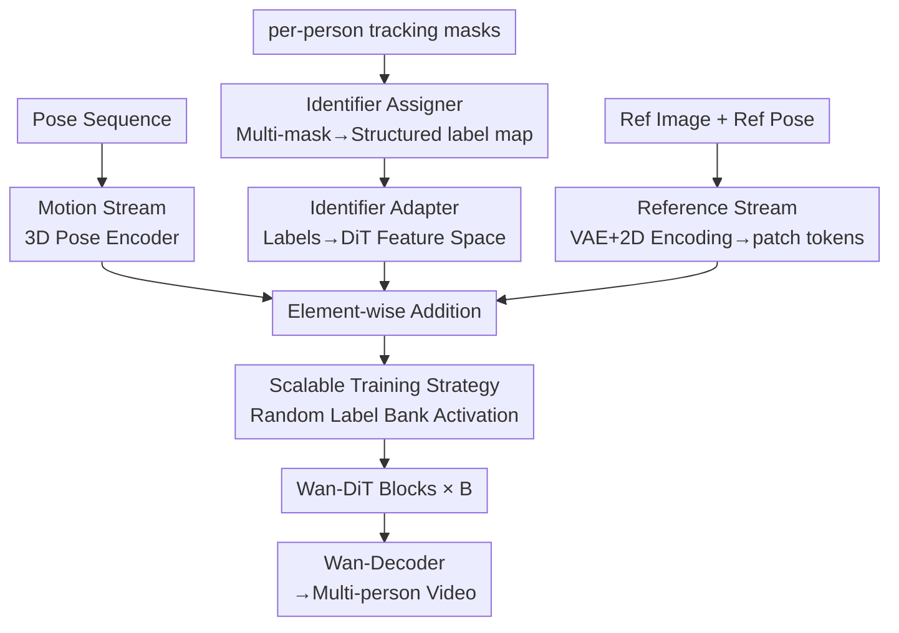

# MultiAnimate: Pose-Guided Image Animation Made Extensible

**Conference**: CVPR 2026  
**Paper**: [CVF Open Access](https://openaccess.thecvf.com/content/CVPR2026/html/Hu_MultiAnimate_Pose-Guided_Image_Animation_Made_Extensible_CVPR_2026_paper.html)  
**Code**: Project Page https://hyc001.github.io/MultiAnimate/ (Code TBD)  
**Area**: Video Generation  
**Keywords**: Pose-Guided Image Animation, Multi-Person Animation, Identity Consistency, Diffusion Transformer, Scalable Training

## TL;DR
MultiAnimate introduces a pair of modules, "Identifier Assigner + Identifier Adapter," into the Wan2.1 DiT video generation framework. By encoding tracking masks of each person into structured labels injected into the DiT and employing a training strategy of "randomly sampling identities from a learnable label bank," the model—trained only on dual-person data—consistently generates dance animations for 3 to 7 people with distinct identities and reasonable occlusions.

## Background & Motivation
**Background**: Pose-guided human image animation synthesizes a video of a person moving according to a skeleton pose sequence given a reference image. With the maturation of diffusion models, especially Diffusion Transformer (DiT) video backbones (e.g., Hunyuan-Video, Wan-Video), single-person animation has achieved high performance in identity preservation and motion alignment.

**Limitations of Prior Work**: Most existing methods cater to **single-person** scenarios. Naively extending them to multi-person scenarios leads to two types of failures: (1) **identity confusion**, where individuals swap faces or identities after interaction; and (2) **implausible occlusions**, where spatial relationships become distorted during crossovers (as seen in Fig.2a, where UniAnimate-DiT fails when extended to two people). Furthermore, even if fine-tuned on dual-person data, models often become **locked to a fixed number of people**: a model trained on two people loses identity when given three (Fig.2b). Supporting more people usually requires recollecting data for that specific count, which is costly or infeasiblity.

**Key Challenge**: In multi-person animation, the **association between pose and identity is ill-posed**. The paper illustrates this with a vivid example (Fig.3): when two people swap positions by rotating 180° clockwise, "continuing to rotate 180° clockwise to return" and "rotating 180° counter-clockwise to return" produce nearly **identical pose sequences** but correspond to **two different trajectories**. Pose sequences alone cannot determine who is who or where they should go—additional per-person spatial cues (tracking masks) are necessary to lock the "person $\leftrightarrow$ trajectory" correspondence. Simultaneously, a conflict exists between training on a fixed number of people and the desire to generalize to any number of people.

**Goal**: Design a framework for human animation that is both **robust** (maintaining identity and visual fidelity during multi-person interactions) and **extensible** (generalizing to more people than seen during training).

**Key Insight**: Since the pose itself is ill-posed, **explicitly assign a unique identifier** to each person. This identifier persists across all frames and is embedded into the DiT feature space, ensuring the model always knows "which token belongs to which person." A training process using "random identity sampling" ensures identifiers are mutually discriminative, allowing identities introduced during inference to be naturally distinguished.

**Core Idea**: Replace the "per-person feature extraction followed by summation" approach with **mask-driven identifier encoding** (the Identifier Assigner converts multiple masks into a structured label map, and the Identifier Adapter injects these labels into the DiT). Combined with an extensible training strategy that **randomly activates channels from a label bank of size $n$**, the model achieves "dual-person training and multi-person generalization."

## Method

### Overall Architecture
Given a reference image $I_{ref}\in\mathbb{R}^{3\times H\times W}$, a driving pose sequence $P\in\mathbb{R}^{T\times3\times H\times W}$, and a set of per-person tracking masks $\{M_i\}_{i=1}^{n}$ ($M_i\in\mathbb{R}^{T\times1\times H\times W}$), the goal is to generate a video $V_{tar}\in\mathbb{R}^{T\times3\times H\times W}$ that preserves the identity of each individual in $I_{ref}$, aligns with the motion in $P$, and respects the spatial relationships in the masks.

The pipeline is built on the Wan2.1 I2V architecture and consists of **two streams** fused via **element-wise addition** on latent tokens:

- **Reference Stream**: The reference image $I_{ref}$ passes through a VAE Encoder to obtain latents; reference poses extracted from $I_{ref}$ pass through a 2D convolution-based Image Encoder. These are added to random noise and patchified into input tokens, responsible for "appearance/identity."
- **Motion Stream**: The pose sequence $P$ passes through a 3D convolutional Pose Encoder to capture temporal motion. The tracking masks $\{M_i\}$ pass through the **Identifier Assigner** to synthesize structured labels, then through the **Identifier Adapter** to model individual position features and interpersonal spatial relationships. The encoded pose and mask features are summed and then added element-wise to the reference stream tokens, responsible for "how they move and who is where."

The fused tokens pass through $B$ Wan-DiT Blocks (self-attention + cross-attention), and the Wan-Decoder reconstructs the target video. The Identifier Assigner and Adapter are the primary innovations; other components (VAE, Pose Encoder, DiT backbone) follow Wan/UniAnimate-DiT.

### Key Designs

**1. Identifier Assigner: Compressing per-person masks into a structured label map with IDs**

This addresses two flaws of the "per-person summation" scheme: concurrent approaches extract pose+mask features for each person separately and **aggregate them via summation**, which is computationally cumbersome and blurs spatial relationships. The Identifier Assigner instead integrates all masks into a **single label map** $L\in\mathbb{R}^{H\times W}$—background pixels are 0, while all pixels in masks for Person A and B are assigned distinct non-zero identifiers $a$ and $b$ from the **Identity Label Bank**. The map $L$ is then one-hot encoded into a binary tensor $\hat{L}\in\{0,1\}^{3\times H\times W}$, where the three channels represent the background and the two persons. This map explicitly preserves "who occupies which region and how they are positioned/occluded," providing a clear spatial prior.

**2. Identifier Adapter: Injecting labels into the DiT feature space to model interactions**

The output $\hat{L}$ of the Assigner is at the pixel-label level. The Identifier Adapter, consisting of stacked **3D convolution** layers, takes $\hat{L}$ and transforms the "who is where" information into the DiT backbone's feature space, modeling positional features and interactions like proximity or occlusion. These identity cues are added to the pose features and fused with the latent tokens. Consequently, the DiT "sees" which person each token belongs to while denoising every frame. This **explicit identity encoding across all frames** allows the model to track identities through complex interactions, mitigating identity confusion at its source.

**3. Scalable Training Strategy: Random sampling + Weight bank activation to unlock generalization**

This mechanism allows for "dual-person training $\rightarrow$ multi-person generalization" by solving two specific issues. The first is the **symmetry issue**: early training might fail if the identity assigned during inference differs from training. The model might "lazy-learn" to bind a person's position to a **fixed channel** of the Adapter rather than the mask itself. The second is the **fixed person count** limitation.

The solution is unified: for a maximum of $n$ people supported during inference, an **Identifier Weight Bank** with $n$ identifier channels is placed in the first Conv3D layer of the Identifier Adapter. During dual-person training, two labels are **randomly** sampled from the Identity Label Bank (activating 3 channels including background) to **activate the corresponding weights** in the Weight Bank. By convergence, although only dual-person data is used, all $n$ channels have been "seen" and trained to be **mutually discriminative**. During inference, even if more people/identifiers are introduced, the model maintains identity. Random labeling also forces the network to correlate persons with their **spatial masks** rather than fixed channels.

**4. High-quality Training Data Synthesis (Gen-dataset)**

Real multi-person dance data has limitations in frame quality. The authors synthesized 2,079 five-second videos with two to three people in diverse scenes using the Wan 2.2 generator. This dataset supplements training to enhance robustness and temporal consistency (e.g., preventing handheld objects from disappearing) and ensures smoother camera transitions and dynamic backgrounds.

### Loss & Training
The approach uses a two-stage process: based on Wan2.1 I2V, the Image/Pose Encoder and LoRA are initialized with UniAnimate-DiT weights. **Stage 1** involves training on the Swing Dance dataset for 40 epochs (7,000 steps), supporting up to 3 people. **Stage 2** involves fine-tuning on the Gen-dataset for 3 epochs (2,400 steps). An **Extended model** was also trained on Swing Dance for 24 epochs (4,200 steps) to support up to 7 people. Training utilized 2×A100 80GB, with a batch size of 1 per GPU and a learning rate of $1\times10^{-4}$. Poses were extracted with DWPose, and tracking masks with Sa2VA.

## Key Experimental Results

### Main Results
Evaluations were conducted on the Swing Dance test set, Gen-dataset, and unseen web dance videos (3~7 people) against SOTAs. Metrics include PSNR/SSIM/L1/LPIPS for frame quality and FVD/FID-VID for video quality.

| Dataset | Method | PSNR↑ | SSIM↑ | LPIPS↓ | FVD↓ | FID-VID↓ |
|--------|------|-------|-------|--------|------|----------|
| Swing Dance | UniAnimate-DiT | 16.15 | 0.619 | 0.427 | 891.89 | 27.71 |
| Swing Dance | VACE | 11.15 | 0.311 | 0.563 | 763.75 | 29.88 |
| Swing Dance | **Ours (Stage 1)** | **19.40** | **0.687** | **0.335** | **648.84** | **22.50** |
| Unseen videos | UniAnimate-DiT | 17.94 | 0.751 | 0.286 | 624.45 | 71.24 |
| Unseen videos | VACE | 17.24 | 0.714 | 0.279 | 922.66 | 78.93 |
| Unseen videos | **Ours (Extended)** | **23.24** | **0.857** | **0.185** | **358.74** | **43.12** |

On Swing Dance (complex dual-person interaction), the proposed method leads in all metrics. On the Unseen videos with higher interaction and 3~7 people, the Extended model shows significant improvement, reducing FVD from the next-best 624.45 to 358.74, proving its generalization capability.

### Ablation Study

| Configuration | Conclusion | Description |
|------|------|------|
| Addition-driven (Feature sum) | OK for 2, fails for >2 | Handles 2 people after training but cannot scale. |
| Mask-driven (Ours) | Stable for all | Preserves per-person spatial organization; high scalability. |
| w/o mask-driven design | Poor consistency | Difficult to distinguish identities or maintain them over time. |
| w/ mask-driven design | Consistent + Scalable | Dual-person training enables successful 3-person generation. |

Single-person compatibility (TikTok dataset, zero-shot):

| Method | PSNR↑ | SSIM↑ | LPIPS↓ | FVD↓ | FID-VID↓ |
|------|-------|-------|--------|------|----------|
| DisPose | 17.17 | 0.691 | 0.261 | 615.27 | 64.74 |
| UniAnimate-DiT | 17.76 | 0.781 | 0.337 | 649.30 | 50.16 |
| **Ours** | **23.68** | **0.867** | 0.250 | **342.48** | **41.85** |

### Key Findings
- **Mask-driven vs. Addition-driven**: Addition-driven methods "largely avoid" symmetry issues but cannot scale beyond the training count. Mask-driven encoding preserves spatial organization, enabling true extensibility.
- **Random Label Sampling**: Simultaneously promotes discriminative identity channels (unlocking scaling) and forces the model to rely on masks rather than fixed channels (mitigating symmetry).
- **Gen-dataset Value**: Enhances dynamic details. Without it, handheld objects might disappear and backgrounds remain static.
- **Single-person Performance**: Explicit identity modeling provides positive transfer to single-person tasks, outperforming specialized baselines.

## Highlights & Insights
- **Ill-posed problem definition**: The 180° rotation example brilliantly identifies why multi-person animation requires tracking masks, forming the core motivation of the work.
- **Reusable "Random Label Bank" Trick**: Sampling from a "bank" larger than the training instance count is a clever design for any generative task requiring scalability (e.g., layout generation).
- **Structured Label Map**: Upgrading from feature summation to spatial explicit encoding avoids the fundamental flaw of "blurring" interpersonal relationships.

## Limitations & Future Work
- **Narrow Training Data**: Swing Dance is limited in clothing and interaction variety. The Gen-dataset may introduce synthesis biases.
- **Scalability Evaluation**: While generalizing up to 7 people, per-count degradation curves for higher numbers were not provided.
- **Dependency on Upstream Tools**: Errors in Sa2VA (masks) or DWPose (poses) directly propagate to the generation process.
- **Future Directions**: Combining the random label bank with appearance embeddings (face/clothing) could enable targeted multi-person editing.

## Related Work & Insights
- **vs. UniAnimate-DiT**: MultiAnimate uses it as a foundation but adds the Identifier modules and random labeling to solve identity confusion and enable scaling.
- **vs. DanceTogether**: While both use mask/pose features, DanceTogether follows the "summation" route which limits scaling, unlike the mask-driven structured labels used here.
- **vs. Champ/StableAnimator**: These focus on single-person control via optical flow or 3D priors; MultiAnimate focuses on the overlooked dimension of **multi-person identity disambiguation**.

## Rating
- Novelty: ⭐⭐⭐⭐ First multi-person framework built on modern DiT backbones capable of scaling beyond training counts.
- Experimental Thoroughness: ⭐⭐⭐⭐ Extensive main comparisons and ablations; however, lacks per-person count degradation curves.
- Writing Quality: ⭐⭐⭐⭐ The ill-posed problem is explained very clearly; logical flow is solid.
- Value: ⭐⭐⭐⭐ Significantly reduces data collection costs for multi-person scenarios; highly practical for digital human generation.

<!-- RELATED:START -->

## Related Papers

- [\[CVPR 2026\] One-to-All Animation: Alignment-Free Character Animation and Image Pose Transfer](one-to-all_animation_alignment-free_character_animation_and_image_pose_transfer.md)
- [\[CVPR 2026\] PoseAnything: General Pose-guided Video Generation with Part-aware Temporal Coherence](poseanything_general_pose-guided_video_generation_with_part-aware_temporal_coher.md)
- [\[CVPR 2026\] PersonaLive! Expressive Portrait Image Animation for Live Streaming](personalive_expressive_portrait_image_animation_for_live_streaming.md)
- [\[CVPR 2026\] Vanast: Virtual Try-On with Human Image Animation via Synthetic Triplet Supervision](vanast_virtual_try-on_with_human_image_animation_via_synthetic_triplet_supervisi.md)
- [\[CVPR 2026\] ConsID-Gen: View-Consistent and Identity-Preserving Image-to-Video Generation](consid-gen_view-consistent_and_identity-preserving_image-to-video_generation.md)

<!-- RELATED:END -->
