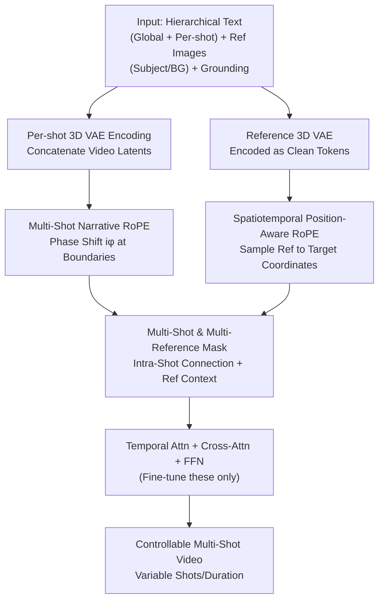

# MultiShotMaster: A Controllable Multi-Shot Video Generation Framework

**Conference**: CVPR 2026  
**Paper**: [CVF Open Access](https://openaccess.thecvf.com/content/CVPR2026/html/Wang_MultiShotMaster_A_Controllable_Multi-Shot_Video_Generation_Framework_CVPR_2026_paper.html)  
**Code**: Project Page https://qinghew.github.io/MultiShotMaster (Code TBD)  
**Area**: Video Generation / Controllable Generation / Diffusion Models  
**Keywords**: Multi-shot video generation, RoPE, reference injection, narrative consistency, DiT

## TL;DR
MultiShotMaster adapts a pre-trained ~1B parameter single-shot T2V model by implementing two types of RoPE (narrative phase shift + spatiotemporal positioning) and an attention mask. It achieves multi-shot video generation with variable shot counts/durations, independent per-shot text, specified subject positioning/motion, and customizable backgrounds without additional adapters. It significantly outperforms CineTrans / EchoShot / VACE / Phantom in text alignment, cross-shot consistency, transition accuracy, and narrative coherence.

## Background & Motivation

**Background**: Current video generation has become highly effective in DiT-based, text-driven "high-quality single-shot clips." Controllability has been extended to conditions like reference images, camera movement, and object trajectories. However, real cinematic works rely on **multi-shot narratives**: a story is told through several shots using camera movement, character interactions, and micro-expressions to clarify the plot.

**Limitations of Prior Work**: Existing multi-shot generation follows two main routes, both with significant flaws. First, the "Text → Keyframe → I2V" approach generates consistent keyframes and completes shots via I2V; however, sparse keyframes fail to cover side characters appearing only briefly or scenes outside the keyframes, leading to consistency leaks. Second, "End-to-end global generation" uses full attention along the temporal dimension for consistency, but shot durations are fixed and shot counts are limited. Crucially, **both routes are primarily text-driven**, lacking the "director-level" control to specify "this character looks like this, stands here, performs this action, in this specific background room."

**Key Challenge**: In DiT, all image patches are flattened into tokens, using position encodings like RoPE to maintain spatiotemporal order. Original 3D-RoPE assigns **continuously increasing** indices along the temporal dimension, causing the model to **fail to distinguish between "adjacent frames within the same shot" and "two frames across a shot boundary."** Consequently, the model treats shot transitions as ordinary image dissolves or interpolations, resulting in static shots or blurred frames. Adding controllability typically requires separate adapters for each signal, which increases model size and computational cost in multi-shot scenarios.

**Goal**: To develop a lightweight solution without additional adapters or disruption of pre-trained attention that simultaneously handles (1) variable shot counts and durations, (2) independent per-shot text, (3) customization of subject appearance and scenes, and (4) subject motion control.

**Key Insight**: RoPE uses rotation phases to encode relative positions. **Shot boundaries can be marked using an additional phase jump**, and **reference image injection can be "aligned" to target spatiotemporal regions by sampling reference token positions via RoPE.** Since 3D-RoPE allows tokens with closer spatiotemporal distances to attend more strongly to each other, one can manually assign the target region's coordinates to the reference tokens.

**Core Idea**: Without modifying the backbone or adding adapters, the authors modify RoPE in two ways: **using phase shifts to mark shot boundaries (Narrative RoPE) and using region coordinate sampling to inject references into specific spatiotemporal locations (Position-Aware RoPE).** Combined with a mask to constrain information flow, the single-shot model is "evolved" into a controllable multi-shot model.

## Method

### Overall Architecture
MultiShotMaster is built upon a ~1B parameter single-shot T2V model (3D VAE + T5 text encoder + Latent DiT, trained with Rectified Flow for velocity field regression). The modification strategy involves concatenating multi-shot videos, reference subjects, and backgrounds into a single in-context token sequence and using RoPE and masks for proper positioning.

The data flow is: each shot is **individually** encoded via 3D VAE (preventing abrupt boundary content from polluting adjacent latent variables), followed by temporal concatenation of video latents. Reference images (subject, background) are also 3D VAE-encoded into clean reference tokens and appended to noised video latents. In temporal attention, **Multi-Shot Narrative RoPE** applies an angular phase shift to each shot, allowing the model to recognize boundaries. **Spatiotemporal Position-Aware RoPE** samples RoPE coordinates for reference tokens based on target regions (subject boxes, target shots), "pouring" reference content into designated positions. Finally, a **Multi-Shot & Multi-Reference Attention Mask** constrains information flow—video tokens are fully connected across shots for global consistency, while reference tokens are only visible to their assigned shots to prevent "character bleeding." Only temporal attention, text cross-attention, and FFNs are fine-tuned.

### Key Designs

**1. Multi-Shot Narrative RoPE: Marking Boundaries with Phase Jumps**

The issue is that original 3D-RoPE uses continuous indices across shots. The authors add a fixed angular phase shift $i\phi$ to all tokens of the $i$-th shot along the temporal dimension without adding trainable parameters. Specifically, the query is calculated as:

$$Q_i = \text{RoPE}\big((t + i\phi)\cdot f,\ h\cdot f,\ w\cdot f\big) \odot \tilde{Q}_i$$

The same applies to the key ($K$); where $(t,h,w)$ are spatiotemporal indices, $\phi$ is the phase shift factor (default 0.5), $f$ is the base frequency vector, and $\odot$ denotes element-wise complex rotation. This **leverages RoPE's rotational nature**: relative positions within a shot remain continuous, but crossing a boundary adds a fixed phase $\phi$, effectively "inserting a gap" in the relative position space. Since the shift is applied to indices, it **does not interfere with pre-trained token interactions**, unlike CineTrans which modifies attention scores and often results in indistinct transitions.

Correspondingly, a **hierarchical prompt structure** is used: a global caption for subject appearance/environment, and per-shot captions for specific actions or camera movements. Each shot concatenates the global caption with its per-shot caption for shot-level cross-attention.

**2. Spatiotemporal Position-Aware RoPE: Injecting References via Coordinate Sampling**

To inject reference images into specific regions/shots, reference images are encoded into clean tokens and concatenated with noised video tokens. The authors **sample the reference token coordinates to match the subject's bounding box coordinates**: given a box $(x_1,y_1,x_2,y_2)$ at frame $t$, the reference RoPE is mapped as:

$$h^{ref} = y_1 + \frac{y_2 - y_1}{H}\cdot j,\quad w^{ref} = x_1 + \frac{x_2 - x_1}{W}\cdot k$$

where $(j,k)$ are spatial indices of the reference token. This "forces" the subject into the designated spatiotemporal position. **Motion control** is achieved by duplicating subject tokens and assigning them different spatiotemporal RoPE coordinates along a trajectory. **Multi-shot scene customization** follows a similar logic by duplicating the first frame's 3D-RoPE for background tokens.

**3. Multi-Shot & Multi-Reference Attention Mask: Constraining Information Flow**

Long in-context sequences increase computation and risk "character bleeding" (e.g., Subject 0 appearing in Shot 2). The authors designed a mask: **Full attention is maintained between all video tokens** for global consistency, but **each shot accesses only its assigned reference tokens**. This ensures focused injection while maintaining coherence and reducing redundant calculations.

**4. Automated Multi-Shot & Multi-Reference Data Curation**

To address data scarcity, a pipeline was built to generate grounded data. Diverse long videos are segmented via TransNet V2 and grouped by a **scene segmentation model**. Samples of 1–5 shots (77–308 frames at 15fps) are extracted. Gemini-2.5 generates hierarchical captions. Subject tracking is performed shot-by-shot using YOLOv11 + ByteTrack + SAM and merged across shots by Gemini-2.5 based on appearance. OmniEraser removes foregrounds to create clean backgrounds.

### Loss & Training
The model uses the Rectified Flow velocity regression objective:

$$\mathcal{L}_{LCM} = \mathbb{E}_{\tau,\epsilon,z_0}\big[\,\|(z_1 - z_0) - v_\Theta(z_\tau,\tau,c_{text})\|_2^2\,\big]$$

**Stage 1**: Train "spatiotemporally designated reference injection" on 300k single-shot samples with sparse bounding boxes.  
**Stage 2**: Train on the curated multi-shot dataset with random dropping of subjects/backgrounds to support various driving modes. A **post-training stage** assigns 2× loss weight to subject regions to enhance identity consistency.

## Key Experimental Results

### Main Results (Table 1)
Metrics: Text Alignment (TA), Cross-shot Consistency (Semantic, Subject, Scene), Transition Deviation (frames, lower is better), and Narrative Coherence.

| Method | TA↑ | Semantic Consist.↑ | Subject Consist.↑ | Scene Consist.↑ | Transition Dev.↓ | Narrative Coherent↑ |
|------|-----------|-----------|-----------|-----------|-----------|-----------|
| CineTrans | 0.174 | 0.683 | 0.437 | 0.389 | 5.27 | 0.496 |
| EchoShot | 0.183 | 0.617 | 0.425 | 0.346 | 3.54 | 0.213 |
| **Ours (w/o Ref)** | **0.196** | **0.697** | **0.491** | **0.447** | **1.72** | **0.695** |

Ours leads in all categories, particularly reducing transition deviation (1.72 vs. 5.27) and improving coherence (0.695 vs. 0.496).

### Reference Injection Comparison (Table 1)

| Method | TA↑ | Subject Consist.↑ | Scene Consist.↑ | Narrative Coherent↑ | Ref-Subject↑ | Ref-BG↑ | Grounding mIoU↑ |
|------|-----------|-----------|-----------|-----------|------------|------------|-----------------|
| VACE | 0.201 | 0.468 | 0.273 | 0.325 | 0.475 | 0.361 | ✗ |
| Phantom | 0.224 | 0.462 | 0.279 | 0.362 | 0.490 | 0.328 | ✗ |
| **Ours (w/ Ref)** | **0.227** | **0.495** | **0.472** | **0.825** | **0.493** | **0.456** | **0.594** |

Independent inference methods (VACE/Phantom) suffer from poor scene consistency (~0.27 vs. 0.472) and lack grounding support.

### Key Findings
- **Transition Deviation** is the primary differentiator: Narrative RoPE marks boundaries more cleanly (1.72 deviation) than attention score modification.
- **Narrative Coherence** shows the largest gap: Sequential generation via in-context learning is significantly superior to shot stitching.
- **Reference synergy**: Ours(w/ Ref) performs slightly better than Ours(w/o Ref), suggesting reference injection aids narrative control.

## Highlights & Insights
- **Innovation via RoPE**: Using RoPE for boundary marking, spatial grounding, and motion control avoids the cost of adding multiple adapters.
- **Phase Shift Intuition**: Adding a fixed phase $i\phi$ effectively separates relative position spaces for different shots without affecting intra-shot timing.
- **Unified Grounding**: Mapping reference token coordinates into subject boxes leverages the intrinsic property of 3D-RoPE (proximity increases attention) for precise grounding.

## Limitations & Future Work
- **Motion-Camera Coupling**: Motion control focuses on the subject; camera movement remains text-driven and sometimes couples with object motion.
- **Scale**: The model is relatively small (~1B parameters, 384×672). Scalability to larger 5B+ parameter models or higher resolutions remains to be tested.
- **Data Dependency**: The curation pipeline relies heavily on external models (YOLO, SAM, Gemini). Errors in any stage (e.g., tracking errors) pollute the training set.

## Related Work & Insights
- **CineTrans**: Uses attention masks to weaken cross-shot correlation; Ours uses RoPE phase shifts, which preserves pre-trained attention features better.
- **EchoShot**: Uses RoPE for transitions but focuses on portrait identity; lacks narrative detail consistency.
- **VACE / Phantom**: Single-shot reference models; when applied to multi-shot scenarios, they lack cross-shot consistency and grounding capabilities.

## Rating
- Novelty: ⭐⭐⭐⭐⭐ Efficient unification of narrative control and grounding via RoPE.
- Experimental Thoroughness: ⭐⭐⭐⭐ Outperforms baselines across diverse metrics, though some ablation is deferred to the appendix.
- Writing Quality: ⭐⭐⭐⭐⭐ Clear motivation and self-consistent methodology.
- Value: ⭐⭐⭐⭐⭐ Vital for professional content creation; the "control via RoPE injection" paradigm is highly transferable.

<!-- RELATED:START -->

## Related Papers

- [\[CVPR 2026\] ShotDirector: Directorially Controllable Multi-Shot Video Generation with Cinematographic Transitions](shotdirector_directorially_controllable_multi-shot_video_generation_with_cinemat.md)
- [\[CVPR 2026\] Rethinking Position Embedding as a Context Controller for Multi-Reference and Multi-Shot Video Generation](rethinking_position_embedding_as_a_context_controller_for_multi-reference_and_mu.md)
- [\[CVPR 2026\] OneStory: Coherent Multi-Shot Video Generation with Adaptive Memory](onestory_coherent_multi-shot_video_generation_with_adaptive_memory.md)
- [\[CVPR 2026\] STAGE: Storyboard-Anchored Generation for Cinematic Multi-shot Narrative](stage_storyboard-anchored_generation_for_cinematic_multi-shot_narrative.md)
- [\[CVPR 2026\] HoloCine: Holistic Generation of Cinematic Multi-Shot Long Video Narratives](holocine_holistic_generation_of_cinematic_multi-shot_long_video_narratives.md)

<!-- RELATED:END -->
