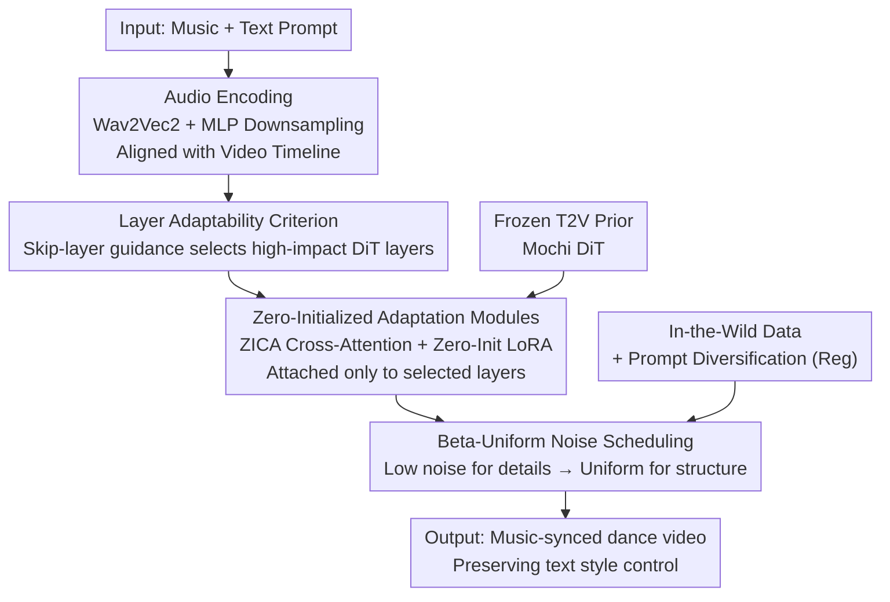

# MusicInfuser: Making Video Diffusion Listen and Dance

**Conference**: CVPR 2026  
**arXiv**: [2503.14505](https://arxiv.org/abs/2503.14505)  
**Code**: Available (Project page, University of Washington)  
**Area**: Video Generation / Diffusion Models / Multimodal  
**Keywords**: Music-driven dance generation, video diffusion adaptation, layer adaptability, zero-initialized cross-attention, prior preservation

## TL;DR
Instead of training an audio-video model from scratch, MusicInfuser injects zero-initialized music-video modules into a pre-trained text-to-video diffusion model (Mochi). It utilizes a "layer adaptability" criterion to select only a few DiT layers for cross-attention adaptation, enabling the video diffusion model to "dance to music" within one day on a single GPU while preserving the text control and image quality priors of the original model.

## Background & Motivation
**Background**: Music-driven dance generation has long followed the pipeline of "generating skeletons/SMPL motions first, then rendering," ranging from early HMM and graph methods to recent Transformers and diffusion models (e.g., work on AIST++). Another adjacent route is joint audio-video generation (e.g., MM-Diffusion), which conditions audio and video on each other.

**Limitations of Prior Work**: ① Skeleton/motion capture routes either depend on expensive mocap or rely on reconstructed motions, which are prone to floating/jittering artifacts. More importantly, skeleton representations are **under-parameterized for dance**—they cannot express spinal curvature, axial rotation, hand joints, or the dynamics of hair and clothing, which are the essence of dance. ② When training audio-video generation models from scratch, "high-quality dance videos aligned with music" are far scarcer than general unconstrained videos; insufficient data leads to poor quality.

**Key Challenge**: To directly generate dance **videos** (rather than intermediate skeletons) to preserve fine dynamics, massive music-dance video data is required. However, such specialized data is scarce and biased; direct training is expensive and destroys generation quality.

**Goal**: Decompose "generating high-quality dance videos" into two sub-problems: "reusing the existing human motion/physics/choreography priors of pre-trained text-to-video models" + "efficiently aligning the music modality without damaging those priors."

**Key Insight**: The authors observe that **text-to-video models already know how to dance**. Having been trained on massive video datasets, they implicitly learn human motion, style variations, body physics, and choreographic patterns. Rather than learning from scratch, it is better to "align" the model to music inputs. The difficulty lies in the fact that specialized dance data is scarce and biased; full fine-tuning would destroy existing priors.

**Core Idea**: Use "lightweight zero-initialized adaptation modules + selecting only a few layers most impactful to image structure for adaptation" to establish the relationship between music features and dance movements while preserving priors—requiring no motion data and completing training in one day on a single GPU.

## Method

### Overall Architecture
The input to MusicInfuser is a piece of music $\mathbf{a}$ and a text prompt $\mathbf{c}$. The output is a dance video synchronized with the music beats/style that conforms to the prompt's scene and style. Building upon a frozen pre-trained text-to-video denoiser $D_\theta(\mathbf{x}\,|\,\mathbf{c};\sigma)$ (Mochi), a set of trainable adaptation parameters $\phi$ is added to form the final denoiser $D_{\theta,\phi}(\mathbf{x}\,|\,\mathbf{c},\mathbf{a};\sigma)$. The optimization objective is the standard diffusion reconstruction loss on the joint video-caption-audio distribution $p_{\text{mm}}$, updating only $\phi$.

The pipeline consists of four synergistic components: Audio is first downsampled and projected via Wav2Vec 2.0 + shallow MLP into audio tokens aligned with the video temporal dimension; a **layer adaptability criterion** selects the most suitable DiT layers offline; **Zero-Initialized Cross-Attention (ZICA) + Zero-Initialized LoRA** are attached only to these layers to integrate music progressively and stably; during training, a **Beta-Uniform noise scheduling** focuses on details before structure, supplemented by in-the-wild data + prompt diversification for regularization. The data/control flow is as follows:

### Key Designs

**1. Layer Adaptability Criterion: Selecting DiT layers via "Skip-Layer Guidance"**

Adding cross-attention to all layers presents two issues: high computational overhead and **destruction of pre-trained denoising capabilities** in low-data scenarios like professional dance (Table 1 shows "All Layers" perform worse). Since exhaustive search is impossible ($\binom{48}{16}>2\times10^{12}$), the authors propose a **constructive** rather than destructive criterion. Instead of measuring performance drop after removing a layer, they quantify the positive impact of a layer when used as a **guidance signal**. Specifically, they construct skip-layer guidance based on the difference between the "full model" and the "model skipping layer $l$," corresponding to the derivative of an implicit energy function:

$$\nabla_{\mathbf{x}}\mathcal{G}_l = \big(D_\theta^{L}(\mathbf{x}\,|\,\mathbf{c};\sigma) - D_\theta^{L\backslash\{l\}}(\mathbf{x}\,|\,\mathbf{c};\sigma)\big)/\sigma$$

Where $L$ is the set of all layers and $D_\theta^{L\backslash\{l\}}$ is the denoiser skipping layer $l$. Existing video metrics are then used to measure the "video improvement brought by using this layer as guidance," defined as the **layer adaptability** of that layer. The intuition is: layers more intrinsically related to video structure/perceptual quality yield greater improvement when used as guidance; these are precisely where music adaptation can effectively influence motion and structure. This avoids training separate models for every combination and prevents deviation from the learned denoising manifold.

**2. Zero-Initialized Adaptation Modules (ZICA + LoRA): Gradual music integration without prior disturbance**

Randomly initialized cross-attention shifts predictions immediately, disrupting continuous training. **ZICA (Zero-Initialized Cross-Attention)** initializes the output projection matrix $\mathbf{W}_O$ to zero, making the cross-attention equivalent to an identity map initially, then gradually introducing conditional information. Given audio tokens $\mathbf{A}$ and video tokens $\mathbf{V}$, cross-attention with output projection is:

$$\mathbf{Z} = \mathbf{V} + \mathbf{W}_O\,\text{softmax}\!\Big(\tfrac{\mathbf{V}\mathbf{W}_Q(\mathbf{A}\mathbf{W}_K)^\top}{\sqrt{d}}\Big)\mathbf{A}\mathbf{W}_V$$

Since $\mathbf{W}_O=\mathbf{0}$, initially $\mathbf{Z}=\mathbf{V}$ (identity). The movement of $\mathbf{W}_O$ away from zero represents the gradual integration of audio. In parallel, attention weights are adapted using **Zero-Initialized LoRA**. While image models often use rank 8–16, the authors emphasize that higher ranks (rank 64 in implementation) are needed for video Transformers to capture temporal dependencies and complex human motion. Both ZICA and LoRA learn progressively from a "neutral starting point," smoothly adapting the network to the new modality without washing out priors.

**3. Beta-Uniform Noise Scheduling: Learning high-frequency details first, then overall structure**

Standard diffusion training uses uniform sampling for noise levels. To preserve the pre-trained model's denoising capability, the authors focus the adaptation phase on **low noise levels first** (corresponding to high-frequency details) before gradually learning larger-scale structural components. They transition the training noise distribution $\Sigma_{\text{train}}$ from a Beta distribution concentrated at low noise to a uniform distribution. Using a Beta distribution with $\alpha=1$:

$$f(x;\alpha{=}1,\beta) = \frac{(1-x)^{\beta-1}}{B(1,\beta)},\quad 0\le x\le 1$$

When $\beta>1$, probability mass concentrates near 0 (sampling small noise scales). As $\beta$ decays toward 1, the distribution flattens toward $\text{Uniform}(0,1)$. By starting with $\beta=3$ and exponentially decaying to 1, the model smoothly transitions from fine-tuning task-specific refined components to handling the fundamental structure of dance movements, thereby preserving general human motion physics priors.

**4. In-the-Wild Data + Prompt Diversification: Resisting overfitting and enforcing "listening"**

Training only on highly constrained studio data like AIST can lead to model degradation. The authors mix in 15,799 YouTube in-the-wild dance clips (diverse camera trajectories, lighting, and scenes) at a 1:1 ratio as regularization. For **prompt diversification**, constrained data uses template captions with placeholders, while in-the-wild videos utilize detailed captions auto-generated by VideoChat2. Crucially, **a small portion of detailed captions are randomly replaced with minimalist prompts** during training to force the adaptation network to "respond to music without relying on text," strengthening the link between music features and motion.

### Loss & Training
The objective function is the diffusion reconstruction loss targeting only the adaptation parameters $\phi$:

$$\mathcal{L}=\mathbb{E}_{(\mathbf{y},\mathbf{c},\mathbf{a})\sim p_{\text{mm}},\,\sigma\sim\Sigma_{\text{train}},\,\mathbf{n}\sim\mathcal{N}(\mathbf{0},\sigma^2\mathbf{I})}\big\|D_{\theta,\phi}(\mathbf{y}+\mathbf{n}\,|\,\mathbf{c},\mathbf{a};\sigma)-\mathbf{y}\big\|_2^2$$

Key hyperparameters: Mochi as the base model; 4,000 steps on a single A100 (~20 hours); LR $1\text{e}{-4}$; LoRA rank 64; Beta-Uniform starting $\beta=3$; inference CFG scale $\gamma_{\text{cfg}}=6.0$. Data includes 2,378 AIST segments + 15,799 in-the-wild segments.

## Key Experimental Results

Evaluation uses Video-LLM based automatic metrics (Qwen3-Omni and VideoLLaMA 2), assessing: **Dance Quality** (Style/Beat alignment, Physical realism, Choreography complexity), **Video Quality** (Imaging, Aesthetics, Consistency), and **Prompt Alignment** (Style capture, Satisfaction).

### Main Results

Dance Quality Comparison (Higher is better; AIST GT as reference):

| Model | Modality | Style Align | Beat Align | Realism | Complexity | Mean Dance |
|------|------|---------|---------|-----------|-----------|------------|
| AIST GT | A+V | 7.46 | 8.95 | 8.67 | 7.45 | 8.01 |
| MM-Diffusion | A+V | 7.16 | 8.56 | 7.05 | 7.53 | 7.16 |
| Mochi (base) | T+V | 7.20 | 8.34 | 7.68 | 7.82 | 7.70 |
| **MusicInfuser** | T+A+V | **7.56** | **8.89** | 8.24 | **7.90** | **7.95** |

Video Quality Comparison:

| Model | Modality | Imaging | Aesthetics | Consistency | Mean Video |
|------|------|---------|------|-----------|------------|
| AIST GT | A+V | 9.76 | 8.17 | 9.77 | 9.23 |
| MM-Diffusion | A+V | 8.94 | 6.52 | 8.38 | 7.94 |
| Mochi (base) | T+V | 9.46 | 7.90 | 8.98 | 8.78 |
| **MusicInfuser** | T+A+V | 9.60 | 7.87 | 9.39 | **8.95** |

Note: Dance quality (7.95) approaches GT (8.01). Video quality (8.95) is significantly higher than MM-Diffusion (7.94) and slightly higher than the base model (8.78).

### Ablation Study

Layer Selection Strategy and Component Ablation (Overall score):

| Configuration | Mean Dance | Mean Video | Overall |
|------|------------|------------|---------|
| **Ours (Adaptability Strategy)** | **8.22** | **8.02** | **8.14** |
| All Layers | 7.86 | 7.71 | 7.80 |
| Evenly Distributed | 7.76 | 7.40 | 7.62 |
| First Layers | 8.16 | 7.71 | 7.99 |
| Feature Addition (ControlNet style) | 8.04 | 7.71 | 7.92 |
| No Beta-Uniform Scheduling | 8.01 | 7.71 | 7.89 |
| No In-the-Wild Data | 8.13 | 7.66 | 7.95 |
| No ZICA Cross-Attention | 8.03 | 7.82 | 7.95 |

### Key Findings
- **Layer selection criterion is the primary contributor**: Selecting layers based on adaptability (Overall 8.14) outperforms heuristic methods and even **outperforms adapting all layers** (7.80), proving that full adaptation destroys priors in low-data regimes.
- **ZICA zero-initialization is vital for image quality**: Removing zero-initialization dropped video quality significantly (7.82 vs 8.02).
- **Feature Addition is inferior to ZICA**: Using cross-attention for conditioning is superior to simple spatial feature addition (Overall 7.92 vs 8.14).
- **In-the-wild data improves prompt alignment**: Style capture dropped from 7.80 to 6.80 without it, showing its role as a strong regularizer for generalization.
- **Music responsiveness is controllable**: Accelerating/decelerating audio results in corresponding rhythm changes, proving the model captures the "music speed ↔ motion dynamics" relationship rather than memorizing tracks.

## Highlights & Insights
- **"Constructive" layer importance measure**: Instead of "deleting layers to see what breaks" (which is OOD), it uses "layers as guidance to see what improves." This logic of using implicit energy function derivatives to characterize layer impact is transferable to other adaptation tasks.
- **Perspective: "Pre-trained video models already know how to dance"**: Reframes music-driven dance as "aligning existing priors" rather than "learning motion," bypassing skeleton limitations to gain fine-grained dynamics (hair, clothing, hand joints).
- **Unified zero-initialization philosophy**: Both ZICA and Zero-Init LoRA learn from a neutral identity starting point, providing a reusable paradigm for adding new modalities without destroying priors.
- **High efficiency**: Completes transformation of a T2V model into a music-synced generator in one day on one GPU without motion-specific data.

## Limitations & Future Work
- **Dependency on base priors**: The method "aligns" rather than "learns." If the base (Mochi) cannot naturally perform a certain movement style, adaptation cannot conjure it from nothing.
- **Video-LLM metric reliance**: Evaluation relies on Qwen3-Omni/VideoLLaMA 2. While correlated with human judgment, absolute scores and fine-grained discriminative power may be limited.
- **Layer adaptability definition**: The exact algorithm for mapping "improvement" to an "adaptability score" is detailed in the supplementary material rather than the main text.
- **Temporal constraints**: Training on 2.5s segments limits the stability of long-duration sequences and multi-person complex choreography.

## Related Work & Insights
- **vs MM-Diffusion**: MM-Diffusion trains from scratch; ours aligns T2V priors, leading to superior video quality (8.95 vs 7.94) without requiring massive paired data.
- **vs Skeleton/SMPL routes**: Traditional routes suffer from under-parameterization and jitter; ours generates video directly to preserve spinal and peripheral dynamics.
- **vs base Mochi**: Adds music synchronization and slightly improves prompt alignment (8.96 vs 8.86) while maintaining comparable image quality.
- **vs ControlNet Feature Addition**: Cross-attention conditioning (ZICA) proves more effective for multimodal integration (Overall 8.14 vs 7.92).

## Rating
- Novelty: ⭐⭐⭐⭐⭐ "Constructive layer adaptability + ZICA + Beta-Uniform scheduling" is a highly original and cohesive approach.
- Experimental Thoroughness: ⭐⭐⭐⭐ Solid metrics and ablations; however, objective beat synchronization metrics could be stronger.
- Writing Quality: ⭐⭐⭐⭐ Clear logic; formulas are well-placed.
- Value: ⭐⭐⭐⭐⭐ High engineering and conceptual utility; enables low-cost transformation of T2V models.

<!-- RELATED:START -->

## Related Papers

- [\[ICCV 2025\] X-Dancer: Expressive Music to Human Dance Video Generation](../../ICCV2025/video_generation/x-dancer_expressive_music_to_human_dance_video_generation.md)
- [\[CVPR 2025\] MotiF: Making Text Count in Image Animation with Motion Focal Loss](../../CVPR2025/video_generation/motif_making_text_count_in_image_animation_with_motion_focal_loss.md)
- [\[CVPR 2026\] Generative Neural Video Compression via Video Diffusion Prior](generative_neural_video_compression_via_video_diffusion_prior.md)
- [\[CVPR 2026\] RFDM: Residual Flow Diffusion Models for Video Editing](rfdm_residual_flow_diffusion_models_for_video_editing.md)
- [\[CVPR 2026\] VMonarch: Efficient Video Diffusion Transformers with Structured Attention](vmonarch_efficient_video_diffusion_transformers_with_structured_attention.md)

<!-- RELATED:END -->
