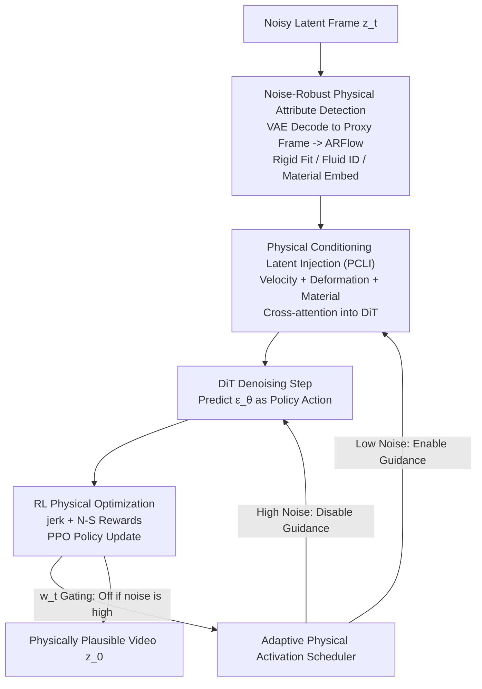

# NS-Diff: Fluid Navier-Stokes Guided Video Diffusion via Reinforcement Learning

**Conference**: CVPR 2026  
**Paper**: [CVF Open Access](https://openaccess.thecvf.com/content/CVPR2026/html/Deng_NS-Diff_Fluid_Navier-Stokes_Guided_Video_Diffusion_via_Reinforcement_Learning_CVPR_2026_paper.html)  
**Area**: Video Generation / Diffusion Models / Reinforcement Learning  
**Keywords**: Video Diffusion, Physical Plausibility, Navier-Stokes, Reinforcement Learning, PPO

## TL;DR
NS-Diff reformulates the denoising trajectory of video diffusion as a "physically constrained Markov Decision Process." It detects rigid/fluid regions in the latent space of a DiT, injects velocity fields and deformation gradients, and fine-tunes the denoising policy using PPO with a reward based on "rigid body minimum jerk + fluid simplified Navier-Stokes." This ensures motion adheres to physical laws (reducing jerk error by 43%, fluid divergence by 33%, and improving FVD by 22.7%) without relying on physical simulators or manual annotations.

## Background & Motivation
**Background**: Video generation models based on diffusion (e.g., SORA, OpenSora2, Wan2.1) have achieved high visual fidelity and long-range consistency, producing realistic textures and frames.

**Limitations of Prior Work**: Visual plausibility does not equal physical correctness. These models often generate physically impossible movements—rigid objects (like plastic chairs) deforming like soft bodies, objects appearing/disappearing/splitting/merging, and sand or water flows violating continuity. No matter how high the visual quality, these mechanical violations expose the "fake" nature of the generated content.

**Key Challenge**: Integrating physics into generative models is difficult. One approach (e.g., VideoJam) learns motion representations from videos without enforcing physical laws (soft constraints). Another approach (e.g., Phy3DGen, PhysDiff, PhysGen) explicitly models mechanics or uses differentiable simulation, but requires expensive simulation data or manual constraints (external forces, boundary conditions), leading to poor generalization and high overhead. The fundamental contradiction is: **either the constraints are too weak to be effective, or they are too heavy/simulation-dependent to generalize**.

**Goal**: Inject "lightweight but effective" physical constraints into the diffusion denoising process without expensive fluid simulation or physical labels, covering both rigid and fluid dynamics while suppressing general physical violations like object pop-in/out.

**Key Insight**: Reinforcement Learning (RL) excels at "optimizing structured behavior and enforcing constraints without predefined simulations." By treating each denoising step as a decision and "physical plausibility" as a reward, policy gradients can embed physical preferences directly into the denoiser without explicitly solving fluid equations.

**Core Idea**: Rewrite the diffusion denoising trajectory as a physically constrained MDP. Optimize the denoising policy using PPO, where the reward consists of "rigid minimum jerk penalty + fluid simplified N-S divergence/smoothness penalty." **Differentiable, lightweight physical proxies are used as rewards instead of expensive simulations**.

## Method

### Overall Architecture
NS-Diff is built upon a pre-trained DiT video diffusion backbone (OpenSora2). The pipeline revolves around a core reformulation: **treating the $T$-step denoising process as a physically constrained Markov Decision Process (MDP)**. The state $s_t$ at each step is the noisy latent variable $z_t$ augmented with physical attributes (velocity, divergence, deformation cues); the action $a_t$ is the denoising direction $\epsilon_\theta(z_t,t)$ predicted by the DiT; and the reward $\mathcal{J}_t$ is a scalar encouraging physically plausible motion.

The method consists of three core components plus a scheduler: first, **detecting** rigid/fluid regions and estimating motion from noisy latent frames (Attribute Detection); second, **injecting** velocity fields, deformation gradients, and material embeddings into DiT intermediate features through cross-attention (PCLI); and third, **fine-tuning** the denoising policy using PPO with physical rewards (RL Optimization). An adaptive activation scheduler is added because motion estimation is unreliable at high noise levels; physical guidance is only enabled at lower noise steps.

### Key Designs

**1. Noise-Robust Physical Attribute Detection: Estimating Regions in Noisy Latent Space**
Physical guidance requires knowing "what is rigid, what is fluid, and how they move." However, directly applying optical flow estimators like ARFlow to noisy intermediate frames fails. Ours utilizes a **hybrid latent-decoding motion estimation scheme**: latents $z_t$ are decoded into low-resolution RGB proxy frames $\hat{x}_t=\text{Decoder}(z_t)$. This preserves spatial structure for flow estimation while saving computation. ARFlow computes optical flow $\mathbf{D}_t=\text{ARFlow}(\hat{x}_{t+1}, \hat{x}_t)$ between adjacent proxy frames.

After obtaining flow, the method performs three tasks. **Camera compensation** removes ego-motion: $\mathbf{D}_t(\mathbf{p})=\mathbf{H}_t\mathbf{p}-\mathbf{p}$. **Rigid detection** uses affine fitting: for each patch, if the residual of $\mathbf{D}_t(u,v) \approx \mathbf{A}\mathbf{p}_{uv} + \mathbf{b}$ is small, it is marked as rigid. **Fluid identification** looks at divergence and curl: regions satisfying $(\nabla\cdot\tilde{\mathbf{D}}_t)^2 + (\nabla\times\tilde{\mathbf{D}}_t)^2 > \tau_{\text{fluid}}$ are identified as fluid. Finally, a small MLP predicts material types.

**2. Physical Conditioning Latent Injection (PCLI): Aligning Physical Cues with DiT**
PCLI packages the attributes into per-patch descriptors: velocity field $\mathbf{v}_t^{(k)}$, deformation gradient $\mathbf{G}_t = \nabla\tilde{\mathbf{D}}_t$, and material embeddings $e_t^{\text{mat}}$. These are mapped to a $d_p=128$ dimensional physical latent representation $\mathbf{p}_t$ through MLPs. Injection uses cross-attention where DiT visual features $\mathbf{f}_t$ serve as queries and $\mathbf{p}_t$ as keys/values. An adaptive gate $g_t$ ensures physical cues "correct" rather than "override" the denoising process.

**3. RL Physical Optimization: Physical Laws as Rewards**
The denoiser $\epsilon_\theta$ is parameterized as a stochastic policy $\pi_\theta(a_t|s_t) = \mathcal{N}(a_t; \epsilon_\theta(s_t,t), \sigma_p^2\mathbf{I})$. Rewards are defined as differentiable proxies for physical laws:
- **Rigid Reward (Minimum Jerk)**: Penalizes the rate of change of acceleration $\mathbf{J}_t$ to suppress non-physical jitter. $\mathcal{L}_{\text{rigid}} = \tfrac{1}{|\mathcal{R}_t|}\sum_{\mathcal{R}_t}\|\mathbf{J}_t\|_2^2$.
- **Fluid Reward (Simplified Navier-Stokes)**:
$$\mathcal{L}_{\text{fluid}} = \frac{1}{|\mathcal{F}_t^k|}\sum_{\mathcal{F}_t^k}\left(\lambda_p\|\nabla(\nabla\cdot\mathbf{v}_t^k)\|_2^2 + \|\nabla\cdot\mathbf{v}_t^k\|_2^2 + \nu\|\nabla^2\mathbf{v}_t^k\|_2^2 + \eta\|\mathbf{v}_t^k\cdot\nabla\mathbf{v}_t^k\|_2^2\right)$$
The terms represent pressure correction (via divergence gradient), incompressibility, viscosity, and convection. PPO is used to update the policy weights using an advantage estimated by GAE.

**4. Adaptive Physical Activation Scheduler**
Early denoising steps have extremely high noise, making motion estimation unreliable. The scheduler calculates a weight $w_t \in [0, 1]$. guidance is disabled ($w_t=0$) until a certain threshold is reached, after which it increases smoothly. This prevents unstable gradients from noisy estimates during training.

### Loss & Training
The RL fine-tuning uses a Gaussian policy with $\sigma_p=0.1$ and PPO clip $\epsilon=0.2$. On-policy rollouts are collected for 32 denoising steps. Standard diffusion loss is maintained during RL fine-tuning to stabilize the model. Training took approximately 4 days on 8 $\times$ A40 GPUs, with physical attribute computation adding only ~8% overhead. **No physical annotations** are used during training.

## Key Experimental Results

### Main Results
On PhysVideoBench, NS-Diff outperforms all baselines in both physical and visual metrics ($\Delta J$ and $\mathcal{L}_{\text{div}}$ lower is better):

| Method | $\Delta J$ ↓ | $\mathcal{L}_{\text{div}}$ ↓ | Appear. ↑ | Motion ↑ |
| :--- | :--- | :--- | :--- | :--- |
| VideoJam | 0.74 | 4.7 | 71.6 | 90.1 |
| PhysGen | 0.63 | 3.5 | 72.8 | 91.0 |
| OpenSora2-1B | 0.72 | 4.6 | 70.4 | 89.2 |
| **NS-Diff-DiT 1B** | **0.33** | **2.9** | **73.1** | **92.4** |
| **NS-Diff-DiT 11B** | **0.25** | **2.4** | **74.4** | **93.7** |

NS-Diff 11B achieves an FVD of 85 on UCF-101 (vs. 110 for OpenSora2). Jerk error is reduced by 43%, and fluid divergence by 33%.

### Ablation Study
Ablations on PhysVideoBench (1B DiT):

| Configuration | Appear. ↑ | Motion ↑ | $\Delta J$ ↓ | $\mathcal{L}_{\text{div}}$ ↓ |
| :--- | :--- | :--- | :--- | :--- |
| Full Model (Physics + PPO) | 73.1 | 92.4 | 0.33 | 2.9 |
| Physics loss w/o RL | 71.5 | 90.1 | 0.58 | 4.7 |
| w/o PCLI | 70.0 | 88.1 | 0.82 | 6.9 |
| w/o Adaptive Scheduler | 72.2 | 91.0 | 0.67 | 4.1 |

### Key Findings
- **RL > Direct Gradient**: Removing RL (using direct gradients) worsens $\Delta J$ from 0.33 to 0.58, indicating that PPO's trajectory-level optimization is vital for temporal stability.
- **PCLI is Crucial**: Removing PCLI causes a massive drop in both visual and physical scores; physical constraints must be "seen" by the model to be optimized.
- **Scheduler Prevents Collapse**: Without the scheduler, performance degrades significantly due to unreliable gradients at high noise levels.
- **Material Self-Organization**: t-SNE analysis shows the model naturally clusters materials (e.g., fluid viscosity types), suggesting it learns fine-grained physical understanding.

## Highlights & Insights
- **MDP Reformulation**: Treating denoising as a physically constrained MDP is a powerful perspective. It replaces explicit differential equation solving with policy gradients, bypassing the need for simulation data.
- **Soft Pressure Projection**: Using $\|\nabla(\nabla\cdot\mathbf{v})\|^2$ as a proxy for pressure correction is a clever, efficient way to approximate incompressibility without solving Poisson equations.
- **Latent-Proxy Bridge**: Decoding latents into low-res RGB frames allows using mature 2D vision tools (like ARFlow) within latent diffusion models with minimal overhead.

## Limitations & Future Work
- **Simplified Physics**: Minimum jerk and simplified N-S do not account for complex collisions, friction, or phase changes. This is a trade-off between realism and compute.
- **Optical Flow Dependency**: The physical constraints are only as good as the motion estimation from the proxy frames.
- **Evaluation Alignment**: Some metrics (jerk/divergence) are directly optimized by the method, which may bias cross-method comparisons on specific benchmarks.

## Related Work & Insights
- **vs. PhysGen**: PhysGen requires user-defined forces and rigid simulations; Ours is generalizable and annotation-free.
- **vs. VideoJam**: VideoJam learns soft representations; Ours enforces explicit mechanical laws via rewards.
- **vs. PhysDiff**: Explicit modeling approaches often require manual constraints or specific domains (like human motion); Ours works in open-domain video latents.

## Rating
- **Novelty**: ⭐⭐⭐⭐⭐ "Denoising trajectory = Physical MDP" is a highly novel and self-consistent framework.
- **Experimental Thoroughness**: ⭐⭐⭐⭐ Comprehensive across three benchmarks, though some metrics are closely tied to optimization targets.
- **Writing Quality**: ⭐⭐⭐⭐ Clear structure with complete formulations.
- **Value**: ⭐⭐⭐⭐⭐ Provides a reusable paradigm for injecting domain-specific physical knowledge into generative models without annotations.

<!-- RELATED:START -->

## Related Papers

- [\[CVPR 2026\] Goal-Driven Reward by Video Diffusion Models for Reinforcement Learning](goal-driven_reward_by_video_diffusion_models_for_reinforcement_learning.md)
- [\[CVPR 2026\] Identity-Preserving Image-to-Video Generation via Reward-Guided Optimization](identity-preserving_image-to-video_generation_via_reward-guided_optimization.md)
- [\[NeurIPS 2025\] RLGF: Reinforcement Learning with Geometric Feedback for Autonomous Driving Video Generation](../../NeurIPS2025/video_generation/rlgf_reinforcement_learning_with_geometric_feedback_for_autonomous_driving_video.md)
- [\[CVPR 2026\] Accelerating Autoregressive Video Diffusion via History-Guided Cache and Residual Correction](accelerating_autoregressive_video_diffusion_via_history-guided_cache_and_residua.md)
- [\[CVPR 2026\] PropFly: Learning to Propagate via On-the-Fly Supervision from Pre-trained Video Diffusion Models](propfly_learning_to_propagate_via_on-the-fly_supervision_from_pre-trained_video_.md)

<!-- RELATED:END -->
