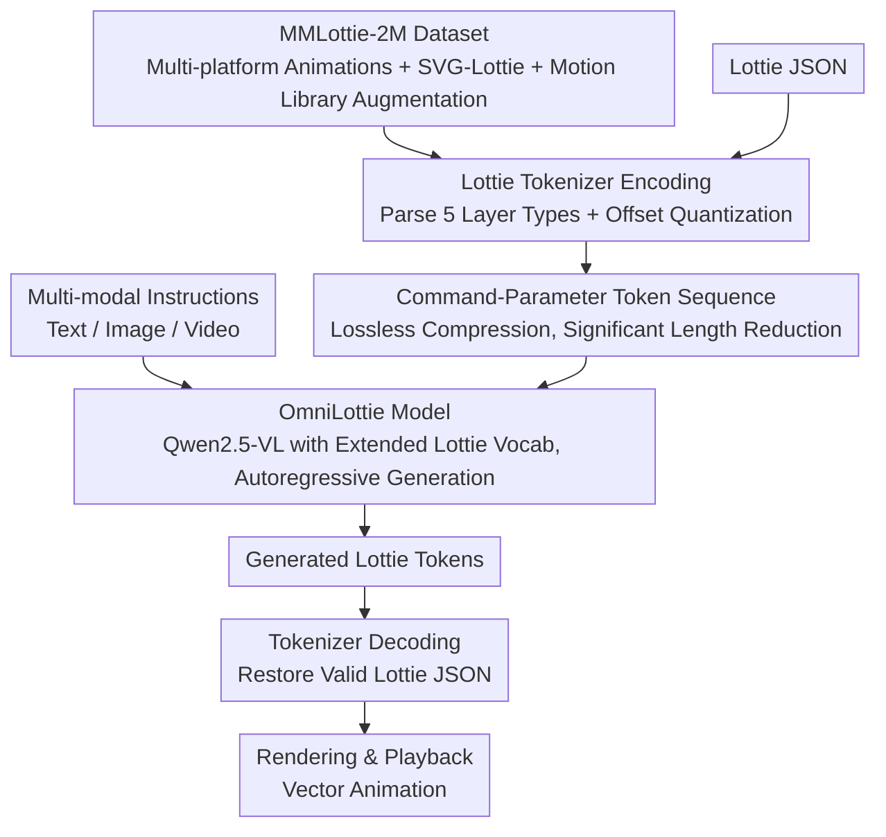

# OmniLottie: Generating Vector Animations via Parameterized Lottie Tokens

**Conference**: CVPR 2026  
**arXiv**: [2603.02138](https://arxiv.org/abs/2603.02138)  
**Code**: To be confirmed (Paper mentions Project Page)  
**Area**: Video Generation  
**Keywords**: Lottie, Vector Animation, tokenization, Multi-modal instruction, VLM generation

## TL;DR
OmniLottie proposes a Lottie Tokenizer that converts Lottie JSON files into structured command-parameter sequences. This enables pre-trained VLMs to generate high-quality vector animations based on multi-modal cross-instructions. The work also constructs the MMLottie-2M large-scale dataset to support training.

## Background & Motivation

### Background
Vector animations (e.g., SVG animations, Lottie format) are widely used in UI design, mobile apps, and web pages due to their small size, resolution independence, and programmable editability. However, automated generation of vector animations remains an underexplored direction—existing works primarily focus on static vector graphics or pixel-level video generation.

### Limitations of Prior Work

**Redundancy of Lottie JSON**: Original Lottie files contain substantial invariant structural metadata and formatting tokens (e.g., brackets, key names), which act as significant noise for learning animation generation.

**Lack of Training Data**: There is a lack of large-scale paired datasets for vector animation and text.

**VLM's Lack of Format Understanding**: Existing VLMs can only generate text or images and cannot directly output structured animation descriptions.

### Key Challenge
Lottie is the most popular vector animation format, but its JSON representation is unfriendly to machine learning. Redundant formatting tokens cause sequence lengths to explode, making it difficult to learn effective generative models.

### Core Idea
Design a **Lottie Tokenizer** to convert Lottie JSON into compact command + parameter sequences (removing all structural redundancy), allowing pre-trained VLMs to generate vector animations autoregressively, similar to natural language generation.

## Method

### Overall Architecture
OmniLottie transforms the task of "generating a vector animation" into "autoregressive sequence generation," a task pre-trained VLMs already excel at. Its key observation is that while Lottie is essentially a JSON file, the majority of characters are invariant structural metadata (version numbers, key names, indentation). Only the layer shapes, transformations, and keyframe interpolations carry animation semantics. The pipeline first uses a Tokenizer to parse and parameterize the Lottie JSON into a compact "command + parameter" token sequence. A VLM with an expanded vocabulary (Qwen2.5-VL) then receives multi-modal instructions (text/image/video) and autoregressively generates the tokens. Finally, these are de-tokenized back into valid Lottie files for rendering. To support training and evaluation, the authors created the MMLottie-2M dataset (2 million samples) and the MMLottie-Bench baseline.

### Key Designs

**1. Lottie Tokenizer: Parsing and parameterizing redundant JSON into command-parameter sequences to shorten sequences for effective learning.**

The main issue with feeding raw Lottie JSON into models is sequence explosion—most characters are structural metadata with zero contribution to animation semantics, diluting effective signals. The Tokenizer operates in two steps. **First, Parameterization**: The Lottie tree is decomposed into basic metadata $M=\{v, fr, ip, op, w, h, nm, ddd\}$ and $N$ layers. Each layer is parsed according to its type (the paper supports five types: pre-composition ty=0, solid ty=1, null ty=3, shape ty=4, text ty=5) into transformations, effects, and shape paths, then flattened into a series of "command + parameter" function calls (e.g., `CMD_ANIMATION`, `CMD_POINT`). **Second, Discretization**: Offset-based quantization maps continuous parameters (coordinates, time, transformations) to discrete tokens: $\text{token}(x,t)=\lfloor x\cdot s_t\rfloor+o_t$, where $s_t$ is the scaling factor for the parameter type and $o_t$ is the vocabulary offset. Different parameter types (time, space, index, speed, style) occupy non-overlapping offset ranges to avoid token conflicts while preserving semantics. This process is lossless. Removing format redundancy significantly shortens sequences, allowing the autoregressive model to perceive the entire animation structure within a limited context.

**2. OmniLottie Model: Integrating Lottie tokens into the Qwen2.5-VL vocabulary to align animation generation with the language modeling paradigm.**

The authors use Qwen2.5-VL as the backbone and extend its vocabulary with randomly initialized Lottie token embeddings. This integrates the Lottie sequence into the same discrete vocabulary. Training uses the standard next-token cross-entropy loss: $$\theta^*=\arg\min_\theta -\sum_{i} \log P(x_s^{[i]}\mid x_c; x_s^{[<i]}; \theta)$$, where $x_c$ represents the multi-modal instruction condition. Leveraging a pre-trained VLM inherits its multi-modal understanding, enabling support for three tasks: Text-to-Lottie, Text-Image-to-Lottie, and Video-to-Lottie.

**3. MMLottie-2M and MMLottie-Bench: Addressing the lack of large-scale paired data and standardized evaluation.**

Data: The authors crawled Lottie animations from platforms like LottieFiles, IconScout, and Flaticon, cleaning unparameterizable elements (base64 images, audio). To mitigate the scarcity of native animations, they used static SVGs from OmniSVG paired with preset motions (SVG-Lottie) and extracted motion trajectories from 1 million real Lotties to create a "motion template library" for augmentation. This resulted in a 2-million-scale dataset. Each animation was automatically labeled by a VLM with descriptions and frame-by-frame temporal details. Evaluation: MMLottie-Bench was established, containing 450 real samples (Real Subset) and a Synthetic Subset generated via GPT-4o / Gemini, evaluated based on visual quality and multi-modal alignment.

### Main Results: Generation Quality

| Method | FID ↓ | CLIP Score ↑ | Human Preference (%) |
|------|-------|-------------|-------------|
| DeepSVG + Motion | 142.3 | 0.21 | 12.3 |
| SVGDreamer | 98.7 | 0.28 | 22.8 |
| AnimateDiff (pixel) | 45.2 | 0.35 | 28.4 |
| **Ours** | **38.6** | **0.41** | **36.5** |

### Ablation Study

| Configuration | CLIP Score ↑ | Description |
|------|-------------|------|
| Full OmniLottie | 0.41 | Complete method |
| w/o Lottie Tokenizer (raw JSON) | 0.24 | Direct JSON text; sequence too long, quality drops |
| w/o Animation Functions | 0.33 | Generates static shapes only, no animation |
| w/o MMLottie Pretrain | 0.31 | Without large-scale pre-training |

### Key Findings
- **The Lottie Tokenizer is core**: Removing it drops the CLIP Score from 0.41 to 0.24 because raw JSON is too verbose for the model to learn effectively.
- Generated vector animations play smoothly on mobile devices with file sizes ~1/100th of equivalent pixel videos.
- Multi-modal instruction flexibility is verified—text, image-text, and video inputs all generate semantically aligned animations.
- The model can generate complex scenes with multiple objects and multi-layered animations.

## Highlights & Insights
- **Transforming vector animation generation into sequence generation**: The Lottie Tokenizer design perfectly aligns this task with the LLM paradigm.
- **Filling the data gap with MMLottie-2M**: The 2-million-scale professional vector animation dataset is a major resource for the community.
- **High practical value**: Generated Lottie files can be used directly in App/Web development without post-processing.
- **Inspiration for serialized format design**: The logic of the Lottie Tokenizer can be extended to other structured formats (e.g., CAD, SVG, Code AST).

## Limitations & Future Work
- Currently supports only the Lottie format; not extended to SVG or CSS animations.
- Generation quality for complex animations (e.g., masks, blend modes, expressions) needs improvement.
- Quantization of parameter values introduces precision loss; subtle animation curves may be coarsened.
- Lack of automatic metrics for evaluating temporal animation quality—FID and CLIP primarily assess static frames.
- The model does not support interactive editing of generated animations.

## Related Work & Insights
- **vs. DeepSVG**: DeepSVG focuses on VAE generation of static vector graphics and does not support animation.
- **vs. AnimateDiff**: AnimateDiff generates pixel videos; OmniLottie generates editable, small-footprint vector formats.
- **vs. SVGDreamer**: SVGDreamer uses diffusion for SVGs but lacks animation and multi-modal input support.
- **Insight**: Tokenization of structured formats is the key bridge connecting traditional design tools with AI generation.

## Rating
- Novelty: ⭐⭐⭐⭐⭐ Modeling vector animation as sequence generation is a first; Tokenizer design is clever.
- Experimental Thoroughness: ⭐⭐⭐⭐ Includes human evaluation and ablations, but lacks temporal quality metrics.
- Writing Quality: ⭐⭐⭐⭐ Clear problem introduction and good visualization of tokenizer design.
- Value: ⭐⭐⭐⭐⭐ Significant contributions in dataset, method, and application value.

<!-- RELATED:START -->

## Related Papers

- [\[CVPR 2026\] LottieGPT: Tokenizing Vector Animation for Autoregressive Generation](lottiegpt_vector_animation_generation.md)
- [\[CVPR 2026\] Vector Prism: Animating Vector Graphics by Stratifying Semantic Structure](vector_prism_animating_vector_graphics_by_stratifying_semantic_structure.md)
- [\[CVPR 2026\] Generating Humanless Environment Walkthroughs from Egocentric Walking Tour Videos](generating_humanless_environment_walkthroughs_from_egocentric_walking_tour_video.md)
- [\[CVPR 2026\] A Frame is Worth One Token: Efficient Generative World Modeling with Delta Tokens](a_frame_is_worth_one_token_efficient_generative_world_modeling_with_delta_tokens.md)
- [\[CVPR 2026\] Ego-InBetween: Generating Object State Transitions in Ego-Centric Videos](ego-inbetween_generating_object_state_transitions_in_ego-centric_videos.md)

<!-- RELATED:END -->
