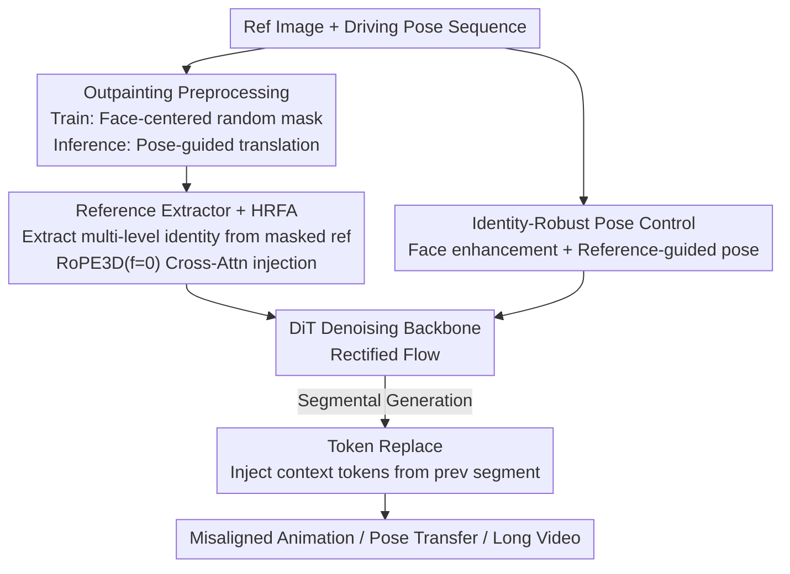

# One-to-All Animation: Alignment-Free Character Animation and Image Pose Transfer

**Conference**: CVPR 2026  
**Paper**: [CVF Open Access](https://openaccess.thecvf.com/content/CVPR2026/html/Shi_One-to-All_Animation_Alignment-Free_Character_Animation_and_Image_Pose_Transfer_CVPR_2026_paper.html)  
**Code**: https://github.com/ssj9596/One-to-All-Animation  
**Area**: Video Generation / Diffusion Models  
**Keywords**: Character Animation, Pose Transfer, Misaligned Reference, Outpainting, Long Video Generation

## TL;DR
Addressing the long-standing challenge of "spatial misalignment" between reference images and driving videos, this paper reformulates character animation training as a self-supervised outpainting task. By combining a specialized reference feature extractor, identity-skeleton decoupled pose control, and a TokenReplace long-video strategy, the model enables a single reference image of **arbitrary layout** to drive cross-scale video animation and image pose transfer, outperforming SOTA models of similar scale.

## Background & Motivation
**Background**: Diffusion models (especially DiT-based video backbones like Wan2.1) have made "pose-driven character animation" increasingly realistic—generating a video of a person from a reference image following a driving pose sequence. Mainstream approaches typically use **self-reconstruction** training: sampling reference and driving frames from the same video, which naturally ensures consistent layout and skeleton geometry.

**Limitations of Prior Work**: This training paradigm embeds a fatal assumption—that the reference image and driving video must be "aligned" during inference. When **misalignment** occurs, existing methods fail. Misalignment occurs at two levels: (1) **Spatial layout mismatch**—e.g., a half-body portrait reference vs. a full-body dancing driving video, where scales and coverage differ significantly; (2) **Facial inconsistency**—differences in the geometric proportions of facial features (eye-nose-mouth spacing) between the reference and the driving subjects. The former leads to body distortion, while the latter causes identity drift.

**Key Challenge**: To maintain alignment, existing methods impose two constraints during inference: the requirement for spatially matched reference images and a heavy reliance on **pose retargeting** to align the driving pose to the reference. However, in real-world scenarios, reference layouts vary wildly. If retargeting is inaccurate, identity drifts; older methods (e.g., MimicMotion, StableAnimator) may even lose appearance entirely or generate incorrect identities under misaligned inputs.

**Goal + Key Insight**: Instead of assuming "perfect alignment" during training, the authors ask—can we **directly train the model to handle misalignment**? The core insight is to reformulate the training as an **outpainting (field-of-view expansion) problem**, using a unified "masked input" format that allows the model to learn generation from diverse layouts. Such a framework unifies three tasks: misaligned image-to-image, aligned image-to-video, and misaligned image-to-video.

**Core Idea**: Replace "align-and-reconstruct" with "mask-and-complete," transforming layout misalignment from a nuisance to be avoided into a capability the model should learn.

## Method
Given a reference image $I_r$ and a sequence of driving video poses $P_{1:N}$, the goal is to generate a video that maintains the reference identity and follows the driving motion. The method intervenes at both the **data** and **model** levels: the data side uses self-supervised outpainting to synthesize "spatially misaligned" reference-driving pairs, while the model side features a reference extractor for masked inputs, identity-robust pose control to mitigate pose overfitting, and TokenReplace for long-video support. The framework is built upon the Wan2.1 text-to-video backbone, with 1.3B and 14B versions trained.

### Overall Architecture
During inference, as the reference image may differ significantly in scale from the driving sequence, a **pose-guided translation** is performed first: an "anchor frame" with a pose orientation closest to the reference is selected from the driving sequence. Visible body parts (e.g., shoulder width, ear distance) are used to estimate the scale ratio, and the reference is scaled and zero-padded to the driving resolution, resulting in an adjusted input $\tilde{I}_r$ and a mask $M_r$ marking the padded areas. The model takes the triplet $(\tilde{I}_r, M_r, P_{1:N})$ and "hallucinates" the missing appearance in the padded regions while following the motion. During training, the reference is randomly masked (face-centered) to create identical "masked inputs," using the original full video as supervision to force the network to learn to complete occluded regions.

### Key Designs

**1. Outpainting Preprocessing: Reformulating "Align-Reconstruct" to "Mask-Complete"**

This is the foundation of the work, directly targeting the contradiction between "aligned training" and "misaligned inference." The authors retain the self-reconstruction framework but introduce a critical modification: during training, frames are no longer treated as naturally aligned. Instead, **face-centered random masking** is applied to the reference image to simulate various scale conditions, generating a binary outpainting mask. The "masked reference + mask + pose sequence" is used as input, with the original full video as supervision. This ensures the training input is **completely isomorphic** to the "scale+zero-pad" input produced by pose-guided translation during inference. The model is forced to hallucinate occluded areas and generate coherent motion during training, enabling it to handle real-world misaligned references naturally. In short: misalignment is treated as a completion task learned during training.

**2. Reference Extractor + Hybrid Reference Fusion Attention (HRFA): Extracting Identity from Incomplete References**

Outpainting training introduces a challenge—how to extract reliable appearance features from heavily masked reference images? Existing solutions fall short: CLIP encoders provide only global semantics lacking fine-grained identity, and I2V backbones are limited by "first-frame copy-paste" constraints. The authors design a dedicated extractor **parallel** to the denoising DiT backbone that outputs features in the same latent space. The reference $\tilde{I}_r$ and mask $M_r$ are encoded via 3D VAE, concatenated, and patchified into initial features $r^0$, then refined through $M$ text-free blocks (initialized from the DiT backbone, removing text cross-attention). These $M+1$ features are injected into $N$ denoising blocks ($n=N/(M+1)$ blocks share each feature) via zero-initialized linear projections.

The core is **HRFA**, which adds a reference cross-attention layer above the DiT self-attention. Video self-attention uses 3D RoPE: $Q=\mathrm{RoPE}_{3D}(hW_q)$, $K=\mathrm{RoPE}_{3D}(hW_k)$, $V=hW_v$. Reference cross-attention uses new projections $W_k', W_v'$ to compute $K'=\mathrm{RoPE}_{3D,f=0}(rW_k')$ and $V'=rW_v'$. Crucially, $\mathrm{RoPE}_{3D,f=0}(hW_q)$ is also applied to the video-side $Q'$, setting the frame index to zero to prevent the cross-attention from learning **absolute frame position dependencies** between the reference and video frames. This preserves temporal extrapolation capabilities, allowing the same weights to handle both images and videos. The two paths are fused by simple addition:

$$\mathbf{z}'_{\text{fusion}} = \mathrm{Attention}(Q,K,V) + \mathrm{Attention}(Q',K',V')$$

This enables identity preservation across variable resolutions and sequence lengths.

**3. Identity-Robust Pose Control: Decoupling Identity from Driving Skeletons**

While outpainting solves layout misalignment at the body level, training-test inconsistency remains at the **facial level**. Since training reference and driving poses come from the same video, faces are aligned, causing the model to **overfit to the driving facial skeleton**—identities are "warped" by the driving skeleton. The authors propose a two-step solution:

First, **face region enhancement**: during training, only the **facial keypoints** of the driving pose are perturbed while keeping body keypoints intact, deliberately creating facial misalignment. This forces the model to recover identity from the reference image rather than the driving skeleton. This enhancement is applied to 70% of samples, with a "dim signal" marking whether a pose is original or enhanced. If retargeting is unreliable during inference, the model can accept the dim pose signal, preserving identity without strict skeleton matching. Second, **reference-guided pose control**: face enhancement alone breaks the element-wise pose injection and introduces instability. Thus, reference guidance is introduced: the reference VAE latent $z^r$ is concatenated along the frame dimension to the video latents $\tilde{\mathbf{z}}^{1:(n+1)}=[\mathbf{z}^r,\mathbf{z}^{1:n}]$. The reference pose $\tilde{P}_r$ (unenhanced, aligned with reference) and driving poses are encoded via Pose ResNet and concatenated, then passed through self-attention $\tilde{\mathbf{p}}^{1:(n+1)}=\mathrm{SA}([\mathbf{p}^r,\mathbf{p}^{1:n}])$ to capture intra-sequence dependencies. The refined pose representation is added to the output of the first DiT block. The "unenhanced reference pose" serves as a relational anchor to stabilize the training noise introduced by enhancement.

**4. Token Replace: Seamless Transition for Long Videos**

Sequential generation of long videos often suffers from boundary flickers. The authors encode the last 5 frames of the previous segment via 3D VAE into 2 latent frames as context tokens $z_{ctx}$. At **each** denoising step $t$, the first two latent frames of the current segment's noise are replaced: $\tilde{\mathbf{z}}^{1:n}_t=[\mathbf{z}_{ctx},\mathbf{z}^{3:n}_t]$. During training, context tokens are excluded from the reconstruction loss and serve only as temporal guidance; during inference, they act as "clean signals" at $t=0$ fed into the feature modulation modules throughout denoising. After denoising, the first two tokens are discarded, and the last two are reserved for the next segment's context. Simple replacement ensures smooth transitions.

### Loss & Training
The model uses Rectified Flow: forward path $\mathbf{x}_t=(1-t)\mathbf{x}_0+t\boldsymbol{\varepsilon}$, with the network predicting target velocity $u_t=\boldsymbol{\varepsilon}-\mathbf{x}_0$ via regression loss $\mathcal{L}_{RF}=\lVert v_t-u_t\rVert^2$. Text prompts are fixed as empty strings. **Three-stage training**: ① Training the Reference Extractor and HRFA's $W_k'/W_v'$ with appearance conditions only; ② Introducing pose conditions, joint training of reference-guided pose control and all HRFA components; ③ Adding TokenReplace. Mixed image-video training is used (multi-resolution 512/768, video:image = 6:1, 29 frames per video segment). Inference uses Euler sampling (30 steps) with cumulative classifier-free guidance to enhance reference appearance and pose separately: $x_{t-1}=x^{t-1}_{\varnothing}+\lambda_P(x^{t-1}_P-x^{t-1}_{\varnothing})+\lambda_I(x^{t-1}_{RP}-x^{t-1}_P)$, where $\lambda_P=\lambda_I=1.5$.

## Key Experimental Results

### Main Results
Built on Wan2.1, trained on 8× H20 GPUs. Dataset includes ~7k web portrait videos + TikTok/Champ/UBC/DeepFashion + 200 cartoon characters. Video tasks evaluated on TikTok benchmark + 12 out-of-domain cartoon pairs (a/b = TikTok/Cartoon):

| Scale | Model | PSNR↑ | SSIM↑ | LPIPS↓ | FVD↓ |
|-------|-------|-------|-------|--------|------|
| ~1.3B | MimicMotion | 15.43/15.09 | 0.721/0.647 | 0.315/0.368 | 412.5/943.4 |
| ~1.3B | StableAnimator | 14.92/15.16 | 0.737/0.638 | 0.315/0.333 | 477.3/720.5 |
| ~1.3B | Animate-X | 15.22/15.63 | 0.741/0.659 | 0.329/0.330 | 375.6/723.3 |
| ~1.3B | **Ours-1.3B** | **17.75/16.24** | **0.788/0.677** | **0.269/0.289** | **361.9/549.3** |
| ~14B | UniAnimate-DiT | 19.07/17.03 | 0.816/0.699 | 0.265/0.269 | 358.4/510.6 |
| ~14B | Wan-Animate | 17.57/16.43 | 0.763/0.659 | 0.306/0.318 | 282.9/485.9 |
| ~14B | **Ours-14B** | 18.07/17.10 | 0.812/0.701 | **0.254/0.259** | 297.9/403.5 |

The 1.3B version leads in most metrics among small models; the 14B version consistently outperforms same-scale competitors in perceptual metrics like LPIPS/FID-VID and cartoon FVD. Image pose transfer results on DeepFashion (8570 pairs):

| Res | Method | FID↓ | LPIPS↓ | PSNR↑ | SSIM↑ |
|--------|------|------|--------|-------|-------|
| 512×352 | CFLD (CVPR24) | 7.11 | 0.279 | 17.13 | 0.753 |
| 512×352 | MCLD (CVPR25) | 7.07 | 0.275 | 16.51 | 0.736 |
| 512×352 | **Ours-1.3B** | **6.85** | **0.249** | 16.84 | 0.742 |
| 944×624 | CFLD | 8.38 | 0.314 | 17.38 | 0.758 |
| 944×624 | MCLD | 8.96 | 0.322 | 16.33 | 0.761 |
| 944×624 | **Ours-1.3B** | **6.92** | **0.285** | 16.24 | 0.754 |

FID and LPIPS are lowest at both resolutions, showing clearer facial details qualitatively despite slightly lower PSNR/SSIM. **User study** (100 misaligned tests, 30 participants) against SOTA Wan-Animate: win rates for unseen region quality (47.6% vs 28.1%) and seen region fidelity (72.4% vs 16.1%) show significant advantages in identity preservation.

### Ablation Study
Component ablation (TikTok, 14B):

| Config | SSIM↑ | LPIPS↓ | FVD↓ | Description |
|------|-------|--------|------|------|
| Base Ref. Extractor | 0.773 | 0.280 | 355.2 | Reference extractor only |
| + Face Enhancement | 0.748 | 0.335 | 412.8 | **Performance drops when added alone** |
| + Ref-Guided Pose Ctrl | 0.795 | 0.275 | 325.7 | Recovers stability from enhancement |
| Full + Token Replace | 0.812 | 0.254 | 297.9 | Full model |

Identity-Robust Pose Control (100 misaligned pairs, CSIM↑/APD-body↓/AED↓):

| Method | CSIM↑ | APD-body↓ | AED↓ |
|------|-------|-----------|------|
| w/o Robust Pose Ctrl | 0.6761 | 0.0358 | 0.6898 |
| Face Enhancement Only | 0.7569 | 0.0772 | 0.9274 |
| Full (Enhance + Ref Guide) | **0.8172** | 0.0367 | 0.7457 |

### Key Findings
- **Face enhancement cannot be used alone**: Adding face enhancement alone drops SSIM from 0.773 to 0.748 and raises FVD to 412.8, as the enhanced pose added to noise latents is misaligned with GT, causing training instability. It must be paired with reference-guided pose control (using unenhanced ref poses for relationship modeling) to succeed—an anti-intuitive finding.
- **vs. Global Skeleton Enhancement**: Models like Animate-X that scale the entire skeleton disrupt global spatial correspondence, leading to motion shifts. This work perturbs only facial keypoints, preserving body motion accuracy while improving identity robustness.
- **Importance of Reference Extractor**: Compared to IP-Adapter (CLIP, lacks fine-grained details) and I2V backbones (limited by copy-paste masking), the dedicated extractor reconstructs occluded regions while maintaining identity.

## Highlights & Insights
- **"Problem Redefinition" Innovation**: Instead of brute-forcing misalignment resolution, the work reformulates the training paradigm into "outpainting," making inference and training inputs isomorphic—a strategy of redefining the problem rather than stacking modules.
- **Clever RoPE Temporal Decoupling**: Applying $f=0$ RoPE3D to the video-side $Q'$ in cross-attention blocks the coupling of absolute frame positions between reference and video. This allows a single set of weights to handle both images and videos seamlessly.
- **Identity-Skeleton Decoupling**: Facial keypoint perturbation + dim signal marks decouple "identity" from "driving skeleton," specifically curing pose overfitting.

## Limitations & Future Work
- Strong dependence on 2D pose keypoints (DWPose) for structural control; failures in keypoint detection or extreme occlusion lead to unreliable pose signals.
- Pose-guided translation relies on shoulder/ear distance for scaling; anchoring may fail if these parts are missing in both reference and driving frames (⚠️ not fully discussed in the paper).
- Video training is limited to 29 frames; long videos rely on segmentation and TokenReplace, leaving global consistency constrained by the segment boundary strategy.
- PSNR/SSIM in image pose transfer are slightly lower than competitors; the authors attribute this to prioritizing perceptual quality over pixel-wise alignment.

## Related Work & Insights
- **vs. MimicMotion / StableAnimator (~1.3B)**: These rely on self-reconstructed alignment; under misaligned inputs, they lose appearance and identity. Ours leads in PSNR/SSIM/LPIPS via outpainting training.
- **vs. UniAnimate-DiT / Wan-Animate (~14B)**: While large-scale training helps, they still rely on pose retargeting; failure in retargeting causes identity drift. Ours' identity-robust pose control decouples identity from the skeleton, winning significantly in misaligned user studies.
- **vs. CFLD / MCLD (Image Pose Transfer)**: Limited to low resolutions (512×352) with poor facial details. Ours supports high-resolution (944×624) pose transfer within a unified framework.
- **Unification**: This is the first work to consolidate "misaligned I2I, aligned I2V, and misaligned I2V" into a **single framework** by using outpainting as the unified input format.

## Rating
- Novelty: ⭐⭐⭐⭐⭐ Direct reformulation into outpainting is a paradigm-level innovation.
- Experimental Thoroughness: ⭐⭐⭐⭐⭐ Covers video/image tasks, two model scales, ablation on components/identity control, and user studies.
- Writing Quality: ⭐⭐⭐⭐ Clear motivation and methodology; logic flow is solid despite dense figures.
- Value: ⭐⭐⭐⭐⭐ Tackles a key deployment bottleneck (arbitrary layout references); code and models are open-sourced.

<!-- RELATED:START -->

## Related Papers

- [\[CVPR 2026\] MultiAnimate: Pose-Guided Image Animation Made Extensible](multianimate_pose-guided_image_animation_made_extensible.md)
- [\[CVPR 2026\] PersonaLive! Expressive Portrait Image Animation for Live Streaming](personalive_expressive_portrait_image_animation_for_live_streaming.md)
- [\[CVPR 2026\] InfinityHuman: Towards Long-Term Audio-Driven Human Animation](infinityhuman_towards_long-term_audio-driven_human_animation.md)
- [\[CVPR 2026\] Vanast: Virtual Try-On with Human Image Animation via Synthetic Triplet Supervision](vanast_virtual_try-on_with_human_image_animation_via_synthetic_triplet_supervisi.md)
- [\[CVPR 2026\] LottieGPT: Tokenizing Vector Animation for Autoregressive Generation](lottiegpt_vector_animation_generation.md)

<!-- RELATED:END -->
