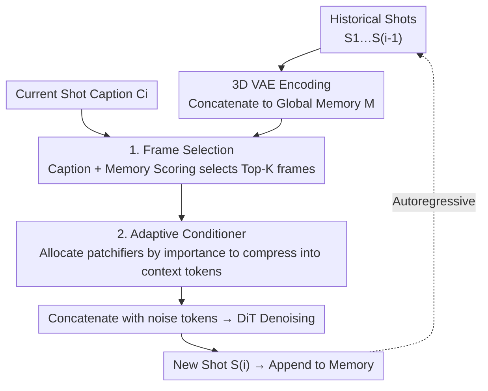

# OneStory: Coherent Multi-Shot Video Generation with Adaptive Memory

**Conference**: CVPR 2026  
**Paper**: [CVF Open Access](https://openaccess.thecvf.com/content/CVPR2026/html/An_OneStory_Coherent_Multi-Shot_Video_Generation_with_Adaptive_Memory_CVPR_2026_paper.html)  
**Code**: None  
**Area**: Video Generation / Diffusion Models  
**Keywords**: Multi-shot video generation, Autoregressive generation, Adaptive memory, Frame selection, I2V

## TL;DR
OneStory reformulates Multi-Shot video generation (MSV) as a "shot-by-shot autoregressive next-shot generation" task. It employs a **Frame Selection module** to select semantically relevant frames from the entire historical shot sequence and an **Adaptive Conditioner** to compress these non-contiguous frames into compact context tokens based on importance. These tokens are directly fed into the DiT, maintaining character/environment consistency and complex plot following in minute-long, ten-shot narratives. SOTA results are achieved in both T2MSV and I2MSV settings.

## Background & Motivation
**Background**: Real-world video storytelling consists of "multiple shots"—discontinuous visual segments that form a coherent narrative. Single-shot T2V/I2V models (e.g., Wan, HunyuanVideo, CogVideoX) generate only continuous scenes and struggle with cross-shot narratives, making MSV an independent research direction.

**Limitations of Prior Work**: Existing MSV approaches fall into two categories, each with significant drawbacks. ① **Fixed Window Attention** (e.g., Mask2DiT, LCT) performs attention on several shots within a limited temporal window, but earlier shots are discarded as the window slides—inevitably leading to memory loss and cross-shot inconsistency in characters/scenes. ② **Keyframe Conditioning** (e.g., StoryDiffusion, Captain Cinema) generates a keyframe for each shot and expands it using I2V, but compressing the cross-shot context into a "single image" fails to transmit complex narrative cues, resulting in weak plot alignment.

**Key Challenge**: The fundamental difficulty of MSV is **how to effectively utilize and maintain long-range cross-shot context**. One must ensure characters/environments remain consistent after intermittent absences while distinguishing between "what should remain unchanged (identity, layout)" and "what should evolve (camera angle, action)." Fixed windows fail at long-range tasks, and single keyframes lack sufficient capacity; both fail due to "context capacity" limitations.

**Goal**: To develop a **global yet compact** cross-shot context representation that can reference any early historical shot (global) without exceeding computational limits by including every historical frame (compact).

**Key Insight**: The authors observe that cross-shot correlation is "variable"—when generating Shot 3, if the protagonist appeared in Shot 1 but a supporting character appeared in Shot 2, Shot 3 should primarily reference Shot 1. Since correlation is sparse and identifiable, it is unnecessary to include all historical frames equally. Instead, one should **select relevant frames first and then allocate computation based on importance**.

**Core Idea**: Rewrite MSV as "next-shot generation," reusing the strong visual conditioning capabilities of pretrained I2V models for shot-by-shot autoregression. Use "frame selection + adaptive compression" to condense the entire history into a set of compact context tokens injected directly into the generator.

## Method

### Overall Architecture
A video with $N$ shots is denoted as $V=\{S_1,\dots,S_N\}$, where each shot $S_i$ contains $K$ frames and is paired with a **referential caption** $C_i$ (captions explicitly reference preceding shots, e.g., "the same man"). OneStory does not generate the entire sequence at once but formulates the task as next-shot generation:

$$S_i=\mathcal{G}\big(\mathcal{E},\,\{S_j\}_{j=1}^{i-1},\,\mathcal{T},\,C_i\big)$$

where $\mathcal{E}$ is the 3D VAE encoder (encoding each shot into latents) and $\mathcal{T}$ is the text encoder. The model is initialized from a pretrained I2V model (Wan2.1) and undergoes lightweight fine-tuning on a self-constructed 60K dataset. During inference, a "history memory bank" is maintained, and shots are generated sequentially: as each new shot is generated, it is encoded and appended to the memory for retrieval by subsequent shots.

The core of the pipeline is the concatenation of two modules: **Frame Selection** picks semantically relevant frames from the entire historical memory to form a global context, and the **Adaptive Conditioner** dynamically compresses these non-contiguous frames into compact context tokens, which are concatenated with noise tokens and sent to the DiT for denoising. The data side is supported by a three-step cleaning pipeline and two training strategies.

### Key Designs

**1. Next-shot Autoregressive Formulation: Decomposing MSV into I2V-compatible segments**

To address the contradiction between "losing memory in fixed windows" and "insufficient context in keyframes," the authors do not force all shots into a single diffusion pass. Instead, they decompose the generation into a sequence of "next-shot generation" sub-problems: shot $i$ is generated conditioned on the previous $i-1$ shots + caption $C_i$ (+ optional initial frame). This approach offers two benefits: first, it allows the direct use of pretrained I2V models as a backbone—since I2V is inherently good at "generating video given visual conditions," next-shot treats "historical shots" as visual conditions requiring only lightweight tuning; second, text and image conditions are naturally unified—the first shot can be initiated by text-only or text+image, with subsequent shots progressing autoregressively. Training uses "predicting the last shot in a 3-shot sequence" as a unified objective.

**2. Frame Selection: Using learnable queries to score historical relevance**

A unique property of multi-shot video is that **cross-shot spatio-temporal variance is unbounded**—adjacent shots may not be continuous in time or space, and correlation changes with content. Treating all historical frames as conditions is redundant and expensive. The Frame Selection module first encodes all $i-1$ shots via VAE and concatenates them along the temporal axis into a global memory $\mathbf{M}\in\mathbb{R}^{F\times N_s\times D_v}$ ($F$ is the total historical frames, $N_s$ tokens per frame). It introduces $m$ learnable query tokens $\mathbf{Q}$: first, queries attend to the current caption to capture the semantic requirement ($\mathbf{Q}'=\mathcal{F}_{\mathrm{attn}}(\mathbf{Q},\phi_T(\mathbf{t}_i),\phi_T(\mathbf{t}_i))$); then, updated queries attend to visual memory to extract visual cues ($\mathbf{Q}''=\mathcal{F}_{\mathrm{attn}}(\mathbf{Q}',\mathbf{M}_1,\mathbf{M}_1)$, where $\mathbf{M}_1$ is the dimensionality-reduced memory). Finally, shot-wise relevance scores $\mathbf{s}=\phi_P(\mathbf{M}_1)\mathbf{Q}''^{\top}$ are calculated, and the average across queries $\mathbf{S}\in\mathbb{R}^F$ is used to select Top-$K_{sel}$ frames to form the relevant context $\widehat{\mathbf{M}}$. To assist scoring, the authors use DINOv2 and CLIP to construct pseudo-labels for supervision. This step transforms "global looking back" into "sparse retrieval."

**3. Adaptive Conditioner: Importance-based patchifiers for compact context tokens**

While selected frames $\widehat{\mathbf{M}}$ are informative, the token count remains large. The Adaptive Conditioner defines a set of patchifiers with different kernel sizes $\{\mathcal{P}_\ell\}_{\ell=1}^{L_p}$ and partitions the indices of $\widehat{\mathbf{M}}$ into $L_p$ disjoint subsets **based on the relevance score $\mathbf{S}$**: more relevant frames are assigned to "finer" patchifiers (low compression, high retention), while less relevant frames use coarse patchifiers. Each patchifier converts assigned frames into context tokens $\mathbf{C}_\ell=\mathcal{P}_\ell(\widehat{\mathbf{M}}_{\mathcal{I}_\ell})$, which are concatenated into $\mathbf{C}$. This differs fundamentally from **fixed temporal allocation** (e.g., always giving the latest frame the finest patchifier)—OneStory allocates computation based on **content importance** for non-contiguous frames, achieving content-driven conditioning. These context tokens $\mathbf{C}$ are concatenated with noise tokens $\mathbf{N}$ to form the DiT input $\mathbf{X}=\mathcal{F}_{\mathrm{concat}}([\mathbf{N},\mathbf{C}])$. By adjusting compression rates, auxiliary computation remains minimal.

**4. Three-step Data Pipeline + Two Training Strategies: Supporting the Next-Shot Paradigm**

The new paradigm requires "referential caption" data and stable training. **On the data side**, a three-step pipeline produces ~60K high-quality multi-shot videos: ① TransNetV2 detects shot boundaries, keeping videos with $\ge$ 2 shots; ② Two-stage captioning—first captioning shots independently, then **rewriting** subsequent captions based on previous frames and captions to introduce referential expressions ("the same man") and scene/object evolution; ③ Keyword filtering + CLIP/SigLIP2/DINOv2 to remove irrelevant transitions or overly similar shots. **On the training side**: **Shot Inflation** expands two-shot sequences into three shots (inserting sampled shots or applying augmentations), creating unified 3-shot training; **Decoupled Conditioning** uses a two-stage curriculum—a warmup stage **uniformly samples** frames from the history to decouple conditioning from an untrained selector, followed by selector-driven conditioning to stabilize convergence and enhance narrative coherence.

### Loss & Training
The model is trained end-to-end to "predict the last shot of each sequence conditioned on preceding shots." The backbone is the pretrained I2V model Wan2.1, optimized with AdamW (LR 0.0005, weight decay 0.01) on 128 A100 GPUs for one epoch. Videos are center-cropped to 480×832.

## Key Experimental Results

### Main Results
Evaluation focuses on **Shot-level Quality** (subject/background consistency, aesthetics, motion) and **Narrative Consistency** (character consistency C-Cons, environment consistency E-Cons, semantic alignment S-Align). Key metrics in the T2MSV setting are shown below (↑ is better):

| Method | C-Cons↑ | E-Cons↑ | Cross-Shot Avg↑ | S-Align↑ | Aesthetics↑ |
|------|----------|----------|------------|----------|----------|
| Flux + Wan2.1 | 0.5454 | 0.5598 | 0.5526 | 0.1915 | 0.5572 |
| Mask2DiT (Fixed Window) | 0.5472 | 0.5419 | 0.5446 | 0.2253 | 0.5235 |
| StoryDiff. + Wan2.1 (Keyframe) | 0.5633 | 0.5681 | 0.5657 | 0.2217 | 0.5703 |
| **OneStory (Ours)** | **0.5874** | **0.5752** | **0.5813** | **0.2389** | **0.5731** |

In the I2MSV setting, OneStory also leads across metrics (C-Cons 0.5851, E-Cons 0.5716, S-Align 0.2354). Qualitatively, baselines often fail identity when the protagonist reappears after a hiatus or in complex composite shots; OneStory maintains consistency and plot evolution.

### Ablation Study
| Configuration | C-Cons↑ | E-Cons↑ | S-Align↑ | Description |
|------|----------|----------|----------|------|
| Last frame only (Baseline) | 0.5153 | 0.5112 | 0.1814 | Lacks history, weakest |
| + Adaptive Conditioner (AC) | 0.5465 | 0.5597 | 0.2172 | Expands context range |
| + Frame Selection (FS) | 0.5526 | 0.5710 | 0.2238 | Selects most relevant frames |
| **AC + FS (Full)** | **0.5874** | **0.5752** | **0.2389** | Complementary, best |

Training strategy ablation: The baseline without Shot Inflation (SI) and Decoupled Conditioning (DC) achieved C-Cons 0.5514; adding SI reached 0.5649; adding DC reached 0.5874. Context token length ablation shows that a 1-frame equivalent budget is already strong (0.5874), with slight gains at 3 frames (0.5926).

### Key Findings
- **AC and FS are complementary**: Adding either module improves over the baseline, but only the combination reaches 0.5874. AC allows "more context capacity," while FS ensures the "most relevant context" is stored.
- **Frame Selection vs. Uniform/Nearest Sampling**: In challenging cases with large camera moves, uniform/nearest sampling loses continuity. Relevance-driven selection maintains cross-shot consistency.
- **Diminishing returns for context tokens**: Increasing budget from 1 to 3 frames yields marginal gains (0.5874 to 0.5926), proving that compact representation captures the primary info.
- **Generalization**: Though trained primarily on human-centric data, the model generalizes to out-of-domain scenes (e.g., stories about cats), indicating that the next-shot + adaptive memory learns general cross-shot modeling.

## Highlights & Insights
- **"Global yet Compact" via Retrieval + Compression**: By sparsely selecting relevant frames for global reach and using importance-based compression for efficiency, the model combines the strengths of fixed-window and keyframe approaches while avoiding their weaknesses. This "select-then-compress" logic is transferable.
- **Importance-based Compression vs. Temporal-based**: Higher importance frames are assigned finer patchifiers. This acts as an "adaptive bitrate" for conditioning signals, marking a shift from temporal-driven to content-driven conditioning.
- **Referential Captions avoid rigid scripts**: Instead of a fixed global script, captions evolve naturally from previous shots, mimicking real creative processes and allowing "room to grow" in subsequent shots.
- **Decoupled Conditioning as a Training Insight**: When a learnable selector and generator are co-optimized, early selector noise can degrade training. Decoupling via uniform sampling first is a robust strategy for such coupled systems.

## Limitations & Future Work
- **Human-centric Bias**: The 60K dataset focuses on human activities; robustness on non-human subjects or complex physical interactions remains to be validated.
- **Base Model Dependency**: Built on Wan2.1, the quality and resolution (480×832) are capped by the backbone's limitations.
- **Reliability of Pseudo-labels ⚠️**: Frame selection depends on DINOv2/CLIP pseudo-labels. Noise in these labels may propagate; detailed sensitivity analysis is deferred to the appendix.
- **Future Directions**: Exploring adaptive context token budgets (scaling with narrative complexity) or region-level frame selection to preserve local consistency during compression.

## Related Work & Insights
- **vs. Mask2DiT (Fixed Window Attention)**: Mask2DiT uses attention masks in finite windows; history outside the window is lost. OneStory enables unbounded lookback via sparse selection, significantly improving narrative consistency (0.5813 vs. 0.5446).
- **vs. StoryDiffusion + I2V (Keyframe Conditioning)**: Keyframe methods compress history into a single image, losing nuance. OneStory injects multi-frame compact context, retaining richer narrative info (S-Align 0.2389 vs. 0.2217).
- **vs. Fixed Temporal Patchification**: Previous methods assume "the latest frame is most important." OneStory's importance-based allocation for non-contiguous frames better fits the nature of unbounded cross-shot variance.

## Rating
- Novelty: ⭐⭐⭐⭐⭐ Reformulating MSV as next-shot + "sparse selection/importance compression" is a substantial advancement over prior paradigms.
- Experimental Thoroughness: ⭐⭐⭐⭐ Extensive ablations across architectures and training strategies; however, comparisons on self-built benchmarks require a caveat.
- Writing Quality: ⭐⭐⭐⭐ Clear motivation and diagrams; minor OCR noise in formulas but does not hinder understanding.
- Value: ⭐⭐⭐⭐⭐ Minute-long coherent narratives are directly applicable; the "on-demand compression of long context" is highly reusable.

<!-- RELATED:START -->

## Related Papers

- [\[CVPR 2026\] MultiShotMaster: A Controllable Multi-Shot Video Generation Framework](multishotmaster_a_controllable_multi-shot_video_generation_framework.md)
- [\[CVPR 2026\] STAGE: Storyboard-Anchored Generation for Cinematic Multi-shot Narrative](stage_storyboard-anchored_generation_for_cinematic_multi-shot_narrative.md)
- [\[CVPR 2026\] ShotDirector: Directorially Controllable Multi-Shot Video Generation with Cinematographic Transitions](shotdirector_directorially_controllable_multi-shot_video_generation_with_cinemat.md)
- [\[CVPR 2026\] HoloCine: Holistic Generation of Cinematic Multi-Shot Long Video Narratives](holocine_holistic_generation_of_cinematic_multi-shot_long_video_narratives.md)
- [\[CVPR 2026\] Rethinking Position Embedding as a Context Controller for Multi-Reference and Multi-Shot Video Generation](rethinking_position_embedding_as_a_context_controller_for_multi-reference_and_mu.md)

<!-- RELATED:END -->
