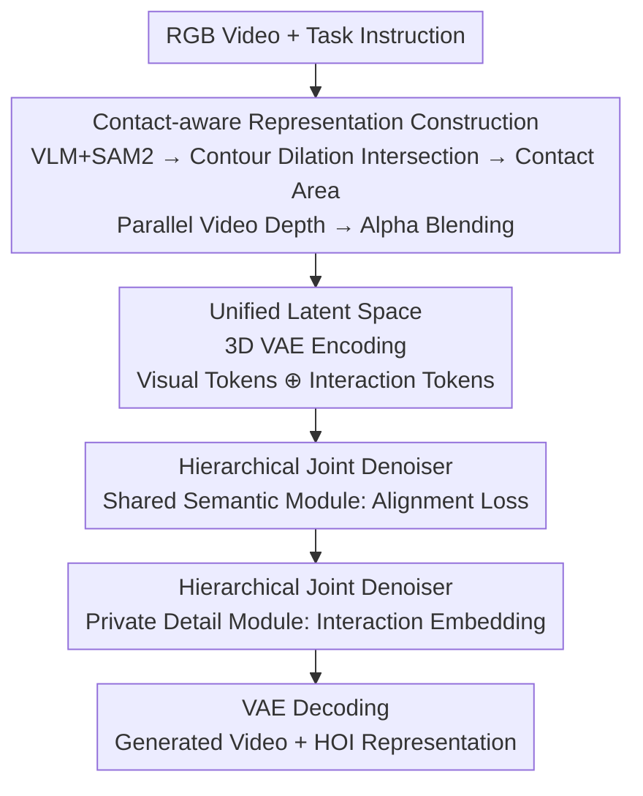

# Open-world Hand-Object Interaction Video Generation Based on Structure and Contact-aware Representation

**Conference**: CVPR 2026  
**Paper**: [CVF Open Access](https://openaccess.thecvf.com/content/CVPR2026/html/Yan_Open-world_Hand-Object_Interaction_Video_Generation_Based_on_Structure_and_Contact_aware_CVPR_2026_paper.html)  
**Code**: None (Project page: https://hgzn258.github.io/SCAR/)  
**Area**: Video Generation / Hand-Object Interaction  
**Keywords**: Hand-Object Interaction, Video Generation, Contact-aware Representation, Joint Generation, Diffusion Transformer

## TL;DR
SCAR proposes a "structure + contact-aware" 2D HOI representation (contact-enhanced hand-object contours + depth maps) and utilizes a "joint generation" paradigm. This approach allows a Diffusion Transformer to simultaneously denoise RGB videos and this representation, learning physically constrained hand-object interactions without relying on 3D annotations, while generalizing to open-world scenarios.

## Background & Motivation
**Background**: The task of Hand-Object Interaction (HOI) video generation is to synthesize a video of a hand manipulating an object given an observation image and a task instruction (e.g., "wipe the bowl with an eraser"). This requires realistic physical relationships, such as contact and occlusion, and temporal coherence. Prevailing methods treat some form of "HOI representation" as an auxiliary generation target to guide video synthesis and capture physical interaction cues.

**Limitations of Prior Work**: HOI representations are caught in a dilemma between scalability and interaction fidelity. Scalable 2D representations—such as optical flow, hand-object segmentation masks, and 2D hand keypoints—are easy to acquire but lack two critical pieces of information: global structural context (depth/occlusion) and hand-object contact regions. Conversely, 3D mesh or MANO parameter sequences provide complete structure and high fidelity but rely on expensive 3D annotations (e.g., motion capture), making them difficult to scale. Moreover, most methods follow a "multi-stage" paradigm (predicting the representation first, then generating the video). These models use ground truth inputs during training but predicted inputs during inference, leading to cumulative errors that degrade physical realism and image quality.

**Key Challenge**: How to design a representation that is both easily obtainable at scale (avoiding 3D labels) and capable of encoding contact regions, spatial localization, and global structural context, while also avoiding the error accumulation of multi-stage serial processing.

**Goal**: (1) Design an extensible 2D representation that expresses contact, localization, and structure without 3D labels; (2) Develop a paradigm that utilizes this representation while avoiding error accumulation.

**Key Insight**: The authors observe that contact regions can be approximated using a simple geometric proxy—the intersection of hand and object contours after dilation. Global structure can be supplemented with video-consistent relative depth estimation. Both components do not require 3D ground truth and can be formatted as "video-like" dense maps, allowing them to be embedded into the same latent space as RGB videos for joint generation.

**Core Idea**: Replace expensive 3D representations with an extensible 2D representation ("contact-enhanced contours + depth maps") and perform "joint generation" of the video and the representation using a single denoiser in a unified latent space to eliminate error accumulation at the source.

## Method

### Overall Architecture
SCAR consists of two main components. The first is the **representation construction pipeline** (offline automatic annotation for training data): starting from RGB videos, a VLM guided by Chain-of-Thought (CoT) locates the hand and object, and SAM2 propagates frame-by-frame masks. These masks are used to estimate "contact-enhanced hand-object contours," while a video depth estimator concurrently produces depth maps. The two are alpha-blended into the final HOI representation. The second component is the **joint generation paradigm**: a 3D VAE encodes both the RGB video and the HOI representation into the same latent space, concatenating them into a single token sequence. A "hierarchical joint denoiser" then denoises the visual and interaction tokens simultaneously—where initial layers handle "shared semantics" for alignment and subsequent layers handle "private details" for differentiation. Finally, two branches are decoded by the VAE into the video and representation.

### Key Designs

**1. Structure + Contact-aware Representation: Using two extensible 2D components to supplement contact and structure**

This directly addresses the gap where 2D lacks contact/structure and 3D lacks scalability. The representation is formed by alpha-blending two complementary components: ① **Contact-enhanced hand-object contours**, encoding contact regions and spatial localization; ② **Depth maps**, providing global structural context. The authors specifically choose sparse contours over dense masks because sparse contours preserve the underlying depth information during alpha-blending, whereas dense masks would overwrite it. The contact area estimation is the most ingenious step: hand and object masks are refined into thin contours $E_h, E_o$ and then dilated. The hand uses a fixed radius $r_h$, while the object uses a scale-adaptive radius $r_o = \min(r_{\max}, \max(r_{\min}, \beta \cdot L))$ (where $L$ is the diagonal of the object bounding box and $\beta$ is a coefficient). The contact region $C$ is defined as the intersection of the two dilated contours: $C = \mathrm{dilate}(E_{\text{hand}}, r_h) \cap \mathrm{dilate}(E_{\text{object}}, r_o)$. This geometric proxy is simple yet reliable, allowing expensive 3D contact labels to be replaced by 2D signals generated at scale for over 100k HOI videos.

**2. Representation Construction Pipeline: VLM-CoT grounding + SAM2 propagation**

For the contact representation to be scalable, the hand and object must be automatically extracted from raw videos. The pipeline first uses a large VLM with CoT prompting to locate the hand and object. CoT guides the model through "textual intent → visual interaction cues → temporal motion," which is more reliable than dedicated detectors in complex scenes with open-vocabulary objects. SAM2 is then prompted with these grounded boxes to extract and propagate masks. The depth component is provided frame-by-frame by a video-consistent depth estimator; although these models are scale-ambiguous, their relative depth ordering is highly reliable for providing scale-invariant structural context.

**3. Joint Generation Paradigm + Hierarchical Joint Denoiser: Simultaneous generation in a unified latent space**

This directly tackles error accumulation in multi-stage paradigms. By using a 3D VAE, RGB videos $V_{\text{RGB}}$ and HOI representations $V_{\text{HOI}}$ are encoded into visual tokens $X_{\text{RGB}}$ and interaction tokens $X_{\text{HOI}}$, combined into a sequence $Z = (X_{\text{RGB}} \oplus X_{\text{HOI}})$. A single DiT-based denoiser then processes this sequence. During training, $Z$ is noise-augmented to $Z_t = \sqrt{\bar\alpha_t} Z + \sqrt{1-\bar\alpha_t}\,\varepsilon$. During inference, clean tokens are recovered from pure noise and decoded to produce the video and representation in one pass. The denoiser features a two-stage design: the **Shared Semantic Module** (layers 1 to $k^*$) uses an alignment loss to force latent states to align at layer $k^*$ by maximizing cosine similarity: $L_{\text{align}} = \sum_{m=1}^{S}\left(1 - \frac{H_{k^*}^m \cdot H_{k^*}^{S+m}}{\|H_{k^*}^m\|\,\|H_{k^*}^{S+m}\|}\right)$ (where $S$ is the number of visual tokens). The **Private Detail Module** (from layer $k^*+1$) removes this constraint and adds a learnable interaction embedding $d_{\text{HOI}}$ only to the interaction tokens to capture modality-specific features. Additionally, each DiT layer uses shared positional embeddings for tokens at the same spatio-temporal location and lightweight LoRA on $W_Q, W_K, W_V$ activated only for interaction tokens via a binary mask $M$: $X_z^\star = P_k W_z + \gamma \cdot \mathrm{diag}(M)\,\mathrm{LoRA}_z(P_k)$.

### Loss & Training
The total loss combines alignment and diffusion losses: $L = L_{\text{RGB}} + \lambda_{\text{HOI}} L_{\text{HOI}} + \lambda_{\text{align}} L_{\text{align}}$. Here, $L_{\text{RGB}}$ and $L_{\text{HOI}}$ are constructed based on the prediction target (noise or velocity). In experiments, $\lambda_{\text{HOI}}=1.0$ and $\lambda_{\text{align}}=0.1$. SCAR is adapted to two pre-trained video diffusion models: CogVideoX-I2V-5B (denoted as SCAR$_C$) and Wan2.1-I2V-14B (denoted as SCAR$_W$).

## Key Experimental Results

### Main Results
Evaluated on Taste-Rob (100k+ fixed-view videos) and Taco (egocentric dual-hand interactions) datasets using VBench metrics (higher is better).

| Dataset | Method | SC↑ | IQ↑ | ISC↑ | IBC↑ | VCS↑ | TS↑ |
|--------|------|-----|-----|------|------|------|-----|
| Taste-Rob | CogVideoX | 0.959 | 0.688 | 0.955 | 0.954 | 0.187 | 8.959 |
| Taste-Rob | Wan2.1 | 0.943 | 0.700 | 0.947 | 0.939 | 0.185 | 8.897 |
| Taste-Rob | FLOVD (Two-stage) | 0.941 | 0.691 | 0.949 | 0.956 | 0.189 | 8.888 |
| Taste-Rob | **SCAR$_C$** | 0.964 | 0.696 | 0.960 | 0.959 | 0.193 | 9.043 |
| Taste-Rob | **SCAR$_W$** | 0.961 | **0.709** | **0.961** | 0.958 | **0.194** | **9.084** |
| Taco | Wan2.1 | 0.905 | 0.717 | 0.933 | 0.947 | 0.189 | 8.792 |
| Taco | FLOVD | 0.903 | 0.686 | 0.927 | 0.947 | 0.177 | 8.619 |
| Taco | **SCAR$_W$** | 0.912 | **0.728** | 0.948 | 0.952 | **0.191** | **8.899** |

SCAR$_C$/SCAR$_W$ consistently outperform their respective base models. FLOVD suffers from poor initial optical flow and error propagation, leading to identity drift (e.g., objects appearing out of nowhere) and significantly lower ISC (image-to-video consistency).

### Ablation Study
Using SCAR$_C$ on Taco as the full model, compared against variants replacing or removing components.

| Config | SC↑ | IQ↑ | ISC↑ | IBC↑ | VCS↑ | Note |
|------|-----|-----|------|------|------|------|
| OF (Optical Flow) | 0.889 | 0.660 | 0.935 | 0.942 | 0.177 | Lacks structure; objects disappear |
| HOM (Hand-Object Mask) | 0.903 | 0.689 | 0.939 | 0.945 | 0.181 | Lacks explicit contact; grasping fails |
| DM (Depth Only) | 0.889 | 0.682 | 0.940 | 0.944 | 0.180 | Lacks contact; poor consistency |
| w/o HOC (No Contours) | 0.899 | 0.689 | 0.937 | 0.945 | 0.181 | Poor localization and consistency |
| w/o CG (No Contact) | 0.906 | 0.687 | 0.945 | 0.948 | 0.179 | Fine-grained tasks fail |
| w/o DM (No Depth) | 0.901 | 0.690 | 0.939 | 0.941 | 0.180 | Lacks global structure |
| + KP (Add 2D Keypoints) | 0.891 | 0.691 | 0.940 | 0.943 | 0.183 | Target too complex; hinders optimization |
| **SCAR (Full)** | **0.916** | **0.698** | **0.951** | **0.954** | **0.187** | Components are complementary |

### Key Findings
- Any single existing representation (OF/HOM/DM) only covers one facet of interaction; removing any core component of SCAR leads to performance drops, proving they are complementary.
- "More is better" is false: adding 2D hand keypoints (+KP) decreases performance because overly complex auxiliary targets interfere with optimization.
- **Open-world Generalization**: On 200 open-world samples with unseen objects, SCAR$_W$ trained on Taste-Rob maintains physical realism and temporal coherence even with distractor objects, whereas baselines show hand-object distortion or fail to follow instructions.

## Highlights & Insights
- **"Dilated Intersection" as a Contact Proxy**: This is the most brilliant insight—replacing contact information that usually requires 3D motion capture with a zero-cost 2D geometric operation.
- **Sparse Contours over Dense Masks**: This design ensures that depth information is not obscured during alpha-blending, preserving structural context.
- **Shared+Private Two-stage Denoising**: This architecture cleanly separates coupled semantics from modality-specific features, a strategy transferable to any joint generation task involving a primary and an auxiliary structural signal.
- **Joint Generation vs. Multi-stage**: Generating video and representation together in a unified latent space structurally fixes the error accumulation problem inherent in two-stage methods.

## Limitations & Future Work
- The "dilated contour intersection" is a 2D heuristic that may be inaccurate for objects with severe occlusion or thin/long geometries.
- Depth maps are based on scale-ambiguous relative depth, which may not suffice for downstream tasks requiring absolute geometry (e.g., precise grasp planning).
- The pipeline still relies on VLM+SAM2 and requires some manual verification; "extensible" is relative to 3D motion capture rather than being fully human-free.

## Related Work & Insights
- **vs. 3D Mesh / MANO**: These are high-fidelity but non-scalable due to annotation costs. SCAR uses 2D contours + depth to encode interaction without 3D labels, trading geometric precision for large-scale training.
- **vs. Scalable 2D Representations**: Previous 2D cues lack contact and global structure; SCAR bridges these gaps.
- **vs. Two-stage Methods**: By generating everything in a unified latent space, SCAR avoids the "train on GT, infer on predictions" error propagation seen in methods like FLOVD.

## Rating
- Novelty: ⭐⭐⭐⭐⭐ "Dilated intersection proxy" + "Joint generation" effectively resolves the scalability-fidelity dilemma.
- Experimental Thoroughness: ⭐⭐⭐⭐ Strong main results and detailed ablations; however, it lacks direct physical metrics for contact realism.
- Writing Quality: ⭐⭐⭐⭐⭐ Very clear logic chain from motivation to design.
- Value: ⭐⭐⭐⭐ Provides a practical, 3D-label-free route for scalable HOI video generation that generalizes to the open world.

<!-- RELATED:START -->

## Related Papers

- [\[CVPR 2026\] GenHOI: Towards Object-Consistent Hand-Object Interaction with Temporally Balanced and Spatially Selective Object Injection](genhoi_towards_object-consistent_hand-object_interaction_with_temporally_balance.md)
- [\[CVPR 2026\] HVG-3D: Bridging Real and Simulation Domains for 3D-Conditional Hand-Object Interaction Video Synthesis](hvg-3d_bridging_real_and_simulation_domains_for_3d-conditional_hand-object_inter.md)
- [\[CVPR 2026\] UnityVideo: Unified Multi-Modal Multi-Task Learning for Enhancing World-Aware Video Generation](unityvideo_unified_multi-modal_multi-task_learning_for_enhancing_world-aware_vid.md)
- [\[CVPR 2026\] HandWorld: Hand-Centric Unified Video Action Generation](handworld_hand-centric_unified_video_action_generation.md)
- [\[CVPR 2026\] Physical Object Understanding with a Physically Controllable World Model](physical_object_understanding_with_a_physically_controllable_world_model.md)

<!-- RELATED:END -->
