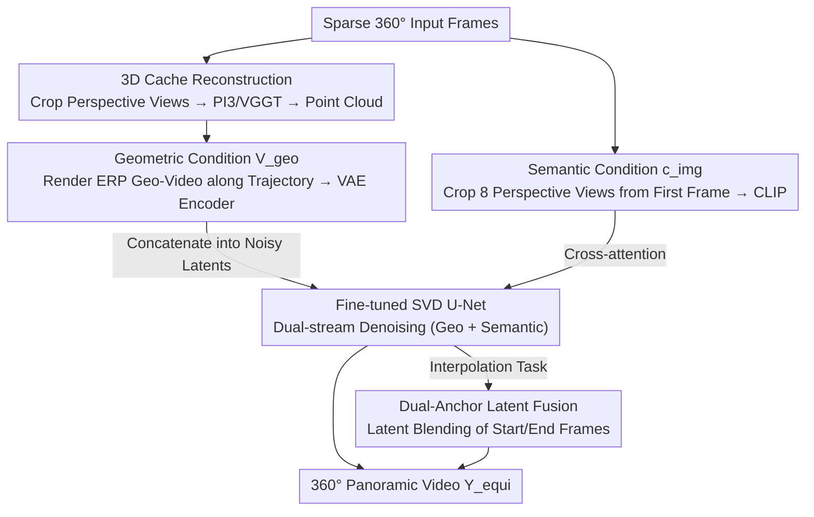

# Pantheon360: Taming Digital Twin Generation via 3D-Aware 360° Video Diffusion

**Conference**: CVPR 2026  
**arXiv**: [2605.25449](https://arxiv.org/abs/2605.25449)  
**Code**: https://koi953215.github.io/pantheon360_page/ (Project Page)  
**Area**: Video Generation / 3D Vision / Diffusion Models  
**Keywords**: 360° Panoramic Video, Digital Twin, Camera Trajectory Control, 3D Cache, Video Diffusion

## TL;DR
Pantheon360 utilizes explicit 3D point clouds ("3D Cache") reconstructed from sparse 360° inputs to render "geometry-only, texture-less" panoramic videos along user-specified camera trajectories. A fine-tuned SVD diffusion model then "paints" realistic textures onto this geometric skeleton. This achieves precise trajectory control and globally consistent digital twin video generation for in-the-wild panoramic scenes, outperforming perspective baselines like GEN3C in metrics such as PSNR and MET3R.

## Background & Motivation
**Background**: To generate "dynamic and complete digital twins" for robotics and autonomous driving simulations, the mainstream approach involves camera-controlled perspective video generation—given a trajectory, a video diffusion model generates frames viewed along that path. Representative works like ViewCrafter, TrajectoryCrafter, and GEN3C mostly follow the "3D cache" paradigm: reconstructing scene geometry first, then rendering along the target path to ground the generation with explicit geometry.

**Limitations of Prior Work**: The Field of View (FoV) of perspective generators is too narrow, making the model "blind" to most of the scene from the first frame. When simulating long trajectories or multi-path explorations, the model must repeatedly "guess" and "hallucinate" unseen regions, leading to two persistent issues: ① **Redundant conditions**—the same piece of geometry is processed repeatedly from different viewpoints; ② **Spatial/temporal inconsistency**—the generated world becomes self-contradictory (e.g., the structure of the same door fails to align from different angles).

**Key Challenge**: The root cause lies in the fundamental conflict between "Narrow FoV ↔ Global Consistency." To ensure global consistency, the model must grasp the entire scene from the start; however, perspective frames inherently see only a small portion. Attempting to supplement global information by extending trajectories or stitching multi-view frames actually amplifies cross-view inconsistencies and temporal drift.

**Goal**: For **in-the-wild** 360° scenes, achieve ① precise following of arbitrary user-defined camera trajectories (rather than just high-level actions like "forward/rotate") and ② global geometric consistency without cross-view conflicts.

**Key Insight**: The authors argue that the **360° panoramic format itself is the solution**. A panorama captures the entire scene context at $t=0$, naturally providing the "global understanding" missing in perspective models, which simplifies trajectory representation and significantly improves consistency. However, panoramas introduce new challenges: extreme distortion in Equirectangular Projection (ERP) and difficulty in precise geometric control.

**Core Idea**: Outsource "complex 3D geometric reasoning" to an **explicit 3D Cache**, allowing the diffusion model to focus solely on "photorealistic texture synthesis." Consistency is enforced by the geometric skeleton while the diffusion model provides realism, decoupling the two tasks.

## Method

### Overall Architecture
Pantheon360 is built upon the pre-trained latent video diffusion model SVD. Given a sparse 360° input and a target trajectory $C_{target}=\{c_1,\dots,c_T\}$, it generates a temporally consistent panoramic video $Y_{equi}$ in ERP format. The core of the pipeline is the **decoupling of geometry and texture**: scene geometry is first frozen into a point cloud cache, "geometry-only" panoramic videos $V_{geo}$ are rendered along the trajectory as skeletons, and the diffusion model applies realistic textures onto these skeletons.

The process follows four steps: **First**, each 360° input frame is cropped into multiple perspective sub-views and fed into 3D foundation models (PI3 or VGGT) to reconstruct an explicit 3D point cloud, the **3D Cache**. **Second**, given $C_{target}$, the point cloud is rendered into an ERP-formatted geometric video $V_{geo}\in\mathbb{R}^{T\times 3\times H'\times W'}$, then encoded into a latent skeleton $v_{equi}=\mathcal{E}(V_{geo})$ via VAE. **Third**, the first frame $I_0$ is cropped into 8 perspective views (one every 45° yaw) to extract semantic features $c_{img}$ via CLIP. **Fourth**, a fine-tuned SVD U-Net consumes both geometric conditions (concatenated into the noisy latents) and semantic conditions (cross-attention) to denoise and generate the final video. For interpolation tasks, a dual-anchor latent fusion technique is used to blend information from the start and end frames in the latent space, ensuring smooth transitions.

### Key Designs

**1. 3D Cache: Explicit Point Cloud Skeleton for Geometry Reasoning**

This is the core design addressing the issue where perspective generation relies on model hallucinations for geometry. Instead of letting the diffusion model "understand 3D" implicitly, an explicit scene point cloud is reconstructed from sparse inputs $\{I_k\}$ during inference. By cropping panoramic frames into perspective views, the system bypasses the unfriendliness of ERP distortion to CLIP and reconstruction models. This point cloud explicitly models the spherical geometry of the scene. Geometric consistency is thereafter **strictly enforced** by this Cache, meaning the diffusion model no longer needs to "guess" unseen areas.

**2. Geometric Conditioning $V_{geo}$: "Geometry-only" Panoramic Skeletons**

To make the point cloud usable for the diffusion model, it is rendered along $C_{target}$ into ERP format to produce $V_{geo}\in\mathbb{R}^{T\times 3\times H'\times W'}$. This video has correct structure but lacks fine texture and contains holes. After VAE encoding into $v_{equi}=\mathcal{E}(V_{geo})$, it is **concatenated** with the noisy latents at every denoising step. This injects trajectory information in a pixel-aligned manner, forcing the diffusion model to refine only within this skeleton, enabling precise following of any trajectory.

**3. Semantic Conditioning $c_{img}$: 8-view Perspective Cropping + CLIP**

While geometry handles structure, semantic features from $I_0$ provide texture style and object information via cross-attention. To avoid the robustness issues of CLIP on distorted ERP images, $I_0$ is cropped into 8 perspective frames (every 45° yaw). These are processed by the CLIP extractor $\mathcal{F}$ and concatenated into $c_{img}$.

**4. Dual-Anchor Latent Fusion: Buffering Jumps from Imperfect Cache Quality**

While the primary model is conditioned on the start frame, interpolation requires anchoring to both start and end frames. In cases of insufficient sparse input views, the reconstructed 3D Cache may be inconsistent with the true end frame, causing **sudden jumps** in the video. The authors introduce a latent fusion technique inspired by Time Reversal Fusion, smoothly blending information between the two anchors in the latent space to mitigate geometric inconsistencies while maintaining temporal smoothness.

### Loss & Training
Training utilizes a standard diffusion denoising objective, where the U-Net $f_\theta$ restores noisy latents $y_{equi,t}$ to ground-truth video latents:

$$L=\mathbb{E}_{y_{equi},v_{equi},c_{img},t,\epsilon}\left[\lambda(t)\,\|\epsilon-f_\theta(y_{equi,t},t,v_{equi},c_{img})\|_2^2\right]$$

where $y_{equi}=\mathcal{E}(Y_{equi})$ is the GT video latent, $v_{equi}=\mathcal{E}(V_{geo})$ is the geometric skeleton latent, and $c_{img}$ represents semantic features.

**Data Annotation** is performed **on-the-fly**: For training videos from 360-1M, camera trajectories $C_{GT\_poses}$ are extracted via ViPE, and SLAM point clouds are treated as the 3D Cache. Setting $C_{target}=C_{GT\_poses}$ allows rendering $V_{geo}$ to form training pairs $(Y_{equi}, V_{geo})$. Models are trained at $1024\times512$ resolution.

## Key Experimental Results

### Main Results
**MET3R** measures multi-view 3D geometric consistency (lower is better).

**Single 360° View → Video** (Web360 dataset, 100 sequences):

| Method | FVD ↓ | SSIM ↑ | PSNR ↑ | LPIPS ↓ | MET3R ↓ |
|------|-------|--------|--------|---------|---------|
| ViewCrafter | 525.7 | 0.371 | 15.65 | 0.284 | 0.4914 |
| TrajectoryCrafter | 517.5 | 0.454 | 15.15 | 0.219 | 0.4578 |
| GEN3C | 380.1 | 0.583 | 20.73 | 0.145 | 0.3496 |
| **Pantheon360 (Ours)** | **356.2** | **0.746** | **22.84** | **0.065** | **0.2840** |

**Sparse 360° Views → Video** (Habitat indoor synthetic dataset, 50 sequences):

| Method | FVD ↓ | SSIM ↑ | PSNR ↑ | LPIPS ↓ | MET3R ↓ |
|------|-------|--------|--------|---------|---------|
| GEN3C | 511.0 | 0.481 | 17.31 | 0.195 | 0.4522 |
| **Pantheon360 (Ours)** | **450.7** | **0.756** | **20.39** | **0.091** | **0.3026** |

Pantheon360 ranks first across all metrics, with particularly significant gains in geometric consistency (MET3R 0.3026 vs GEN3C 0.4522 on Habitat).

### Ablation Study
Verified on 30 Google Street View scenes for dual-anchor latent fusion:

| Configuration | STWE ↓ | IE ↓ | PSNR ↑ | SSIM ↑ | LPIPS ↓ | Description |
|------|--------|------|--------|--------|---------|------|
| Single | 0.124 | 4.784 | 20.92 | 0.661 | 0.271 | Start frame only; best temporal consistency but poor end-frame alignment |
| Single + Latent Fusion | 0.420 | 12.083 | 28.01 | 0.817 | 0.112 | Fusion improves end-frame alignment but worsens IE |
| Dual | 0.419 | 8.120 | 27.86 | 0.817 | 0.093 | Dual anchors improve convergence |
| **Dual + Latent Fusion (Ours)** | 0.395 | **7.437** | **28.95** | **0.830** | **0.088** | Full method; overall best |

### Key Findings
- **The Single model is most temporally stable but lacks end-frame alignment**: Without the second anchor, it generates smoothly but drifts away from the target destination.
- **Dual-anchor + Latent Fusion is the optimal combination**: Adding dual anchors (Dual) pulls PSNR to 27.86; adding latent fusion further improves it to 28.95, proving that fusion mitigates geometric inconsistencies.
- **Geometric consistency (MET3R) shows the largest margin over baselines**, highlighting the value of explicit 3D Cache in solving the "cross-view conflict" issue inherent in perspective models.

## Highlights & Insights
- **Decoupling geometry and texture is a powerful paradigm**: By delegating 3D consistency to a deterministic point cloud cache, the diffusion model focuses on its strength: texture synthesis. This makes precise trajectory control nearly "free."
- **360° panoramas solve FoV blindness at the source**: Perspective generation's inconsistencies stem from "not seeing enough." Panoramas lock in the global context at $t=0$, removing the error-prone "geometric hallucination" step.
- **Practical engineering for ERP distortions**: Using perspective crops for reconstruction/CLIP and using SLAM points for training annotations are effective strategies to ensure the model learns to "trust" geometric conditions.

## Limitations & Future Work
- **Lack of explicit dynamic control**: The 3D Cache primarily encodes static geometry. Motion of dynamic objects relies on diffusion priors, meaning dynamics can be generated but not precisely controlled.
- **Dependency on 3D Cache quality**: In sparse view scenarios, inconsistencies between the point cloud and the target frame can still cause artifacts, which latent fusion only partially mitigates.
- **Pipeline complexity**: The multi-stage process (reconstruction → rendering → diffusion) results in higher inference latency compared to end-to-end models.

## Related Work & Insights
- **vs GEN3C / ViewCrafter**: These use the "reconstruction + rendering" 3D cache paradigm but are limited by narrow FoV perspective views. Pantheon360 extends this to the 360° domain, achieving significantly better MET3R scores.
- **vs GenEX**: GenEX only supports high-level actions (e.g., "forward") and suffers from quality degradation over time. Pantheon360 allows for precise, predefined trajectories with stable quality.
- **vs Reconstruction models (e.g., PanoSplatt3R)**: Reconstruction models can only reproduce seen regions. Pantheon360 uses reconstruction as a skeleton, allowing the diffusion model to creatively fill in large occlusions or new areas.

## Rating
- Novelty: ⭐⭐⭐⭐
- Experimental Thoroughness: ⭐⭐⭐⭐
- Writing Quality: ⭐⭐⭐⭐
- Value: ⭐⭐⭐⭐

<!-- RELATED:START -->

## Related Papers

- [\[CVPR 2026\] 3D-Aware Implicit Motion Control for View-Adaptive Human Video Generation](3d-aware_implicit_motion_control_for_view-adaptive_human_video_generation.md)
- [\[CVPR 2026\] Endless World: Real-Time 3D-Aware Long Video Generation](endless_world_real-time_3d-aware_long_video_generation.md)
- [\[CVPR 2026\] Content-Aware Dynamic Patchification for Efficient Video Diffusion](content-aware_dynamic_patchification_for_efficient_video_diffusion.md)
- [\[CVPR 2026\] Archon: A Unified Multimodal Model for Holistic Digital Human Generation](archon_a_unified_multimodal_model_for_holistic_digital_human_generation.md)
- [\[CVPR 2026\] CubeComposer: Spatio-Temporal Autoregressive 4K 360° Video Generation from Perspective Video](cubecomposer_spatio-temporal_autoregressive_4k_360_video_generation_from_perspec.md)

<!-- RELATED:END -->
## Related Papers

- [\[CVPR 2026\] 3D-Aware Implicit Motion Control for View-Adaptive Human Video Generation](3d-aware_implicit_motion_control_for_view-adaptive_human_video_generation.md)
- [\[CVPR 2026\] Content-Aware Dynamic Patchification for Efficient Video Diffusion](content-aware_dynamic_patchification_for_efficient_video_diffusion.md)
- [\[CVPR 2026\] StereoWorld: Geometry-Aware Monocular-to-Stereo Video Generation](stereoworld_geometry-aware_monocular-to-stereo_video_generation.md)
- [\[CVPR 2026\] Towards Realistic and Consistent Orbital Video Generation via 3D Foundation Priors](orbital_video_3d_foundation_priors.md)
- [\[CVPR 2026\] EgoControl: Controllable Egocentric Video Generation via 3D Full-Body Poses](egocontrol_controllable_egocentric_video_generation_via_3d_full-body_poses.md)

<!-- RELATED:END -->
