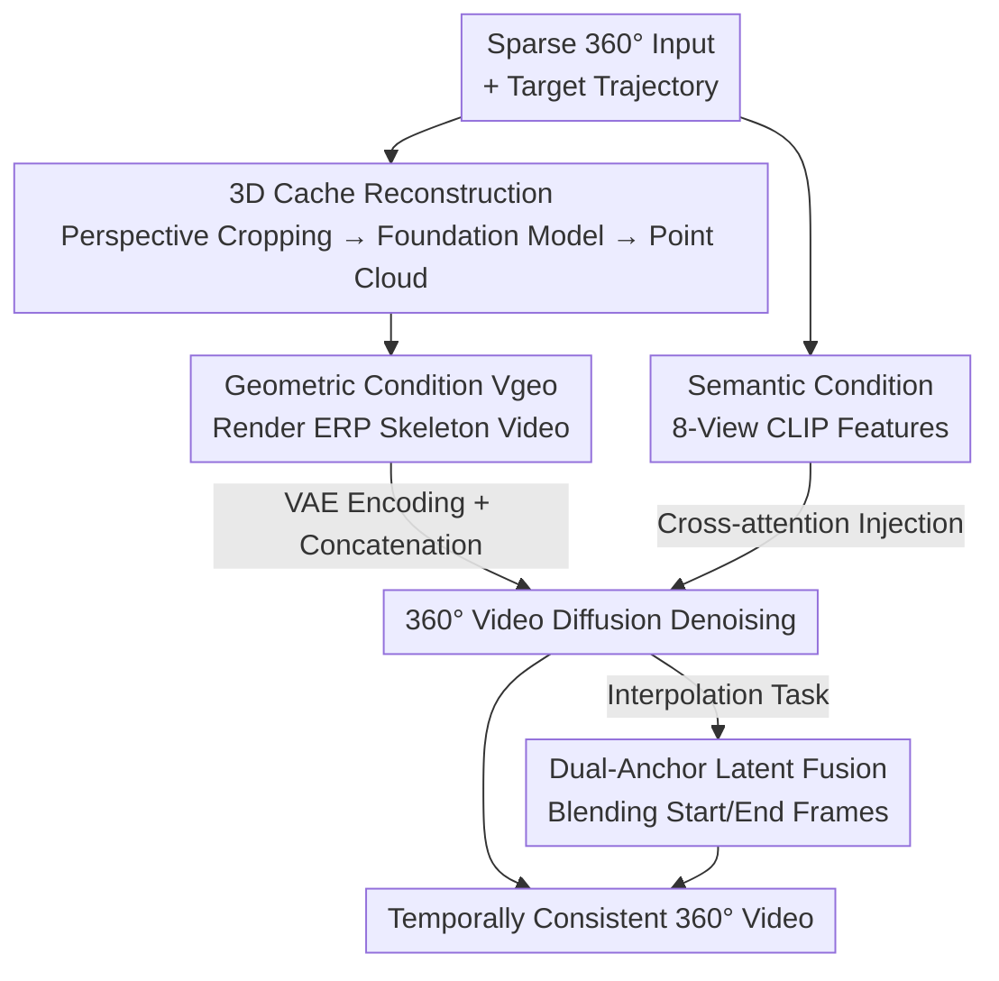

# Pantheon360: Taming Digital Twin Generation via 3D-Aware 360° Video Diffusion

**Conference**: CVPR 2026  
**Paper**: [CVF Open Access](https://openaccess.thecvf.com/content/CVPR2026/html/Chen_Pantheon360_Taming_Digital_Twin_Generation_via_3D-Aware_360deg_Video_Diffusion_CVPR_2026_paper.html)  
**Code**: None (Project page: https://koi953215.github.io/pantheon360_page/ )  
**Area**: Video Generation / Diffusion Models / 3D Vision  
**Keywords**: 360° Video Generation, Camera Trajectory Control, 3D Cache, Video Diffusion, Digital Twin

## TL;DR
Starting from sparse (or even single) 360° panoramas, Pantheon360 first reconstructs an explicit point cloud "3D Cache" using 3D foundation models. It then renders a geometric skeleton video along user-specified camera trajectories. Finally, a fine-tuned 360° video diffusion model is utilized solely to "paste" realistic textures onto this skeleton, achieving precise trajectory control and strong geometric consistency for 360° video synthesis in in-the-wild scenarios.

## Background & Motivation

**Background**: Batch generation of dynamic digital twins (for closed-loop simulation in robotics/autonomous driving) using generative video models is replacing traditional 3D reconstruction. The mainstream approach is "camera-controllable perspective video generation"—given a camera trajectory, the video diffusion model generates the corresponding view sequence.

**Limitations of Prior Work**: The field of view (FoV) in perspective video generation is narrow, "missing" most of the scene from the very first frame. When simulating long trajectories or multi-path explorations, the model must repeatedly guess and hallucinate unseen regions, leading to two problems: (1) redundant processing of the same geometry from different perspectives (redundant conditioning), and (2) self-contradictory worlds with severe cross-view inconsistencies and temporal drift. Existing controllable 360° methods have their own drawbacks: GenEx only offers high-level action control (e.g., "forward/turn") and cannot follow precise trajectories; CamPVG supports precise trajectories but is only validated on synthetic data, failing to address real-world scenes.

**Key Challenge**: Expecting the diffusion model to simultaneously handle "geometric reasoning (to ensure global consistency)" and "texture synthesis (to ensure realism)" is too burdensome. Under narrow FoV, it lacks sufficient global context to maintain geometric consistency, leading to errors that accumulate during the "guess-and-draw" process.

**Goal**: Achieve **precise camera trajectory control** on in-the-wild 360° videos while ensuring cross-view geometric consistency and realism.

**Key Insight**: The authors argue that 360° panoramas are naturally suited for this task—they capture the entire scene context from $t=0$, providing a strong global prior for generation and simplifying trajectory representation. Furthermore, powerful 3D foundation models (e.g., PI3, VGGT) can quickly reconstruct reliable geometry from sparse panoramas.

**Core Idea**: Outsource complex 3D geometric reasoning to an explicit 3D Cache (point cloud). The diffusion model focuses solely on realistic texture synthesis. Geometric consistency is enforced by the Cache, while realism is handled by diffusion, decoupling the two tasks.

## Method

### Overall Architecture
The input consists of sparse (or single) 360° panoramic frames $\{I_k\}$ and a user-defined camera trajectory $C_\text{target}=\{c_1,\dots,c_T\}$. The output is a temporally consistent 360° video $Y_\text{equi}\in\mathbb{R}^{T\times3\times H'\times W'}$ in equirectangular (ERP) format. The pipeline is built on the pre-trained latent video diffusion model SVD, with the core strategy of decoupling "geometry" and "texture" into independent streams.

The inference process involves four steps: (1) Each 360° frame is cropped into multiple perspective views using a sliding window and fed into a 3D foundation model (PI3/VGGT) to reconstruct an explicit **3D Cache** (point cloud); (2) The point cloud is rendered along the target trajectory into a "geometry-only, texture-less" ERP video $V_\text{geo}$, encoded by a VAE into a latent skeleton $v_\text{equi}=E(V_\text{geo})$, and concatenated with noisy latents at each diffusion step as a geometric condition; (3) CLIP features are extracted from 8 perspective crops of the first frame as semantic conditions and injected via cross-attention; (4) The fine-tuned 360° video diffusion U-Net consumes both geometric and semantic conditions to denoise and generate a realistic video. For interpolation tasks, a "Dual-Anchor Latent Fusion" mechanism is used to blend information from both start and end frames.

### Key Designs

**1. 3D Cache: Outsourcing geometric reasoning to explicit point clouds to provide a "guess-free" geometric skeleton.**

This is the foundation of the work, directly addressing the pain point where diffusion models fail to maintain geometric consistency when hallucinating under narrow FoVs. Instead of letting the diffusion model reason about 3D, the authors reconstruct an explicit point cloud cache from sparse inputs during inference. Specifically, each 360° frame is cropped into perspective views (as models like CLIP/PI3 are more robust to perspective views than distorted ERP maps) and fed into PI3 or VGGT to obtain a point cloud representing the spherical geometry. The framework is compatible with any point-cloud generation method. Once the point cloud is established, the global geometry is "locked"—regardless of camera movement, the geometry derives from the same consistent 3D representation, eliminating cross-view drift.

**2. Geometric Condition $V_\text{geo}$: Rendering point clouds into "geometry-only" skeleton videos and concatenating in latent space.**

To follow a trajectory, the static 3D Cache must be converted into a video condition. Given $C_\text{target}$, the point cloud is rendered into a geometry-only ERP video $V_\text{geo}\in\mathbb{R}^{T\times3\times H'\times W'}$, showing projected geometric structures without texture. This is encoded via VAE as $v_\text{equi}=E(V_\text{geo})$ and **concatenated with the noisy ground-truth latent $y_{\text{equi},t}$ at every diffusion step**. This "concatenation-based" injection is more effective than numerical embeddings of camera parameters (like Plücker coordinates): the model sees a pixel-aligned geometric skeleton and only needs to "fill in" textures, with geometric consistency naturally enforced by $V_\text{geo}$.

**3. Dual-Stream Conditioning + Standard Diffusion Objective: Geometry via concatenation, semantics via cross-attention.**

The generator $G$ is a fine-tuned SVD U-Net $f_\theta$ modulated by two streams. The geometric stream uses $v_\text{equi}$ (concatenation), while the semantic stream extracts features from the first frame $I_0$. Since CLIP is more robust on perspective views, $I_0$ is cropped into 8 perspective frames (at 45° yaw intervals), processed by the CLIP extractor to form $c_\text{img}$, and injected via cross-attention. The training uses a standard denoising objective:

$$L = \mathbb{E}_{y_\text{equi},v_\text{equi},c_\text{img},t,\epsilon}\big[\lambda(t)\,\|\epsilon - f_\theta(y_{\text{equi},t},\,t,\,v_\text{equi},\,c_\text{img})\|_2^2\big]$$

The model learns to denoise noisy latents back to real video latents, guided by $v_\text{equi}$ (position/structure) and $c_\text{img}$ (appearance).

**4. Dual-Anchor Latent Fusion: Remedying interpolation jumps caused by inaccurate 3D Cache in sparse views.**

Single-anchor models (looking only at the first frame) may fail during interpolation between start and end frames: point clouds reconstructed from sparse inputs might be inconsistent with the final frame's geometry, causing jitter. The authors trained a dual-anchor variant (conditioned on both start and end frames) but found jumps persisted when Cache quality was low. They introduced latent fusion via Time Reversal Fusion: latents from forward generation (frame 1:N) and backward generation (frame N:1) are smoothly blended in the latent space, mitigating sudden transitions while maintaining temporal smoothness. This is crucial for real-world scenes like Google Street View with poor reconstruction conditions.

### Loss & Training
The training target is the standard denoising loss. Training data is generated via "on-the-fly self-labeling" using the 360-1M dataset (filtered for mislabeled 180° videos, static posters, and low-motion clips). Since 360-1M lacks labels, the authors set $Y_\text{equi}=Y_\text{GT}$, use ViPE for robust 3D estimation to obtain camera trajectories $C_\text{GT poses}$ and SLAM point clouds (as 3D Cache), and render paired $V_\text{geo}$ with $C_\text{target}=C_\text{GT poses}$. The authors emphasize the importance of high-quality, non-noisy point clouds; otherwise, the model learns to "ignore" the geometric condition. Both single and dual-anchor models were trained on 4×A100 GPUs for 5 days at $1024\times512$ resolution; PI3 was used for 3D reconstruction with a confidence threshold of 0.25 and a sky mask.

## Key Experimental Results

### Main Results

Single 360° view-to-video (Web360 dataset, 100 test sequences, metrics calculated on 8 perspective crops at 45° intervals):

| Method | FVD ↓ | SSIM ↑ | PSNR ↑ | LPIPS ↓ | MET3R ↓ |
|------|-------|--------|--------|---------|---------|
| ViewCrafter | 525.7 | 0.371 | 15.65 | 0.284 | 0.4914 |
| TrajectoryCrafter | 517.5 | 0.454 | 15.15 | 0.219 | 0.4578 |
| GEN3C | 380.1 | 0.583 | 20.73 | 0.145 | 0.3496 |
| **Ours** | **356.2** | **0.746** | **22.84** | **0.065** | **0.2840** |

Sparse 360° multi-view-to-video (Habitat dataset, non-closed polyline trajectories, 50 test sequences):

| Method | FVD ↓ | SSIM ↑ | PSNR ↑ | LPIPS ↓ | MET3R ↓ |
|------|-------|--------|--------|---------|---------|
| ViewCrafter | 778.2 | 0.193 | 11.83 | 0.398 | 0.5061 |
| TrajectoryCrafter | 690.3 | 0.216 | 12.22 | 0.461 | 0.6741 |
| GEN3C | 511.0 | 0.481 | 17.31 | 0.195 | 0.4522 |
| **Ours** | **450.7** | **0.756** | **20.39** | **0.091** | **0.3026** |

Ours leads in all metrics across both settings, with particularly significant gains in the geometric consistency metric MET3R (0.3026 vs. GEN3C 0.4522). Note: Baselines were adapted by feeding $V_\text{geo}$ as perspective crops.

### Ablation Study

Ablation of dual-anchor latent fusion (30 Google Street View scenes; STWE=Short-Term Warping Error, IE=Interpolation Error):

| Configuration | STWE ↓ | IE ↓ | PSNR ↑ | SSIM ↑ | LPIPS ↓ |
|------|--------|------|--------|--------|---------|
| Single (Start frame only) | **0.124** | 4.784 | 20.92 | 0.661 | 0.271 |
| Single + Latent Fusion | 0.420 | 12.08 | 28.01 | 0.817 | 0.112 |
| Dual (Start + End frames) | 0.419 | 8.120 | 27.86 | 0.817 | 0.093 |
| **Dual + Latent Fusion (Full)** | 0.395 | **7.437** | **28.95** | **0.830** | **0.088** |

### Key Findings
- **End-frame alignment vs. temporal consistency is a trade-off**: The Single model is most temporally stable (STWE 0.124) but has poor end-frame alignment (PSNR 20.92). Adding dual-anchors improves PSNR to 27.86, and latent fusion further reaches 28.95 with the lowest IE (7.44), proving it achieves the best balance.
- **Geometric consistency is the primary strength**: MET3R leads significantly in both main experiments. Reconstructing point clouds from generated videos using PI3 yielded dense, coherent structures for Ours, while GEN3C's results were sparse and fragmented.
- **Applications in infinite trajectory extension**: The model's convergence on anchor frames allows for concatenating segments (using the last frame of one as the first of the next), enabling infinite exploration and video stabilization.

## Highlights & Insights
- **"3D Cache Decoupling" is the cleanest design philosophy**: Instead of asking one network to manage both geometry and texture, it outsources geometry to deterministic point cloud rendering, letting diffusion do what it does best—texture synthesis.
- **Convincing argument for 360° as "Natural Global Context"**: Fig.2 illustrates that narrow FoVs necessitate hallucinating occluded areas, while panoramas provide full context from the start, elevating the choice of 360° from an engineering preference to a methodological necessity.
- **On-the-fly self-labeling solves the 360° pose data bottleneck**: Using SLAM point clouds as Cache and their poses as trajectories allows for training on unlabeled 360-1M data.
- **Adapting perspective baselines for 360° evaluation** (cropping 8 views to feed $V_{\text{geo}}$) ensures a fair comparison and provides a useful trick for future 360° research.

## Limitations & Future Work
- **Explicit control of object-level dynamics remains difficult**: The model relies on learned motion priors for dynamic objects but cannot precisely control their movement. The 3D Cache primarily characterizes static geometry.
- **Heavy reliance on 3D reconstruction quality**: If the point cloud from sparse inputs is inconsistent with the target frame, jitters occur. While latent fusion mitigates this, it essentially transfers the error to the reconstruction module.
- **Scale of in-the-wild quantitative evaluation**: While synthetic (Habitat) and real (Web360) data were used, the number of real sequences (100/50) is relatively small.
- **Computational cost**: Training took 5 days on 4×A100 GPUs per model, and inference requires running a 3D foundation model reconstruction first.

## Related Work & Insights
- **vs. GEN3C / ViewCrafter / TrajectoryCrafter**: These use the "3D-cache rendering + diffusion" paradigm but are designed for narrow FoV perspective videos. Ours extends this to the 360° domain to eliminate FoV limitations.
- **vs. GenEx**: GenEx only supports high-level actions (e.g., forward/turn) and its quality degrades quickly; Ours supports precise trajectory following and maintains quality.
- **vs. CamPVG**: CamPVG supports precise trajectories but only on synthetic data; Ours is trained on real 360-1M data.
- **vs. PanoSplatt3R**: Reconstruction models can only faithfully reproduce seen views; Ours utilizes generative diffusion to synthesize and complete large occluded/unseen areas.

## Rating
- Novelty: ⭐⭐⭐⭐⭐ First to extend the 3D-cache paradigm to in-the-wild 360° with precise trajectory control.
- Experimental Thoroughness: ⭐⭐⭐⭐ Covers various settings and applications, though real-world quantitative sequences are limited.
- Writing Quality: ⭐⭐⭐⭐⭐ Strong motivation (Fig.2), clear pipeline, and intuitive methodology.
- Value: ⭐⭐⭐⭐⭐ Directly addresses simulation needs; geometrically consistent 360° generation has significant downstream utility.

<!-- RELATED:START -->

## Related Papers

- [\[CVPR 2026\] 3D-Aware Implicit Motion Control for View-Adaptive Human Video Generation](3d-aware_implicit_motion_control_for_view-adaptive_human_video_generation.md)
- [\[CVPR 2026\] CubeComposer: Spatio-Temporal Autoregressive 4K 360° Video Generation from Perspective Video](cubecomposer_spatio-temporal_autoregressive_4k_360_video_generation_from_perspec.md)
- [\[CVPR 2026\] Content-Aware Dynamic Patchification for Efficient Video Diffusion](content-aware_dynamic_patchification_for_efficient_video_diffusion.md)
- [\[CVPR 2026\] StereoWorld: Geometry-Aware Monocular-to-Stereo Video Generation](stereoworld_geometry-aware_monocular-to-stereo_video_generation.md)
- [\[CVPR 2026\] Towards Realistic and Consistent Orbital Video Generation via 3D Foundation Priors](orbital_video_3d_foundation_priors.md)

<!-- RELATED:END -->
