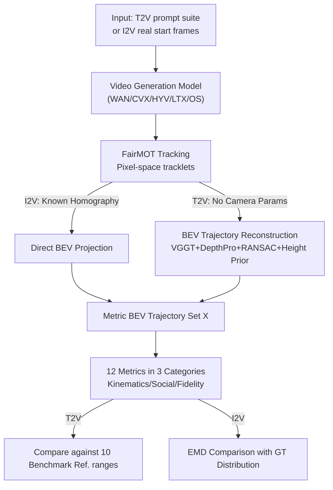

# PEDRA: Evaluating the Realism of Pedestrian Dynamics in Video Generation

**Conference**: CVPR 2026  
**arXiv**: [2510.20182](https://arxiv.org/abs/2510.20182)  
**Code**: https://github.com/aaronappelle/PEDRA (Available)  
**Area**: Video Generation / Evaluation Benchmark / Pedestrian Dynamics  
**Keywords**: Video generation evaluation, world models, pedestrian simulation, BEV trajectory reconstruction, multi-agent dynamics

## TL;DR
PEDRA proposes a rigorous evaluation protocol to assess Text-to-Video (T2V) and Image-to-Video (I2V) models as "implicit pedestrian simulators." It **reconstructs Bird's-Eye View (BEV) pedestrian trajectories from generated videos without camera parameters** and measures the realism of multi-agent dynamics using 12 metrics across kinematics, social interaction, and video fidelity. The study finds that while mainstream models have learned priors for "reasonable crowd behavior," they commonly exhibit failure modes like pedestrian **merging and spontaneous vanishing** that violate physical consistency.

## Background & Motivation

**Background**: Traditional pedestrian/crowd simulation relies on expert-tuned physical models (social forces, global path planning, etc.), which lack scalability and generalization. Meanwhile, large-scale video generation models have made significant strides in visual realism. The community has begun exploring them as "general world simulators," showing initial potential in tasks like rigid-body dynamics.

**Limitations of Prior Work**: Existing video quality benchmarks (such as VBench) mostly evaluate the realism of a **single subject**—checking if an individual's movements look good or if temporal consistency is maintained. However, the core of pedestrian simulation lies in **multiple interacting agents** (emergent social phenomena like collision avoidance, personal space, and density-velocity relationships). Whether this multi-agent dynamics in generated videos is reasonable has never been systematically quantified.

**Key Challenge**: To quantify the realism of pedestrian dynamics, **metric-scale BEV trajectories** (velocity, acceleration, and collision avoidance must be calculated in world coordinates) are required. However, T2V generates entirely synthetic scenes with **no known camera intrinsics/extrinsics, no 3D geometry, and no guarantee of a static viewpoint**. Projecting pixel trajectories onto ground coordinates is impossible without these parameters, posing a fundamental obstacle to evaluating video models as simulators.

**Goal**: (1) Design an evaluation protocol covering various crowd densities and interaction types for both I2V and T2V models; (2) Solve the technical challenge of "reconstructing BEV trajectories from pixels without camera parameters"; (3) Propose a metric system reflecting physical and social rationality to provide performance baselines and failure mode profiles for mainstream models.

**Key Insight**: I2V can use initial frames from real pedestrian datasets (e.g., ETH/UCY) as conditions to obtain **ground truth (GT) videos** for distribution comparison. Since T2V lacks GT, a structured prompt suite is constructed, and metrics are compared against a "Reference Range (Ref.)" statistically derived from 10 public pedestrian benchmarks.

**Core Idea**: By integrating 3D reconstruction (VGGT), metric depth estimation (Depth Pro), scale alignment, and human height priors, synthetic videos are inverted into metric BEV trajectories. These are then scored using a set of pedestrian dynamics metrics, enabling the first systematic evaluation of video generation models as **implicit multi-agent simulators**.

## Method

### Overall Architecture

PEDRA is an evaluation protocol rather than a new generative model. The pipeline consists of three stages: **Generation → Trajectory Extraction → Metric Calculation**. Generation follows two tracks: **I2V** uses initial frames from the ETH/UCY datasets as conditions (530 non-overlapping frames, generating videos until each scene accumulates $\ge 150$ trajectories or 1500 detections), allowing for distribution comparison with real videos. **T2V** uses a structured prompt suite (9 categories across density $\times$ interaction axes, with 20 LLM-generated scene descriptions per category, sampled 5 times each, totaling 900 videos per model, approx. 1.25 hours).

Trajectory extraction is the technical core. For both tracks, the FairMOT tracker is used to obtain tracklets in pixel space, with the bounding box bottom-center as the ground contact point. **I2V** leverages provided homography matrices to project pixel trajectories directly to BEV (for fairness, real videos are re-processed with the same MOT to avoid manual annotation bias). **T2V** involves synthetic scenes without camera parameters, so a reconstruction sub-pipeline is introduced: "VGGT for extrinsics/intrinsics + Depth Pro for metric depth + RANSAC scale alignment + human height prior," ultimately re-projecting pixel trajectories into a unified metric BEV coordinate system.

Given the BEV trajectory set $X=\{T^1,\dots,T^{|X|}\}$, 12 metrics are calculated across three categories: Trajectory Kinematics, Social Interaction, and Video Fidelity. T2V results are compared against the "Ref." range of 10 public benchmarks, while I2V uses Earth Mover's Distance (EMD) to measure the gap between generated and GT distributions.

### Key Designs

**1. Dual-Track Evaluation Protocol & Structured T2V Prompt Suite**: Quantification for both "with GT" and "without GT" scenarios.
Evaluating video models as simulators is difficult because T2V lacks ground truth. PEDRA splits the problem: **I2V** uses frames from real datasets (ETH, HOTEL, UNIV, ZARA1, ZARA2) to compare distributions. **T2V** systematizes crowd scenes along two orthogonal axes: Density (Sparse Sp. / Moderate Mo. / Crowded Cr.) and Interaction Type (Directional Di. / Multi-directional Mu. / Converging Co.). This structured design allows the evaluation to determine if a model understands density/interaction semantics, rather than just providing a generic realism score.

**2. BEV Trajectory Reconstruction without Camera Parameters**: Inverting synthetic videos into metric ground trajectories.
This component is essential for evaluating T2V. Synthetic scenes lack geometry and static viewpoints. PEDRA's solution uses **VGGT** to estimate per-frame intrinsics $K_k$, extrinsics $(R_k, t_k)$, and scale-less depth maps $D_{\text{norm},k}$. **Depth Pro** is used on keyframes to estimate metric depth $D_{\text{metric},k}$. A RANSAC-based alignment calculates the per-frame scale factor by minimizing the Huber loss between scaled VGGT depth and metric depth:

$$\lambda_k = \arg\min_{\lambda'} \sum_{p\in\mathcal{P}} \rho\big(|\lambda' \cdot D_{\text{norm},k}(p) - D_{\text{metric},k}(p)|\big)$$

where $\rho(\cdot)$ is the Huber loss and $\mathcal{P}$ is the valid pixel set. Finally, a **human height prior** is applied for validation: real heights are estimated via pinhole projection $H_{\text{world}} = h_{\text{pixels}}\cdot Z_{\text{cam}}/f_y$. If the mean height falls outside the reasonable range of $(1.4, 2.0)$ meters, the scale factor is adjusted so the mean equals 1.7 meters. This ensures metric-scale trajectories are reliable.

**3. 12-Metric System**: Decomposing physical realism, social rationality, and video quality.
**Trajectory Kinematics**: Velocity $M_{\text{vel}}$, Acceleration $M_{\text{acc}}$, Distance $M_{\text{dist}}$. **Social Interaction**: Collision rate $M_{\text{coll}}$ (distance < 0.1m), static ratio $M_{\text{stat}}$ (displacement < 0.2m), population $M_{\text{pop}}$ (active agents per frame), flow $M_{\text{flow}}$ (local density $\times$ velocity), and nearest neighbor distance $M_{\text{nn}}$ (personal space). **Video Fidelity**: Disappearance rate $M_{\text{disp}}$ (trajectories terminating in the central 80% area), MOT confidence $M_{\text{mot}}$ (trackability proxy), and 3D geometry confidence $M_{\text{geo}}$ (depth uncertainty from VGGT).

I2V uses **normalized EMD** for distribution comparison: $\widehat{\text{EMD}}(\mathcal{A},\mathcal{B}) = \text{EMD}\big(\frac{\mathcal{A}-\mu^{\text{GT}}}{s^{\text{GT}}}, \frac{\mathcal{B}-\mu^{\text{GT}}}{s^{\text{GT}}}\big)$. T2V reports absolute metric values against the Ref. ranges of 10 public benchmarks.

**4. Failure Mode Profiling**: Locating physical consistency defects.
The evaluation identifies systematic failure modes. The most prominent is the **loss of agent integrity**: pedestrians merge into "fluid-like pixel blobs" or vanish mid-trajectory. Merging is particularly common in "Crowded (Cr.)" and "Multi-directional (Mu.)" T2V prompts. These defects are most severe for **background agents with small pixel footprints**, suggesting a correlation between representation scale and dynamical consistency.

### Loss & Training
No models are trained in this work. The only optimization is the minimization of the Huber loss (Eq. 1) via RANSAC during BEV reconstruction. Five models (Wan2.1, CogVideoX1.5, HunyuanVideo, LTX-Video, Open-Sora 2.0) were tested using default hyperparameters to generate 5-second videos on 4×NVIDIA H200 GPUs.

## Key Experimental Results

Five SOTA models tested: Wan2.1 (WAN), CogVideoX1.5 (CVX), HunyuanVideo (HYV), LTX-Video (LTX), Open-Sora 2.0 (OS).

### Main Results

**I2V Evaluation (Average of five ETH/UCY scenes, lower EMD is better; higher $M_{\text{mot}}$ is better)**

| Model | $M^E_{\text{vel}}$ | $M^E_{\text{acc}}$ | $M^E_{\text{dist}}$ | $M^E_{\text{coll}}$ | $M^E_{\text{pop}}$ | $M^E_{\text{flow}}$ | $M^E_{\text{disp}}$ | $M_{\text{mot}}\uparrow$ |
|------|------|------|------|------|------|------|------|------|
| WAN | 0.457 | 0.782 | 0.370 | 0.029 | 0.701 | 0.384 | 0.331 | 0.497 |
| HYV | **0.419** | **0.639** | **0.288** | 0.033 | 0.467 | 0.228 | 0.158 | 0.500 |
| OS | 0.549 | 0.703 | 0.462 | 0.047 | 0.916 | 0.180 | 0.514 | 0.486 |
| LTX | 0.510 | 0.747 | 0.391 | 0.041 | 0.568 | 0.745 | **0.130** | **0.503** |
| CVX | 0.808 | 0.706 | 0.621 | 0.054 | 0.892 | 0.228 | 0.169 | 0.491 |

Conclusion: **No single model dominates across all metrics.** HYV performs best in kinematics; LTX leads in trackability (lowest $M^E_{\text{disp}}$); OS is best at replicating human flow; WAN achieves the most realistic low collision rates.

**T2V Evaluation (Average across categories vs. Ref., units as specified)**

| Model | $M_{\text{vel}}$ (m/s) | $M_{\text{acc}}$ (m/s²) | $M_{\text{coll}}$ (%) | $M_{\text{pop}}$ | $M_{\text{flow}}$ | $M_{\text{nn}}$ (m) | $M_{\text{disp}}$ (%) | $M_{\text{mot}}\uparrow$ |
|------|------|------|------|------|------|------|------|------|
| **Ref. (Real)** | 0.91 | 0.65 | 1.19 | 13.77 | 0.54 | 1.18 | – | – |
| WAN | 0.56 | 0.83 | 5.33 | 56.83 | 1.30 | 0.72 | 29.19 | 0.54 |
| HYV | 0.66 | 0.91 | 9.88 | 35.36 | 1.73 | 0.69 | 29.11 | 0.54 |
| OS | 0.38 | 0.50 | **2.68** | 22.79 | **0.21** | **1.06** | 31.89 | **0.56** |
| LTX | 0.80 | 1.19 | 7.62 | 33.76 | 1.14 | 0.74 | 32.19 | 0.56 |
| CVX | 0.40 | 0.65 | 5.77 | 28.51 | 0.50 | 0.80 | 33.56 | 0.51 |

Conclusion: **Most models underestimate pedestrian velocity**; **all models overestimate population**. While OS has the lowest collision rate, it is still double the real value. $M_{\text{disp}}$ is high across all models (29–34%), highlighting "phantom" pedestrians as a universal issue.

### Ablation Study

Analyses of semantic response categorized by prompt (averaged across 5 models):

| Experiment Category | $M_{\text{vel}}$ | $M_{\text{coll}}$(%) | $M_{\text{pop}}$ | $M_{\text{flow}}$ | $M_{\text{nn}}$(m) | Description |
|------|------|------|------|------|------|------|
| Ref. | 0.91 | 1.19 | 13.77 | 0.54 | 1.18 | Real Ref. |
| Density Sp. | 0.66 | 1.71 | 4.79 | 0.45 | 1.62 | Sparse |
| Density Mo. | 0.67 | 3.29 | 24.33 | 0.44 | 0.97 | Moderate |
| Density Cr. | 0.51 | 7.57 | **74.75** | 1.18 | **0.69** | Crowded: Pop. surge, spacing drop |
| Interaction Di. | 0.66 | 7.14 | 32.56 | **1.64** | 0.73 | Directional: Highest flow |
| Interaction Mu. | 0.55 | 4.00 | 41.06 | 0.52 | 0.93 | Multi-directional |
| Interaction Co. | 0.47 | 8.19 | 32.59 | 0.90 | 0.73 | Converging: Lowest velocity |

### Key Findings
- **Models understand density/interaction semantics**: Population $M_{\text{pop}}$ increases monotonically with prompt density. Directional scenes show higher flow than converging ones. Models even replicate emergent behaviors like "funneling."
- **Collision rates scale with density**: Over 7% of agents in crowded scenes are in contact, revealing failures in collision avoidance.
- **Failures relate to representation scale**: Merging/vanishing is most acute for small background agents. High VAE compression (LTX, OS) may blur dense crowds into singular blobs.
- **Training data filtering is a factor**: WAN explicitly removes crowded scenes, while HYV filters videos with >5 people, likely contributing to poor performance in dense scenarios.

## Highlights & Insights
- **Quantifying "World Simulators"**: Moves the community beyond qualitative assessment of models like Sora by providing metric trajectories and 12 quantitative metrics.
- **Modular BEV Reconstruction**: The VGGT + Depth Pro + RANSAC + Height Prior pipeline is transferable to any task requiring world-metric geometry from synthetic video.
- **Physiological Prior for Scaling**: Using a mean human height of 1.7m to resolve monocular scale ambiguity is a simple yet robust trick to ground synthetic pixels in reality.
- **Precise Failure Location**: Identifying thatMerging/vanishing relates to pixel scale provides a concrete target for improving generative models (e.g., token allocation for dense crowds).

## Limitations & Future Work
- **Technical Limitations**: The multi-stage pipeline introduces label noise, particularly in T2V scale estimation. The 5-second generation limit prevents analysis of long-range navigation or temporal fidelity decay.
- **Ours' Discovery**: Evaluation depends on FairMOT quality; metrics like "disappearance rate" are coupled with tracker capability. The "Ref. ranges" may lead to skewed conclusions if the benchmark scene densities differ significantly from the test prompts.
- **Future Directions**: Introducing longer generation durations; integrating multi-tracker calibration; and using these metrics as rewards/signals for reinforcing generative models.

## Rating
- Novelty: ⭐⭐⭐⭐⭐ First systematic protocol for evaluating multi-agent pedestrian dynamics; solves the BEV reconstruction barrier for T2V.
- Experimental Thoroughness: ⭐⭐⭐⭐ Broad coverage of SOTA models and scenarios, though limited by 5s durations and tracker sensitivity.
- Writing Quality: ⭐⭐⭐⭐⭐ Clear motivation, rigorous definitions, and actionable failure mode profiling.
- Value: ⭐⭐⭐⭐⭐ Establishes a quantifiable baseline for world models with open-source code; highly relevant for crowd simulation and world model research.

<!-- RELATED:START -->

## Related Papers

- [\[CVPR 2026\] SeeU: Seeing the Unseen World via 4D Dynamics-aware Generation](seeu_seeing_the_unseen_world_via_4d_dynamics-aware_generation.md)
- [\[CVPR 2026\] VideoRealBench: A Chain-of-Thought Realism Evaluation Benchmark for Generated Human-Centric Videos](videorealbench_a_chain-of-thought_realism_evaluation_benchmark_for_generated_hum.md)
- [\[CVPR 2026\] SymphoMotion: Joint Control of Camera Motion and Object Dynamics for Coherent Video Generation](symphomotion_joint_control_of_camera_motion_and_object_dynamics_for_coherent_vid.md)
- [\[CVPR 2026\] Phantom: Physics-Infused Video Generation via Joint Modeling of Visual and Latent Physical Dynamics](phantom_physics-infused_video_generation_via_joint_modeling_of_visual_and_latent.md)
- [\[ECCV 2024\] Evaluating Text-to-Visual Generation with Image-to-Text Generation](../../ECCV2024/video_generation/evaluating_text-to-visual_generation_with_image-to-text_generation.md)

<!-- RELATED:END -->
