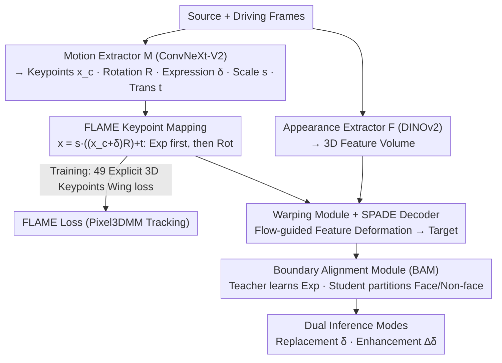

# PerformRecast: Expression and Head Pose Disentanglement for Portrait Video Editing

**Conference**: CVPR 2026  
**arXiv**: [2603.19731](https://arxiv.org/abs/2603.19731)  
**Code**: [https://youku-aigc.github.io/PerformRecast](https://youku-aigc.github.io/PerformRecast)  
**Area**: Video Generation  
**Keywords**: Portrait Video Editing, Expression Disentanglement, 3DMM, Keypoint Transformation, GAN

## TL;DR

PerformRecast proposes a GAN-based portrait video editing method utilizing an improved 3DMM keypoint transformation formula. By applying expression deformation before head rotation (consistent with the FLAME model), precise disentanglement of expression and head pose is achieved. A Boundary Alignment Module is introduced to resolve stitching misalignments between facial and non-facial regions. The method significantly outperforms existing approaches in both expression replacement and enhancement modes.

## Background & Motivation

**Background**: Significant progress has been made in the field of portrait animation, including GAN-based warping methods (LivePortrait, Face Vid2Vid, etc.) and Diffusion-based methods (SkyReels, Hunyuan-Portrait, Wan-Animate, etc.). These methods typically generate animations from a static portrait image controlled by a driving video.

**Limitations of Prior Work**: The core challenge in existing methods lies in the **disentanglement of expression and head pose**. The task of "expression editing" in portrait videos requires modifying only the facial expressions while strictly maintaining the original identity (ID), head pose, camera movement, and background—any changes beyond expression are considered failures. However, current methods face several issues: (1) Diffusion-based methods naturally struggle to decouple expression from head rotation, suffer from slow inference speeds, and exhibit poor temporal consistency; (2) GAN-based warping methods (such as LivePortrait), while more controllable, utilize implicit keypoints that lack explicit physical meaning and direct supervision, leading to incomplete disentanglement.

**Key Challenge**: The keypoint transformation formula in LivePortrait is $x = s \cdot (x_c R + \delta) + t$, where canonical keypoints are first multiplied by the head rotation $R$ and then added to the expression deformation $\delta$. This sequence is inconsistent with the forward process of 3DMMs—models like FLAME apply expression deformation before head rotation. The order in LivePortrait causes residual head pose information to leak into the learned $\delta$, preventing true disentanglement.

**Goal**: (1) Correct the keypoint transformation formula to align with the FLAME forward process; (2) Use explicit 3D keypoints for direct supervision of the motion extractor; (3) Solve boundary misalignment between facial and non-facial regions during expression editing.

**Key Insight**: 3DMMs inherently represent identity, expression, and head pose with independent parameters. The authors leverage the forward process of FLAME—applying expression before rotation—as a physically correct sequence to improve upon LivePortrait.

**Core Idea**: Modify the keypoint transformation order to "expression first, then rotation" to match FLAME, and utilize explicit 3D keypoints from 3D face tracking for direct supervision of the motion extractor.

## Method

### Overall Architecture

PerformRecast is built upon the warping architecture of LivePortrait. Given source and driving frames, an appearance feature extractor $\mathcal{F}$ (based on DINOv2) extracts a 3D feature volume, while a motion extractor $\mathcal{M}$ (ConvNext-V2-Tiny) predicts canonical keypoints $x_c$, head rotation $R$, expression deformation $\delta$, scale $s$, and translation $t$. Source and driving keypoints are generated via the improved FLAME transformation formula. A warping module generates optical flow to deform the feature volume, which is then decoded into the target image by a SPADE decoder. Training is overseen by explicit FLAME loss in conjunction with Pixel3DMM 3D face tracking. A Boundary Alignment Module (BAM) utilizes teacher-student partitioned supervision to suppress boundary artifacts. Two inference modes—replacement and enhancement—are provided.

### Key Designs

**1. FLAME Keypoint Transformation: Returning Deformation to Physical Correctness**

This is the cornerstone of the work. LivePortrait's transformation is $x = s \cdot (x_c R + \delta) + t$. Here, canonical keypoints are rotated by $R$ before adding $\delta$. Consequently, $\delta$ must compensate for differences in a "rotated coordinate system," forcing it to fit residual head pose information, which contaminates the expression with pose data. PerformRecast shifts the parentheses:

$$x = s \cdot \big((x_c + \delta)\, R\big) + t$$

This ensures **expression deformation occurs in the canonical coordinate system before global rotation**. This aligns with the FLAME forward process—where the template mesh is adjusted by expression blendshapes before joint rotation—allowing $\delta$ to focus solely on "how the expression deforms" while $R$ handles rotation.

To anchor $\delta$ physically, the authors use Pixel3DMM for 3D face tracking to extract 49 explicit 3D keypoints from the FLAME mesh. These are supervised in three groups: canonical $V_c$ (identity only), expression $V_{exp}$ (expression plus jaw/eyeball rotation, excluding head rotation), and full $V_{kp}$ (all parameters), using Wing loss. This explicit 3D supervision renders the implicit constraints used in LivePortrait (e.g., equivariance loss, prior loss) redundant.

**2. Boundary Alignment Module (BAM): Separating "Edit Expression" from "Keep Others Static"**

Since warping fields are global, shifting 3D keypoints inevitably affects non-facial regions (hairline, ears, neck), leading to misalignment. BAM addresses this using a two-stage teacher-student approach. In stage one, a teacher $M_t$ is trained with global animation losses to produce accurate facial expressions, albeit with messy boundaries. In stage two, the student $M_s$ learns two tasks: the facial region is supervised by the teacher's intermediate output $\hat{I}_s^t$ (where only $\delta$ is replaced), while the non-facial region is supervised directly by the original source frame $I_s$. This forces the model to follow the teacher for precision while adhering to the original for stability, eliminating the need for separate stitching or retargeting modules.

**3. Dual Inference Modes: Replacement and Enhancement**

The model supports two practical editing workflows. The **Replacement mode** replaces the source $\delta_s$ with the driving $\delta_d$ while keeping other parameters constant—ideal for changing a performance's expression. The **Enhancement mode** adds the driving expression delta $\delta_{d,i} - \delta_{d,0}$ to the source expression, effectively amplifying existing expressions. Both modes operate exclusively on the $\delta$ term, demonstrating the utility of clean disentanglement.

### Loss & Training

The total loss is $\mathcal{L}_{animate} = \mathcal{L}_{FLAME} + \mathcal{L}_{P,cascade} + \mathcal{L}_{1,cascade} + \mathcal{L}_{G,cascade} + \mathcal{L}_{faceid}$, where the FLAME loss provides Wing loss supervision for three sets of keypoints, and cascade losses refer to multi-scale versions of Perceptual/L1/GAN losses. The BAM phase adds a partitioned supervision loss for face and non-face regions. Training utilized approximately 600,000 video segments from datasets including VFHQ, MEAD, Nersemble, and high-definition web videos.

## Key Experimental Results

### Main Results

Evaluated on a MetaHuman digital human benchmark (20 characters, 18 expressions) in Replacement mode:

| Method | PSNR↑ | SSIM↑ | LPIPS↓ | AED↓ | APD↓ | FVD↓ |
|------|-------|-------|--------|------|------|------|
| LivePortrait | 27.73 | 0.899 | 0.059 | 0.610 | 0.016 | 165.1 |
| SkyReels-A1 | 24.91 | 0.859 | 0.162 | 0.716 | 0.016 | 1249.7 |
| Hunyuan-Portrait | 22.43 | 0.792 | 0.169 | 0.661 | 0.035 | 1925.1 |
| Wan-Animate | 22.82 | 0.802 | 0.132 | 0.700 | 0.024 | 849.2 |
| **Ours** | **29.27** | **0.914** | **0.047** | **0.499** | **0.012** | **103.0** |

In Enhancement mode, PerformRecast remains superior (PSNR 30.27, FVD 90.2).

### Ablation Study

| Configuration | PSNR↑ | AED↓ | FVD↓ | Description |
|------|-------|------|------|------|
| Ours (Full) | 29.27 | 0.499 | 103.0 | Full model |
| Ours (KT of LP) | 27.06 | 0.573 | 288.8 | Using LivePortrait's original KT formula |
| Ours (w/o FLAME loss) | 24.99 | 0.663 | 188.1 | Removing FLAME loss |
| Ours (w/o T-S) | 27.73 | 0.575 | 136.4 | Removing teacher-student (BAM) |

### Key Findings

- **Improving keypoint transformation order** is the most critical design: shifting from LP's formula dropped PSNR from 29.27 to 27.06 and increased FVD from 103.0 to 288.8, proving the order is vital for disentanglement.
- Explicit supervision from the **FLAME loss** reduced AED from 0.663 to 0.499, indicating that defined 3D keypoint constraints are more effective than implicit learning.
- **BAM** primarily improves boundary quality (FVD dropped from 136.4 to 103.0), significantly enhancing non-facial fidelity.
- PerformRecast also outperforms LivePortrait on standard portrait animation tasks (e.g., self-driven PSNR 22.88 → higher, cross-ID CSIM higher).

## Highlights & Insights

- **The slight change in keypoint order has a massive impact.** Changing $x_c R + \delta$ to $(x_c + \delta) R$ led to a +2.2 PSNR gain and nearly 3x lower FVD. This suggests that in warping-based animation, aligning the model architecture with the underlying physical model is a powerful inductive bias.
- **Teacher-Student partitioned supervision** elegantly resolves the conflict between global optimization and local fidelity. The teacher focuses on facial expression accuracy, while the student learns the face from the teacher and the non-face from the ground truth. This approach could be applied to any local editing task requiring global consistency.
- The significant advantage over diffusion-based methods (FVD 10x+ lower) indicates that for tasks requiring fine-grained controllability, GAN-based warping remains the superior choice.

## Limitations & Future Work

- Input resolution is fixed at 512×512, which may be insufficient for high-definition cinematic applications.
- The method still relies on 2D face segmentation to define regions, which may lack robustness under heavy occlusion or extreme angles.
- Enhancement mode uses simple deformation addition, lacking fine-grained control over expression intensity.
- Accuracy is capped by the performance of the 3D face tracker (Pixel3DMM)—tracking failures result in erroneous supervision.
- Performance under extreme lighting or profile views has not been fully evaluated.

## Related Work & Insights

- **vs LivePortrait**: This work is directly built upon and improves LivePortrait. Key differences are the transformation order and explicit FLAME supervision. Unlike LP, PerformRecast does not require additional stitching/retargeting modules due to superior disentanglement.
- **vs Diffusion-based methods**: Diffusion methods perform poorly on expression editing tasks (PSNR 4-7 points lower, FVD 8-19x higher) because their motion representations cannot accurately decouple expression from pose.
- **vs Act-Two (Runway)**: Act-Two fails to maintain the source video's head pose accurately and loses fine-grained expression detail (PSNR 20.83 vs Ours 29.27).

## Rating

- Novelty: ⭐⭐⭐⭐ The transformation order insight is simple but profound; BAM's partitioned supervision is innovative.
- Experimental Thoroughness: ⭐⭐⭐⭐⭐ Custom MetaHuman benchmark, multi-method comparisons, thorough ablation, and multi-task evaluation.
- Writing Quality: ⭐⭐⭐⭐ Clear structure and motivation, though some mathematical notations could be more concise.
- Value: ⭐⭐⭐⭐ Direct utility for post-production in film/video; decoupled expression editing is a high-demand feature.

<!-- RELATED:START -->

## Related Papers

- [\[CVPR 2026\] HarmoVid: Relightful Video Portrait Harmonization](harmovid_relightful_video_portrait_harmonization.md)
- [\[ICLR 2026\] Controllable Video Generation with Provable Disentanglement](../../ICLR2026/video_generation/controllable_video_generation_with_provable_disentanglement.md)
- [\[CVPR 2026\] PersonaLive! Expressive Portrait Image Animation for Live Streaming](personalive_expressive_portrait_image_animation_for_live_streaming.md)
- [\[CVPR 2026\] ExPose: Reinforcing Video Generation Models for Extreme Pose Estimation](expose_reinforcing_video_generation_models_for_extreme_pose_estimation.md)
- [\[CVPR 2026\] MultiAnimate: Pose-Guided Image Animation Made Extensible](multianimate_pose-guided_image_animation_made_extensible.md)

<!-- RELATED:END -->
