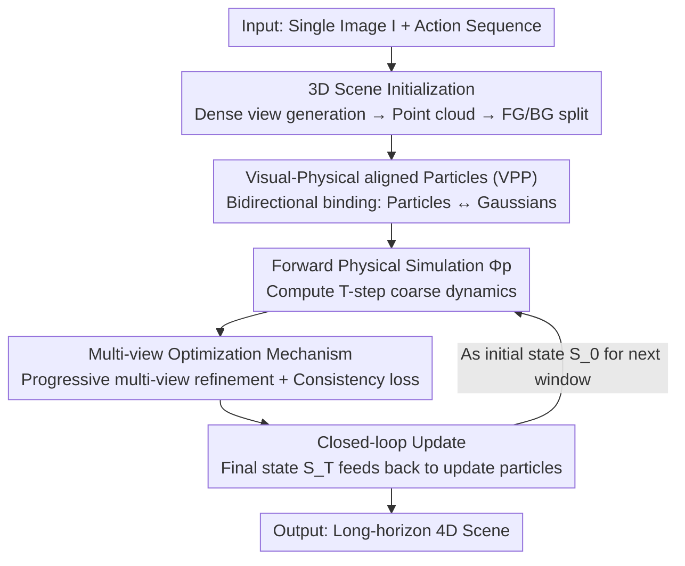

# PerpetualWonder: Long-horizon Action-conditioned 4D Scene Generation

**Conference**: CVPR 2026  
**Paper**: [CVF Open Access](https://openaccess.thecvf.com/content/CVPR2026/html/Zhan_PerpetualWonder_Long-horizon_Action-conditioned_4D_Scene_Generation_CVPR_2026_paper.html)  
**Code**: None (Project page: https://johnzhan2023.github.io/PerpetualWonder/)  
**Area**: 4D Generation / Video Generation / World Models  
**Keywords**: 4D Scene Generation, Action-conditioned, Hybrid Generative Simulation, Closed-loop System, Multi-view Optimization

## TL;DR
PerpetualWonder starts from a single image and employs a **closed-loop** hybrid generative simulator—combining "forward physical simulation and backward video model optimization"—along with a unified representation (VPP) that binds physical particles to Gaussian primitives. This allows 4D scenes to respond continuously to multi-step actions (push, poke, wind, gravity) while maintaining physical plausibility and visual consistency over long horizons, significantly outperforming the predecessor WonderPlay in controllability and 3D consistency.

## Background & Motivation
**Background**: Generating interactive 4D scenes (3D scenes evolving over time) from a single image is a core capability for world models, useful for VR/AR, gaming, and embodied AI. Earlier methods relied on traditional physical simulation, which offers precise control but suffers from a "reality gap"—simplified physics and analytical rendering fail to capture complex visual phenomena like material deformation, lighting, and splashing in the real world. Recently, **hybrid generative simulators** have emerged: first using physical simulation for coarse action-driven dynamics, then using a video generation model as a "neural refiner" to provide high-fidelity visuals.

**Limitations of Prior Work**: WonderPlay, the most relevant predecessor, implements this hybrid approach but is restricted to **short-term interactions within a single time window**. The fundamental issue is that the information flow is unidirectional and incomplete: physical states drive the video model, but the refinements from the video model only return to the **visual representation**, not the underlying **physical state**.

**Key Challenge**: The physical representation (particle positions/velocities) and visual representation (Gaussian primitives) are **decoupled**. Consequently, at the start of each new action sequence, the physical simulator is "blind" to the generative corrections from the previous round. Gaussian primitives are reset to original positions rather than refined ones, leading to cumulative errors—a castle poked by a shovel might shatter or suffer from shape distortion and temporal discontinuity.

**Goal**: Enable the system to **loop perpetually** between "user action → physical simulation → generative refinement," supporting long-horizon, sequential multi-step actions. This requires solving two specific sub-problems: (1) physical states cannot be updated by video model refinements—requiring a new representation unifying physics and visuals; (2) to update this unified representation, video refinement must be multi-view to eliminate optimization ambiguity, yet video models do not naturally generate perfectly consistent multi-view videos—requiring a robust update mechanism.

**Core Idea**: Use a unified representation called VPP (Visual-Physical aligned Particle) to bind physical particles and visual primitives bidirectionally, and then use progressive multi-view optimization to resolve ambiguity, assembling the **first truly closed-loop** hybrid generative simulator.

## Method
### Overall Architecture
The goal of PerpetualWonder is: given a single image $I$ and a sequence of actions $\{A_t\}_{t=0}^{T-1}$ (including global forces like gravity/wind $f(x,y,z,t)$ and local forces like pokes $f(t)$), output a dynamic 4D scene sequence $\{S_t\}_{t=0}^{T}$. At any time, the scene $S_t=(B_t, F_t)$ is decomposed into a static background $B_t$ and interactive dynamic foregrounds $F_t$.

The system is a closed loop that iterates perpetually between **forward physical simulation $\Phi_p$** and **backward neural optimization $\Psi_n$**. It first reconstructs a complete 3D scene from a single image and uses VPP to bind each physical particle to a small cluster of Gaussians. For a time window of $T$ steps: the forward pass uses a physical simulator to compute coarse dynamics; the backward pass uses a video model to refine from multiple views, correcting both appearance and dynamics; finally, the "loop is closed"—the refined visual results of the final state $S_T$ are fed back to update the physical particles, serving as the initial state $S_0$ for the next window, thereby chaining multi-window interactions into long horizons.

### Key Designs

**1. VPP (Visual-Physical aligned Particle): Binding physics and visuals for bidirectional information flow**

This is the foundation for the closed loop, directly addressing the pain point where physical states cannot be refined. Previous hybrid simulators used decoupled visual primitives (Gaussians) for appearance and physical particles for dynamics, with a unidirectional binding (particles driving Gaussians). VPP reverses this by treating each physical particle $p_j$ as an **anchor** for a cluster of $K$ Gaussians $\{g_{j,k}\}_{k=1}^{K}$, expressing all dynamics and appearance through **optimizable Gaussian attributes**. The position of each Gaussian is determined by a learnable offset relative to the anchor particle:

$$\mu_{j,k}=p_j+\tanh(\tilde{p}_{j,k})\cdot\delta$$

where $\delta$ is the particle size during simulation sampling, and $\tanh$ constrains the offset within the particle's neighborhood. Each Gaussian also possesses a spatial opacity $o_s$ and a **temporal opacity** $o_t(t)=\exp\!\big(-\tfrac{1}{2}(\tfrac{t-\mu_t}{s_d})^2\big)$ (centered at $\mu_t$ with duration $s_d$), resulting in final opacity $o(t)=o_s\times o_t(t)$. This allows primitives to appear/disappear over time to capture transient effects like splashing. This creates a **bidirectional bridge**: forwardly, simulation updates $p_j$ to move anchored Gaussians (driving dynamics); backwardly, optimizing $\{g_{j,k}\}$ attributes refines the 4D scene, constrained to stay near anchor particles—meaning visual refinement can calibrate physics.

**2. Progressive Multi-view Optimization: Eliminating single-view ambiguity with multi-view supervision + consistency constraints**

VPP solves "if it can be updated," while this design solves "how to update consistently," targeting WonderPlay's issue with multi-view distortion. It consists of two parts. First, **Dense 3D Initialization**: A camera-controllable video model (GEN3C) synthesizes dense multi-view videos from the single image, which COLMAP uses to initialize 3DGS. Gaussian Grouping adds learnable features, and SAM2 provides object masks for supervision, splitting the scene into background $B_0$ and foreground objects. Foreground Gaussians are converted to closed meshes via TSDFusion to sample initial VPP particles $P_0$. This "unified coordinate system construction" supports rendering from any dense view.

Second, **Progressive Multi-view Optimization**: Coarse 4D scenes are rendered into RGB+Optical Flow and fed to a video model for refinement $V_t$. Since refined videos from different views are naturally inconsistent, (a) an consistency-aware loss is designed:

$$\mathcal{L}=\mathcal{L}_p(\text{Render}(B_t)\odot(1-M),\,V_t\odot(1-M))+\mathcal{L}_p(\text{Render}(G_t),\,V_t\odot M)+\lambda_{\text{sim}}\mathcal{L}_{\text{sim}}$$

where $M$ is the foreground VPP mask, $\mathcal{L}_p$ is the photometric loss (L1+SSIM), and the **simulation consistency loss** $\mathcal{L}_{\text{sim}}=\frac{1}{T\cdot J}\sum_t\sum_j\big\|p_{j,t}-\frac{1}{K}\sum_k\mu_{j,k,t}\big\|_2^2$ penalizes Gaussians for drifting from anchor particles, acting as a strong regularizer. (b) **Progressive Strategy**: Optimization starts only with the input view video, follows with other views using smaller control weights, and concludes with a final optimization using all views to gradually resolve ambiguity.

**3. Simulation Loop & Long-horizon: Feeding refined visuals back to physical particles**

This is the key to the "perpetual" loop, addressing error accumulation. A $T$-step window has three stages: **Forward** using physical operators to compute a coarse sequence $\hat{S}_{t+1}=\Phi_p(\hat{S}_t,A_t)$ (supporting cloth, sand, snow, liquid, smoke, etc.); **Backward** using progressive multi-view optimization to refine $\{\hat{S}_t\}$ into $\{S_t\}$; **Closed-loop** which turns the final state $S_T$ of the current window into the initial state $S_0$ of the next. Specifically, the **average position** of refined Gaussians $\{g_{j,k}\}$ at time $T$ updates the position of corresponding particle $p_j$, while velocity is inherited. This calibrated physical state $\{P_T,V_T\}$ becomes the input for the next forward pass.

### Loss & Training
The core loss $\mathcal{L}$ includes photometric alignment for foreground/background and the simulation consistency regularizer $\lambda_{\text{sim}}\mathcal{L}_{\text{sim}}$. Background Gaussians also carry learnable spatial/temporal opacity to capture secondary effects like shadows. Implementation: Initial scene $S_0$ is reconstructed from 242 views generated by GEN3C; Genesis is used for physical simulation; experiments typical span 3 time windows with 392 simulation steps each; refined videos (H=704/W=1280) are conditioned on RGB+Flow, outputting 49 frames; progressive optimization uses 3 key views (front, left, right).

## Key Experimental Results

### Main Results
Evaluated on 10 scenes (cloth, rigid, elastic, liquid, gas, granular) using the WorldScore metric, PerpetualWonder leads significantly in camera controllability and 3D consistency:

| Method | Camera Controllability | 3D Consistency | Image Quality |
|------|-----------|----------|----------|
| Wan2.2 | 59.73 | 65.35 | 67.03 |
| GEN3C | 80.29 | 61.69 | 66.25 |
| WonderPlay | 75.95 | 63.93 | 36.80 |
| Tora | 51.80 | 60.77 | 54.37 |
| Wan2.6 | 64.75 | 70.49 | 66.09 |
| DaS | 78.96 | 62.18 | 60.23 |
| Veo3.1 | 60.61 | 73.93 | 67.82 |
| **PerpetualWonder** | **93.26** | **80.41** | 66.98 |

In 2AFC human preference studies, ~70%-90% of subjects preferred Ours in physical plausibility and motion fidelity:

| Comparison | Physical Plausibility favor | Motion Fidelity favor |
|----------|----------------|----------------|
| over Wan2.2 | 74.1% | 71.8% |
| over GEN3C | 93.5% | 83.5% |
| over WonderPlay | 80.8% | 86.3% |
| over Veo3.1 | 62.0% | 70.8% |
| over Wan2.6 | 68.5% | 77.3% |

### Ablation Study
| Configuration | Phenomenon | Description |
|------|------|------|
| Full (VPP + Progressive) | Plausible dynamics, consistent views | Complete model |
| w/o VPP (using standard 3DGS) | Chaotic dynamics, visual distortion | Unconstrained Gaussians minimize loss by detaching from physics |
| w/o Progressive (direct multi-view) | Blurry textures, flickering | Conflicting signals from inconsistent multi-view videos pollute representation |

### Key Findings
- **VPP binding is fundamental to kinetic plausibility**: Without VPP, primitives move solely to minimize photometric loss, leading to chaotic motion and artifacts; VPP ensures Gaussians follow the physical solver.
- **Progressive optimization resolves multi-view conflict**: Directly optimizing with inconsistent hallucinations from different views causes texture blurring; the progressive strategy resolves this disparity.
- **Long-horizon distinguishes Ours from WonderPlay**: WonderPlay accumulates errors and shatters shapes after multiple interactions due to particle resets; Ours maintains continuity across windows through $S_T\to S_0$ feedback.

## Highlights & Insights
- **The "Closed Loop" is the core aha-moment**: Previous hybrid simulators were stuck with unidirectional flow. This work introduces a small representation change (particles as anchors + consistency loss) to close the circuit, allowing visual refinement to modify physics—a key shift from "short-term one-off" to "long-horizon perpetual" interaction.
- **Unified representation over decoupled ones** is a transferable insight: Any hybrid system where simulation provides coarse results for neural refinement (fluids, soft bodies, sim2real) can benefit from "anchor + offset + consistency" to feed back differentiable corrections.
- **Temporal opacity** $o_t(t)$ gives static Gaussians the ability to appear/disappear, providing a lightweight way to capture transients like splashing or smoke.

## Limitations & Future Work
- **Reliance on a chain of external models** (GEN3C, COLMAP, SAM2, TSDFusion, Genesis, video models): Failure in any step propagates; the pipeline is heavy and initialization cost for 242 views is high.
- **Velocity inheritance approximation** assumes small updates from $\mathcal{L}_{\text{sim}}$. Large displacements in a single round might make velocity inheritance inaccurate.
- **Physics limits**: Accuracy is bounded by the Genesis solver. Complex contacts or novel materials might exceed the simulator's capacity.
- **Horizon evaluation**: While tested on 3 windows, it remains to be seen if errors drift over much longer horizons (e.g., dozens of rounds).

## Related Work & Insights
- **vs WonderPlay**: Both are hybrid simulators using physical simulation then refinement. WonderPlay uses decoupled representations and single-view optimization without feedback, limiting it to short-term shots. Ours uses VPP, progressive multi-view optimization, and closed-loop feedback for long horizons.
- **vs Conditional Video Generation (Wan/Veo/GEN3C/Tora)**: These models operate in 2D video space without explicit 3D representations—they might ignore camera commands or fail to respond to physical actions. Ours operates on a full 3D representation to ensure physical accuracy and 3D consistency.
- **vs Active 4D Generation**: Passive 4D methods generate predetermined animations from text/images; PerpetualWonder focuses on interactive responses to user-defined action conditions.

## Rating
- **Novelty**: ⭐⭐⭐⭐⭐ First truly closed-loop hybrid generative simulator.
- **Experimental Thoroughness**: ⭐⭐⭐⭐ Covers multiple materials and benchmarks, though limited by scene count and efficiency reporting.
- **Writing Quality**: ⭐⭐⭐⭐⭐ Clear logic from problem identification to component solution.
- **Value**: ⭐⭐⭐⭐⭐ Provides a paradigm for long-horizon interactive 4D generation in world models.

<!-- RELATED:START -->

## Related Papers

- [\[CVPR 2026\] HandWorld: Hand-Centric Unified Video Action Generation](handworld_hand-centric_unified_video_action_generation.md)
- [\[CVPR 2026\] Diff4Splat: Repurposing Video Diffusion Models for Dynamic Scene Generation](diff4splat_controllable_4d_scene_generation_with_latent_dynamic_reconstruction_m.md)
- [\[CVPR 2026\] CineScene: Implicit 3D as Effective Scene Representation for Cinematic Video Generation](cinescene_implicit_3d_as_effective_scene_representation_for_cinematic_video_gene.md)
- [\[CVPR 2026\] SeeU: Seeing the Unseen World via 4D Dynamics-aware Generation](seeu_seeing_the_unseen_world_via_4d_dynamics-aware_generation.md)
- [\[CVPR 2026\] Geometry-as-context: Modulating Explicit 3D in Scene-consistent Video Generation to Geometry Context](geometry-as-context_modulating_explicit_3d_in_scene-consistent_video_generation_.md)

<!-- RELATED:END -->
