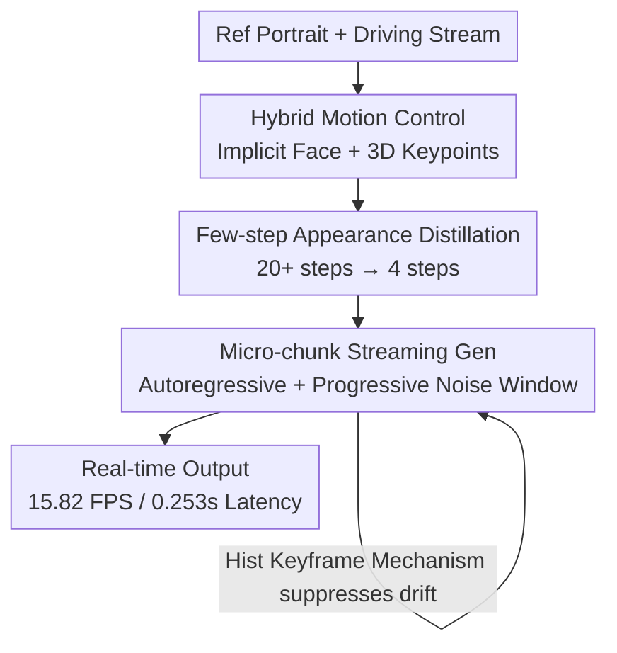

# PersonaLive! Expressive Portrait Image Animation for Live Streaming

**Conference**: CVPR 2026  
**Paper**: [CVF Open Access](https://openaccess.thecvf.com/content/CVPR2026/html/Li_PersonaLive_Expressive_Portrait_Image_Animation_for_Live_Streaming_CVPR_2026_paper.html)  
**Code**: https://github.com/GVCLab/PersonaLive  
**Area**: Video Generation / Portrait Animation  
**Keywords**: Portrait Animation, Diffusion Distillation, Streaming Generation, Real-time Inference, Live Streaming

## TL;DR
PersonaLive introduces a three-stage pipeline—"Hybrid Motion Control + Few-step Appearance Distillation + Micro-chunk Autoregressive Streaming Generation"—to compress diffusion-based portrait animation from offline models requiring 20+ denoising steps and second-level latency to a real-time system capable of 4-step denoising with 15.82 FPS and 0.253s latency. This represents a 7–22× speedup over previous diffusion methods while delivering superior temporal stability for long sequences.

## Background & Motivation
**Background**: Animating a static portrait based on the expression and head pose of a driving video (face reenactment) has recently been dominated by diffusion models. ReferenceNet-based diffusion schemes are the current mainstream paradigm due to their powerful generation capabilities in expression detail and identity preservation.

**Limitations of Prior Work**: Existing methods focus almost exclusively on image quality and expression realism, largely ignoring inference efficiency, which prevents their use in real-time scenarios like live streaming. Two primary hurdles exist: (i) **Computational Cost**: Most methods require 20+ denoising steps and rely on Classifier-Free Guidance (CFG) to enhance fidelity, effectively doubling the network passes per frame. (ii) **Chunk-based Processing Flaws**: Due to VRAM constraints, long videos are split into fixed-length chunks for independent generation. To maintain temporal consistency across chunks, models either insert overlapping frames (causing redundant computation and latency) or reuse the final frames of previous chunks as conditions (leading to error accumulation).

**Key Challenge**: Portrait animation fundamentally involves **modeling motion changes between highly similar consecutive frames**. This task may not necessarily require numerous denoising steps. Furthermore, independent chunk generation conflicts with the requirements of a "real-time continuous stream"—overlapping frames sacrifice latency for consistency, while frame reuse sacrifices stability for latency.

**Goal**: To develop a diffusion-based portrait animation system that is truly real-time, streamable, low-latency, and stable for long sequences without compromising image quality.

**Key Insight**: The authors assemble three components into a single pipeline: ① Integrating a hybrid signal of **implicit face representation + 3D implicit keypoints** for more controllable motion transfer; ② Observing that decorative appearance refinement in the later dozens of denoising steps is redundant once structural layout is fixed, they **distill** appearance refinement into 4 compact sampling steps; ③ Abandoning independent chunk generation in favor of a **micro-chunk autoregressive streaming paradigm**, combined with sliding training and a Historical Keyframe Mechanism, to enable frame output during generation with long-term stability.

## Method

### Overall Architecture
Given a reference portrait $I_R$ and a continuous driving frame stream $\{I_D^1, I_D^2, \dots, I_D^S\}$, the goal is to synthesize the animation sequence $\mathcal{A}_{\{1,\dots,S\}}$ frame-by-frame in a low-latency, real-time manner by combining the appearance of $I_R$ with the motion cues of the driving frames:

$$\mathcal{A}_i = \mathcal{D}(\mathcal{M}(I_D^i), \mathcal{R}(I_R)),\quad i=1,2,\dots,S$$

where $\mathcal{D}$ is the denoising backbone, $\mathcal{M}$ is the motion extractor, and $\mathcal{R}$ is the appearance (ReferenceNet) extractor. The system is built via a **three-stage training pipeline**: Stage I learns motion transfer of expression and head pose at the image level using hybrid signals; Stage II distills redundant appearance refinement into 4-step sampling for inference acceleration; Stage III adds temporal modules to extend the image model into streamable video generation using micro-chunk autoregression with sliding training and historical keyframes.

### Key Designs

**1. Hybrid Implicit Motion Control: De-coupling Expression and Pose**

To address the failure of single signals to control movement, where 2D landmarks or motion frames lack flexibility for global head movement (position, scale, rotation), PersonaLive splits motion into hybrid signals. **Local expression** is encoded into a 1D embedding $m_f = E_f(I_D)$ from the cropped face region and injected via cross-attention. **Global head pose** uses 3D implicit keypoint parameters extracted via $E_k$:

$$k_{c,d}, R_d, t_d, s_d = \mathcal{E}_k(I_D),\quad k_{c,s}, R_s, t_s, s_s = \mathcal{E}_k(I_R)$$

The driving parameters are transferred to the reference identity's canonical keypoints $k_{c,s}$ to obtain driving 3D keypoints:

$$k_d = s_d \cdot k_{c,s} R_d + t_d$$

$k_d$ is projected back to pixel space and injected via PoseGuider. This separation ensures precise control without interference between head pose and facial dynamics.

**2. Few-step Appearance Distillation: Compressing Redundancy**

Visualizing denoising trajectories without CFG revealed that **motion and structural layout are determined in the earliest denoising steps**, while subsequent iterations merely refine textures and lighting. The authors distill this into a compact sampler $\{t_i\}_{i=1}^N$ ($N=4$). During training, noise $z_{\text{noise}}\sim\mathcal{N}(0,I)$ is processed for $n \in [1,N]$ steps to reach an approximate clean state $\hat z_0$, decoded to pixels $\hat x = V_d(\hat z_0)$, and optimized via:

$$\mathcal{L}_{distill} = \mathcal{L}_2(\hat x, x^{gt}) + \lambda_{lpips}\mathcal{L}_{lpips}(\hat x, x^{gt}) + \lambda_{adv}\mathcal{L}_{adv}(\hat x)$$

The adversarial loss is crucial; ablation shows that MSE+LPIPS alone leads to over-smoothed results, while GAN loss maintains high-frequency details without the need for CFG, preserving both speed and quality.

**3. Micro-chunk Autoregressive Streaming: Progressive Windows and Stability**

To solve the chunking conflict, the model adopts a streaming paradigm where frames within a window are not assigned the same noise level. Instead, the window is split into micro-chunks with progressively increasing noise:

$$W_s = \{C_s^1, C_s^2, \dots, C_s^N\},\quad C_s^n = \{z_i^{t_n}\mid i=1,\dots,M\},\ t_1 < t_2 < \dots < t_N$$

With each denoising step, chunks "slide" toward lower noise levels, and the cleanest chunk $C_s^1$ is output immediately. This eliminates the need for overlapping frames. To counter exposure bias and drift:

- **Sliding Training (ST)**: Mirrors the inference process during training. Instead of using ground-truth frames for every input, the model is trained on its own previous outputs, forcing it to learn error correction.
- **Historical Keyframe Mechanism (HKM)**: Tracks a library of historical features $h_f$ and motion embeddings $m_f$. If the current motion embedding differs from the library by a distance $d > \tau$, it is stored as a new keyframe to serve as a stable appearance anchor in the spatial module.

## Key Experimental Results

### Main Results
Evaluated on TalkingHead-1KH (self-reenactment) and a self-curated LV100 dataset (cross-reenactment for long videos).

| Method | LPIPS↓ | tLP(Self)↓ | ID-SIM↑ | FVD↓ | tLP(Cross)↓ | FPS↑ | Latency (s)↓ |
|------|--------|---------|---------|------|---------|------|---------|
| LivePortrait* (GAN) | 0.137 | 20.40 | 0.723 | 557.2 | 13.51 | – | – |
| X-Portrait | 0.173 | 25.87 | 0.678 | 587.8 | 24.52 | 0.851 | 14.10 |
| Follow-your-Emoji | 0.144 | 26.92 | **0.773** | 696.5 | 35.13 | 1.558 | 7.793 |
| Megactor-Σ | 0.183 | 23.55 | 0.606 | 585.3 | 28.86 | 2.216 | 6.918 |
| **PersonaLive (Ours)** | **0.129** | 21.31 | 0.698 | **520.6** | **12.83** | **15.82** | **0.253** |

PersonaLive achieves state-of-the-art results in FVD and temporal stability (tLP), with 7–22× speedup over diffusion baselines. Using TinyVAE further increases performance to 20 FPS.

### Ablation Study
- **Sliding Training (ST) is vital**: Without ST, ID-SIM drops from 0.698 to 0.549, and FVD worsens to 678.8 due to rapid error accumulation.
- **HKM Trade-off**: Removing HKM improves ID-SIM slightly but harms long-term FVD and tLP. The authors argue this trade-off is necessary for long-sequence stability.
- **Distillation Loss**: Without GAN loss, outputs lack high-frequency details. Adding CFG to compensate reduces speed to 9.5 FPS.

## Highlights & Insights
- **Quantifying Redundancy**: The observation that structure is fixed early allows for efficient 4-step distillation, a concept transferable to other continuous generation tasks like virtual try-on.
- **"Train as Inference"**: By matching the training window sliding mechanism to inference, the model naturally handles the autoregressive "exposure bias" from the source.
- **HKM as Appearance Anchors**: Using motion distance to gate historical frames effectively "locks" the appearance, preventing identity drift in long-form generation.

## Limitations & Future Work
- **Generalization**: Distortion occurs when reference images are significantly out-of-domain compared to the training set.
- **Benchmark Consistency**: Cross-reenactment results rely on the self-built LV100 dataset; broader validation on public standard benchmarks for long-form video is needed.
- **TinyVAE**: While 20 FPS is achievable, the impact of TinyVAE on fine-grained facial expression quality requires further quantification.

## Related Work & Insights
Compared to **X-Portrait**, which uses prompt traveling to smooth chunk boundaries (leading to high latency), PersonaLive uses micro-chunk autoregression for true streaming. Unlike **RAIN**, which uses diffusion forcing without addressing exposure bias, PersonaLive integrates sliding training and HKM to suppress accumulation from the start. It represents a successful application of diffusion acceleration (like ADD/LCM) specifically tailored to the temporal redundancies of portrait animation.

## Rating
- **Novelty**: ⭐⭐⭐⭐ (Solid integration of distillation and streaming generation insights).
- **Experimental Thoroughness**: ⭐⭐⭐⭐ (Comprehensive comparison across 7 baselines and specialized metrics for long videos).
- **Writing Quality**: ⭐⭐⭐⭐ (Clear logic with strong visual support for the core idea).
- **Value**: ⭐⭐⭐⭐⭐ (Directly enables real-time high-quality virtual avatars for live streaming).

<!-- RELATED:START -->
<!-- RELATED:END -->

## Related Papers

- [\[CVPR 2026\] FlashPortrait: 6× Faster Infinite Portrait Animation with Adaptive Latent Prediction](flashportrait_6x_faster_infinite_portrait_animation_with_adaptive_latent_predict.md)
- [\[CVPR 2026\] One-to-All Animation: Alignment-Free Character Animation and Image Pose Transfer](one-to-all_animation_alignment-free_character_animation_and_image_pose_transfer.md)
- [\[CVPR 2026\] MultiAnimate: Pose-Guided Image Animation Made Extensible](multianimate_pose-guided_image_animation_made_extensible.md)
- [\[CVPR 2026\] StreamDiT: Real-Time Streaming Text-to-Video Generation](streamdit_real-time_streaming_text-to-video_generation.md)
- [\[CVPR 2025\] Teller: Real-Time Streaming Audio-Driven Portrait Animation with Autoregressive Motion Generation](../../CVPR2025/video_generation/teller_real-time_streaming_audio-driven_portrait_animation_with_autoregressive_m.md)

<!-- RELATED:END -->
