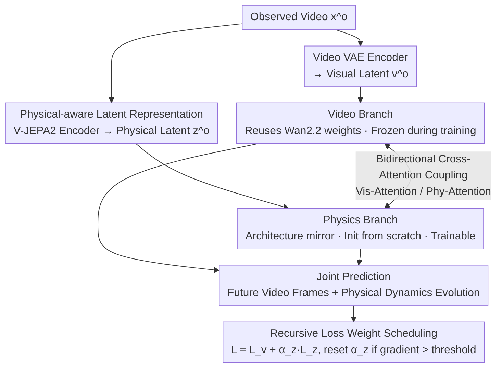

# Phantom: Physics-Infused Video Generation via Joint Modeling of Visual and Latent Physical Dynamics

**Conference**: CVPR 2026  
**arXiv**: [2604.08503](https://arxiv.org/abs/2604.08503)  
**Code**: [https://plan-lab.github.io/phantom](https://plan-lab.github.io/phantom)  
**Area**: Video Generation / Physical Consistency  
**Keywords**: Physically Consistent Video Generation, Flow Matching, Dual-branch Architecture, V-JEPA2, Latent Physics Dynamics

## TL;DR
The Phantom framework is proposed, adding a physical dynamics branch to the pretrained video diffusion model (Wan2.2-TI2V). By utilizing physical-aware embeddings extracted by V-JEPA2 as latent physical states, it jointly models visual content and physical dynamics evolution via bidirectional cross-attention. It significantly outperforms baselines on physical consistency benchmarks (50.4% improvement on VideoPhy PC) while maintaining visual quality.

## Background & Motivation

**Background**: Video generation models represented by Sora, HunyuanVideo, and Wan2.2 can produce visually realistic videos, but they still exhibit significant defects in physical consistency—generated objects often violate basic physical laws such as gravity, inertia, and collisions.

**Limitations of Prior Work**: (1) Simply scaling model size and data volume is insufficient for learning generalizable physical laws; models tend towards case-based memory rather than abstract physical rules. (2) Existing physics-aware methods either rely on external physical simulators (limited by simulator coverage), depend on LLM prompt engineering for guidance at inference time (which does not increase internal physical understanding and adds overhead), or inject physical priors via representation alignment (which cannot explicitly model physical state evolution).

**Key Challenge**: Current video generation models primarily rely on the next-frame prediction objective, which optimizes visual fidelity but does not explicitly enforce physical reasoning, making it difficult for the model to internalize and obey real-world physical laws.

**Goal**: How to directly integrate reasoning about latent physical attributes during the video generation process, so that the model generates videos that are both visually realistic and physically consistent?

**Key Insight**: The authors hypothesize that the inability to learn physical dynamics stems from the model's sole reliance on the next-frame prediction objective. The solution is to have the model simultaneously predict video content and latent physical parameters.

**Core Idea**: A dedicated physics branch is added to the video generation pipeline. Using V-JEPA2 self-supervised representations as "latent physical states," it is trained jointly with the visual branch, allowing the model to reason about physical dynamics while generating video.

## Method

### Overall Architecture
Phantom addresses a specific problem: video diffusion models have learned to "look right" but not to "move right"—objects clip through each other, float, or bounce erratically. The authors posit that the root cause is the model only optimizing for next-frame prediction without being explicitly required to reason about physics. Consequently, Phantom parallels a second "physics branch" alongside the pretrained Wan2.2-TI2V-5B, allowing video generation and physical reasoning to occur simultaneously.

The pipeline operates as follows: an observed video $\mathbf{x}^o$ is encoded into two complementary latent spaces—the video VAE encoder provides the visual latent sequence $\mathbf{v}^o$, and V-JEPA2 provides the physical latent sequence $\mathbf{z}^o$. The visual sequence is fed into the video branch (reusing Wan2.2 weights), while the physical sequence is fed into a physics branch that mirrors the visual architecture but is initialized from scratch. Both branches run flow-matching latent ODEs and interact through bidirectional cross-attention at corresponding depths. Finally, the model jointly predicts future video frames and the corresponding physical dynamics evolution under the constraints of conditional frames and physical states.

### Key Designs

**1. Physical-aware Latent Representation: Using V-JEPA2 embeddings as "Latent Physical States"**

Models fail to learn physics because they lack a dedicated place to represent "what the current physical state is." Phantom does not construct a physical simulator or manually label parameters like gravity/mass; instead, it leverages representations from V-JEPA2, a self-supervised video encoder. Since it is pretrained on large-scale video data, it has been shown to encode intuitive physical concepts like object permanence, collisions, and gravity. Phantom treats these representations as a "learned abstract physical space," allowing the model to reason about dynamics without external physical inputs. Compared to simulators, this latent representation is not constrained by simulator assumptions and covers more complex phenomena; compared to static alignment methods, Phantom explicitly predicts how physical states evolve over time.

**2. Bidirectional Cross-Attention Coupling: Mutual correction without cross-contamination**

If the two branches ran independently, they would behave as separate models, and physical reasoning would not translate to the visual output. Phantom inserts bidirectional cross-attention at corresponding depths. Vis-Attention uses video hidden states as queries and physical hidden states as keys/values to inject physical cues into visual generation:

$$\mathbf{h}'_v = \text{Softmax}\!\left(\frac{\mathbf{W}^Q_v\mathbf{h}_v \cdot (\mathbf{W}^K_v\mathbf{h}_z)^T}{\sqrt{d}}\right) \mathbf{W}^V_v\mathbf{h}_z$$

Phy-Attention operates symmetrically, refining physical reasoning using visual evidence. This allows physical states to guide motion while the visual output calibrates physical estimation. Using separate cross-attention layers instead of joint-attention prevents excessive entanglement of visual and physical features, which could destabilize training, and allows for fine-grained control over both modalities.

**3. Selective Freezing Training: Updating new components while preserving Wan2.2 generation priors**

The physics branch is initialized from scratch. Early gradients are large and noisy; training the entire architecture would destroy the strong generation capabilities of Wan2.2. Phantom's strategy is to freeze all pretrained parameters of the video branch during training, updating only the physics branch and the cross-attention layers. During training, 50% of instances have no condition frames (text-to-video), and 50% use 1–45 sampled frames as conditions (video-to-video), enabling the model to support both modes.

**4. Recursive Loss Weight Scheduling: A "reset gate" for dominant physical losses**

The joint loss is $\mathcal{L} = \mathcal{L}_v + \alpha_z \mathcal{L}_z$. In practice, the gradient norm of $\mathcal{L}_z$ is much larger than that of the visual loss; fixed weights cause the physics branch to overwhelm the shared architecture. Phantom starts $\alpha_z$ at 0 and increases it during training. Once the physics gradient norm exceeds a threshold $\eta_z$, $\alpha_z$ is reset to zero, restarting the scheduling cycle. This cyclic weighting acts as a "trial-and-error" mechanism, allowing the physics branch to contribute meaningful gradients without destabilizing the visual branch.

### Loss & Training
The overall objective extends standard flow-matching to jointly predict visual and physical velocity fields, balanced by the recursive weight scheduling. Training data consists of OpenVidHD-0.4M (approx. 400k high-quality video-text pairs, not specifically physical data), supporting up to 121 frames at 480×832 resolution.

## Key Experimental Results

### Main Results

| Benchmark | Metric | Phantom | Wan2.2-TI2V | Gain |
| :--- | :--- | :--- | :--- | :--- |
| VideoPhy | SA | 47.5 | 41.5 | +14.5% |
| VideoPhy | PC | **37.9** | 25.2 | **+50.4%** |
| VideoPhy-2 | SA | 27.75 | 24.53 | +13.1% |
| VideoPhy-2 | PC | 71.74 | 69.20 | +2.6% |
| Physics-IQ (Single) | Score | **29.59** | 22.10 | **+33.9%** |
| Physics-IQ (Multi) | Score | 27.53 | - | - |

Note: Achieved the highest VideoPhy PC (37.9) among all methods, surpassing dedicated physics methods like PhyT2V (37) and WISA (33).

### VBench-2 Comprehensive Evaluation

| Dimension | Phantom | Wan2.2-TI2V | Change |
| :--- | :--- | :--- | :--- |
| Total | 51.84 | 51.57 | +0.5% |
| Physics | 43.61 | 40.19 | +6.0% |
| Human Fidelity | 88.39 | 86.10 | +2.7% |
| Controllability | 20.23 | 18.50 | +9.4% |
| Commonsense | 61.43 | 60.57 | +1.4% |

### Physics-IQ Breakdown (Single-frame)

| Metric | Phantom | Wan2.2-TI2V | Gain |
| :--- | :--- | :--- | :--- |
| Spatial IoU | 0.245 | 0.164 | +49.4% |
| Spatiotemporal IoU | 0.146 | 0.132 | +10.6% |
| Weighted Spatial IoU | 0.140 | 0.102 | +37.3% |
| MSE↓ | 0.009 | 0.010 | +11.1% |

### Key Findings
- **Significant improvement in physical consistency without sacrificing visual quality**—VBench-2 total scores remain stable or slightly higher, indicating that physical reasoning and visual generation are compatible.
- Diversity in the Creativity category decreased (64.67→45.95), but Composition increased from 40.35 to 45.07. The authors suggest that physically irrational videos might "inflate" diversity metrics.
- In the Physics-IQ single-frame setting, Phantom reached 29.59, exceeding all methods including CogVideoX-I2V (27.90) and RDPO (25.21).
- Phantom utilized only 400k training videos (non-specialized physical data), yet significantly improved physical consistency, validating the effectiveness of V-JEPA2 physical representations and joint modeling.

## Highlights & Insights
- **Clever choice of V-JEPA2 as a physical prior**: Avoids the need for physical simulators or parameter labeling by leveraging intuitive physical knowledge already encoded in self-supervised visual representations. This is a "free lunch"—using the physical-aware capabilities of one large model to enhance another.
- **Dual-branch flow-matching design**: The parallel ODE processes for vision and physics are coupled via cross-attention, enabling information exchange while maintaining modality-specific characteristics. This is more elegant than direct concatenation and offers better scalability.
- **Recursive Loss Weight Scheduling** is a practical trick: when different learning objectives have vastly different gradient scales, periodic weight resets provide more stability than a fixed ratio. This is transferable to other multi-task learning scenarios.
- **Zero extra physical input at inference**: In text-to-video mode, the model performs joint denoising from pure noise, indicating that the model has internalized physical understanding.

## Limitations & Future Work
- The physics branch is initialized from scratch; training efficiency might improve by initializing with existing physical models.
- V-JEPA2's physical awareness is still limited and may be insufficient for complex fluid dynamics or deformable objects.
- Training was limited to 400k samples, while the baseline Wan2.2 was pretrained on much larger datasets—larger scale training may yield further improvements.
- Recursive weight scheduling requires manual setting of the threshold $\eta_z$, which may be sensitive to hyperparameters.
- The drop in VBench-2 Diversity is noteworthy and may limit creative application scenarios.

## Related Work & Insights
- **vs. PhyT2V/DiffPhy**: These methods use LLM reasoning at inference to refine prompt-guided diffusion. These are external and do not increase the model's internal physical understanding, adding inference overhead. Phantom internalizes physical reasoning.
- **vs. VideoREPA**: VideoREPA injects physical priors via representation alignment. This is a static alignment and does not model the temporal evolution of physical states. Phantom explicitly predicts physical dynamics over time.
- **vs. PhysAnimator/PhysGen**: Rely on external physical simulators, limited by simulator coverage and fidelity. Phantom requires no simulator.

## Rating
- Novelty: ⭐⭐⭐⭐⭐ The dual-branch joint modeling of visual and physical dynamics is a new paradigm; the choice of V-JEPA2 is clever.
- Experimental Thoroughness: ⭐⭐⭐⭐ Covers VideoPhy/VideoPhy-2/Physics-IQ/VBench-2, though ablation studies on individual components are limited.
- Writing Quality: ⭐⭐⭐⭐ Clear motivation and systematic method description.
- Value: ⭐⭐⭐⭐⭐ Opens a new direction for physically consistent video generation; the paradigm of dual-branch joint modeling + self-supervised physical representations is highly influential.

<!-- RELATED:START -->

## Related Papers

- [\[CVPR 2026\] SymphoMotion: Joint Control of Camera Motion and Object Dynamics for Coherent Video Generation](symphomotion_joint_control_of_camera_motion_and_object_dynamics_for_coherent_vid.md)
- [\[CVPR 2026\] Inference-time Physics Alignment of Video Generative Models with Latent World Models](inference-time_physics_alignment_of_video_generative_models_with_latent_world_mo.md)
- [\[CVPR 2026\] Physical Simulator In-the-Loop Video Generation](physical_simulator_in-the-loop_video_generation.md)
- [\[ICLR 2026\] JavisDiT++: Unified Modeling and Optimization for Joint Audio-Video Generation](../../ICLR2026/video_generation/javisdit_unified_modeling_and_optimization_for_joint_audio-video_generation.md)
- [\[ICLR 2026\] Syncphony: Audio-to-Video Generation with Synchronized Visual Dynamics using Diffusion Transformers](../../ICLR2026/video_generation/syncphony_synchronized_audio-to-video_generation_with_diffusion_transformers.md)

<!-- RELATED:END -->
