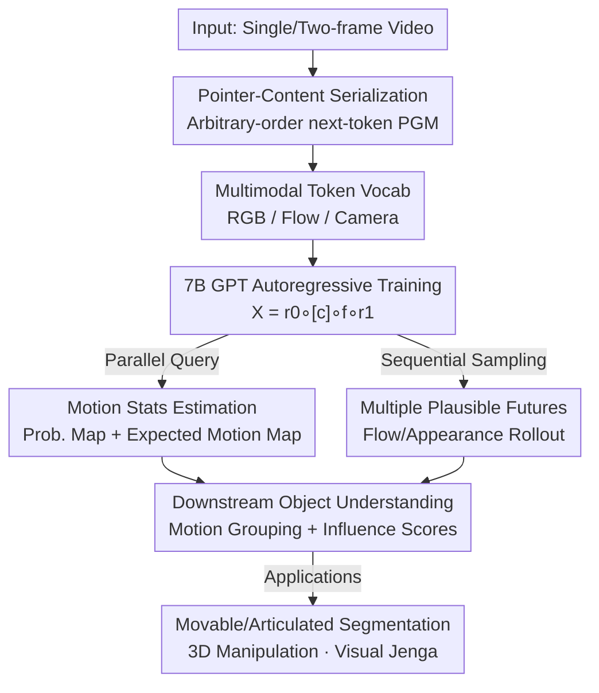

# Physical Object Understanding with a Physically Controllable World Model

**Conference**: CVPR 2026  
**arXiv**: [2606.00439](https://arxiv.org/abs/2606.00439)  
**Code**: https://neuroailab.github.io/psi-website/blog.html (Available)  
**Area**: Video Generation / World Models / Physical Scene Understanding  
**Keywords**: Probabilistic World Models, Autoregressive Sequence Modeling, Optical Flow Tokens, Movable Object Discovery, Visual Jenga

## TL;DR
This paper reformulates the "world model" as a Probabilistic Graphical Model (PGM) capable of querying conditional distributions of arbitrary visual variables. Utilizing GPT-style next-token prediction, the authors efficiently train a 7-billion-parameter physically controllable world model, PSI, which describes scenes using RGB, optical flow, and camera tokens. Once trained, without any task-specific heads, PSI achieves zero-shot movable object segmentation (SpelkeBench SOTA), articulated part discovery, 3D object manipulation, and physical reasoning tasks like Visual Jenga by simply "virtually poking" pixels to observe collective motion.

## Background & Motivation
**Background**: Current mainstream world models (e.g., text/action-conditioned video generation, JEPA-style global embedding prediction) excel at generating long videos, instruction-conditioned generation, and multimodal reasoning. However, they typically condition on global signals such as text, actions, or scene embeddings.

**Limitations of Prior Work**: Existing models lack a mechanism to "isolate and query" the mutual influence between local scene variables—such as how motion in one area affects another or how force propagates through an object's structure. These local conditional relationships are critical for reasoning about physical structures like object boundaries, articulations, and support. Specialized object understanding models (e.g., SAM2 relying on labels, CutLER/ProMerge relying on DINO attention) only solve specific sub-tasks and are often fragile in complex natural scenes.

**Key Challenge**: Physical reasoning requires a PGM capable of "estimating the distribution of any target variables given an arbitrary subset of observed variables." Historically, PGMs have been notoriously difficult to train and were largely abandoned by modern deep learning. Thus, a contradiction exists between "flexible conditional inference capability" and "scalable training."

**Goal**: Construct a unified architecture that supports arbitrary conditional queries like a PGM while maintaining the efficient, scalable training of Large Language Models (LLMs) to enable the emergence of rich physical object understanding.

**Key Insight**: The authors observe that learning the "conditional relationships between arbitrary variables" can be reframed as GPT-style next-token prediction. By decomposing a scene into local variables, serializing them into tokens, and employing a pointer mechanism to specify "which location to predict," a PGM simplifies into a standard autoregressive sequence model.

**Core Idea**: Implement a probabilistic world model (termed PSI/Probabilistic Structure Integrator) using an "arbitrary-order autoregressive sequence of pointer tokens and content tokens." Inexpensive visual patches (optical flow, camera motion) are used as control signals instead of expensive real action data, acting as a "poor man's world model."

## Method

### Overall Architecture
PSI partitions the world state into a set of local variables. The objective is to learn: "given a subset of observed variables $\mathbf{X}$ and an unobserved query location $p$, return the conditional distribution $\text{Pr}[v\mid\mathbf{X},p]$." Formally, the model $\Psi:(\mathbf{X},\,p\notin\mathrm{dom}(\mathbf{X}))\mapsto\{\text{Pr}[v\mid\mathbf{X},p]:v\in\mathcal{V}\}$ represents a PGM. The core transformation serializes data into a stream of alternating "pointer-content" tokens $[p_0,v_0,\dots,p_k,v_k]$. Querying an arbitrary location is equivalent to appending a pointer to the sequence and reading the next-token distribution.

The authors instantiate a physically controllable visual world model where the content vocabulary includes: **RGB tokens** (encoding appearance), **Optical Flow tokens** (encoding dynamics), and **Camera tokens** (encoding 6DOF viewpoint changes). The pointer vocabulary is divided by modality. Training sequences follow the form $\mathbf{X}=\mathbf{r}^0\circ[c]\circ\mathbf{f}\circ\mathbf{r}^1$ (Initial RGB → Camera → Flow → Next RGB), where segments are ordered randomly and flow is masked at a 0–1 ratio. By selecting which pointers to append, various inference paths emerge: motion statistics estimation, sequential sampling of multiple futures, flow completion, or dynamic rendering.

### Key Designs

**1. PGM ≡ Autoregressive Sequence: Learning Joint Distributions via Next-Token Prediction**

While PGMs are traditionally hard to train, physical reasoning requires "arbitrary conditional" capabilities. The authors prove that serializing data into pointer-content pairs transforms Equation (1) $\Psi(\mathbf{X},p)$ into $\Psi(\mathbf{X}\circ p)\equiv\text{Pr}[v\mid\mathbf{X}\circ p]$. By applying cross-entropy loss over various token permutations (supervising content but not pointers), the model learns an amortized inference of the full joint distribution, leveraging the scalable training stacks of LLMs.

**2. Pointer Tokens: Breaking Raster Order for Multi-Directional Inference**

Traditional GPT-style image autoregression relies on a fixed raster order, which is a harmful inductive bias for high-dimensional data. "Pointer tokens" explicitly specify the spatial-temporal location to be predicted next, allowing sequences to be constructed in any spatial order. This enables the model to condition on arbitrary subsets of the image, handle partial patch conditioning, and perform local patch regeneration.

**3. RGB / Flow / Camera Tokens: Embedding Physical Control**

To make the world model "physically controllable," the authors use shallow convolutional quantizers for RGB and flow patches and binning for 6DOF camera transformations. The training sequence $\mathbf{X}=\mathbf{r}^0\circ[c]\circ\mathbf{f}\circ\mathbf{r}^1$ allows flow to act as both a **prediction target** (generating dynamics) and a **conditioning signal** (rendering future appearance). Flow serves as a "control surface"—a proxy for action data—allowing users to apply "virtual pokes" as physical interventions.

**4. Motion Statistics and Grouping: Zero-Shot Object Discovery**

Object understanding is treated as a statistical query of the learned distribution. **Parallely**, the model calculates the "motion probability" $\mathbb{P}_{\text{motion}}[p]=\sum_{f_j\in\mathcal{F}_{\text{motion}}}\text{Pr}(f_j\mid\mathbf{X}\circ p)$ and "expected motion" $\mathbb{E}_{\text{motion}}[p]$. By setting camera tokens to zero, one can isolate physical interaction effects. **Sequentially**, by sampling $N$ "virtual pokes" at a point, the model computes the average dot product between the poke vector $\mathbf{v}_j$ and the resulting flow $\hat{\mathbf{f}}_j$; thresholding this yields movable objects that "move together." Unlike SAM2's texture-based grouping, objects are defined here as units of coordinated physical motion.

**5. Motion Influence Scores: Support Relations and Visual Jenga**

Pairwise physical relations are inferred by applying virtual pokes to the bottom of a stack and observing the resulting motion in supported objects. Formally, for objects $O_1,\dots,O_N$, a directed graph is constructed with edge weights $w_{ij}=\mathbb{P}_{\text{motion}}(O_j\mid O_i\text{ moves})$. The influence score $\mathbb{I}[O_i]$ is the average of outgoing edges. Visual Jenga is performed by iteratively selecting the object with the minimum score (least disturbance) and "removing" it using a 3D manipulation pipeline.

### Loss & Training
$\Psi$ is a 7B parameter GPT transformer trained with next-token cross-entropy loss, **supervising only content tokens**. Training uses 3 million real-world RGB video snippets (~1.4 trillion tokens). Batch size is 512, trained for 1.5 million steps using a Warmup-Stable-Decay scheduler. Inference supports both sequential sampling (higher quality, captures causal dependencies) and parallel sampling (efficiency via conditional independence assumptions).

## Key Experimental Results

### Main Results
PSI achieves zero-shot SOTA across multiple tasks. Point-prompted movable object segmentation (SpelkeBench, N=8 pokes):

| Task/Dataset | Metric | PSI | Best Baseline | Note |
|--------------|--------|---------|---------------|------|
| SpelkeBench Point-Prompted | AR | **0.541** | FPT 0.368 / SAM2 0.482 | Strongest self-supervised model |
| SpelkeBench Point-Prompted | mIoU | **0.681** | FPT 0.566 / SAM2 0.623 | Surpasses supervised SAM2 |
| DragAMove Articulated Parts | mIoU | **0.410** | FPT 0.287 / MotionI2V 0.073 | SOTA in articulated discovery |

Unprompted segmentation (SpelkeBench, auto-sampling motion locations + NMS):

| Method | AP | AR | mIoU | F1 |
|--------|----|----|------|----|
| SAM2 (Supervised) | 0.11 | 0.62 | 0.68 | 0.17 |
| CutLER | 0.41 | 0.32 | 0.42 | 0.34 |
| ProMerge | 0.42 | 0.34 | 0.43 | 0.36 |
| **PSI** | 0.35 | 0.46 | 0.57 | **0.38** |

SAM2 suffers from texture-based over-segmentation; PSI achieves the highest F1 score because its segments align with physical objects. In 3D manipulation (3DEditBench), PSI segments yield better LPIPS↓ and SSIM↑ compared to SAM2 segments.

### Ablation Study
Conducted on SpelkeBench point-prompted segmentation:

| Configuration | AR | mIoU | Description |
|---------------|----|------|-------------|
| #pokes 1 → 8 | 0.379 → 0.525 | 0.587 → 0.679 | Multiple pokes stabilize performance |
| #seeds 1 → 8 | 0.379 → 0.482 | 0.587 → 0.645 | Multiple seeds help but less than pokes |
| Seq. Steps 0 → 64 → 256 | 0.462 → 0.525 → 0.534 | 0.641 → 0.672 → 0.677 | Diminishing returns after 64 steps |
| Model 100M → 1B → 7B | 0.431 → 0.525 → 0.547 | 0.617 → 0.672 → 0.680 | Effective scaling |
| CWM / PSI-RGB / **PSI** | 0.158 / 0.412 / **0.541** | 0.334 / 0.576 / **0.681** | Optical flow tokens are critical |

### Key Findings
- **Flow tokens are the primary source of gain**: Removing flow and performing counterfactuals in RGB space (PSI-RGB) drops mIoU from 0.681 to 0.576. 
- **Sequential vs. Parallel Decoding**: Parallel (0 steps) mIoU is 0.641; sequential reaches 0.672 at 64 steps. Most causal dependencies are captured in early steps.
- **Scaling remains effective**: Scaling to 7B continues to improve performance.
- **Fairness check for SAM2**: Even selecting the "most confident" mask in multimask mode for SAM2 (0.622 mIoU) leaves it below PSI.

## Highlights & Insights
- **Translating PGM to LLM**: The core insight that PGM inference equals next-token prediction via pointer tokens allows world models to use mature LLM infrastructure.
- **"Poor Man’s World Model" Strategy**: Using inexpensive flow/camera patches instead of real action data circumvents data bottlenecks while providing a unified "physical probe" (the virtual poke).
- **Emergent Understanding**: Segmentation, articulation discovery, and support reasoning all arise from the same distribution query mechanism—no task-specific heads or fine-tuning required.
- **Transferable Paradigm**: Treating a generative model as a causal probe (sampling futures → motion correlation) is applicable to any field where perturbations reveal structure (e.g., medical imaging).

## Limitations & Future Work
- The study focuses on macro human-centric scenes; verification in non-intuitive domains (microscopic or astrophysical) is pending.
- Sequential sampling is high-quality but computationally expensive.
- Object discovery relies on motion; it may fail for naturally static objects or independent instances with identical appearances.
- High training cost (7B model, 1.4T tokens) creates a significant barrier to entry.

## Related Work & Insights
- **Vs. Global Conditioned Models**: PSI supports fine-grained causal queries by modeling local variables.
- **Vs. CWM**: CWM operates in RGB space for counterfactuals; PSI proves that flow tokens are a superior control surface.
- **Vs. SAM2 / CutLER**: PSI segments based on physical "coordinated motion" rather than texture/appearance, leading to more physically coherent segments.
- **Vs. Force Prompting/FPT**: PSI generalizes better in cluttered scenes where 2D drag vectors often fail.

## Rating
- Novelty: ⭐⭐⭐⭐⭐ Conceptually clean breakthrough mapping PGM to LLM sequences.
- Experimental Thoroughness: ⭐⭐⭐⭐⭐ Four task categories with comprehensive scaling and ablation studies.
- Writing Quality: ⭐⭐⭐⭐ Clear framework; however, some implementation details are dense.
- Value: ⭐⭐⭐⭐⭐ Provides a scalable recipe for self-supervised physically controllable world models.

<!-- RELATED:START -->

## Related Papers

- [\[CVPR 2026\] ProPhy: Progressive Physical Alignment for Dynamic World Simulation](prophy_progressive_physical_alignment_for_dynamic_world_simulation.md)
- [\[CVPR 2026\] Yume1.5: A Text-Controlled Interactive World Generation Model](yume15_a_text-controlled_interactive_world_generation_model.md)
- [\[CVPR 2026\] Open-world Hand-Object Interaction Video Generation Based on Structure and Contact-aware Representation](open-world_hand-object_interaction_video_generation_based_on_structure_and_conta.md)
- [\[ICML 2025\] How Far is Video Generation from World Model: A Physical Law Perspective](../../ICML2025/video_generation/how_far_is_video_generation_from_world_model_a_physical_law_perspective.md)
- [\[CVPR 2026\] VerseCrafter: Dynamic Realistic Video World Model with 4D Geometric Control](versecrafter_dynamic_realistic_video_world_model_with_4d_geometric_control.md)

<!-- RELATED:END -->
