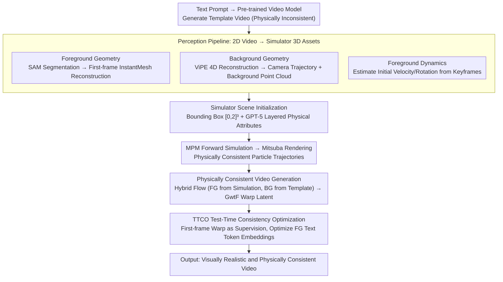

# Physical Simulator In-the-Loop Video Generation

**Conference**: CVPR 2026  
**arXiv**: [2603.06408](https://arxiv.org/abs/2603.06408)  
**Code**: [https://vcai.mpi-inf.mpg.de/projects/PSIVG](https://vcai.mpi-inf.mpg.de/projects/PSIVG)  
**Area**: Video Generation / Physical Consistency  
**Keywords**: Physical Simulator In-the-Loop, Video Diffusion Model, MPM Simulation, Test-Time Optimization, Physically Consistent Generation

## TL;DR
PSIVG is proposed as the first training-free inference-time framework that embeds a physical simulator into the video diffusion generation loop. It reconstructs 4D scenes and object meshes from a template video, generates physically consistent trajectories in an MPM simulator, guides video generation with optical flow, and ensures texture consistency of moving objects via Test-Time Consistency Optimization (TTCO), achieving a user preference rate of 82.3%.

## Background & Motivation

**Background**: Diffusion video generation models (such as CogVideoX and HunyuanVideo) have achieved outstanding visual realism. However, generated videos frequently violate fundamental laws of physics like gravity, inertia, and collision—objects disappear, movement trajectories are illogical, and physical interactions are unrealistic.

**Limitations of Prior Work**: (1) Modern video generation models are trained on denoising/reconstruction objectives, essentially optimizing pixel/patch-wise reconstruction without explicit physical constraints. (2) Early physics-aware methods coupled 2D rigid body simulators with image generators but were limited by simplified 2D assumptions. (3) Methods like PhysAnimator focus on 2D mesh simulation for cartoon animations, while PhysGen3D requires input images for 3D reconstruction. (4) LLM-based prompting methods are orthogonal explorations but do not directly impose physical constraints within the generator.

**Key Challenge**: The training objectives of video diffusion models (denoising/reconstruction) do not contain physical constraints, providing no mechanism to force the learning of physical laws. To achieve physical consistency while maintaining visual quality, physical guidance must be introduced during the generation process.

**Goal**: How to effectively integrate information from physical simulators into the video diffusion process to achieve physically consistent video generation?

**Key Insight**: The authors propose a "simulation-in-the-loop" paradigm where a physical simulator acts as a physics-aware constraint to guide the model in maintaining spatiotemporal consistency during the diffusion generation loop.

**Core Idea**: First, a pre-trained video model generates a template video. From this, 4D scenes and object meshes are reconstructed and placed into a physical simulator. The physically consistent trajectories output by the simulator guide video regeneration, and texture consistency is enhanced through test-time optimization.

## Method

### Overall Architecture
PSIVG addresses the contradiction where video diffusion models produce high-quality visuals that fail to follow physics by embedding an actual physical simulator into the generation loop as a "judge," without training any parameters. The pipeline starts from a "physically inconsistent but compositionally complete" template video. A pre-trained video model generates this template from text; a perception pipeline then decomposes it into 3D foreground meshes, 4D background scenes, and camera trajectories—assets readable by the simulator. These are processed by an MPM physical simulator for forward simulation to obtain trajectories consistent with gravity, inertia, and collisions. Finally, the simulated motion is converted into optical flow to re-condition the video diffusion model for regeneration. When necessary, TTCO is used during test-time to fine-tune and align the textures of moving objects across frames. The template video determines "appearance," while the simulator determines "movement," stitched together by optical flow.

### Key Designs

**1. Perception Pipeline: Translating 2D Generated Videos into 3D Simulator Assets**

Since template videos are 2D and physically inconsistent while simulators requires 3D geometry and initial velocities, the perception pipeline bridges this gap across three paths. For foreground geometry, SAM/GroundedSAM segments dynamic objects, and the **first frame**'s local object image is sent to InstantMesh for single-image 3D mesh reconstruction. A single frame is used because the generated video's inter-frame geometry is often inconsistent. For background geometry, the foreground is masked, and ViPE performs 4D reconstruction to solve for camera trajectories using bundle adjustment, aggregating per-frame metric depth maps into a global 3D background point cloud. For foreground dynamics, initial linear velocity is derived from 3D displacement over $\Delta t$ between keyframes, while rotational velocity is estimated by back-calculating 2D flow fields from SuperGlue feature matching relative to the center of mass.

**2. Physical Simulator Scene Initialization: Replicating the Template Scene in MPM**

After obtaining assets, the simulator must be informed of the scene scale and material properties. The simulation domain is determined by a bounding box encompassing the foreground motion and background geometry, shrunk via spatial offset coefficients into a standard $[0,2]^3$ cube, establishing a scaling factor between real and simulation scales. For physical attributes, GPT-5 is used with layered prompting: first identifying semantic descriptions like material composition, elasticity, and surface roughness, then mapping these to numerical parameters such as density and Young's modulus.

> ⚠️ The paper uses GPT-5 to estimate physical properties; the model version is based on the original text.

Following scene setup, MPM forward simulation generates high-resolution particle trajectories, which Mitsuba renders into RGB frames, segmentation masks, and pixel correspondences. While the rendered visuals may be artificial, their physics are faithful and serve as guidance signals.

**3. Physically Consistent Video Generation: Conditioning Diffusion Models with Flow rather than Pixels**

If the simulator's raw RGB output were used as a condition, visual quality would be degraded by its artificial style. Instead, only **motion** is passed using Go-with-the-Flow (GwtF) for optical flow conditioning. A hybrid optical flow is constructed: the foreground flow is taken from the simulator to ensure physical trajectories, while the background flow is taken from the original template video to preserve scene motion and camera dynamics. These are stitched together using the foreground mask and used to warp the noisy latent.

**4. TTCO Test-Time Consistency Optimization: Preventing Texture Flickering**

Optical flow manages movement but cannot guarantee texture consistency over time, especially during rotation or occlusion. TTCO warps the first frame of the template video $\hat{I}_1$ to every frame using simulation-derived pixel-pixel correspondences to serve as a supervision target. During test-time, a set of zero-initialized learnable embeddings (added to text tokens corresponding to foreground objects) are optimized to force the generated pixels to follow the simulated foreground motion:

$$\mathcal{L}_{\text{TTCO}} = \sum_t \sum_j \big\|\,[De(h_0(\hat{L}_\tau))]_{q_{t,j}} - [W_t(\hat{I}_1)]_{q_{t,j}}\,\big\|_2^2$$

Optimization focuses on early, noisier diffusion steps (700–1000) where the general texture is established, converging in 50 iterations. Modifying the foreground text token ensures locality, affecting only the foreground object without disturbing the background.

### Loss & Training
PSIVG requires no additional training data. TTCO uses AdamW at test-time with a learning rate of $2 \times 10^{-4}$ for 50 iterations. Template videos are generated by CogVideoX-I2V-5B or HunyuanVideo-I2V following image generation via SD3.

## Key Experimental Results

### Main Results

| Method Type | Method | SAM mIoU↑ | Corr.Pixel MSE↓ | CLIP Text↑ | Subj. Consis.↑ |
|----------|------|-----------|----------------|------------|----------------|
| Text-based | CogVideoX | 0.47 | 0.032 | 0.34 | 0.93 |
| Text-based | HunyuanVideo | 0.46 | 0.017 | 0.35 | 0.95 |
| Physics | PISA-Seg | 0.50 | 0.012 | 0.35 | 0.95 |
| Controllable | SG-I2V | 0.75 | 0.021 | 0.34 | 0.95 |
| Controllable | MotionClone | 0.68 | 0.019 | 0.35 | 0.87 |
| **Ours** | **PSIVG** | **0.84** | **0.007** | **0.35** | **0.95** |

### Key Findings
- **PSIVG leads in motion controllability metrics**: It achieves a SAM mIoU of 0.84 (0.09 higher than SG-I2V) and the lowest Corr. Pixel MSE of 0.007.
- While methods like PISA-Seg show high temporal stability, they often produce nearly static videos, whereas PSIVG captures authentic motion.
- **TTCO significantly improves texture consistency**: Corr. Pixel MSE drops from 0.009 to 0.007, and Subject Consistency rises from 0.93 to 0.95.
- Prompt-based optimization is superior to LoRA-based designs; LoRA often degrades background quality with artifacts, while prompt optimization is lightweight and localized.

## Highlights & Insights
- The **"Simulation-in-the-loop" paradigm** is the primary contribution. It introduces physical constraints during inference without modifying the generation model or requiring additional training, making it plug-and-play.
- **Perception Pipeline Insight**: Using InstantMesh for single-frame reconstruction (rather than multi-frame) acknowledges the inter-frame geometric inconsistency inherent in current video models.
- **Layered Physical Property Estimation with GPT-5**: Mapping semantic material descriptions to numerical parameters is more reliable than direct numerical estimation by LLMs.
- **Text Token Spatial Correspondence**: The finding that modifying text embeddings primarily affects foreground appearance confirms the spatial mapping capabilities of text tokens in diffusion models.

## Limitations & Future Work
- Dependency on the MPM simulator limits handling of complex agents (humans, vehicles) and articulated structures.
- The quality of the initial reconstruction in the perception pipeline directly impacts downstream simulation and generation.
- It inherits the limitations of the GwtF model, such as difficulty in generating very small or thin objects.
- The pipeline is significantly more complex than end-to-end approaches, leading to higher latency.

## Related Work & Insights
- **vs. PhysAnimator**: PhysAnimator focuses on 2D cartoon animation with 2D meshes/simulators; PSIVG is a 3D, training-free, open-vocabulary framework.
- **vs. PhysGen3D**: PhysGen3D renders directly from MPM simulations; PSIVG uses video diffusion to compensate for the simulator's rendering deficiencies (e.g., lighting, resolution).
- **vs. PISA**: PISA learns interactions by fine-tuning on large datasets; PSIVG is entirely training-free.

## Rating
- Novelty: ⭐⭐⭐⭐⭐ 
- Experimental Thoroughness: ⭐⭐⭐⭐ 
- Writing Quality: ⭐⭐⭐⭐ 
- Value: ⭐⭐⭐⭐ 

<!-- RELATED:START -->

## Related Papers

- [\[CVPR 2026\] Physical Object Understanding with a Physically Controllable World Model](physical_object_understanding_with_a_physically_controllable_world_model.md)
- [\[CVPR 2026\] ProPhy: Progressive Physical Alignment for Dynamic World Simulation](prophy_progressive_physical_alignment_for_dynamic_world_simulation.md)
- [\[CVPR 2026\] Phantom: Physics-Infused Video Generation via Joint Modeling of Visual and Latent Physical Dynamics](phantom_physics-infused_video_generation_via_joint_modeling_of_visual_and_latent.md)
- [\[ICLR 2026\] VideoPhy-2: A Challenging Action-Centric Physical Commonsense Evaluation in Video Generation](../../ICLR2026/video_generation/videophy-2_a_challenging_action-centric_physical_commonsense_evaluation_in_video.md)
- [\[ICLR 2026\] $PhyWorldBench$: A Comprehensive Evaluation of Physical Realism in Text-to-Video Models](../../ICLR2026/video_generation/phyworldbench_a_comprehensive_evaluation_of_physical_realism_in_text-to-video_mo.md)

<!-- RELATED:END -->
