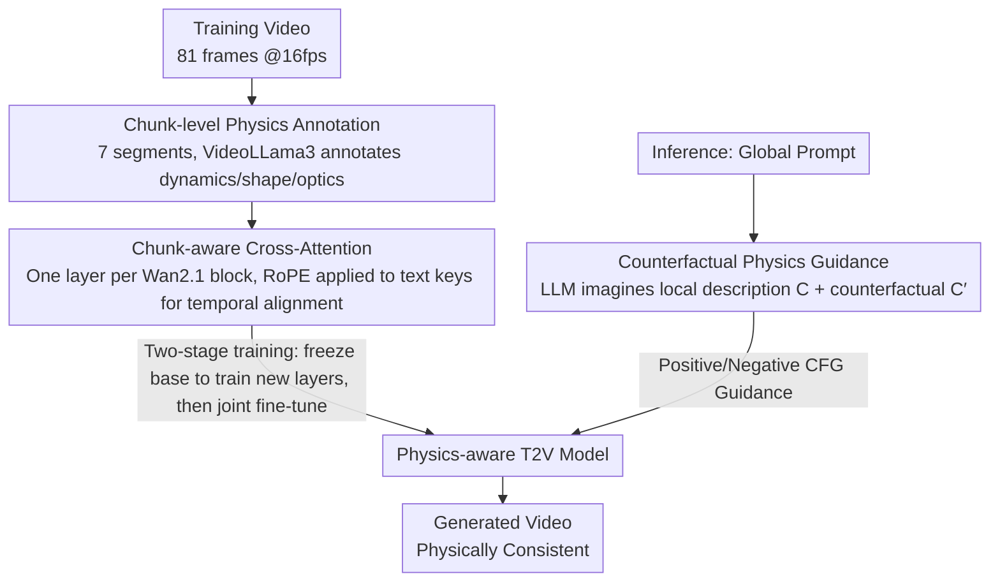

# PhysVid: Physics Aware Local Conditioning for Generative Video

**Conference**: CVPR 2026  
**arXiv**: [2603.26285](https://arxiv.org/abs/2603.26285)  
**Code**: [Project Page](https://5aurabhpathak.github.io/PhysVid)  
**Area**: Video Generation  
**Keywords**: Video generation, physical consistency, local conditioning, cross-attention, counterfactual guidance

## TL;DR

PhysVid proposes a physics-aware local conditioning scheme that divides videos into temporal chunks. A VLM annotates physical phenomenon descriptions for each chunk, which are then injected into the generative model via chunk-level cross-attention. At inference, "negative physics prompts" (counterfactual guidance) are introduced to guide generation away from physical violations, improving the physical common sense score on VideoPhy by approximately 33%.

## Background & Motivation

Generative video models (e.g., Sora, Wan2.1) have achieved significant progress in visual realism but still exhibit fundamental flaws in physical consistency—generated videos frequently violate basic physical laws (e.g., object interpenetration, gravity anomalies, unreasonable deformations). Limitations of prior work:

**Background**: Standard T2V models use the same text to condition all frames, failing to capture local temporal changes in physical details.

**Limitations of Prior Work**: Frame-level control methods are often domain-specific and lack cross-frame physical continuity.

**Key Challenge**: While methods like DiffPhy and PhyT2V use LLMs to enhance physical information in global prompts, they cannot ensure the model focuses on the correct physical cues at the right time.

**Key Insight**: Global cross-attention tends to produce nearly static attention maps, leading to temporal alignment failures for motion-related words. The core insight of PhysVid is that **physical phenomena are local-temporal**—motion, collisions, and lighting changes occur within short intervals, requiring aligned local conditioning.

## Method

### Overall Architecture

PhysVid addresses the specific pain point where T2V models use a single global text prompt for all frames, whereas physical phenomena (collisions, deformations, reflections) occur only in specific split-second moments. The core idea is to provide "exclusive" physical descriptions for each time segment. The mechanism involves three steps: first, training videos are divided into temporal chunks, and a VLM annotates the physical phenomena in each chunk to obtain timestamped labels; second, a chunk-level cross-attention layer is inserted into the pre-trained Wan2.1 model, allowing each video segment to attend only to its aligned physical description; third, during inference, since no ground-truth video is available, an LLM "imagines" local physical descriptions from the global prompt and generates counterfactual descriptions of physical violations for dual CFG guidance.

### Key Designs

**1. Chunk-level Physics Annotation: Aligning descriptions with temporal segments**

**Function**: To provide precise local information that global prompts lack. The mechanism divides each 5-second training video (81 frames @16fps) into 7 chunks of approximately 0.7 seconds. VideoLLama3-7B analyzes each segment, focusing specifically on three categories: dynamics (motion, collisions, acceleration), shape (deformation, bending), and optics (reflection, shadows, refraction). The global prompt is also provided to the VLM to ensure local descriptions remain relevant, and output is constrained to a structured format.

**2. Chunk-aware Cross-Attention: Temporal alignment for attention**

**Design Motivation**: Standard T2V cross-attention lacks a temporal coupling between text and video frames, often resulting in static attention maps. PhysVid inserts a new chunk-level cross-attention layer in each Transformer block of Wan2.1. While video query tokens use standard 3D spatio-temporal RoPE, **the key step is applying RoPE to text keys and defining a grid with a chunk axis**. By using the same RoPE frequency base for both video and text, the attention logits gain cross-modal positional awareness, allowing video tokens at a specific time to naturally "favor" text from the corresponding chunk.

**3. Counterfactual Physics Guidance: Reinforcing correct physics and penalizing violations**

**Mechanism**: During inference, an LLM first "imagines" local physical descriptions $C$ from the global prompt. It then identifies key visual/physical elements to generate counterfactual descriptions $C'$ that intentionally violate these laws (e.g., changing "ball bounces off the ground" to "ball passes through the ground"). Both paths are integrated into classifier-free guidance:

$$x_{T-1} = (1+w) \cdot \mathcal{G}(x_T, c_g, C, T) - w \cdot \mathcal{G}(x_T, c_n, C', T)$$

where $c_g, C$ are global positive and local physics prompts, and $c_n, C'$ are global negative and counterfactual physics prompts. The positive term pulls the generation toward correct physics, while the negative term pushes it away from violations.

### Loss & Training

**Training Strategy**: Training is conducted in two stages to stabilize the new modules. Stage 1 (1000 steps) freezes the Wan2.1 base model and trains only the newly inserted chunk cross-attention layers. Stage 2 (2000 steps) unfreezes the base model for joint parameter training. The optimization objective follows the flow matching loss of Wan2.1. The training data consists of approximately 53K video samples (832×480, 81 frames @16fps) processed from WISA-80K.

## Key Experimental Results

### Main Results

**Table 1: VideoPhy Benchmark**

| Method | Parameters | SA (Semantic Alignment) | PC (Physical Common Sense) ↑ |
|------|--------|-------------|----------------|
| Wan-1.3B | 1.3B | 0.46 | 0.24 |
| Wan-14B | **14B** | **0.52** | 0.24 |
| **Ours (PhysVid)** | **1.7B** | 0.43 | **0.32** |

PhysVid outperforms the 14B model in physical common sense with only 1.7B parameters, achieving a **relative gain of ~33%**.

**Table 2: VideoPhy2 Benchmark**

| Method | Parameters | SA | PC ↑ |
|------|--------|-----|------|
| Wan-1.3B | 1.3B | 0.28 | 0.61 |
| Wan-14B | 14B | **0.29** | 0.59 |
| **Ours (PhysVid)** | 1.7B | 0.28 | **0.64** |

Relative gain of ~8% over Wan-14B on VideoPhy2.

### Ablation Study

| Method | VideoPhy PC ↑ | VideoPhy2 PC ↑ | Description |
|------|--------------|---------------|------|
| Wan-1.3B Baseline | 0.2401 | 0.6144 | No improvements |
| Direct Fine-tuning | 0.2866 | 0.6261 | Fine-tuned on WISA data without chunk architecture |
| PhysVid (w/o CFG) | 0.2924 | 0.6334 | Only positive local conditioning |
| **PhysVid (Full)** | **0.3169** | **0.6411** | Positive + Counterfactual guidance |

### Key Findings

1. **Local > Global**: Prev. SOTA physics info is more effective when temporally aligned; PhysVid significantly outperforms direct fine-tuning.
2. **Counterfactual Guidance Effectiveness**: Incorporating counterfactual negative prompts raised the PC score from 0.2924 to 0.3169.
3. **Scale vs. Physics**: Wan-14B, despite having 8x the parameters, lacks superior physical common sense compared to the structured PhysVid-1.7B.
4. **Trade-off**: A slight decrease in SA (0.43 vs 0.46) suggests that physics-oriented guidance may slightly compromise overall semantic aesthetics.

## Highlights & Insights

1. **Precision of Temporal Grain**: Local physical conditioning is the correct trajectory, as global prompts cannot align with transient events.
2. **Automated Annotation via VLM**: By using VLMs to extract physical information from videos, the method remains scalable and non-reliant on human labeling.
3. **Double Constraint via CFG**: Extending the CFG logic to the physical dimension by explicitly modeling "violations" provides a strong corrective signal.
4. **Cross-modal RoPE**: Applying RoPE to text keys ensures the chunk boundaries are explicitly recognized during attention calculations.

## Limitations & Future Work

1. **Semantic Drop**: The reduction in SA score suggests local physics might interfere with global semantic coherence.
2. **VLM Dependency**: The quality of chunk-level descriptions is limited by the reasoning capabilities of VideoLLama3.
3. **Inference Latency**: Generating local and counterfactual prompts via LLM adds overhead to the inference pipeline.
4. **Data Scope**: The WISA dataset is narrow, and generalization to arbitrary T2V scenarios remains unverified.
5. **Fixed Chunking**: Equal-length chunking may not perfectly match the diverse temporal scales of various physical events.

## Related Work & Insights

- **Comparison with Hao et al.**: While both use counterfactual guidance, PhysVid advances this to the chunk level.
- **Comparison with WISA**: WISA uses global MoE modules and classifiers; PhysVid focuses on automated VLM extraction and local injection.
- **World Model Implications**: PhysVid serves as a step toward physics-aware world simulators by teaching models how physics unfolds over time.

## Rating

- **Novelty**: ⭐⭐⭐⭐ — Novel combination of chunk-level conditioning and counterfactual guidance.
- **Experimental Thoroughness**: ⭐⭐⭐⭐ — Comprehensive analysis across multiple benchmarks and sub-categories.
- **Writing Quality**: ⭐⭐⭐⭐ — Clear structure and thorough related work section.
- **Value**: ⭐⭐⭐⭐ — Architecture is compatible with existing T2V models and offers strong scalability.

<!-- RELATED:START -->

## Related Papers

- [\[CVPR 2026\] FaceCam: Portrait Video Camera Control via Scale-Aware Conditioning](facecam_portrait_video_camera_control_via_scale-aware_conditioning.md)
- [\[CVPR 2026\] Inference-time Physics Alignment of Video Generative Models with Latent World Models](inference-time_physics_alignment_of_video_generative_models_with_latent_world_mo.md)
- [\[NeurIPS 2025\] PhysCtrl: Generative Physics for Controllable and Physics-Grounded Video Generation](../../NeurIPS2025/video_generation/physctrl_generative_physics_for_controllable_and_physicsgrou.md)
- [\[CVPR 2026\] SeeU: Seeing the Unseen World via 4D Dynamics-aware Generation](seeu_seeing_the_unseen_world_via_4d_dynamics-aware_generation.md)
- [\[CVPR 2026\] Generative Neural Video Compression via Video Diffusion Prior](generative_neural_video_compression_via_video_diffusion_prior.md)

<!-- RELATED:END -->
