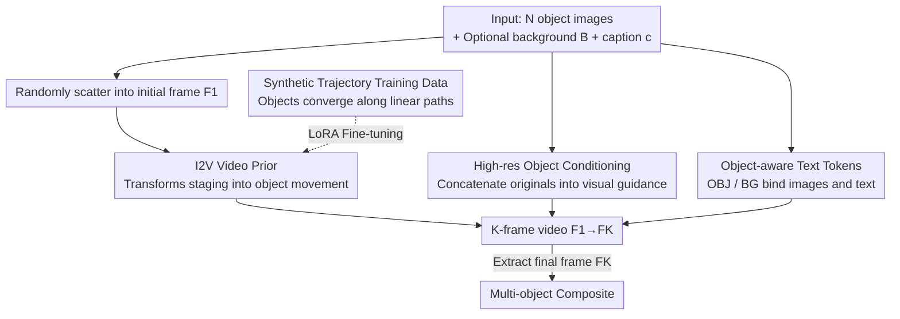

# PLACID: Identity-Preserving Multi-Object Compositing via Video Diffusion with Synthetic Trajectories

**Conference**: CVPR 2026  
**Paper**: [CVF Open Access](https://openaccess.thecvf.com/content/CVPR2026/html/Tarres_PLACID_Identity-Preserving_Multi-Object_Compositing_via_Video_Diffusion_with_Synthetic_Trajectories_CVPR_2026_paper.html)  
**Code**: None (Project Page: https://gemmact.github.io/placid/ )  
**Area**: Video Generation / Diffusion Models / Image Synthesis  
**Keywords**: Multi-Object Compositing, Image-to-Video, Identity Preservation, Synthetic Trajectories, Product Imagery

## TL;DR
PLACID reformulates multi-object "staging" compositing as an Image-to-Video (I2V) task: multiple objects scattered randomly are made to "move" along synthetic trajectories to a final layout. By using the last frame of the video diffusion model as the composite result, the method leverages temporal priors to preserve object identity, background, and color while significantly reducing object omissions or duplications.

## Background & Motivation
**Background**: In e-commerce and marketing, the task involves compositing multiple product images onto a clean background with an aesthetic layout. Mainstream approaches currently adapt Text-to-Image (T2I) diffusion models for object composition (e.g., AnyDoor, IMPRINT) or utilize subject-driven generation (e.g., DreamBooth, IP-Adapter, UNO, OmniGen) to insert reference objects into new scenes.

**Limitations of Prior Work**: These I2I/T2I methods often fail in "studio-level" multi-object compositing across four requirements: identity preservation (color gradients, textures, and shapes are easily altered), background and color fidelity (slight color shifts damage brand identity), layout controllability, and complete display ("no omissions and no duplications"). In practice, current SOTA methods frequently change colors, omit objects, duplicate objects, or produce incorrect relative scales. Moreover, many methods can only handle **single** objects or require additional bounding boxes/masks.

**Key Challenge**: The prior of T2I/I2I models is based on "static single frames," lacking the knowledge that "the same object can move, be repositioned, and interact with the background while maintaining its identity." Consequently, multiple objects become entangled, omitted, or duplicated upon input.

**Goal**: Given multiple object images, an optional background image, and a text description, the goal is to generate a composite image where identity, background, and color are preserved, and all objects are present.

**Key Insight**: The authors observe that Image-to-Video (I2V) models inherently possess temporal priors—knowledge that "objects remain consistent over time, can be repositioned, and interact with the background." This is precisely the knowledge missing in compositing tasks. By transforming "arranging objects into place" into "objects smoothly moving to target positions in a video," one can directly leverage video priors.

**Core Idea**: A pretrained I2V diffusion model is used to let randomly scattered objects converge smoothly along **synthetic trajectories** to the final layout described by text. The **last frame** is taken as the composite result. To enable the video model to learn this process of "inanimate objects moving themselves" (data largely absent from real videos), a batch of training videos with synthetic trajectories is specifically generated.

## Method

### Overall Architecture
PLACID receives three types of inputs: $N$ unsegmented object images $I_1..I_N$, an optional background image $B$, and a free-text caption $c$. The system first **randomly places** the $N$ objects on the background (or a white canvas) to obtain a coarse initial frame $F_1$. Then, an I2V Video DiT synthesizes a $K$-frame video $V=\{F_1,...,F_K\}$, allowing the scene to transition smoothly from the cluttered $F_1$ to the refined scene $F_K$ described by the caption. The final frame $F_K$ is the desired composite. Without a background, the white canvas in $F_1$ gradually "grows" into the final scene.

The backbone is a text-guided I2V diffusion transformer (Wan2.1 I2V-14B), which originally relies on "initial frame + caption" cross-attention. PLACID introduces two conditional modifications (high-resolution object conditioning and object-aware text tokens) and a set of **synthetic trajectory training data** to teach the model this "staging" motion—all three components are essential.

### Key Designs

**1. Reformulating "Staging" as "Object Movement" via I2V Video Priors**

This paradigm shift directly addresses the core challenge that single-frame models lack priors for object movement or repositioning. instead of using I2I to paste objects onto backgrounds in one step, the authors generate a $K$-frame video from $F_1$ (random) to $F_K$ (final product). This delegates the "how to arrange" problem to the video model's inherent priors for object interaction and repositioning. Advantages include: objects are constrained by temporal priors across frames to "remain the same thing," suppressing identity drift, omissions, and duplications. Simultaneously, $F_K$ naturally incorporates shadows and lighting gradients, making the composition look realistic rather than like a crude cutout.

**2. High-Resolution Object Conditioning: Feeding Original Details Directly**

To address the loss of detail during downsampling and the entanglement of multiple identities, the original DiT only receives downsampled objects in $F_1$, causing loss of texture/color. PLACID modifies visual guidance: the **original full-resolution** object images $I_1..I_N$ (and background $B$) are concatenated with the coarse composite $F_1$ and injected into the generation via cross-attention after CLIP encoding. The visual condition is thus $I_c=[F_1, I_1,...,I_N]$. This provides a "high-definition reference" throughout the diffusion process, preserving background details and avoiding the blurring or "bleeding" of objects.

**3. Object-Aware Text Tokens: Mapping Descriptions to Specific Objects**

To ensure description fragments like "red cup" or "wooden background" are precisely bound to the correct images, PLACID introduces four special tokens: `<OBJ> </OBJ>` and `<BG> </BG>`. These wrap segments of the caption describing specific objects or the background. **The order of the wrapped segments matches the order of the provided images.** During text cross-attention, these tokens guide the model to associate specific text segments with their corresponding visual information, while the remaining description handles the overall completion of the image.

**4. Synthetic Trajectory Training Data: Creating "Self-Moving Objects"**

This addresses the lack of real-world video data showing inanimate objects moving independently. instead of simple interpolation between initial and final frames (which creates "ghosting" or transparency), PLACID moves objects along **linear synthetic trajectories** from random starting points to target positions. This maintains spatio-temporal consistency and suppresses identity changes. Data comes from three sources: ① Professional multi-object images (Unsplash products reorganized via GroundingDINO+SAM, plus ~400 designer-composed sets); ② Subject-driven pairs from Subject-200k (white background vs. scene images of the same object—**loss is only calculated on the last frame** here); ③ 3D rendered objects with known dimensions arranged side-by-side with progressive relighting. These total ~50K tuples, augmented with object/background/caption variations.

### Loss & Training
Based on Flow Matching fine-tuning, only a lightweight LoRA adapter is trained. The objective is:
$$\mathcal{L}=\mathbb{E}_{V_0,V,I_c,c,t}\big\|\,u(x_t,I_c,c,t;\theta)-w_t\,\big\|^2,$$
where $V_0\sim\mathcal{N}(0,1)$ is noise, $t\in[0,1]$ is the timestamp, $V_t=tV+(1-t)V_0$ is the noisy video, and the model predicts velocity $u(\cdot)$ to fit $w_t=V_t-V_0$. For synthetic trajectory data, the loss covers the **entire video**; for Subject-200k where intermediate frames might be unreasonable, **only the final frame** loss is used. Training was conducted on 8×H100 for 119k steps (~5 days) with $K=9$ frames. Inference can use longer sequences (e.g., 33 frames), taking ~26–80s.

## Key Experimental Results

The evaluation uses 122 sets composed from ABO product images and DreamBench++ (1–7 objects per set). Metrics include identity preservation (CLIP-I, DINO), text alignment (CLIP-T, VQAScore), background fidelity (MSE-BG), color fidelity (Chamfer), and omission rate (Missing), supplemented by two user studies.

### Main Results
| Method | CLIP-I↑ | DINO↑ | VQAScore↑ | MSE-BG↓ | Chamfer↓ | Missing↓ |
|------|---------|-------|-----------|---------|----------|----------|
| UNO | 0.696 | 0.450 | 0.886 | 0.062 | 14.733 | 0.099 |
| OmniGen | 0.724 | 0.478 | 0.793 | 0.119 | 15.120 | 0.128 |
| VACE | 0.689 | 0.439 | 0.891 | 0.096 | 9.948 | 0.096 |
| NanoBanana (Closed) | 0.662 | 0.390 | **0.929** | 0.029 | 13.146 | 0.138 |
| Wan 2.1 (Base) | 0.711 | 0.446 | 0.809 | 0.047 | 7.746 | 0.048 |
| **PLACID (Ours)** | 0.705 | 0.440 | 0.912 | **0.019** | **4.641** | **0.044** |

PLACID leads in background fidelity (MSE-BG 0.019), color fidelity (Chamfer 4.641), and omission rate (Missing 0.044). While CLIP-I/DINO are slightly lower than some models, the authors explain that PLACID prioritizes natural, coherent composition (allowing slight occlusion or perspective changes), whereas "copy-paste" methods inflate these scores despite poor visual coherence.

### Ablation Study
| Configuration | CLIP-I↑ | DINO↑ | CLIP-T↑ | MSE-BG↓ | Chamfer↓ | Missing↓ |
|------|---------|-------|---------|---------|----------|----------|
| Wan 2.1 (base) | 0.711 | 0.446 | 0.333 | 0.047 | 7.746 | 0.048 |
| + FT (Fine-tuned on our data) | 0.691 | 0.415 | 0.331 | 0.042 | 5.754 | 0.045 |
| + FT, $I_c$ (High-res object cond.) | 0.698 | 0.440 | 0.329 | 0.040 | 4.138 | 0.042 |
| + FT, $I_c$, TOK (Object tokens) | 0.703 | 0.447 | 0.331 | 0.033 | 4.555 | 0.051 |
| Ours (including final-frame loss) | 0.705 | 0.440 | **0.336** | **0.019** | 4.641 | 0.044 |

Ablation on data sources shows: In-the-wild data yields best identity (CLIP-I 0.721) but risks copy-paste; Subject-200k yields best text alignment; Side-by-side yields best color fidelity. **Using all three sources** achieves the best overall balance.

### Key Findings
- The omission rate (Missing 0.044) is the lowest, confirming that the combination of video temporal priors and trajectory-consistent data effectively prevents lost or duplicated objects.
- High-resolution object conditioning $I_c$ significantly improves color fidelity (Chamfer 7.746→4.138).
- Quantitative metrics sometimes reward "copy-pasting," so 1265 side-by-side user studies verify PLACID's superiority in identity preservation and overall quality over open-source methods.

## Highlights & Insights
- **Temporalization of Static Synthesis**: The cleverest step is reformulating "placement" as "movement," treating an I2V model's motion prior as a free object-consistency and repositioning prior. This insight of "changing the task formulation to borrow existing priors" is transferable.
- **Tailoring Data for Priors**: Instead of forcing a video model to learn a new domain, the authors created synthetic trajectory data that "aligns with video temporal priors," replacing the "ghosting" of interpolation with consistent linear motion.
- **User Study over Deceptive Metrics**: By acknowledging that CLIP-I/DINO can be inflated by copy-pasting, the authors used extensive user studies to ensure practical quality.

## Limitations & Future Work
- Prioritizing visual coherence over strict text alignment occasionally results in lower CLIP-T scores when dealing with ambiguous descriptions (e.g., "green figurine").
- Identity preservation may lead to slight object overlap or repositioning, requiring new viewpoint synthesis, which can paradoxically lower CLIP-I/DINO scores.
- Synthetic trajectories are **linear**; complex non-rigid repositioning or extreme relighting still relies on the Subject-200k branch (final-frame loss), sacrificing intermediate frame physics.
- Stability with long sequences (K=9 training vs. 33 inference) and the lack of open-source code may hinder reproducibility and deployment.

## Related Work & Insights
- **vs AnyDoor / IMPRINT**: These preserve identity well but are usually for **single objects** and require masks/boxes. PLACID handles multiple objects via text without boxes.
- **vs UNO / OmniGen / MS-Diffusion**: These treat the background as a reference, which often alters details. PLACID leads significantly in background and color fidelity (MSE-BG/Chamfer).
- **vs VACE**: VACE focuses on single-object or style editing; PLACID applies I2V priors specifically to **multi-object composition with consistent backgrounds**.

## Rating
- Novelty: ⭐⭐⭐⭐⭐ Reformulating composition as I2V trajectory convergence is highly novel and self-consistent.
- Experimental Thoroughness: ⭐⭐⭐⭐ Main results, dual ablations, and two user studies are comprehensive; however, code is unavailable.
- Writing Quality: ⭐⭐⭐⭐ Clear logic from motivation to method; the four requirements align perfectly with the four designs.
- Value: ⭐⭐⭐⭐ Directly addresses e-commerce pain points; the fidelity of background/color and low omission rate are highly practical.

<!-- RELATED:START -->

1. **AnyDoor**: Zero-shot Object-level Image Customization.
2. **Wan2.1**: Edge-stabilized Video Diffusion Transformer.
3. **OmniGen**: Unified Image Generation Model.

<!-- RELATED:END -->

## Related Papers

- [\[CVPR 2026\] Identity-Preserving Image-to-Video Generation via Reward-Guided Optimization](identity-preserving_image-to-video_generation_via_reward-guided_optimization.md)
- [\[CVPR 2026\] ConsID-Gen: View-Consistent and Identity-Preserving Image-to-Video Generation](consid-gen_view-consistent_and_identity-preserving_image-to-video_generation.md)
- [\[CVPR 2026\] EvoID: Reinforced Evolution for Identity-Preserving Video Generation](evoid_reinforced_evolution_for_identity-preserving_video_generation.md)
- [\[CVPR 2026\] Let Your Image Move with Your Motion! – Implicit Multi-Object Multi-Motion Transfer](let_your_image_move_with_your_motion_--_implicit_multi-object_multi-motion_trans.md)
- [\[CVPR 2026\] Stand-In: A Lightweight and Plug-and-Play Identity Control for Video Generation](stand-in_a_lightweight_and_plug-and-play_identity_control_for_video_generation.md)

<!-- RELATED:END -->
