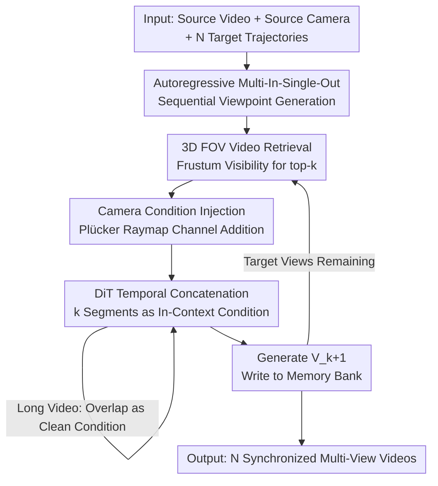

# Plenoptic Video Generation

**Conference**: CVPR 2026  
**Paper**: [CVF Open Access](https://openaccess.thecvf.com/content/CVPR2026/html/Fu_Plenoptic_Video_Generation_CVPR_2026_paper.html)  
**Code**: None (Project page: research.nvidia.com/labs/dir/plenopticdreamer)  
**Area**: Video Generation  
**Keywords**: Camera-controllable video generation, Video re-rendering, Autoregressive, Spatiotemporal memory, Plücker raymap

## TL;DR
PlenopticDreamer formulates "re-rendering input videos along arbitrary camera trajectories" as an **autoregressive, multi-in-single-out** diffusion model. During the generation of each new viewpoint, the model retrieves the most relevant historical video segments from a memory bank based on 3D frustum visibility to serve as conditions. Combined with progressive context expansion and self-conditioning training, it ensures spatiotemporal consistency in "hallucinated" occluded regions across different trajectories, significantly outperforming single-view methods like ReCamMaster on view synchronization metrics in the Basic and Agibot benchmarks.

## Background & Motivation

**Background**: Camera-controllable generative video re-rendering (generating a new video along a target camera trajectory given an input video while maintaining content consistency) has progressed rapidly. Methods like ReCamMaster and TrajectoryCrafter can produce high-quality single-view results on real-world or synthetic datasets. Video frames are essentially discrete samplings of the scene's radiation field (plenoptic function), and controlling camera movement is equivalent to taking different slices of this light field.

**Limitations of Prior Work**: Most existing methods succeed only in a **single-view** setting—generating one segment for a target trajectory independently. When generating **multiple** trajectories for the same scene (multi-view), severe inconsistencies appear in regions not visible in the source view that require model "hallucination." Occluded areas generated across different trajectories often show geometric misalignment or "view desynchronization."

**Key Challenge**: There are two root causes. First, diffusion models are inherently **stochastic**, leading to different hallucinated content in each independent inference. Second, models lack **long-range spatial memory**; during the $N$-th generation, the model has no knowledge of how occluded regions were rendered in the previous $N-1$ attempts. Methods like TrajectoryCrafter, which inject conditions via 3D point tracking, fail because they **do not update the 3D memory with newly rendered content**.

**Goal**: To explicitly maintain **spatiotemporal memory** during multi-trajectory video generation, ensuring that hallucinations of occluded regions are synchronized across all viewpoints—essentially generating a truly "spatiotemporally correlated plenoptic function" of the scene.

**Key Insight**: Rather than treating multi-view generation as "one-off independent tasks," the process is reformulated as **autoregressive, sequential generation**. For each new viewpoint, previously generated video-camera pairs are used as conditions. This allows new viewpoints to inherit historical hallucinations, transforming the problem from "enforcing consistency between independent samplings" to "managing historical context."

**Core Idea**: Replace single-pass generation with **multi-in–single-out autoregressive diffusion**, using **3D FOV retrieval** to select the top-$k$ most relevant historical segments from a video memory bank as conditions, providing a solid "grounding" for hallucinations.

## Method

### Overall Architecture

Task Formalization: Given a source video $V_s \in \mathbb{R}^{F\times C\times H\times W}$, a source camera trajectory $P_s$, and $N$ target camera trajectories $\{P_t^n\}_{n=1}^{N}$, the goal is to generate $N$ target videos $\{V_t^n\}$. Each video follows a target trajectory while maintaining content consistency and spatiotemporal synchronization across viewpoints. The backbone is a **flow-matching video DiT**: the forward process linearly interpolates between data and noise $x_t=(1-t)x_0+t\epsilon$, $v_t=\epsilon-x_0$, and the training objective is to predict the velocity field $\mathcal{L}(\Theta)=\mathbb{E}\|v_\Theta(x_t,t,c)-v_t\|^2$ (Eq. 3).

The "Native" approach (directly extending ReCamMaster) would expand the context window from 1 video to $N$ videos, patchifying and concatenating them along the frame dimension as $x=[x_s,x_1,...,x_N]$ for single-pass generation. However, this causes computational explosion and OOM issues as $N$ or resolution increases, being feasible only for $N\le 3$ at $\le$480p.

The PlenopticDreamer pipeline is restructured into three collaborative components: **(a) Video & Camera Memory Bank** storing all generated $(P_n,V_n)$ pairs; **(b) Autoregressive Multi-Camera Generator** which uses **3D FOV Retrieval** at each step to select top-$k$ historical segments from the memory. These, along with target camera $P_{k+1}$, are processed via noise scheduling and learnable reconstruction to generate $V_{k+1}$, which is then written back to memory; **(c) Internal DiT Blocks** concatenate the retrieved $k$ video tokens along the **temporal dimension** as in-context conditions. Camera parameters are encoded as Plücker raymaps and added channel-wise to the video tokens. For long videos, overlapping frames from the end of the previous chunk are kept as clean condition frames.

### Key Designs

**1. Autoregressive Multi-In-Single-Out Generation: From "Independent Sampling" to "Sequential Continuation"**

This addresses the root cause of view desynchronization. The standard generation function $f:c,V_s,P_s,\{P_t^n\}\to\{V_t^n\}$ is a single-step process. This work reformulates it as a sequential recurrence (Eq. 6):

$$f(\cdot):c,\{(P_n,V_n)\}_{n=1}^{k},P_{k+1}\to V_{k+1},\quad k=1,...,N-1$$

Only one video $V_{k+1}$ is generated per step, using the **previously generated $k$ video-camera pairs as conditions**. The source pair $(P_s,V_s)$ is treated as $(P_1,V_1)$, where $k$ is the model's context capacity. Conditions are constructed via **temporal concatenation**: $x=[x_1,...,x_{k+1}]$, forming a long token sequence for the DiT. Camera info is encoded using **Plücker raymaps**—mapping each pixel to a 6D ray representation $\ddot P_n\in\mathbb{R}^{f\times H\times W\times 6}$, which is dimension-aligned by a projection layer $E_{cam}$ and **added channel-wise** to video tokens before self-attention. This ensures animations are continued based on historical constraints rather than random sampling, while amortizing the context cost to avoid OOM.

**2. 3D FOV Video Retrieval: Selecting History that "Sees the Same Area"**

With a growing memory bank, selecting which $k$ segments to use as conditions is critical. Random selection dilutes spatial cues. Instead, **spatial co-visibility** retrieval is used (Algorithm 1): for each historical video, the frustum is constructed frame-by-frame. Monte Carlo sampling is performed between the near and far planes, counting "sample points visible to the target camera." Similarity is accumulated as $S_n \leftarrow S_n + \frac{P_n+P_{K+1}}{2P\times F}$. Segments viewing the same region as the target are prioritized. For cases where $l > k$, a **divide-and-conquer inference** (Algorithm 2) fuses the most divergent views into a single "merged trajectory" $P_{merge}$, reducing the set until $l\le k$.

**3. Progressive Context Extension + Self-Conditioning: Stabilizing Convergence and Error Suppression**

These strategies address typical autoregressive issues. First, **direct training with large $k$ is unstable**. **Progressive training** is employed: starting with $k{=}1$ and gradually increasing to $k=4$ (e.g., training 10K/4K/1K/1K steps respectively on Basic). This improves stability and speeds up the final stages. Second, to handle **error accumulation** from imperfect historical conditions during inference, **self-conditioning training** is used. After initial convergence with ground-truth conditions, the model is trained on its own "imperfect synthetic outputs." This makes the model robust to input noise, mitigating artifacts and overexposure in long-range reasoning.

### Loss & Training

The training objective follows flow-matching velocity regression (Eq. 9): $\mathcal{L}(\Theta)=\mathbb{E}\big\|v_\Theta(\{(P_n,V_n)\}_{n=1}^{k+1},t,c)-v_t\big\|^2$. Overlapping frame predictions $\tilde V_{k+1}$ for long videos are also included in the loss. The backbone is **Cosmos-Predict2.5-2B**, generating 432×768, 93-frame videos. Context parallelism is set to 8. Fine-tuning is performed on 32 H100 GPUs (batch size 1, lr 2e-5), **updating only self-attention layers and camera encoders**. Timestep $t$ is biased toward high noise during training to encourage robust reconstruction under degraded correlation.

## Key Experimental Results

Evaluation spans three dimensions: visual quality (PSNR, FVD), camera accuracy (TransErr, RotErr), and view synchronization (Mat. Pix. via RoMa high-confidence matches).

### Main Results

Comparison on the Basic benchmark (100 wilderness videos × 12 trajectories), Mat. Pix. in thousands (K):

| Model | FVD ↓ | TransErr ↓ | RotErr ↓ | 3 Shots ↑ | 6 Shots ↑ | 9 Shots ↑ | 12 Shots ↑ |
|------|-------|-----------|----------|-----------|-----------|-----------|------------|
| Trajectory-Attention | 734.1 | 0.77 | 0.26 | 22.7 | 26.9 | 28.8 | 29.1 |
| TrajectoryCrafter | 665.9 | 0.65 | 0.27 | 31.2 | 29.3 | 35.3 | 36.2 |
| ReCamMaster | 731.6 | 0.72 | 0.23 | 32.1 | 29.0 | 30.9 | 27.6 |
| ReCamMaster* (Retrained) | 675.4 | 0.52 | 0.22 | 24.6 | 20.2 | 29.7 | 31.2 |
| **PlenopticDreamer** | **425.8** | 0.54 | **0.21** | **41.4** | **40.8** | **45.4** | **41.2** |

View synchronization (Mat. Pix.) leads across all shot counts, and FVD is reduced from ~665 to 425.8. Notably, synchronization does not decay as the number of shots increases, unlike baselines, proving the effectiveness of the memory mechanism.

Agibot Robotic Manipulation benchmark (200 test videos, head-view to gripper-view):

| Model | PSNR ↑ | View Sync. (Mat. Pix. K) ↑ |
|------|--------|----------------------------|
| ReCamMaster* | 13.84 | 13.2 |
| **Ours** | **14.54** | **15.3** |

### Ablation Study

Training strategy and retrieval ablation on the Basic set:

| Configuration | FVD ↓ | IQ ↑ | TransErr ↓ | 3 Shots ↑ | 12 Shots ↑ | Description |
|------|-------|------|-----------|-----------|-----------|------|
| Full Model | 425.8 | 58.5 | 0.54 | 41.4 | 41.2 | Full Model |
| w/o Self-Cond. | 464.3 | 56.7 | 0.54 | 40.9 | 40.7 | Without Self-Cond: Worse FVD/IQ, artifacts in long sequences |
| w/o Progressive | 453.8 | 57.2 | 0.63 | 39.6 | 39.4 | Without Progressive: TransErr 0.54 to 0.63, incorrect occluded objects |
| w/ Random Context | 520.5 | 58.3 | 0.56 | 33.6 | 32.4 | Random history selection: Sync collapses, inconsistent hallucinations |

### Key Findings
- **3D FOV Retrieval is vital for synchronization**: Switching to random history selection causes 3-shot sync to drop from 41.4 to 33.6 and 12-shot from 41.2 to 32.4, a larger impact than any training strategy.
- **Progressive training saves camera accuracy**: Its removal worsens TransErr from 0.54 to 0.63 and causes occluded objects to reappear incorrectly.
- **Context quantity has diminishing returns**: Increasing $k$ from 4 to 6 improves consistency via richer spatial cues, but higher values (8, 10) show diminishing returns as trajectory fusion errors and generation noise compound.

## Highlights & Insights
- **Transforming Stochastic Inconsistency into a Retrieval Problem**: Instead of constraining diffusion sampling directly, the model allows new views to "read" what was generated before. The autoregressive + memory bank approach is a clean framework applicable to any task requiring mutual consistency across independent generations.
- **Frustum-Based Co-visibility vs. Pose Distance**: Using Monte Carlo sampling within the frustum to measure relevance is more accurate for "what helps hallucinate this occlusion" than simple Euclidean pose distance.
- **Divide-and-Conquer Inference**: This elegantly handles cases where the number of retrieved candidates exceeds context capacity by merging divergent views into oversight trajectories.
- **Self-Conditioning as a Robustness Tool**: Training with "self-produced flawed outputs" directly targets error accumulation in autoregressive models, a simple yet effective strategy for long-sequence generation.

## Limitations & Future Work
- **Dependency on Large-Scale Multi-View Synthetic Data**: Basic requires ~170K episodes and Agibot ~146K synchronized segments. The cost of obtaining precise multi-camera labels limits expansion to open-domain real-world scenes.
- **High Compute Barrier**: Requiring 32×H100 with context parallelism is expensive for reproduction and deployment.
- **Scalability of Context Capacity**: Benefits plateau after $k=6$ due to fused trajectory errors, suggesting a ceiling for scalability to a very high number of视角 $N$.
- **Geometric vs. Semantic metrics**: PSNR on Agibot remains relatively low (~14.5), and synchronization is primarily measured at the pixel level rather than semantic label consistency.

## Related Work & Insights
- **vs. ReCamMaster / TrajectoryCrafter (Single-View)**: These lack cross-step memory. While TrajectoryCrafter uses 3D point tracking, it **does not update the 3D memory**. Ours explicitly brings historical hallucinations into the context, nearly doubling the Mat. Pix. sync metric.
- **vs. Video Memory Mechanisms**: Various levels exist (frame-level, latent-level, 3D structure/surfel, or network-level via TTT). This is the **first framework to use explicit "video segment retrieval" as a condition**, where the memory unit is a full video-camera pair rather than isolated tokens or frames.
- **Insight**: The "Autoregressive + Retrieval-based Memory" combination is a universal template for long-range consistency in generative tasks (long videos, 3D scenes, embodied agents).

## Rating
- Novelty: ⭐⭐⭐⭐⭐ First framework to introduce explicit spatiotemporal memory + video-level retrieval for generative video re-rendering.
- Experimental Thoroughness: ⭐⭐⭐⭐ Solid results on dual benchmarks; however, some ablation tables have missing columns and visual fidelity improvement is modest.
- Writing Quality: ⭐⭐⭐⭐ Clear formalization and algorithms; however, some symbols for trajectory fusion require careful reading.
- Value: ⭐⭐⭐⭐ Highly valuable for immersive content creation and embodied AI, though compute/data costs are significant.

<!-- RELATED:START -->

## Related Papers

- [\[CVPR 2026\] Physical Simulator In-the-Loop Video Generation](physical_simulator_in-the-loop_video_generation.md)
- [\[CVPR 2026\] EgoX: Egocentric Video Generation from a Single Exocentric Video](egox_egocentric_video_generation_from_a_single_exocentric_video.md)
- [\[CVPR 2026\] SURF: Signature-Retained Fast Video Generation](surf_signature-retained_fast_video_generation.md)
- [\[CVPR 2026\] Dual-Granularity Memory for Efficient Video Generation](dual-granularity_memory_for_efficient_video_generation.md)
- [\[CVPR 2026\] Spatia: Video Generation with Updatable Spatial Memory](spatia_video_generation_with_updatable_spatial_memory.md)

<!-- RELATED:END -->
