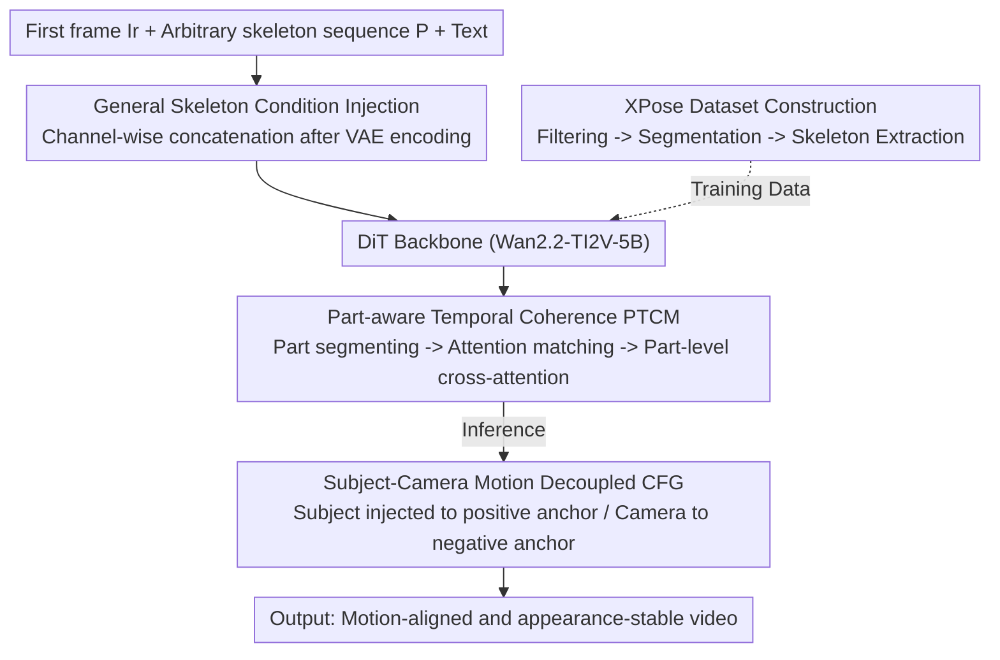

# PoseAnything: General Pose-guided Video Generation with Part-aware Temporal Coherence

**Conference**: CVPR 2026  
**Paper**: [CVF Open Access](https://openaccess.thecvf.com/content/CVPR2026/html/Wang_PoseAnything_General_Pose-guided_Video_Generation_with_Part-aware_Temporal_Coherence_CVPR_2026_paper.html)  
**Code**: None (Project page only: https://ryan-w2024.github.io/project/PoseAnything/)  
**Area**: Video Generation / Controllable Generation  
**Keywords**: Pose-guided video generation, General skeleton, Part-level coherence, Decoupled CFG, Camera motion control

## TL;DR
PoseAnything enables pose-guided video generation to break free from "human-only" constraints for the first time. Given an initial frame and an arbitrary subject's skeleton sequence, it generates corresponding motion videos. It relies on a "Part-aware Temporal Coherence Module" to refine appearance consistency to local body parts and a "Subject-Camera Motion Decoupled CFG" to achieve independent camera control. The authors release XPose, a dataset of 50,000 non-human pose-video pairs, outperforming SOTA on TikTok (human) and custom non-human benchmarks.

## Background & Motivation
**Background**: Pose-guided video generation controls subject motion via skeleton sequences, a key capability for animation and avatar driving. In the diffusion era, a common approach involves adding pose conditions to a video generation backbone (early Stable Diffusion/U-Net, recent DiT)—such as using ControlNet in Disco or ReferenceNet in AnimateAnyone for appearance preservation while using temporal layers for inter-frame modeling.

**Limitations of Prior Work**: ① These methods almost exclusively **support only human skeletons**. With fixed skeleton structures (DWPose/DensePose joint definitions), their networks and data are tied to humans, causing generalization to fail for cats, fish, or robotic arms. Animate-X attempts to map human skeletons to non-humans, but only works for "human-like" cases and cannot accommodate diverse skeleton topologies. ② **Poor appearance consistency** during motion: local details (textures, limbs) suffer from distortion or flickering during large pose changes because ControlNet/cross-attention only capture the "global appearance" of the reference image without part-level constraints. ③ **Uncontrollable camera motion**: Existing pose-driven methods only manage subject motion while the background/camera remains static. Injecting camera control signals alongside subject signals often results in mutual interference.

**Key Challenge**: First, the contradiction between "skeleton universality" and "existing human-specific condition injection/data"; second, the coarse granularity of "global appearance alignment" versus the need for "stable local details during motion"; third, the interference between subject and camera motion signals when coupled.

**Goal**: Develop a general pose-guided video generation framework supporting any skeleton and any subject, while achieving part-level appearance consistency and independent camera control.

**Key Insight**: The authors observe that **attention weights between the same part across different frames are naturally higher than between different parts**. Thus, attention itself can establish inter-frame part correspondences. Furthermore, the positive and negative anchors of CFG are essentially independent guidance channels, which can separately carry subject and camera motion signals.

**Core Idea**: Decompose "global appearance consistency" into "part-level consistency + attention-matched part pairs", inject subject and camera controls into positive/negative CFG anchors for decoupling, and construct the first large-scale non-human pose dataset, XPose, to support general skeleton training.

## Method

### Overall Architecture
PoseAnything is built upon the image-to-video model **Wan2.2-TI2V-5B**. Inputs include a reference image $I_r$, a pose sequence $P$, and a text prompt. The reference image is encoded by the Wan2.2-VAE into latent $Z_i$, then concatenated with noise $\epsilon$ to form $Z_0=[Z_i,\epsilon]$. The pose sequence $P$ is also encoded by the same pre-trained VAE into pose latent $Z_p$. Both are concatenated along the **channel dimension** and passed through a convolutional patchify layer to form the DiT input $Z$. A **Part-aware Temporal Coherence Module (PTCM)** is inserted after each DiTBlock's original cross-attention layer for fine-grained appearance constraints. During inference, **Subject-Camera Motion Decoupled CFG** is used to inject camera motion independently. Training data consists of the specially constructed **XPose** non-human dataset (50,000 pairs) and 15,000 internal human videos.

The workflow consists of "General Skeleton Condition Injection → Part-level Coherence Refinement → Decoupled Camera Control," supported by a non-human data pipeline:

### Key Designs

**1. General Skeleton Condition Injection: Integrating arbitrary skeletons into DiT without damaging the base**

To generalize to any subject, the first step is feeding skeleton info into DiT without disrupting Wan2.2's pre-trained capabilities. The authors compared three strategies: (a) Channel-wise concatenation—merging $Z_0$ and $Z_p$ along the channel dimension $Z_{agr}=[Z_0,Z_p]\in F\times H\times W\times 2C$, then using a convolution to reduce it back to the original channel count $Z=\mathrm{Conv}(Z_{agr})\in f\times h\times w\times c$. This maintains the backbone's structure without increasing sequence length while aligning skeleton and image latents spatially. (b) MLP Addition—$Z=Z_0+\mathrm{MLP}(X_p)$. (c) Width-wise concatenation—$Z=\mathrm{Concat}_{width}(Z_0,Z_p)$. Experiments showed that **Channel-wise concatenation** is significantly superior for pose guidance. Crucially, skeletons are not bound to human joint definitions and are processed directly via VAE encoding, allowing any topology.

**2. Part-aware Temporal Coherence Module (PTCM): Refining appearance consistency to local parts**

PTCM breaks "global consistency" into three steps. **Step 1: Part Mask Generation**: Each frame's pose is segmented into segments $s_{ij}$ ($i$-th frame, $j$-th segment), which are dilated to create masks covering subject parts $m_{ij}=\mathrm{Dilate}(s_{ij},\alpha)$. The dilation coefficient $\alpha$ is determined by $\alpha_{ij}=\min\{\alpha,\ 100\mid \mathrm{IoU}(\mathrm{Dilate}(s_{ij},\alpha),\ \mathrm{Body}^{ref}_{ij})\ge 1\}$. **Step 2: Attention-based Part Matching**: Utilizing the observation that intra-part cross-frame attention is higher than inter-part attention, initial inference steps calculate weights between the first and subsequent frames. The $j$-th segment of the first frame is matched to the subsequent frame's segment with the highest attention: $s_{ij'}\sim s_{0j}\iff j'=\arg\max_t \mathrm{attn\_weight}[m_{0j}][m_{it}]$. **Step 3: Part-level Cross-attention**: For each matched pair $\langle s_{0j},s_{ij}\rangle$, $Q$ is computed from the current frame token and $K, V$ from the reference frame token for a mask-constrained cross-attention $x'=x+\mathrm{Cross\text{-}Atten}(Q_j,K_j,V_j)$, where $Q_j=m_{ij}XW_q,\ K_j=m_{0j}X_0W_k,\ V_j=m_{0j}X_0W_v$. This ensures each local region aligns with its "homologous part" in the first frame, maintaining detail stability for limbs or patterns.

**3. Subject-Camera Motion Decoupled CFG: Separating signals using positive and negative anchors**

The authors discovered that although the model is only trained on subject motion, it generalizes to camera motion. However, simultaneous injection causes interference. The solution leverages CFG anchors: **Subject pose control** is injected into the positive anchor, and **camera motion control** into the negative anchor. The guidance formula is:

$$\tilde{\epsilon}=\hat{\epsilon}_\theta(\varnothing_s,z_c)+s\cdot(\hat{\epsilon}_\theta(z_s,\varnothing_c)-\hat{\epsilon}_\theta(\varnothing_s,z_c))=(1+s)\cdot\hat{\epsilon}_\theta(\varnothing_s,\varnothing_c)+\hat{\epsilon}_\theta(z_s,\varnothing_c)+s\cdot\hat{\epsilon}_\theta(\varnothing_s,z_c),$$

where $z_s$ and $z_c$ represent latents with subject and camera motion info. Significantly, **camera control in the negative anchor acts "inversely"**: Since the negative anchor "pushes" generation away from a state, to make the camera pan left (moving the background right), a "left-moving rectangular skeleton" is injected into the negative anchor. This pushes the model away from the "left-shift" signal, producing a rightward background flow. This is the **first** implementation of independent camera control in pose-guided video generation.

**4. XPose Dataset and Construction Pipeline: Filling the vacuum of non-human pose data**

To enable general skeleton training, the authors built the XPose dataset (50,000 non-human pairs) via a three-stage pipeline: **Stage 1: Video Filtering**—Using Qwen-2.5-VL-7B-Instruct to select clips from Koala and UltraVideo containing single non-human subjects without scene cuts and with stable cameras. **Stage 2: Subject Segmentation**—Grounded-SAM2 segments the subject. Invalid skeletons are filtered by subject area ratios and temporal IoU consistency. **Stage 3: Skeleton Extraction**—BlumNet extracts skeletons from masks. Sequences are discarded if the skeleton extraction success rate $T_{skel}/T < 0.8$.

## Key Experimental Results

The base model is Wan2.2-TI2V-5B. Training occurs in three stages: baseline training on human data (3k steps), mixed human/non-human training, and finally freezing other modules to train PTCM (8k steps). Evaluation uses PSNR, SSIM, L1, LPIPS, and FVD.

### Main Results

On the human benchmark (TikTok), PoseAnything achieves the best performance across all five metrics:

| Method | PSNR↑ | SSIM↑ | L1↓ | LPIPS↓ | FVD↓ |
|------|-------|-------|------|--------|------|
| Disco | 29.03 | 0.668 | 3.78E-04 | 0.292 | 292.80 |
| AnimateAnyone | 29.56 | 0.718 | - | 0.285 | 171.90 |
| Champ | 29.91 | 0.802 | 2.94E-04 | 0.234 | 160.82 |
| Unianimate | 30.77 | 0.811 | 2.66E-04 | 0.231 | 148.06 |
| Animate-X | 30.78 | 0.806 | 2.70E-04 | 0.232 | 139.01 |
| **Ours** | **31.50** | **0.836** | **2.79E-05** | **0.224** | **133.95** |

Non-human benchmark (51 random clips from XPose), compared with drag/trajectory-based methods:

| Method | PSNR↑ | SSIM↑ | L1↓ | LPIPS↓ | FVD↓ |
|------|-------|-------|------|--------|------|
| Tora | 30.08 | 0.6929 | 9.38E-06 | 0.3530 | 103.75 |
| ATI | 30.15 | 0.6810 | 9.59E-06 | 0.3706 | 101.44 |
| SG-I2V | 29.86 | 0.6634 | 1.28E-05 | 0.3674 | 102.97 |
| **Ours** | **30.29** | **0.7114** | **8.19E-06** | **0.3241** | **99.97** |

### Ablation Study
Ablations on XPose: Concat is the baseline without PTCM; EC uses cross-attention on the whole subject area without part segmentation; PTCM is the full module.

| Config | PSNR↑ | SSIM↑ | LPIPS↓ | L1↓ | FVD↓ |
|------|-------|-------|--------|------|------|
| Concat | 29.85 | 0.6964 | 0.3304 | 9.43E-06 | 102.30 |
| EC | 30.27 | 0.7107 | 0.3243 | 8.15E-06 | 101.50 |
| PTCM | **30.29** | **0.7114** | **0.3241** | **8.19E-06** | **99.97** |

### Key Findings
- Removing PTCM (Concat) significantly degrades performance, confirming that part-level consistency is the main factor in appearance stability.
- Downgrading cross-attention from "part-level" to "entire subject" (EC) increases FVD from 99.97 to 101.50, proving that fine-grained **part segmentation + matching** is the key driver of quality.
- Camera control experiments show that the subject follows the pose sequence while the camera moves smoothly per instruction without mutual interference, validating Decoupled CFG.

## Highlights & Insights
- **Self-matching via Attention**: Using the observation of high intra-part attention eliminates the need for an extra matching network—a simple, zero-supervision trick.
- **CFG Anchors as Dual Channels**: Repurposing the CFG negative anchor to carry camera motion and utilizing its "inverse guidance" property is ingenious and naturally decouples the signals.
- **Data as Capability**: The authors recognize that the bottleneck for general skeletons is data, providing a 50,000-pair dataset and pipeline to make general generalization possible.

## Limitations & Future Work
- **Backbone Dependency**: Performance is capped by the Wan2.2-TI2V-5B base. Camera control is an "emergent" capability rather than explicitly trained, leaving its robustness boundaries unclear.
- **Error Accumulation**: The XPose pipeline depends on Grounded-SAM2 and BlumNet; segmentation/skeleton errors propagate to training data.
- **Hand-crafted Camera Control**: Camera motion via "inverse rectangular skeletons" in negative anchors might struggle with complex trajectories or zooming ⚠️.
- **Open-source Status**: Currently, only the project page is available; PTCM and Decoupled CFG must be self-implemented.

## Related Work & Insights
- **vs AnimateAnyone / Animate-X**: These methods use ReferenceNet/temporal layers for human consistency but are limited by human skeleton definitions. PoseAnything supports arbitrary skeletons and refines consistency to the part level.
- **vs Tora / ATI / SG-I2V**: These methods excel at global displacement (panning/scaling) but fail at fine-grained limb motion. PoseAnything provides better pose alignment and foreground/background integrity.

## Rating
- **Novelty**: ⭐⭐⭐⭐⭐ First to support general skeletons for pose-guided generation and first to achieve independent camera control via decoupled CFG.
- **Experimental Thoroughness**: ⭐⭐⭐⭐ Solid performance across human and non-human benchmarks, though the non-human test set is relatively small.
- **Writing Quality**: ⭐⭐⭐⭐ Clear motivation and contributions; logical flow.
- **Value**: ⭐⭐⭐⭐⭐ Opens the door to "any-subject pose driving" and provides a large-scale dataset, highly valuable for animation.

<!-- RELATED:START -->

- **AnimateAnyone**: ReferenceNet for consistent human video generation.
- **Wan 2.1/2.2**: The underlying diffusion transformer backbone.
- **ControlNet**: Foundational work for controllable diffusion generation.

<!-- RELATED:END -->

## Related Papers

- [\[CVPR 2026\] MultiAnimate: Pose-Guided Image Animation Made Extensible](multianimate_pose-guided_image_animation_made_extensible.md)
- [\[CVPR 2026\] TEAR: Temporal-aware Automated Red-teaming for Text-to-Video Models](tear_temporal-aware_automated_red-teaming_for_text-to-video_models.md)
- [\[CVPR 2026\] ExPose: Reinforcing Video Generation Models for Extreme Pose Estimation](expose_reinforcing_video_generation_models_for_extreme_pose_estimation.md)
- [\[CVPR 2026\] BulletTime: Decoupled Control of Time and Camera Pose for Video Generation](bullettime_decoupled_control_of_time_and_camera_pose_for_video_generation.md)
- [\[CVPR 2026\] VideoCoF: Unified Video Editing with Temporal Reasoner](videocof_unified_video_editing_with_temporal_reasoner.md)

<!-- RELATED:END -->
