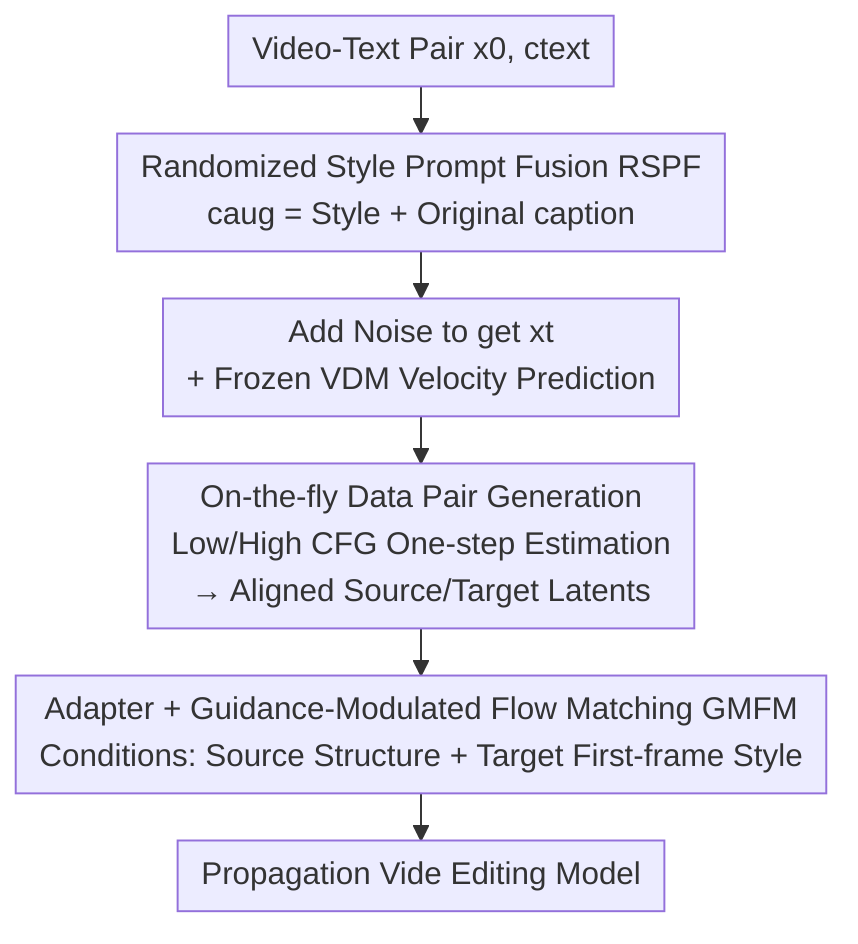

# PropFly: Learning to Propagate via On-the-Fly Supervision from Pre-trained Video Diffusion Models

**Conference**: CVPR 2026  
**Paper**: [CVF Open Access](https://openaccess.thecvf.com/content/CVPR2026/html/Seo_PropFly_Learning_to_Propagate_via_On-the-Fly_Supervision_from_Pre-trained_Video_CVPR_2026_paper.html)  
**Code**: None (Project page https://kaist-viclab.github.io/PropFly_site/)  
**Area**: Video Generation  
**Keywords**: Propagation-based Video Editing, Video Diffusion Models, Flow Matching, Classifier-Free Guidance, On-the-fly Supervision

## TL;DR
PropFly utilizes a frozen pre-trained Video Diffusion Model (VDM) as its own "supervision source": it performs one-step denoising estimates on the same noisy latent using two different CFG scales (low and high) to obtain structure-aligned but semantically distinct "source/target" video pairs. Subsequently, a new GMFM loss is used to train an adapter to learn to propagate the "edited first frame" to the entire video sequence—requiring no paired (original, edited) datasets while significantly surpassing SOTA across multiple video editing benchmarks.

## Background & Motivation
**Background**: Text-guided video editing is the mainstream approach, using prompts for transformations like style transfer or local object replacement. While intuitive, it is difficult for users to precisely describe fine-grained visual effects via text, often leading to results that deviate from creative intent. Consequently, "propagation-based editing" has emerged: users precisely edit **a single frame**, and the model **propagates** this modification to the entire video while preserving the motion and structure of the original, offering much finer control.

**Limitations of Prior Work**: Training propagation models requires large-scale, diverse paired video datasets (source video + edited video), which are extremely expensive and difficult to acquire. Existing workarounds have significant flaws: GenProp uses object segmentation masks to synthesize training pairs, which only allows for local modifications such as "adding/deleting objects" and fails for global stylization; CCEdit / Go-with-the-Flow rely on pre-computed depth maps or optical flow as auxiliary signals, which introduce artifacts if these signals contain errors; Señorita-2M synthesizes paired data through iterative sampling with diffusion models, which is computationally expensive for video and covers limited editing types.

**Key Challenge**: Propagation editing needs massive and diverse paired supervision to generalize to various edits (local to global); however, paired data is either expensive, narrow in coverage, or reliant on error-prone auxiliary signals—there is a **deadlock between supervision signal diversity and acquisition cost**.

**Key Insight**: The authors observe that pre-trained VDMs inherently "know" how to perform various global transformations. Specifically, **changing the CFG scale directly modulates the global visual attributes** (style, tone, texture) of the output while maintaining the overall video content (Observation 1); furthermore, a **one-step clean latent estimate is sufficient**, making full iterative denoising unnecessary (Observation 2).

**Core Idea**: For a single noisy latent, low CFG is used as the "source" and high CFG as the "target." By estimating two structure-aligned but semantically distinct latents in a single step, infinitely diverse training pairs are synthesized on-the-fly. An adapter is then trained to learn the transformation between these pairs—effectively converting the VDM's "generative capability" into "propagation supervision."

## Method

### Overall Architecture
PropFly is a **training pipeline** designed to attach a trainable adapter to a frozen pre-trained VDM, enabling it to learn "propagating the edited first frame to the entire source video." The pipeline consists of three steps: (a) sampling a "video latent + text" pair from a video dataset and expanding the caption into an augmented prompt $c_\text{aug}$ using Randomized Style Prompt Fusion (RSPF); (b) adding noise to the video to obtain $x_t$ and performing one-step clean latent estimates with the frozen VDM at low/high CFG scales to generate a "source latent $\hat{x}^{\text{low}}_{0|t}$ / target latent $\hat{x}^{\text{high}}_{0|t}$" pair on-the-fly; (c) the adapter predicts velocity conditioned on the **entire source latent (structure) + target latent first frame (style) + augmented text**, using GMFM loss to align with the VDM's high-CFG velocity.

The base uses a frozen Wan2.1 T2V model, and the adapter is a VACE adapter initialized from I2V weights, injecting features into the frozen backbone at stride $S_\text{in}$. The entire video latent and the edited first-frame latent are concatenated along the temporal dimension before being fed to the adapter.

### Key Designs

**1. On-the-fly Data Pair Generation: Using CFG scale differences and one-step estimation to create aligned yet semantically distinct source/target pairs.**

This is the core of the method, addressing the bottleneck of expensive paired video data. Instead of searching for existing data, PropFly lets the frozen VDM generate its own supervision. Based on Flow Matching, the backbone is trained to predict the velocity field $v_t = x_1 - x_0$ connecting data $x_0$ and noise $x_1$. Thus, for any noisy latent $x_t = (1-t)x_0 + t x_1$, a one-step clean latent estimate can be derived as $\hat{x}_{0|t} = x_t - t\cdot v_\theta(x_t, t, c_\text{aug})$. By layering the CFG mechanism:

$$\hat{v}^{\omega}_\theta = v_\theta(x_t, t, \varnothing) + \omega \cdot \big(v_\theta(x_t, t, c_\text{aug}) - v_\theta(x_t, t, \varnothing)\big)$$

Velocities are calculated using a low scale $\omega_L$ (e.g., 1.0) and a high scale $\omega_H$ (e.g., 7.0), yielding estimated source latent $\hat{x}^{\text{low}}_{0|t} = x_t - t\cdot\hat{v}^{\text{low}}_\theta$ and target latent $\hat{x}^{\text{high}}_{0|t} = x_t - t\cdot\hat{v}^{\text{high}}_\theta$. Since both originate from the **same** $x_t$ and the same velocity prediction, motion and structure are naturally aligned; because of the differing CFG scales, the high-CFG target captures stronger semantic edits (style/color/texture enhancement). The authors emphasize that the key is not the high image quality of these one-step latents, but rather the **clean semantic difference** between them, which serves as the required supervision signal for propagation.

**2. GMFM Loss: Encouraging the adapter to learn "transformation" rather than "video reconstruction"**

Training the adapter with the source/target pairs is the second key. Using standard Flow Matching loss causes problems: the FM objective is for the model to reconstruct the **original video**, while propagation requires the edit to be **carried forward**. The authors propose Guidance-Modulated Flow Matching (GMFM) to solve this. The adapter's velocity prediction is conditioned on three components: (i) the entire source video latent $\hat{x}^{\text{low}}_{0|t}$ for structure, (ii) the first frame of the target latent $\hat{x}^{\text{high}}_{0|t}[0]$ for visual style, and (iii) the augmented text $c_\text{aug}$:

$$\hat{v}_{\theta,\phi} = v_{\theta,\phi}\big(x_t, t, c_\text{aug}, \hat{x}^{\text{low}}_{0|t}, \hat{x}^{\text{high}}_{0|t}[0]\big)$$

The loss matches the **high-CFG velocity** (stop-gradient, as the backbone is frozen):

$$L_\text{GMFM} = \mathbb{E}\Big[\big\lVert \hat{v}_{\theta,\phi} - \text{sg}\{\hat{v}^{\text{high}}_\theta\} \big\rVert^2\Big]$$

Crucially, the $x_t$ fed into the adapter is the same noisy latent used during data generation. This allows the frozen backbone $\theta$ to easily reconstruct its own original prediction $\hat{v}^{\text{cond}}_\theta$, enabling the adapter $\phi$ to **focus exclusively on learning to transform $\hat{x}^{\text{low}}_{0|t}$ into $\hat{x}^{\text{high}}_{0|t}$**.

**3. Randomized Style Prompt Fusion (RSPF): Augmenting with style terms to provide diverse content-style combinations**

To increase signal diversity, a random style phrase $c_\text{style}$ (e.g., "in snow") is prepended to the original caption $c_\text{text}$ (e.g., "A bear walks") during sampling to obtain $c_\text{aug} := [c_\text{style} | c_\text{text}]$. This allows the model to synthesize countless "content × style" pairs from a limited set of real videos, improving generalization.

### Loss & Training
Only the adapter $\phi$ is optimized (backbone and VDM remain frozen), using the $L_\text{GMFM}$ objective. PropFly-14B is initialized from Wan2.1-14B ($N_B=35$, $S_\text{in}=5$), and PropFly-1.3B from Wan2.1-1.3B ($N_B=30$, $S_\text{in}=2$). The dataset includes YouTube-VOS and 3000 manually collected Pexels videos, with captions generated by Qwen2.5-VL. Training consists of 50K iterations at 480×832 resolution using AdamW, LR $1\times10^{-5}$, and global batch 48. During inference, UniPC is used for 25 steps.

## Key Experimental Results

### Main Results
On the EditVerseBench-Appearance subset, PropFly-14B achieves SOTA across all five metrics (Pick score, Frame/Video-level text alignment, and Temporal Consistency via CLIP/DINO).

| Method | Type | Pick↑ | Frame↑ | Video↑ | CLIP↑ | DINO↑ | Param |
|------|------|-------|--------|--------|-------|-------|--------|
| EditVerse | Te | 20.06 | 27.95 | 25.48 | 98.58 | 98.56 | - |
| Runway Aleph | Te | 20.19 | 28.18 | 24.96 | 98.82 | 98.39 | - |
| AnyV2V | Pr | 19.78 | 28.19 | 25.34 | 95.97 | 97.73 | 1.3B |
| Señorita-2M | Pr | 19.69 | 27.36 | 24.53 | 98.04 | 98.03 | 5B |
| **PropFly-1.3B** | Pr | 20.35 | 28.37 | 25.37 | 99.03 | 98.83 | 1.3B |
| **PropFly-14B** | Pr | **20.42** | **28.71** | **26.05** | **99.21** | **99.05** | 14B |

On the TGVE benchmark, PropFly-14B leads in all categories (Pick 21.19 / CLIP 0.978 / ViCLIPdir 0.228 / ViCLIPout 0.278). Notably, PropFly-1.3B outperforms the 5B-parameter Señorita-2M.

### Ablation Study
Evaluated on EditVerseBench-Appearance using Wan2.1-1.3B:

| Configuration | Pick↑ | Frame↑ | Video↑ | CLIP↑ | DINO↑ | Description |
|------|-------|--------|--------|-------|-------|------|
| w/ Full sampling | 19.75 | 27.20 | 24.77 | 98.77 | 98.51 | Use full iterative sampling to generate pairs |
| w/ FM loss (Eq.1) | 19.50 | 26.33 | 21.98 | 98.52 | 98.29 | Use standard FM loss |
| w/o RSPF | 20.28 | 28.35 | 25.61 | 98.96 | 98.55 | No randomized style fusion |
| w/ Paired dataset | 19.53 | 27.12 | 24.69 | 98.13 | 97.85 | Trained with Señorita-2M ground truth pairs |
| **PropFly-1.3B (Full)** | **20.35** | **28.37** | **25.37** | **99.03** | **98.63** | Complete model |

### Key Findings
- **One-step estimation > Full sampling**: Full sampling results in lower performance and severe motion misalignment. Low/high CFG iterative paths accumulate numerical errors independently, causing the source/target pairs to diverge.
- **GMFM is irreplaceable by FM**: Standard FM loss forces the model to reconstruct the original video, causing edits (like snow) to disappear in subsequent frames. GMFM ensures the adapter replicates the target transformation.
- **On-the-fly supervision outperforms ground-truth paired data**: Baselines trained on Señorita-2M's synthesized ground truth lag behind PropFly, as on-the-fly synthesis provides superior diversity.
- **RSPF enhances quality and style consistency**: Without it, the model struggles to adhere to the reference style (e.g., color appearing in a 1920s monochrome edit).

## Highlights & Insights
- **Generative capability as supervision**: The core insight is that CFG scale differences yield "structure-aligned, semantically different" pairs—essentially using a frozen model as its own "data labeler" and bypassing the paired data bottleneck.
- **The efficiency of one-step clean latent estimation**: This eliminates expensive iterative sampling while ensuring strict alignment due to the shared $x_t$.
- **Reusing $x_t$ to offload reconstruction from the adapter**: By letting the backbone handle what it already knows (reconstruction), the adapter focuses strictly on the incremental transformation.

## Limitations & Future Work
- Supervision relies entirely on the pre-trained VDM's "understanding" of global transformations; propagation is limited by the backbone's (Wan2.1) generative prior.
- Reliance on external models (e.g., Gemini 2.5 Flash Image) to synthesize the "edited first frame" during inference; the quality of this frame directly dictates the propagation result.
- Evaluation focuses on "appearance" edits (style, background, objects) and excludes camera view changes or depth-to-video tasks.
- Inference still requires 25 steps (approx. 120s for the 14B model), which is not yet real-time.

## Related Work & Insights
- **vs GenProp**: GenProp is limited to local edits via masks; PropFly handles global and local edits without masks via CFG modulation.
- **vs CCEdit / Go-with-the-Flow**: They rely on error-prone depth/flow signals; PropFly uses RGB latents directly.
- **vs Señorita-2M**: Señorita-2M uses expensive iterative sampling for a fixed dataset; PropFly synthesizes diverse data on-the-fly.
- **vs AnyV2V**: AnyV2V is zero-shot and suffers from artifacts in moving objects; PropFly provides stable propagation while maintaining complex motion.

## Rating
- Novelty: ⭐⭐⭐⭐⭐ "Using CFG scale differences + one-step estimation for on-the-fly supervision" is highly innovative.
- Experimental Thoroughness: ⭐⭐⭐⭐ Strong results on two benchmarks and valid ablations; however, limited to appearance-based edits.
- Writing Quality: ⭐⭐⭐⭐⭐ Logic is clear, with complete formulas and pseudocode.
- Value: ⭐⭐⭐⭐⭐ Directly addresses the paired data bottleneck in video editing with a transferable paradigm.

<!-- RELATED:START -->

## Related Papers

- [\[ECCV 2024\] Exploring Pre-trained Text-to-Video Diffusion Models for Referring Video Object Segmentation](../../ECCV2024/video_generation/exploring_pre-trained_text-to-video_diffusion_models_for_referring_video_object_.md)
- [\[CVPR 2026\] Generative Neural Video Compression via Video Diffusion Prior](generative_neural_video_compression_via_video_diffusion_prior.md)
- [\[CVPR 2026\] Diff4Splat: Repurposing Video Diffusion Models for Dynamic Scene Generation](diff4splat_controllable_4d_scene_generation_with_latent_dynamic_reconstruction_m.md)
- [\[CVPR 2026\] LocalDPO: Direct Localized Detail Preference Optimization for Video Diffusion Models](mind_the_generative_details_direct_localized_detail_preference_optimization_for_.md)
- [\[CVPR 2026\] Vanast: Virtual Try-On with Human Image Animation via Synthetic Triplet Supervision](vanast_virtual_try-on_with_human_image_animation_via_synthetic_triplet_supervisi.md)

<!-- RELATED:END -->
## Related Papers

- [\[CVPR 2026\] Goal-Driven Reward by Video Diffusion Models for Reinforcement Learning](goal-driven_reward_by_video_diffusion_models_for_reinforcement_learning.md)
- [\[ECCV 2024\] Exploring Pre-trained Text-to-Video Diffusion Models for Referring Video Object Segmentation](../../ECCV2024/video_generation/exploring_pre-trained_text-to-video_diffusion_models_for_referring_video_object_.md)
- [\[CVPR 2026\] Generative Neural Video Compression via Video Diffusion Prior](generative_neural_video_compression_via_video_diffusion_prior.md)
- [\[CVPR 2026\] Diff4Splat: Repurposing Video Diffusion Models for Dynamic Scene Generation](diff4splat_controllable_4d_scene_generation_with_latent_dynamic_reconstruction_m.md)
- [\[CVPR 2026\] LocalDPO: Direct Localized Detail Preference Optimization for Video Diffusion Models](mind_the_generative_details_direct_localized_detail_preference_optimization_for_.md)

<!-- RELATED:END -->
